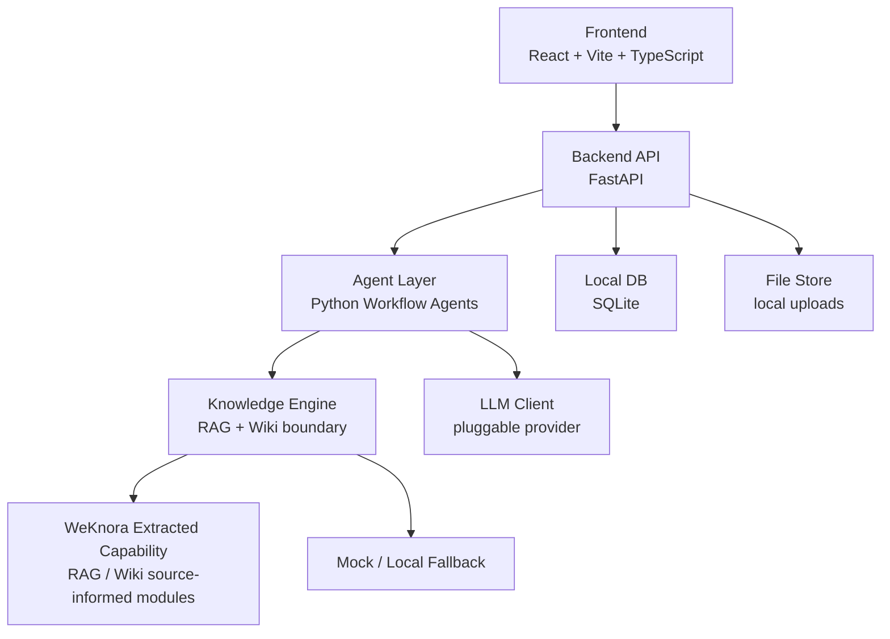
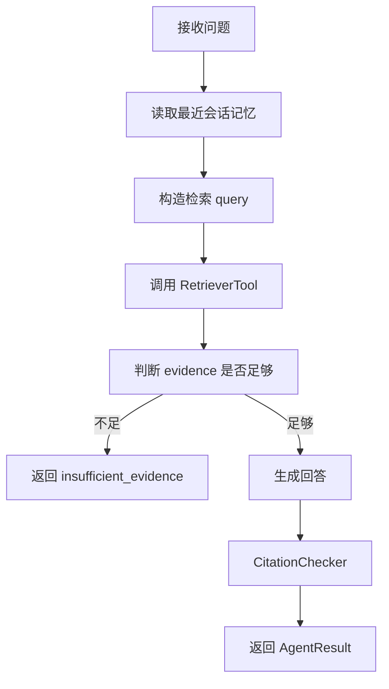
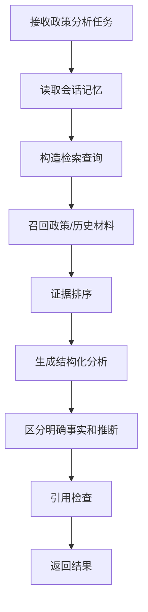

# PA 智能工作台 Product Spec

> 文档状态：交互式补充中
>
> 产品名称：PA 智能工作台
>
> 目标周期：3 天内完成第一版模块化 MVP

## 1. 产品定位与用户场景

### 1.1 产品名称

产品名称暂定为：**PA 智能工作台**。

该名称强调产品不是一个通用聊天机器人，也不是 WeKnora 的子产品，而是面向金融公共事务团队日常材料工作的独立内部工具。

### 1.2 目标用户

第一版目标用户是腾讯金融 PA 部门内部成员。当前部门规模约 8 人，因此第一版不区分复杂用户群体，不做多组织、多租户或复杂权限矩阵。

第一版默认服务对象包括：

- 实习生：负责资料整理、政策梳理、初稿生成、历史材料查找。
- PA 同事：负责议题研判、政策分析、口径准备、案例复盘。
- 部门负责人或资深同事：需要快速查看材料结论、风险点、引用依据和历史沉淀。

由于团队规模较小，第一版优先追求：

- 使用门槛低。
- 功能闭环完整。
- 结果可追溯。
- 架构模块化，方便后续迭代。

暂不优先投入：

- 复杂 RBAC 权限体系。
- 多部门隔离。
- 审批流。
- 多人协同编辑。

### 1.3 核心产品目标

PA 智能工作台的核心目标是把部门已有材料转化为可检索、可分析、可沉淀的知识资产，并围绕金融 PA 场景提供结构化 AI 辅助能力。

第一版要完成的核心闭环：

```text
资料进入
-> 知识检索
-> AI 分析与生成
-> 来源引用校验
-> 结果保存
-> Wiki 沉淀
```

产品不是为了替代人工判断，而是帮助部门成员更快完成以下工作：

- 找到相关政策和历史材料。
- 快速理解政策影响。
- 复盘类似历史案例。
- 形成带引用依据的初步判断。
- 将可复用知识沉淀为 Wiki。

### 1.4 第一版核心场景

第一版聚焦 4 个主要使用场景。

#### 场景一：知识问答

用户可以围绕部门资料库提问，例如：

- 某项政策的核心要求是什么？
- 过去有没有类似议题？
- 某个业务方向涉及哪些监管关注点？
- 某份材料中对某个问题是怎么表述的？

系统应返回：

- 结构化回答。
- 引用来源。
- 相关原文片段。
- 依据不足提示。

关键要求：

- 无可靠来源时不能正常给出确定性回答。
- 回答必须帮助用户快速定位材料，而不是只给泛泛总结。

#### 场景二：政策分析

用户可以输入或选择某份政策材料，让系统输出政策分析结果。

典型输出包括：

- 政策背景。
- 核心要求。
- 涉及主体。
- 对金融业务或部门工作的潜在影响。
- 风险点。
- 建议关注事项。
- 可引用依据。

关键要求：

- 分析必须基于资料库证据。
- 影响判断要区分“材料明确提到”和“基于材料推断”。
- 不确定内容必须进入 warnings 或“待人工确认”区域。

#### 场景三：历史案例

用户可以查询、复盘或对比历史案例。

典型问题包括：

- 过去有没有类似事件？
- 当时采取了什么处理方式？
- 结果如何？
- 有哪些经验教训可以复用？
- 对当前议题有什么参考？

系统应输出：

- 案例背景。
- 时间线。
- 涉及主体。
- 关键动作。
- 处理结果。
- 经验教训。
- 对当前工作的参考意义。

关键要求：

- 时间线必须尽量按时间顺序输出。
- 经验教训必须能回到来源材料。
- 不把不同案例混成一个案例。

#### 场景四：Wiki 沉淀

用户希望将分散资料、政策分析、历史案例和已生成内容沉淀成可持续维护的 Wiki。

第一版 Wiki 能力目标：

- 保留 Wiki 知识库入口。
- 支持查看或搜索 Wiki 页面。
- 支持从资料或生成结果中沉淀可复用主题。
- 为后续接入完整 Wiki 图谱、页面编辑和版本管理预留接口。

Wiki 页面类型可包括：

- 政策 Wiki：政策背景、核心要求、影响分析。
- 案例 Wiki：历史事件、处理过程、经验教训。
- 议题 Wiki：某个持续议题的材料集合与演变。
- 口径 Wiki：可复用表述、注意事项、禁用表述。

关键要求：

- Wiki 不是装饰功能，而是长期知识资产沉淀入口。
- 第一版可以先实现轻量入口和适配层，但架构上必须把 Wiki 当作一级模块。

### 1.5 第一版产品形态

第一版目标不是一次性做成完整企业系统，而是在 3 天内完成一个功能尽可能全、但边界清晰的模块化 MVP。

第一版应具备：

- 独立前端。
- 独立后端。
- Python Agent 层。
- WeKnora RAG / Wiki 适配层。
- 本地数据库。
- 清晰模块目录。
- mock fallback。
- 可运行的演示流程。

第一版允许部分能力采用 mock 或轻量实现，但必须保留稳定接口，方便后续替换为真实能力。

### 1.6 设计原则

第一版开发遵循以下原则：

1. **独立产品原则**
   PA 智能工作台是独立产品，WeKnora 只是底层 Knowledge Engine，不直接暴露给最终用户。

2. **模块化优先**
   前端、后端、Agent、RAG Adapter、Wiki Adapter、导出模块、数据库模块应分层清晰，避免后续重构成本过高。

3. **先闭环，再增强**
   优先完成“问答、政策分析、历史案例、Wiki 入口”的可演示闭环，再逐步提升检索质量和生成质量。

4. **证据优先**
   所有关键结论都应尽量绑定来源。没有来源时，系统必须提示依据不足。

5. **安全保守**
   不在日志、Git、前端调试信息中暴露敏感文件、密钥或长段原文。

6. **面向迭代**
   第一版所有功能都应为后续多 Agent、权限、审批、Wiki 图谱、Word 导出、评测体系预留扩展点。

## 2. 第一版功能范围

### 2.1 范围原则

3 天第一版以“功能尽可能全的模块化 MVP”为目标，但不追求所有模块都达到生产级深度。

范围划分为三类：

- **必须做**：第一版演示和后续迭代的核心闭环，必须有真实页面、API、数据结构和基本可运行能力。
- **轻量做**：第一版保留入口和最小能力，优先保证数据结构和接口稳定，复杂体验后续补齐。
- **暂不做**：第一版不投入开发时间，只在架构和文档中预留扩展方向。

### 2.2 功能优先级总表

| 功能 | 第一版优先级 | 说明 |
| --- | --- | --- |
| 资料上传与资料库管理 | 必须做 | 产品的知识入口，必须支持上传、记录、状态展示和基础筛选 |
| 知识问答 | 必须做 | 核心使用场景，必须返回回答和引用 |
| 政策分析 | 必须做 | 核心 PA 场景，必须有结构化输出 |
| 历史案例复盘 | 轻量做 | 第一版提供入口和简化结构化输出 |
| Wiki 浏览/搜索 | 必须做 | Wiki 是长期知识沉淀模块，第一版必须作为一级功能出现 |
| 生成结果历史 | 轻量做 | 保存问答/分析结果，支持查看最近记录 |
| Word 导出 | 暂不做 | 第一版不做，后续可基于结构化结果接入 |
| 用户反馈/评分 | 暂不做 | 第一版不做，后续用于评测与优化 |
| 任务进度展示 | 必须做 | Agent 工作流必须可见，避免用户等待黑盒 |
| 本地数据库保存记录 | 必须做 | 保存资料、任务、结果、引用，为后续迭代打基础 |

### 2.3 必须做功能

#### 2.3.1 资料上传与资料库管理

目标：

用户可以将部门脱敏资料上传到 PA 智能工作台，系统保存资料记录，并尝试同步到 WeKnora 知识底座。

第一版能力：

- 上传文件。
- 创建资料记录。
- 填写资料标题。
- 设置业务方向。
- 设置资料类型。
- 设置来源。
- 设置关键词。
- 展示资料状态。
- 展示资料列表。
- 按业务方向、资料类型、关键词做基础筛选。

建议资料状态：

```text
uploaded -> indexing -> indexed -> failed
```

字段范围：

```text
id
title
business_area
document_type
source
keywords
file_name
file_path
weknora_doc_id
status
error_message
created_at
updated_at
```

第一版实现策略：

- 后端必须有真实 API 和本地数据库记录。
- 文件可以先保存到本地 `uploads/`。
- 如果 WeKnora 上传接口未跑通，必须通过 mock adapter 保证状态流转可演示。
- 不要求第一版实现复杂批量上传、自动同步外部数据源或高级权限。

验收标准：

- 用户能上传一份文件并看到资料记录。
- 资料记录能保存到本地数据库。
- 资料列表能展示状态。
- WeKnora 不可用时，系统不崩溃，并显示 mock / fallback 状态。

#### 2.3.2 知识问答

目标：

用户围绕资料库提问，系统通过 WeKnora Adapter 检索资料，并返回带引用的结构化回答。

第一版能力：

- 输入问题。
- 可选业务方向。
- 可选资料类型。
- 可选指定资料。
- 调用 Agent / RAG Adapter 检索证据。
- 返回回答。
- 返回引用来源。
- 返回依据不足提示。

输出结构：

```json
{
  "answer": "结构化回答正文",
  "citations": [
    {
      "document_id": "doc_001",
      "title": "来源标题",
      "chunk_id": "chunk_001",
      "text": "引用片段",
      "source": "weknora | mock"
    }
  ],
  "warnings": [],
  "status": "ok | insufficient_evidence"
}
```

第一版实现策略：

- 必须通过后端 API 调用，不允许前端直接调 WeKnora。
- WeKnora 检索失败时使用 mock evidence。
- 没有 evidence 时返回 `insufficient_evidence`。
- 回答可以先由规则模板或轻量 LLM 调用生成，但接口必须稳定。

验收标准：

- 用户能在知识问答页面提交问题。
- 页面展示回答、引用来源和 warnings。
- 无 evidence 时不会编造确定性答案。

#### 2.3.3 政策分析

目标：

用户选择或输入一个政策议题，系统基于资料库生成结构化政策分析。

第一版能力：

- 输入政策分析主题。
- 可选业务方向。
- 可选参考资料范围。
- 检索相关资料。
- 输出结构化政策分析。
- 展示引用和依据不足提示。

输出结构：

```text
1. 政策背景
2. 核心要求
3. 涉及主体
4. 对部门工作的影响
5. 风险点
6. 建议关注事项
7. 引用来源
8. 待人工确认
```

第一版实现策略：

- 可以由 `PolicyAnalysisAgent` 或通用 `GenerationAgent` 实现。
- 分析必须显式区分：
  - “材料明确提到”
  - “基于材料推断”
  - “待人工确认”
- 若没有检索结果，应返回依据不足，而不是空泛政策分析。

验收标准：

- 用户能生成一份结构化政策分析。
- 页面能展示风险点和建议关注事项。
- 至少展示一条引用或明确提示依据不足。

#### 2.3.4 Wiki 浏览/搜索

目标：

Wiki 是 PA 智能工作台长期知识沉淀模块，第一版必须作为一级功能出现。

第一版能力：

- 前端有 Wiki 页面入口。
- 支持输入关键词搜索 Wiki。
- 支持查看 Wiki 搜索结果。
- 支持查看 Wiki 页面详情。
- WeKnora Wiki API 不可用时使用 mock fallback。

第一版可不做：

- Wiki 图谱可视化。
- Wiki 页面在线编辑。
- Wiki 版本管理。
- 自动生成复杂 Wiki 页面。

建议接口：

```text
GET /api/wiki/search?query=xxx&kb_id=xxx
GET /api/wiki/pages/{slug}?kb_id=xxx
```

验收标准：

- 用户能进入 Wiki 页面。
- 用户能搜索 Wiki。
- 用户能打开一个 Wiki 页面详情。
- WeKnora Wiki 不可用时页面仍可用，并显示 fallback 提示。

#### 2.3.5 任务进度展示

目标：

Agent 工作流对用户必须可见，不能让用户面对黑盒等待。

第一版能力：

- 创建任务时生成任务记录。
- 任务有状态。
- 前端展示当前状态。
- 生成完成后展示结果。
- 失败时展示错误原因。

任务状态建议：

```text
created -> retrieving -> generating -> checking -> completed -> failed
```

第一版实现策略：

- 可以先用同步 API + 前端 loading + 后端返回步骤字段。
- 不强制第一版实现 WebSocket 或 SSE。
- 数据库中必须保存 `status` 和 `current_step`，为后续异步任务预留。

验收标准：

- 用户提交问答或政策分析后，页面能显示 loading / step。
- 任务完成或失败后状态明确。
- 数据库能记录任务状态。

#### 2.3.6 本地数据库保存记录

目标：

第一版必须有本地持久化能力，避免所有内容只是前端临时状态。

第一版必须保存：

- 资料记录。
- 任务记录。
- 生成结果。
- 引用来源。

推荐使用 SQLite。

最低数据表：

```text
documents
generation_tasks
generated_outputs
citations
```

验收标准：

- 重启后仍能看到已上传资料记录。
- 生成结果能被保存。
- 最近结果能在页面中查看。

### 2.4 轻量做功能

#### 2.4.1 历史案例复盘

目标：

第一版提供历史案例能力入口和简化输出，证明系统可以支持案例型 PA 工作。

第一版能力：

- 输入案例查询或复盘主题。
- 检索相关资料。
- 输出简化案例复盘。

输出结构：

```text
1. 案例背景
2. 时间线
3. 涉及主体
4. 关键动作
5. 处理结果
6. 经验教训
7. 引用来源
```

轻量实现策略：

- 可以复用政策分析生成接口，通过 `task_type=case_review` 区分模板。
- 时间线可先由模型/规则从 evidence 中抽取，不要求复杂事件图谱。
- 若 evidence 不足，返回“未找到足够历史案例依据”。

验收标准：

- 前端有历史案例入口。
- 能生成一份简化案例复盘。
- 能展示引用或依据不足。

#### 2.4.2 生成结果历史

目标：

第一版保存最近生成记录，方便用户回看。

第一版能力：

- 保存问答、政策分析、历史案例结果。
- 在首页或结果历史页展示最近记录。
- 点击记录查看详情。

轻量实现策略：

- 不做复杂筛选。
- 不做版本对比。
- 不做收藏、归档、采用状态。

验收标准：

- 用户刷新页面后仍能查看最近生成结果。
- 结果详情包含输入、输出、引用和生成时间。

### 2.5 暂不做功能

#### 2.5.1 Word 导出

第一版暂不实现 Word 导出。

后续预留方向：

- 基于 `generated_outputs.content_json` 生成 Word Schema。
- 使用 `python-docx` 导出。
- 文末附引用来源。

#### 2.5.2 用户反馈/评分

第一版暂不实现反馈评分。

后续预留方向：

- 有用 / 无用。
- 引用错误。
- 表述不合适。
- 风险遗漏。
- 用于构建评测集和优化 Agent。

### 2.6 第一版导航结构

第一版建议前端导航：

```text
/
  工作台首页

/library
  资料库

/qa
  知识问答

/policy-analysis
  政策分析

/case-review
  历史案例

/wiki
  Wiki 知识库

/history
  生成历史
```

### 2.7 第一版成功标准

3 天内第一版完成后，应满足：

1. 用户能上传资料并在资料库看到记录。
2. 用户能进行知识问答，并看到回答和引用。
3. 用户能生成政策分析，并看到结构化结果。
4. 用户能进入历史案例页面，并生成轻量案例复盘。
5. 用户能进入 Wiki 页面，搜索并查看 Wiki 页面。
6. 用户能看到任务进度或当前处理阶段。
7. 用户能查看最近生成历史。
8. 所有核心记录保存在本地数据库。
9. WeKnora 不可用时，系统仍能通过 mock fallback 完成演示。
10. 前后端、Agent、Adapter、数据库模块边界清晰，方便后续迭代。

## 3. 系统架构与技术选型

### 3.1 架构总目标

PA 智能工作台第一版采用独立产品架构。

产品代码统一放在仓库根目录下的独立目录：

```text
pa-ai-workbench/
```

除非明确说明，不修改 WeKnora 原有源码。WeKnora 只作为源码参考和知识能力来源，不作为最终产品的页面、用户入口或业务模型。

第一版目标架构：



### 3.2 技术选型

#### 3.2.1 前端

第一版前端采用：

```text
React + Vite + TypeScript
```

选择原因：

- 启动快，适合三天内快速完成可演示产品。
- TypeScript 有利于约束 API 数据结构。
- 后续可以逐步演进成更复杂的工作台。
- 生态成熟，便于接入图标库、Markdown 渲染、状态管理和路由。

建议依赖：

```text
react
react-dom
vite
typescript
lucide-react
```

第一版前端可以不引入复杂 UI 框架，优先用自定义 CSS 完成专业、克制的内部工作台风格。

前端不得：

- 直接调用 WeKnora。
- 直接调用模型 API。
- 直接读取本地文件路径。
- 存储 API Key。

#### 3.2.2 后端

第一版后端采用：

```text
Python FastAPI
```

选择原因：

- 与 Agent 层、LLM 工具链、文档处理生态兼容度高。
- 开发速度快，适合 MVP。
- 后续可以拆分为多个服务，或者将 Agent 层独立部署。

后端职责：

- 提供前端 API。
- 管理资料上传与本地文件。
- 管理本地数据库。
- 创建和查询任务。
- 调用 Agent Orchestrator。
- 调用 Knowledge Engine。
- 返回结构化结果和任务状态。

后端不得：

- 把 PA 业务逻辑散落在路由函数里。
- 绕过 Agent 层直接拼生成结果。
- 在日志中输出密钥、完整敏感原文或长引用片段。

#### 3.2.3 数据库

第一版采用：

```text
SQLite
```

建议通过轻量 ORM 管理数据模型：

```text
SQLAlchemy 2.x 或 SQLModel
```

推荐选择：

```text
SQLModel
```

选择原因：

- 和 FastAPI / Pydantic 风格一致。
- 数据模型、请求响应模型较容易统一。
- 对非科班开发者更友好。
- 后续迁移 PostgreSQL 成本可控。

第一版数据库文件建议：

```text
pa-ai-workbench/backend/data/pa_workbench.db
```

数据库必须保存：

- documents
- generation_tasks
- generated_outputs
- citations

第一版可以不做：

- 数据库迁移系统。
- 多用户权限表。
- 复杂审计表。

但代码结构需要为后续迁移 Alembic / PostgreSQL 预留位置。

#### 3.2.4 文件存储

第一版采用本地文件存储：

```text
pa-ai-workbench/backend/uploads/
```

约束：

- `uploads/` 必须加入 `.gitignore`。
- API 返回资料 ID，不返回真实本地路径。
- 文件名需要做安全处理，避免路径穿越。
- 后续可替换为内网对象存储。

#### 3.2.5 Agent 层

Agent 层第一版采用 Python 包形式放在项目中，但按未来独立服务标准设计。

第一版目录位置：

```text
pa-ai-workbench/agent/
```

第一版形态：

```text
backend 进程内调用 agent 包
```

后续目标形态：

```text
agent 独立服务 / 独立进程 / 可独立部署
```

因此第一版必须遵守：

- 后端只能通过 `AgentOrchestrator` 调用 Agent。
- Agent 输入输出必须使用结构化 schema。
- Agent 不直接依赖 FastAPI request / response。
- Agent 不直接读写前端状态。
- Agent 的工具调用通过 tools / adapters 完成。
- Agent 对话必须支持会话级多轮记忆，同一会话内能理解连续追问。

Agent 层长期规划包括：

- 多 Agent 编排。
- 记忆系统。
- Skill 系统。
- 引用校验。
- 风险审查。
- 工具调用。
- 任务状态流。

第一版只实现最小可运行版本，但目录结构必须预留这些能力。

建议目录：

```text
agent/
  __init__.py
  orchestrator.py
  schemas.py
  memory/
    __init__.py
    base.py
    conversation_memory.py
    sqlite_memory.py
  skills/
    __init__.py
    registry.py
    base.py
    builtin/
      policy_analysis.md
      case_review.md
      qa.md
  agents/
    __init__.py
    qa_agent.py
    policy_agent.py
    case_agent.py
  tools/
    __init__.py
    retriever_tool.py
    citation_checker.py
    evidence_ranker.py
  prompts/
    qa.md
    policy_analysis.md
    case_review.md
```

三天第一版实际必须完成：

- `AgentOrchestrator`
- `QAAgent`
- `PolicyAnalysisAgent`
- 轻量 `CaseReviewAgent`
- `RetrieverTool`
- `CitationChecker` 轻量版
- 会话级多轮记忆
- Skill 目录与注册器雏形
- Memory 目录与接口雏形

三天第一版可以只做接口雏形：

- 跨会话长期记忆。
- 复杂 Skill 沙箱。
- 多轮自主规划。

#### 3.2.5.1 Agent 会话记忆系统

Agent 对话必须具备记忆功能，支持保存多轮对话上下文。

第一版记忆系统定位：

```text
会话级短期记忆 + 本地持久化消息记录
```

第一版必须实现：

- 创建会话。
- 保存多轮用户消息和 Agent 回复。
- 按 `conversation_id` 读取历史消息。
- Agent 生成时读取最近 N 轮上下文。
- 每轮 Agent 回复可关联任务类型、引用来源、warnings。
- 刷新页面后仍能查看会话历史。

第一版建议实现：

- 最近窗口记忆：默认读取最近 6-10 条消息。
- 会话标题字段：可由用户输入，或用第一条问题生成简短标题。
- 会话摘要字段：先预留 `summary`，第一版可不自动压缩。

第一版暂不实现：

- 跨会话长期用户记忆。
- 向量化记忆检索。
- 用户画像。
- 自动偏好学习。
- 复杂记忆遗忘策略。

后续升级方向：

```text
短期记忆：当前会话最近 N 轮消息
摘要记忆：超过窗口后压缩成会话摘要
长期记忆：沉淀用户常用议题、偏好、已确认口径
检索记忆：把历史对话和生成结果向量化后可召回
Skill 记忆：记录某类任务的成功流程和模板
```

建议接口：

```python
class ConversationMemory:
    def create_conversation(self, title: str | None = None) -> str:
        """创建会话并返回 conversation_id。"""

    def append_message(
        self,
        conversation_id: str,
        role: str,
        content: str,
        metadata: dict | None = None,
    ) -> None:
        """保存一条用户或 Agent 消息。"""

    def get_recent_messages(self, conversation_id: str, limit: int = 10) -> list[dict]:
        """读取最近 N 条消息。"""

    def update_summary(self, conversation_id: str, summary: str) -> None:
        """更新会话摘要。"""
```

记忆写入规则：

- 用户每次提交任务或追问时，保存为 `role=user`。
- Agent 输出结果保存为 `role=assistant`。
- 引用来源、任务类型、状态、warnings 保存到 `metadata`。
- 不在记忆中保存 API Key、系统提示词或完整敏感长文。

记忆读取规则：

- `QAAgent` 必须读取最近对话上下文，用于理解追问。
- `PolicyAnalysisAgent` 可以读取最近上下文，用于延续同一政策议题。
- `CaseReviewAgent` 可以读取最近上下文，用于判断“类似案例”“刚才那个事件”等指代。

验收标准：

- 用户能在同一会话中连续追问。
- 第二轮问题可以引用上一轮主题，例如“那它对证券业务有什么影响？”。
- 后端数据库能保存 conversation 和 messages。
- 刷新页面后仍能查看会话历史。
- Agent 调用时能拿到最近消息上下文。

### 3.3 Knowledge Engine 与 WeKnora 源码剥离策略

#### 3.3.1 设计立场

PA 智能工作台不直接作为 WeKnora 的子产品开发。

第一版需要建立独立的 Knowledge Engine 边界：

```text
pa-ai-workbench/knowledge_engine/
```

Knowledge Engine 是本产品内部知识能力模块，负责：

- 资料入库抽象。
- RAG 检索抽象。
- 引用结果标准化。
- Wiki 搜索抽象。
- Wiki 页面读取抽象。
- fallback / mock 能力。

WeKnora 的角色：

- 源码参考。
- RAG / Wiki 能力来源。
- 可迁移知识引擎实现。

最终产品不应让前端或业务后端直接依赖 WeKnora 内部结构。

#### 3.3.2 源码剥离原则

由于 WeKnora 是完整 Go 工程，包含后端、前端、数据库、队列、文档解析、Agent、Wiki 等大量能力，三天第一版不应尝试一次性物理拆完。

第一版采用 **分阶段源码剥离**：

1. **接口先行**
   先定义本产品自己的 `KnowledgeEngine` 抽象接口。

2. **源码参考**
   阅读 WeKnora 中 RAG / Wiki 相关 API、数据结构和流程，抽取对本产品有用的能力设计。

3. **最小实现**
   在 `knowledge_engine/` 中实现本产品需要的最小能力。

4. **兼容后端**
   第一版允许存在 `weknora_api_backend` 或 `mock_backend`，用于保证演示闭环。

5. **逐步替换**
   后续再把 WeKnora 的文档解析、检索、Wiki ingest、Wiki page 等能力逐步迁移到独立 Knowledge Engine。

#### 3.3.3 第一版 Knowledge Engine 后端模式

第一版至少支持两种 backend：

```text
mock
weknora_api
```

建议预留第三种：

```text
extracted
```

含义：

| Backend | 含义 | 第一版要求 |
| --- | --- | --- |
| mock | 本地假数据，保证演示闭环 | 必须可用 |
| weknora_api | 通过 HTTP 调用本地 WeKnora | 尽量接入 |
| extracted | 后续源码剥离后的本地实现 | 预留接口 |

配置示例：

```text
KNOWLEDGE_BACKEND=mock | weknora_api | extracted
WEKNORA_BASE_URL=http://localhost:8080/api/v1
WEKNORA_API_KEY=
```

#### 3.3.4 Knowledge Engine 标准接口

建议接口：

```python
class KnowledgeEngine:
    def upload_document(self, file_path: str, metadata: dict) -> dict:
        """上传或登记资料，返回知识引擎侧 document 信息。"""

    def get_document_status(self, external_doc_id: str) -> dict:
        """查询资料解析或入库状态。"""

    def retrieve(self, query: str, filters: dict | None = None, top_k: int = 8) -> list[dict]:
        """返回标准化 evidence 列表。"""

    def search_wiki(self, query: str, kb_id: str | None = None) -> list[dict]:
        """搜索 Wiki 页面。"""

    def read_wiki_page(self, slug: str, kb_id: str | None = None) -> dict | None:
        """读取 Wiki 页面详情。"""
```

标准 evidence：

```json
{
  "document_id": "doc_001",
  "external_doc_id": "weknora_or_extracted_id",
  "title": "资料标题",
  "chunk_id": "chunk_001",
  "text": "引用片段",
  "score": 0.82,
  "source": "mock | weknora_api | extracted",
  "metadata": {
    "business_area": "securities",
    "document_type": "policy"
  }
}
```

标准 Wiki Page：

```json
{
  "slug": "policy/example-policy",
  "title": "Wiki 页面标题",
  "page_type": "policy | case | issue | wording | concept",
  "summary": "摘要",
  "content": "Markdown 内容",
  "citations": [],
  "source": "mock | weknora_api | extracted"
}
```

#### 3.3.5 WeKnora 剥离优先级

后续源码剥离优先级：

1. Wiki Page API 和数据结构。
2. RAG 检索结果标准化。
3. 文档上传 / 入库状态。
4. 文档解析和 chunking。
5. Wiki ingest 自动生成。
6. 图谱可视化和高级 Wiki 修订。

三天第一版优先完成：

- Knowledge Engine 目录和接口。
- mock backend。
- weknora_api backend 尽力接入。
- Wiki 搜索和页面读取的统一接口。
- RAG evidence 标准化。

### 3.4 后端模块结构

第一版后端建议目录：

```text
pa-ai-workbench/
  backend/
    app/
      __init__.py
      main.py
      config.py
      database.py
      models.py
      schemas.py
      api/
        __init__.py
        documents.py
        qa.py
        policy_analysis.py
        case_review.py
        wiki.py
        history.py
      services/
        __init__.py
        document_service.py
        task_service.py
        output_service.py
      storage/
        __init__.py
        file_store.py
    requirements.txt
    .env.example
    data/
    uploads/
```

后端分层规则：

- `api/` 只做参数接收、响应返回和错误映射。
- `services/` 负责业务流程。
- `models.py` 定义数据库模型。
- `schemas.py` 定义 API 请求响应模型。
- `database.py` 管理 SQLite session。
- `config.py` 读取环境变量。
- `storage/` 管理本地文件。
- 后端通过 `agent/orchestrator.py` 调用 Agent。
- 后端通过 `knowledge_engine/` 调用知识能力。

### 3.5 前端模块结构

第一版前端建议目录：

```text
pa-ai-workbench/
  frontend/
    package.json
    index.html
    src/
      main.tsx
      App.tsx
      api/
        client.ts
        documents.ts
        qa.ts
        policy.ts
        caseReview.ts
        wiki.ts
        history.ts
      components/
        AppShell.tsx
        TaskProgress.tsx
        CitationList.tsx
        ResultPanel.tsx
        EmptyState.tsx
      pages/
        Dashboard.tsx
        Library.tsx
        KnowledgeQA.tsx
        PolicyAnalysis.tsx
        CaseReview.tsx
        Wiki.tsx
        History.tsx
      types/
        api.ts
      styles.css
```

前端分层规则：

- 所有 HTTP 请求集中在 `api/`。
- 页面组件只调用 api client，不直接拼 URL。
- 引用展示统一使用 `CitationList`。
- 任务状态展示统一使用 `TaskProgress`。
- 结果展示尽量使用结构化组件，避免大段不可控 HTML。

### 3.6 三天第一版推荐完整目录

最终建议目录：

```text
pa-ai-workbench/
  README.md
  DEV_SPEC.md
  PRODUCT_SPEC.md
  .gitignore
  backend/
    app/
      main.py
      config.py
      database.py
      models.py
      schemas.py
      api/
      services/
      storage/
    requirements.txt
    .env.example
    data/
    uploads/
  agent/
    orchestrator.py
    schemas.py
    agents/
    tools/
    memory/
    skills/
    prompts/
  knowledge_engine/
    __init__.py
    base.py
    factory.py
    schemas.py
    backends/
      mock_backend.py
      weknora_api_backend.py
      extracted_backend.py
  frontend/
    package.json
    index.html
    src/
  docs/
    DEMO_SCRIPT.md
    ARCHITECTURE.md
```

### 3.7 架构验收标准

第一版架构完成后必须满足：

1. 所有新产品代码都位于 `pa-ai-workbench/`。
2. 前端只调用 FastAPI 后端。
3. 后端只通过 Orchestrator 调 Agent。
4. Agent 只通过 Knowledge Engine 获取资料证据。
5. Knowledge Engine 至少有 mock backend。
6. WeKnora 相关能力被封装在 `knowledge_engine/backends/weknora_api_backend.py` 或后续 `extracted_backend.py` 中。
7. 本地数据库可保存资料、任务、结果、引用。
8. Agent 层已有 memory 和 skills 的目录与接口预留。
9. uploads、data、.env、日志不进入 Git。

## 4. 前端页面与用户流程

### 4.1 页面设计原则

第一版前端不做营销页，不做通用聊天机器人页面，而是直接进入部门内部工作台。

页面设计目标：

- 用户进入首页后能立刻知道可以做什么。
- 核心任务入口清晰。
- 问答、政策分析、历史案例共享同一套任务组件。
- 引用来源、任务进度、依据不足提示要显眼。
- UI 风格应像内部专业工具，而不是宣传落地页。

第一版不追求复杂视觉效果，优先做到：

- 信息密度适中。
- 状态清楚。
- 表单易用。
- 结果结构化。
- 后续模块可扩展。

### 4.2 页面合并决策

原始候选页面：

```text
工作台首页
资料库
知识问答
政策分析
历史案例
Wiki
生成历史
```

第一版合并为 5 个主模块：

```text
/
  工作台首页

/library
  资料库

/analysis
  智能分析台
  - 知识问答
  - 政策分析
  - 历史案例

/wiki
  Wiki 知识库

/history
  生成历史
```

合并理由：

- 知识问答、政策分析、历史案例本质都是“输入任务 -> 检索证据 -> Agent 生成 -> 展示引用”的流程。
- 三个页面如果分开开发，会重复表单、任务进度、引用列表、结果面板。
- 合并成“智能分析台”后，可以通过 `task_type` 切换任务模板，后续新增“会议纪要”“口径生成”“风险审查”也更自然。
- 生成历史轻量保留独立入口，方便快速回看。
- Wiki 作为长期知识资产模块，必须独立成一级入口。

### 4.3 全局布局

第一版采用左侧导航 + 主内容区布局。

导航项：

```text
工作台
资料库
智能分析
Wiki
历史
```

顶部区域建议展示：

- 产品名称：PA 智能工作台。
- 当前知识引擎状态：mock / weknora_api / extracted。
- 后端连接状态。

主内容区根据路由切换。

全局组件：

```text
AppShell
SidebarNav
StatusBadge
TaskProgress
CitationList
ResultPanel
EmptyState
ErrorState
LoadingState
```

### 4.4 工作台首页

路由：

```text
/
```

目标：

首页是用户进入产品后的任务总览和快捷入口。

首页模块：

1. 快捷任务入口
   - 知识问答
   - 政策分析
   - 历史案例
   - Wiki 搜索

2. 资料概览
   - 资料总数
   - 已入库数量
   - 失败数量
   - 最近上传资料

3. 最近任务
   - 最近问答
   - 最近政策分析
   - 最近案例复盘

4. 系统状态
   - Knowledge Backend：mock / weknora_api / extracted
   - WeKnora 连接状态
   - 本地数据库状态

用户流程：

```text
进入首页
-> 选择快捷任务
-> 跳转到智能分析台并预选任务类型
```

验收标准：

- 用户进入首页 10 秒内能理解产品能做什么。
- 快捷入口能跳转到正确任务。
- 首页至少展示资料数量和最近生成记录。
- WeKnora 不可用时，首页能显示当前处于 mock fallback。

### 4.5 资料库

路由：

```text
/library
```

目标：

资料库是资料进入和管理入口。

页面区域：

1. 上传区
   - 文件选择。
   - 标题。
   - 业务方向。
   - 资料类型。
   - 来源。
   - 关键词。

2. 资料筛选区
   - 关键词搜索。
   - 业务方向筛选。
   - 资料类型筛选。
   - 状态筛选。

3. 资料列表
   - 标题。
   - 文件名。
   - 业务方向。
   - 资料类型。
   - 状态。
   - 创建时间。
   - 操作：查看、重试入库。

业务方向建议：

```text
综合
基金
保险
证券
金融科技
其他
```

资料类型建议：

```text
政策
会议纪要
谈参
历史案例
研究报告
其他
```

资料状态：

```text
uploaded
indexing
indexed
failed
```

用户流程：

```text
打开资料库
-> 上传文件并填写元数据
-> 后端保存文件和资料记录
-> Knowledge Engine 尝试入库
-> 前端展示状态
```

验收标准：

- 用户能上传文件并看到资料记录。
- 资料状态能展示为 uploaded / indexing / indexed / failed。
- 资料列表支持基础筛选。
- 上传文件不会被提交到 Git。

### 4.6 智能分析台

路由：

```text
/analysis
```

目标：

智能分析台承载第一版主要 AI 功能，包括知识问答、政策分析、历史案例复盘。

页面结构：

```text
左侧：会话列表 + 任务输入区
右侧：当前会话消息流 + 结构化结果区
底部或侧栏：引用来源 / 最近结果
```

任务类型切换：

```text
knowledge_qa
policy_analysis
case_review
```

#### 4.6.1 通用输入字段

所有任务共享字段：

```text
conversation_id
task_type
title
query_or_topic
business_area
document_type
document_ids
extra_requirements
```

前端表单展示：

- 任务类型 Tabs / Segmented Control。
- 当前会话选择或新建会话。
- 主题或问题输入框。
- 业务方向选择。
- 资料类型选择。
- 参考资料选择，可选。
- 补充要求，可选。
- 生成按钮。

#### 4.6.0 会话与多轮追问

智能分析台必须支持会话级多轮对话。

第一版会话能力：

- 新建会话。
- 查看会话列表。
- 打开历史会话。
- 在同一会话内连续追问。
- 展示用户消息和 Agent 回复。
- Agent 回复中展示引用来源和 warnings。

会话消息类型：

```text
user
assistant
system_status
```

用户流程：

```text
进入智能分析台
-> 新建会话或打开已有会话
-> 选择任务类型
-> 提交问题 / 分析主题
-> Agent 读取同一 conversation_id 下的最近消息
-> 返回结构化结果
-> 用户继续追问
```

示例：

```text
第一轮：这份政策的核心要求是什么？
第二轮：那它对证券业务有什么影响？
第三轮：有没有历史类似案例？
```

第二轮和第三轮必须能使用前文“这份政策”的上下文。

第一版前端要求：

- 会话列表可以轻量实现，只展示标题和更新时间。
- 当前会话必须展示消息流。
- 每条 Agent 回复可展开引用来源。
- 任务结果同时保存到生成历史。

验收标准：

- 用户可以创建会话。
- 用户可以在同一会话中连续追问。
- 刷新页面后能重新打开历史会话。
- 前端请求必须携带 `conversation_id`。
- 如果没有 `conversation_id`，后端应自动创建并返回。

#### 4.6.2 知识问答模式

任务类型：

```text
knowledge_qa
```

输入重点：

- 问题。
- 可选筛选条件。

输出结构：

```text
回答
引用来源
依据不足提示
继续追问建议
```

页面要求：

- 如果 `status=insufficient_evidence`，结果区应明显提示“未找到足够依据”。
- 引用来源必须和回答同时展示。

#### 4.6.3 政策分析模式

任务类型：

```text
policy_analysis
```

输入重点：

- 政策主题。
- 参考资料范围。
- 业务方向。

输出结构：

```text
政策背景
核心要求
涉及主体
对部门工作的影响
风险点
建议关注事项
引用来源
待人工确认
```

页面要求：

- “材料明确提到”和“基于材料推断”应在结果中区分。
- warnings 必须单独展示。

#### 4.6.4 历史案例模式

任务类型：

```text
case_review
```

第一版轻量做。

输入重点：

- 案例主题或当前议题。
- 可选参考资料。

输出结构：

```text
案例背景
时间线
涉及主体
关键动作
处理结果
经验教训
引用来源
```

页面要求：

- 如果没有足够案例证据，提示“未找到足够历史案例依据”。
- 时间线可以为空，但必须给出原因。

#### 4.6.5 任务进度展示

智能分析台必须展示任务进度。

第一版可采用同步请求 + 步骤状态展示。

状态示例：

```text
created
retrieving
generating
checking
completed
failed
```

前端展示：

- loading 状态。
- 当前步骤。
- 失败原因。
- 完成后结果。

后续可升级：

- SSE。
- WebSocket。
- 后台任务队列。

验收标准：

- 三类任务都能通过同一个智能分析台触发。
- 三类任务结果结构不同，但复用同一套结果展示基础组件。
- 引用来源统一展示。
- 失败和依据不足状态清楚。

### 4.7 Wiki 知识库

路由：

```text
/wiki
```

目标：

Wiki 页面是长期知识沉淀入口，第一版必须保留独立模块。

页面区域：

1. Wiki 搜索
   - 关键词输入。
   - 可选知识库 ID。

2. Wiki 结果列表
   - 标题。
   - 类型。
   - 摘要。
   - 来源 backend。

3. Wiki 页面详情
   - 标题。
   - 页面类型。
   - Markdown 内容。
   - 引用来源。
   - source 标记：mock / weknora_api / extracted。

第一版 Wiki 页面类型：

```text
policy
case
issue
wording
concept
```

用户流程：

```text
进入 Wiki
-> 搜索关键词
-> 查看结果列表
-> 打开页面详情
```

第一版不做：

- 图谱可视化。
- 页面编辑。
- 版本管理。
- 自动 Wiki ingest 完整流程。

验收标准：

- Wiki 页面是一级导航。
- 用户能搜索 Wiki。
- 用户能打开一个 Wiki 页面详情。
- WeKnora Wiki 不可用时，mock Wiki 仍可演示。

### 4.8 生成历史

路由：

```text
/history
```

目标：

轻量展示最近生成结果，支持回看。

页面区域：

1. 结果列表
   - 标题。
   - 任务类型。
   - 状态。
   - 创建时间。

2. 结果详情
   - 输入参数。
   - 输出正文。
   - 引用来源。
   - warnings。

第一版轻量做：

- 不做复杂筛选。
- 不做版本对比。
- 不做收藏或采用状态。
- 不做用户反馈。

验收标准：

- 用户能看到最近生成记录。
- 点击记录能查看详情。
- 记录来自本地数据库，而不是前端临时状态。

### 4.9 前端状态与错误处理

所有页面必须处理：

```text
loading
empty
error
success
mock fallback
insufficient evidence
```

错误提示原则：

- 用户看得懂。
- 保留下一步动作。
- 不暴露内部密钥、接口路径细节或长堆栈。

示例：

```text
未找到足够依据：当前资料库没有召回可靠来源，建议补充资料或放宽筛选条件。

知识引擎不可用：当前使用 mock fallback 演示数据，真实检索结果需启动 Knowledge Engine。

生成失败：任务输入已保存，可稍后重试。
```

### 4.10 前端组件复用要求

为保证三天内开发效率，第一版必须优先复用组件。

建议组件：

```text
TaskTypeTabs
TaskInputForm
TaskProgress
StructuredResult
CitationList
DocumentStatusBadge
BackendStatusBadge
WikiSearchPanel
HistoryList
```

复用规则：

- 知识问答、政策分析、历史案例共用 `TaskInputForm`。
- 三类任务共用 `TaskProgress`。
- 所有引用共用 `CitationList`。
- 结果展示共用 `StructuredResult`，根据 `task_type` 渲染不同 section。

### 4.11 前端验收标准

第一版前端完成后必须满足：

1. 有 5 个主模块：工作台、资料库、智能分析、Wiki、历史。
2. 用户可以上传资料。
3. 用户可以发起知识问答。
4. 用户可以发起政策分析。
5. 用户可以发起轻量历史案例复盘。
6. 用户可以搜索和查看 Wiki 页面。
7. 用户可以查看生成历史。
8. 所有核心任务有进度展示。
9. 所有结果有引用区域或依据不足提示。
10. mock fallback 状态在页面上可见。

## 5. 后端 API 与数据模型

### 5.1 后端设计原则

后端是 PA 智能工作台的产品业务中枢。

后端负责：

- 接收前端请求。
- 保存资料、会话、任务、结果和引用。
- 管理本地文件上传。
- 调用 Agent Orchestrator。
- 调用 Knowledge Engine。
- 返回结构化数据给前端。

后端不负责：

- 直接实现复杂生成逻辑。
- 直接拼接 Prompt 并绕过 Agent。
- 直接把 WeKnora 内部结构暴露给前端。
- 在路由函数中写复杂业务流程。

分层规则：

```text
api -> services -> agent / knowledge_engine / database / storage
```

### 5.2 后端目录结构

第一版建议目录：

```text
backend/
  app/
    __init__.py
    main.py
    config.py
    database.py
    models.py
    schemas.py
    api/
      __init__.py
      health.py
      documents.py
      conversations.py
      analysis.py
      wiki.py
      history.py
    services/
      __init__.py
      document_service.py
      conversation_service.py
      analysis_service.py
      wiki_service.py
      history_service.py
    storage/
      __init__.py
      file_store.py
  requirements.txt
  .env.example
  data/
  uploads/
```

### 5.3 配置项

`.env.example` 至少包含：

```text
APP_NAME=PA AI Workbench
APP_ENV=local
APP_PORT=8000

DATABASE_URL=sqlite:///./data/pa_workbench.db
UPLOAD_DIR=./uploads

KNOWLEDGE_BACKEND=mock
WEKNORA_BASE_URL=http://localhost:8080/api/v1
WEKNORA_API_KEY=

MEMORY_RECENT_LIMIT=10
MOCK_MODE=true
```

要求：

- `.env` 不得提交。
- 配置读取集中在 `config.py`。
- 业务代码不得散落读取环境变量。

### 5.4 数据模型

第一版数据库使用 SQLite。

#### 5.4.1 documents

用途：

保存用户上传或登记的资料记录。

字段：

```text
id                  string primary key
title               string
business_area       string
document_type       string
source              string nullable
keywords_json       text/json
file_name           string
file_path           string
file_size           integer nullable
mime_type           string nullable
knowledge_backend   string
external_doc_id     string nullable
summary             text nullable
status              string
error_message       text nullable
created_at          datetime
updated_at          datetime
```

状态：

```text
uploaded
indexing
indexed
failed
```

约束：

- `file_path` 不直接返回给前端。
- `external_doc_id` 表示 Knowledge Engine 或 WeKnora 侧文档 ID。
- `knowledge_backend` 标记来源：mock / weknora_api / extracted。

#### 5.4.2 conversations

用途：

保存 Agent 多轮对话会话。

字段：

```text
id                  string primary key
title               string
summary             text nullable
default_task_type   string nullable
created_by          string nullable
created_at          datetime
updated_at          datetime
```

说明：

- 第一版可以不做真实用户系统，`created_by` 可为空或固定为 local。
- `summary` 第一版预留，可不自动生成。
- `default_task_type` 用于记住该会话主要任务，如 policy_analysis。

#### 5.4.3 conversation_messages

用途：

保存会话中的多轮消息。

字段：

```text
id                  string primary key
conversation_id     string
role                string
content             text
metadata_json       text/json
created_at          datetime
```

role：

```text
user
assistant
system_status
```

metadata 示例：

```json
{
  "task_id": "task_001",
  "task_type": "knowledge_qa",
  "citation_ids": ["cite_001"],
  "warnings": ["部分结论缺少直接来源"],
  "status": "ok"
}
```

约束：

- 不保存系统 Prompt。
- 不保存 API Key。
- 不保存无关长原文。
- 引用原文片段应在 citations 表保存，不在 message metadata 中重复长段内容。

#### 5.4.4 generation_tasks

用途：

保存每一次问答、政策分析、历史案例复盘任务。

字段：

```text
id                  string primary key
conversation_id     string nullable
task_type           string
title               string
input_json          text/json
status              string
current_step        string nullable
progress            integer
error_message       text nullable
created_at          datetime
updated_at          datetime
```

task_type：

```text
knowledge_qa
policy_analysis
case_review
wiki_search
```

status：

```text
created
retrieving
generating
checking
completed
failed
insufficient_evidence
```

#### 5.4.5 generated_outputs

用途：

保存 Agent 生成结果。

字段：

```text
id                  string primary key
task_id             string
conversation_id     string nullable
task_type           string
title               string
content_json        text/json
content_markdown    text nullable
warnings_json       text/json
status              string
created_at          datetime
updated_at          datetime
```

说明：

- `content_json` 是前端渲染的主数据。
- `content_markdown` 用于复制和后续导出。
- 第一版不做 Word 导出，但这里为后续导出预留结构化内容。

#### 5.4.6 citations

用途：

保存所有引用来源。

字段：

```text
id                  string primary key
task_id             string nullable
output_id           string nullable
document_id         string nullable
external_doc_id     string nullable
chunk_id            string nullable
title               string
text                text
score               float nullable
source              string
metadata_json       text/json
created_at          datetime
```

source：

```text
mock
weknora_api
extracted
manual
```

约束：

- `text` 保存必要引用片段，不保存整篇文档。
- 引用必须可以被前端展示。
- Agent 结果中的关键结论应关联 citation。

#### 5.4.7 wiki_pages_cache

用途：

缓存或保存 Wiki 搜索/读取结果，方便第一版演示和后续沉淀。

字段：

```text
id                  string primary key
slug                string
title               string
page_type           string
summary             text nullable
content             text
source              string
metadata_json       text/json
created_at          datetime
updated_at          datetime
```

说明：

- 第一版可选实现缓存。
- 如果实现成本高，可以只通过 Knowledge Engine 实时返回，不落库。
- 但 `wiki_pages_cache` 建议在模型中预留。

### 5.5 API 总览

第一版 API：

```text
GET    /health
GET    /api/status

POST   /api/documents
GET    /api/documents
GET    /api/documents/{document_id}
POST   /api/documents/{document_id}/retry-index

POST   /api/conversations
GET    /api/conversations
GET    /api/conversations/{conversation_id}
GET    /api/conversations/{conversation_id}/messages

POST   /api/analysis/run
GET    /api/tasks/{task_id}
GET    /api/outputs/{output_id}

GET    /api/wiki/search
GET    /api/wiki/pages/{slug}

GET    /api/history
GET    /api/history/{output_id}
```

### 5.6 Health 与系统状态 API

#### GET /health

响应：

```json
{
  "status": "ok",
  "service": "pa-ai-workbench"
}
```

#### GET /api/status

用途：

前端首页展示系统状态。

响应：

```json
{
  "service": "pa-ai-workbench",
  "database": "ok",
  "knowledge_backend": "mock",
  "weknora": {
    "enabled": false,
    "status": "unavailable"
  },
  "mock_mode": true
}
```

### 5.7 Documents API

#### POST /api/documents

用途：

上传资料并创建资料记录。

请求：

```text
multipart/form-data
file
title
business_area
document_type
source
keywords
```

响应：

```json
{
  "document": {
    "id": "doc_001",
    "title": "某政策文件",
    "business_area": "securities",
    "document_type": "policy",
    "status": "indexed",
    "knowledge_backend": "mock"
  }
}
```

流程：

```text
接收文件
-> 保存到 uploads
-> 创建 documents 记录
-> 调用 KnowledgeEngine.upload_document
-> 更新 external_doc_id / status
-> 返回 document
```

失败处理：

- 文件保存失败：返回 500。
- Knowledge Engine 入库失败：资料记录保留，状态为 failed。
- mock backend：允许直接返回 indexed 或 uploaded。

#### GET /api/documents

Query：

```text
business_area
document_type
keyword
status
```

响应：

```json
{
  "items": [],
  "total": 0
}
```

#### GET /api/documents/{document_id}

返回单个资料详情。

#### POST /api/documents/{document_id}/retry-index

重试入库。

第一版可轻量实现：

- mock backend 下直接把 failed 改为 indexed。
- weknora_api 下重新调用 upload / index。

### 5.8 Conversations API

#### POST /api/conversations

请求：

```json
{
  "title": "某政策分析",
  "default_task_type": "policy_analysis"
}
```

响应：

```json
{
  "conversation": {
    "id": "conv_001",
    "title": "某政策分析",
    "summary": "",
    "default_task_type": "policy_analysis",
    "created_at": "2026-06-03T10:00:00"
  }
}
```

#### GET /api/conversations

返回会话列表。

#### GET /api/conversations/{conversation_id}

返回会话详情。

#### GET /api/conversations/{conversation_id}/messages

返回该会话消息列表。

响应：

```json
{
  "conversation_id": "conv_001",
  "messages": [
    {
      "id": "msg_001",
      "role": "user",
      "content": "这份政策核心要求是什么？",
      "metadata": {},
      "created_at": "2026-06-03T10:00:00"
    }
  ]
}
```

### 5.9 Analysis API

#### POST /api/analysis/run

用途：

统一触发知识问答、政策分析、历史案例复盘。

请求：

```json
{
  "conversation_id": "conv_001",
  "task_type": "knowledge_qa",
  "title": "证券业务政策影响分析",
  "query_or_topic": "这份政策对证券业务有什么影响？",
  "business_area": "securities",
  "document_type": "policy",
  "document_ids": ["doc_001"],
  "extra_requirements": "重点关注风险点"
}
```

字段说明：

| 字段 | 必填 | 说明 |
| --- | --- | --- |
| conversation_id | 否 | 为空时后端自动创建会话 |
| task_type | 是 | knowledge_qa / policy_analysis / case_review |
| title | 否 | 任务标题，缺省时由后端生成 |
| query_or_topic | 是 | 问题或分析主题 |
| business_area | 否 | 业务方向 |
| document_type | 否 | 资料类型 |
| document_ids | 否 | 指定参考资料 |
| extra_requirements | 否 | 补充要求 |

响应：

```json
{
  "conversation_id": "conv_001",
  "task": {
    "id": "task_001",
    "task_type": "knowledge_qa",
    "status": "completed",
    "current_step": "completed",
    "progress": 100
  },
  "output": {
    "id": "out_001",
    "task_type": "knowledge_qa",
    "title": "证券业务政策影响分析",
    "content": {},
    "warnings": []
  },
  "citations": []
}
```

流程：

```text
如果 conversation_id 为空，创建会话
-> 保存用户消息
-> 创建 generation_task
-> AgentOrchestrator.run
-> 保存 citations
-> 保存 generated_output
-> 保存 assistant message
-> 返回结果
```

状态更新：

- 创建任务后：created。
- 检索前：retrieving。
- 生成前：generating。
- 引用检查：checking。
- 完成：completed。
- 证据不足：insufficient_evidence。
- 异常：failed。

第一版可以同步返回，但必须在数据库记录状态变化。

#### GET /api/tasks/{task_id}

返回任务状态。

#### GET /api/outputs/{output_id}

返回生成结果详情。

### 5.10 Wiki API

#### GET /api/wiki/search

Query：

```text
query
kb_id optional
```

响应：

```json
{
  "items": [
    {
      "slug": "policy/example",
      "title": "示例政策 Wiki",
      "page_type": "policy",
      "summary": "页面摘要",
      "source": "mock"
    }
  ]
}
```

#### GET /api/wiki/pages/{slug}

Query：

```text
kb_id optional
```

响应：

```json
{
  "page": {
    "slug": "policy/example",
    "title": "示例政策 Wiki",
    "page_type": "policy",
    "summary": "页面摘要",
    "content": "Markdown 内容",
    "citations": [],
    "source": "mock"
  }
}
```

### 5.11 History API

#### GET /api/history

返回最近生成结果。

Query：

```text
task_type optional
limit optional
```

响应：

```json
{
  "items": [
    {
      "id": "out_001",
      "task_id": "task_001",
      "conversation_id": "conv_001",
      "task_type": "policy_analysis",
      "title": "某政策分析",
      "status": "completed",
      "created_at": "2026-06-03T10:00:00"
    }
  ]
}
```

#### GET /api/history/{output_id}

返回结果详情。

### 5.12 错误码

第一版错误码：

| 错误码 | 含义 | 前端处理 |
| --- | --- | --- |
| DOCUMENT_SAVE_FAILED | 文件保存失败 | 提示重新上传 |
| DOCUMENT_INDEX_FAILED | 知识引擎入库失败 | 显示失败原因，允许重试 |
| CONVERSATION_NOT_FOUND | 会话不存在 | 返回会话列表或创建新会话 |
| RETRIEVAL_NO_EVIDENCE | 没有召回可靠证据 | 展示依据不足 |
| GENERATION_FAILED | Agent 生成失败 | 保留输入，允许重新生成 |
| CITATION_MISSING | 关键结论缺少引用 | 展示 warnings |
| KNOWLEDGE_BACKEND_UNAVAILABLE | 知识引擎不可用 | 显示 mock fallback 或错误 |

错误响应格式：

```json
{
  "error": {
    "code": "RETRIEVAL_NO_EVIDENCE",
    "message": "未找到足够依据",
    "detail": {}
  }
}
```

### 5.13 后端验收标准

第一版后端完成后必须满足：

1. `/health` 可访问。
2. `/api/status` 能返回数据库和知识引擎状态。
3. 可以上传文件并写入 documents 表。
4. 可以创建 conversation。
5. 可以保存和读取 conversation_messages。
6. `/api/analysis/run` 支持 knowledge_qa、policy_analysis、case_review。
7. `conversation_id` 为空时自动创建会话。
8. Agent 生成时能读取最近会话消息。
9. generated_outputs 和 citations 能保存。
10. `/api/wiki/search` 和 `/api/wiki/pages/{slug}` 可用，mock backend 下也可演示。
11. `/api/history` 可查看最近生成结果。
12. 所有失败都有可读错误信息。
13. `.env`、uploads、data 不进入 Git。

## 6. Agent 层详细设计

### 6.1 Agent 层定位

Agent 层是 PA 智能工作台的核心业务智能层。

它不应被第一版的知识问答、政策分析、历史案例三个功能锁死，而应设计为一个可扩展的 **Agent Runtime**。

第一版的 QAAgent、PolicyAnalysisAgent、CaseReviewAgent 只是运行在 Agent Runtime 上的内置 workflow / profile。后续可以继续加入更复杂的 Agent，例如风险审查 Agent、口径生成 Agent、材料审校 Agent、Wiki 修订 Agent、多 Agent Supervisor、长期记忆 Agent、Skill 执行 Agent。

设计参考方向：

- Claude Code / CodeBuddy 类工程 Agent 的模块化思想。
- Runtime 与业务 Agent 解耦。
- 工具、记忆、Skill、上下文、策略、事件流都作为独立模块。
- Agent 每一步输入输出结构化，方便观测、调试、回放和优化。

Agent 层不是一个单文件“prompt + 函数调用”实现，而是一个可持续演进的 Agent 操作系统雏形。

核心目标：

- 支持知识问答。
- 支持政策分析。
- 支持历史案例复盘。
- 支持会话级多轮记忆。
- 支持引用校验。
- 支持可注册工具。
- 支持 Skill 系统。
- 支持运行时上下文管理。
- 支持事件流和任务状态。
- 支持策略约束和安全检查。
- 预留长期记忆系统和多 Agent 扩展。

Agent 层只通过结构化输入输出与后端交互。

Agent 层不直接：

- 处理 HTTP 请求。
- 操作前端状态。
- 管理文件上传。
- 暴露数据库 session 给前端。
- 直接依赖 WeKnora 内部源码。

### 6.2 Agent 架构

第一版采用分层 Agent Runtime 架构：

```text
Agent API Boundary
-> AgentOrchestrator
-> AgentRuntime
-> ContextManager
-> MemoryManager
-> SkillRegistry
-> ToolRegistry
-> PolicyGuard
-> AgentProfile / Workflow
-> EventBus
```

业务 Agent 不直接控制所有底层能力，而是通过 Runtime 使用上下文、记忆、工具和 Skill。

第一版不是纯 ReAct 主架构，而是：

```text
Workflow-first Agent + Tool Calling + Memory + Skill-guided behavior
```

原因：

- PA 材料工作需要稳定输出结构。
- 关键结论必须可追溯。
- 任务流程需要可展示状态。
- 纯 ReAct 容易出现工具调用不可控、步骤漂移、引用缺失。

第一版 Agent 主流程：

```text
接收请求
-> AgentOrchestrator 路由任务
-> AgentRuntime 创建 run context
-> ContextManager 组装用户输入、会话历史、任务配置
-> MemoryManager 读取会话记忆
-> SkillRegistry 读取任务 Skill
-> ToolRegistry 提供 Retriever / CitationChecker 等工具
-> AgentProfile / Workflow 执行业务步骤
-> PolicyGuard 做安全与引用约束
-> EventBus 记录步骤事件
-> 输出 AgentResult
-> MemoryManager 写入对话记忆
```

局部可使用轻量推理：

- 查询改写。
- evidence 选择。
- 风险点归纳。
- 输出组织。

#### 6.2.1 Agent Runtime 核心模块

| 模块 | 职责 | 第一版要求 |
| --- | --- | --- |
| AgentOrchestrator | 后端调用 Agent 层的唯一入口，按 task_type 路由 | 必须实现 |
| AgentRuntime | 单次 Agent run 的执行容器，协调上下文、记忆、工具、事件 | 必须实现轻量版 |
| ContextManager | 组装当前输入、最近对话、资料筛选、Skill 说明 | 必须实现轻量版 |
| MemoryManager | 管理会话记忆、历史消息读取和写入 | 必须实现会话级记忆 |
| SkillRegistry | 注册和读取内置 Skill 文档 | 必须实现轻量版 |
| ToolRegistry | 注册 RetrieverTool、CitationChecker 等工具 | 必须实现轻量版 |
| PolicyGuard | 安全、引用、mock 标记、依据不足检查 | 必须实现轻量版 |
| EventBus | 记录任务步骤和进度事件 | 必须实现轻量版 |
| AgentProfile | 定义某类 Agent 的名称、目标、允许工具、输出 schema | 必须实现 |
| Workflow | 定义某类任务的固定步骤 | 必须实现三类内置 workflow |

#### 6.2.2 Agent Profile 与 Workflow

第一版不要把业务 Agent 写死成完全独立的复杂类，而应抽象为：

```text
AgentProfile = 这个 Agent 是谁、能用什么工具、遵守什么输出结构
Workflow = 这个任务按哪些步骤执行
```

示例：

```python
class AgentProfile:
    name: str
    task_type: str
    skill_name: str
    allowed_tools: list[str]
    output_schema: str
    memory_enabled: bool
```

```python
class Workflow:
    def run(self, context: AgentRunContext) -> AgentResult:
        ...
```

第一版内置 profile：

```text
knowledge_qa
policy_analysis
case_review
```

后续可新增：

```text
talking_points
risk_review
meeting_minutes
wiki_synthesis
wiki_fixer
briefing_draft
```

#### 6.2.3 解耦规则

Agent 层必须遵守以下解耦规则：

1. Agent 不直接访问 FastAPI request。
2. Agent 不直接访问前端路由或组件。
3. Agent 不直接访问 WeKnora API；必须通过 Knowledge Engine / RetrieverTool。
4. Agent 不直接拼数据库 SQL；记忆通过 MemoryManager。
5. Agent 不直接读取 Skill 文件路径；通过 SkillRegistry。
6. Agent 不直接实例化工具；通过 ToolRegistry。
7. Agent 不直接决定安全规则；通过 PolicyGuard。
8. Agent 输出必须是 AgentResult，不返回任意 dict。
9. Agent 内部每个关键步骤必须产生 AgentEvent。
10. 新增 Agent 时应优先新增 Profile + Workflow，而不是改 Orchestrator 主逻辑。

#### 6.2.4 第一版实现切片

为了在 3 天内落地，第一版 Agent Runtime 采用“接口完整、实现轻量”的方式。

第一版必须真正可运行：

- AgentOrchestrator。
- AgentRuntime。
- AgentRunContext。
- MemoryManager 的会话级最近消息读取。
- SkillRegistry 的本地 Markdown Skill 读取。
- ToolRegistry 的工具注册和获取。
- RetrieverTool。
- CitationChecker。
- PolicyGuard 的基础检查。
- EventBus 的内存事件记录。
- 三个内置 workflow：knowledge_qa、policy_analysis、case_review。

第一版可以轻量实现：

- Planner：暂不做复杂规划，只由 Workflow 固定步骤。
- Reflection：暂不做自动反思。
- Long-term Memory：只保留接口，不做向量化记忆。
- Skill Execution：只读取 Skill 文档，不执行脚本。
- Multi-Agent Supervisor：只预留，不做多 Agent 协作。
- Tool Approval：只预留，不做人机审批。

第一版不得为了“复杂 Agent”牺牲可运行闭环。判断优先级：

```text
可运行闭环 > 清晰接口 > 高级能力雏形 > 复杂智能行为
```

后续扩展时应优先新增模块，而不是改动核心协议。例如：

```text
新增长期记忆 -> 实现 MemoryStore，不改 QAAgent 主逻辑
新增风险审查 -> 新增 AgentProfile + Workflow，不改 Orchestrator 主路由结构
新增工具 -> 注册到 ToolRegistry，不在 Agent 内手写实例化
新增 Skill -> 放入 skills/builtin 或外部 skills 目录，不改 Agent 代码
```

### 6.3 Agent 目录结构

建议目录：

```text
agent/
  __init__.py
  orchestrator.py
  runtime.py
  schemas.py
  context/
    __init__.py
    manager.py
    run_context.py
  agents/
    __init__.py
    base.py
    profiles.py
    workflows.py
    qa_agent.py
    policy_agent.py
    case_agent.py
  events/
    __init__.py
    event_bus.py
  memory/
    __init__.py
    base.py
    conversation_memory.py
    sqlite_memory.py
    manager.py
  skills/
    __init__.py
    base.py
    registry.py
    builtin/
      qa.md
      policy_analysis.md
      case_review.md
  policies/
    __init__.py
    guard.py
  tools/
    __init__.py
    base.py
    registry.py
    retriever_tool.py
    evidence_ranker.py
    citation_checker.py
    result_builder.py
  prompts/
    qa.md
    policy_analysis.md
    case_review.md
```

### 6.4 Agent Schema

#### 6.4.1 AgentRequest

```python
class AgentRequest:
    task_id: str
    conversation_id: str
    task_type: str
    title: str | None
    query_or_topic: str
    business_area: str | None
    document_type: str | None
    document_ids: list[str]
    extra_requirements: str | None
```

#### 6.4.2 AgentResult

```python
class AgentResult:
    task_id: str
    conversation_id: str
    task_type: str
    status: str
    title: str
    content: dict
    markdown: str
    citations: list[Citation]
    warnings: list[str]
    memory_updates: list[dict]
```

#### 6.4.3 Citation

```python
class Citation:
    document_id: str | None
    external_doc_id: str | None
    chunk_id: str | None
    title: str
    text: str
    score: float | None
    source: str
    metadata: dict
```

#### 6.4.4 AgentEvent

用于任务进度展示。

```python
class AgentEvent:
    task_id: str
    step: str
    message: str
    progress: int
```

step：

```text
created
loading_memory
retrieving
ranking_evidence
generating
checking_citations
completed
failed
insufficient_evidence
```

### 6.5 AgentOrchestrator

AgentOrchestrator 是后端调用 Agent 的唯一入口。

接口：

```python
class AgentOrchestrator:
    def run(self, request: AgentRequest) -> AgentResult:
        """根据 task_type 路由到对应 Agent，并返回结构化结果。"""

    def get_events(self, task_id: str) -> list[AgentEvent]:
        """返回任务执行事件。第一版可从内存或任务状态中读取。"""
```

路由规则：

```text
knowledge_qa -> QAAgent
policy_analysis -> PolicyAnalysisAgent
case_review -> CaseReviewAgent
```

职责：

- 读取会话记忆。
- 路由具体 Agent。
- 记录状态事件。
- 捕获异常并转换为 AgentResult。
- 保证所有 Agent 输出 shape 一致。

Orchestrator 不负责：

- 具体 Prompt 生成。
- 具体业务结果结构。
- 直接调用 Knowledge Engine。

验收标准：

- 能根据 task_type 调用正确 Agent。
- 未知 task_type 返回明确错误。
- 任一 Agent 异常时返回 failed 状态和可读错误。
- 输出统一为 AgentResult。

### 6.6 BaseAgent

所有 Agent 继承统一基类。

接口：

```python
class BaseAgent:
    task_type: str

    def run(self, request: AgentRequest, memory_messages: list[dict]) -> AgentResult:
        raise NotImplementedError
```

BaseAgent 可以提供公共方法：

- build_retrieval_query
- retrieve_evidence
- rank_evidence
- check_citations
- build_markdown
- insufficient_evidence_result

### 6.7 QAAgent

#### 6.7.1 目标

QAAgent 负责知识问答。

输入：

- 用户问题。
- 会话上下文。
- 资料筛选条件。

输出：

- 结构化回答。
- 引用来源。
- 继续追问建议。
- warnings。

#### 6.7.2 工作流



#### 6.7.3 多轮记忆规则

QAAgent 必须读取最近 N 条会话消息。

示例：

```text
上一轮：这份政策核心要求是什么？
当前轮：那它对证券业务有什么影响？
```

QAAgent 应把当前问题理解为：

```text
这份政策对证券业务有什么影响？
```

第一版可用规则拼接：

```text
recent_context + current_question
```

后续可升级为 LLM query rewrite。

#### 6.7.4 输出结构

```json
{
  "answer": "回答正文",
  "key_points": ["要点 1", "要点 2"],
  "follow_up_suggestions": ["可以继续追问的问题"],
  "evidence_status": "sufficient | insufficient"
}
```

#### 6.7.5 验收标准

- 有 evidence 时返回回答和引用。
- 无 evidence 时返回 insufficient_evidence。
- 第二轮追问能使用会话上下文。
- 引用列表不能为空，除非状态是 insufficient_evidence。

### 6.8 PolicyAnalysisAgent

#### 6.8.1 目标

PolicyAnalysisAgent 负责政策分析，是第一版核心 PA 场景。

输入：

- 政策主题或问题。
- 业务方向。
- 参考资料。
- 会话上下文。

输出：

- 政策背景。
- 核心要求。
- 涉及主体。
- 对部门工作的影响。
- 风险点。
- 建议关注事项。
- 待人工确认。
- 引用来源。

#### 6.8.2 工作流



#### 6.8.3 输出结构

```json
{
  "policy_background": "政策背景",
  "core_requirements": ["要求 1", "要求 2"],
  "involved_parties": ["主体 1"],
  "impact_on_pa_work": ["影响 1"],
  "risks": ["风险 1"],
  "recommended_actions": ["建议 1"],
  "explicit_facts": ["材料明确提到的事实"],
  "inferences": ["基于材料推断的判断"],
  "to_be_confirmed": ["待人工确认事项"]
}
```

#### 6.8.4 生成规则

- “材料明确提到”和“基于材料推断”必须分开。
- 风险点必须保守表达。
- 不得输出无来源的确定性政策判断。
- 待人工确认事项必须显式展示。

#### 6.8.5 验收标准

- 能输出完整政策分析结构。
- 至少有一项风险点或说明未识别到明确风险。
- 有引用或明确依据不足。
- warnings 能展示缺少证据的部分。

### 6.9 CaseReviewAgent

#### 6.9.1 目标

CaseReviewAgent 第一版轻量实现，用于历史案例复盘。

输入：

- 案例主题或当前议题。
- 会话上下文。
- 可选资料筛选。

输出：

- 案例背景。
- 时间线。
- 涉及主体。
- 关键动作。
- 处理结果。
- 经验教训。
- 对当前工作的参考意义。

#### 6.9.2 输出结构

```json
{
  "case_background": "案例背景",
  "timeline": [
    {
      "time": "时间或阶段",
      "event": "事件"
    }
  ],
  "parties": ["主体"],
  "key_actions": ["动作"],
  "result": "处理结果",
  "lessons": ["经验教训"],
  "reference_value": ["对当前工作的参考"]
}
```

#### 6.9.3 轻量实现策略

- 复用 RetrieverTool。
- 复用 CitationChecker。
- 不做复杂事件抽取。
- 时间线无法识别时返回空数组，并在 warnings 说明。

#### 6.9.4 验收标准

- 有历史案例入口。
- 能输出结构化案例复盘。
- 时间线按顺序展示，或明确说明无法识别。
- 经验教训必须关联 evidence 或进入 warnings。

### 6.10 Memory 模块

#### 6.10.1 ConversationMemory

第一版 Memory 只做会话级短期记忆。

接口：

```python
class ConversationMemory:
    def get_recent_messages(self, conversation_id: str, limit: int = 10) -> list[dict]:
        pass

    def format_for_agent(self, messages: list[dict]) -> str:
        pass
```

职责：

- 从后端数据库读取最近消息。
- 转换为 Agent 可用上下文。
- 控制最大消息数量。
- 避免把长引用片段全部塞入上下文。

格式示例：

```text
User: 这份政策核心要求是什么？
Assistant: 核心要求包括...
User: 那它对证券业务有什么影响？
```

#### 6.10.2 记忆上下文限制

第一版限制：

- 默认最近 10 条消息。
- 单条消息超过一定长度时截断。
- citations 原文不完整注入，只注入标题和简短片段。

#### 6.10.3 验收标准

- Agent 收到 memory_messages。
- 多轮追问可引用上文。
- 长历史不会导致上下文无限增长。

### 6.11 Skill 系统

#### 6.11.1 第一版定位

Skill 系统第一版先做轻量注册器，不做复杂沙箱。

目标：

- 将 QA、政策分析、历史案例的任务说明沉淀为可维护 Skill 文档。
- 让后续新增 Agent 能通过 Skill 描述扩展。
- 为未来 CodeBuddy / Codex 自动读取技能说明预留结构。

#### 6.11.2 Skill 文件格式

建议使用 Markdown：

```markdown
---
name: policy-analysis
description: Analyze policy documents for financial PA work.
---

# Policy Analysis Skill

## When to use

Use when user asks for policy interpretation, impact analysis, risk assessment.

## Output

- Policy background
- Core requirements
- Impact
- Risks
- Recommended actions
- Citations
```

第一版内置 Skill：

```text
qa
policy_analysis
case_review
```

#### 6.11.3 SkillRegistry

接口：

```python
class SkillRegistry:
    def list_skills(self) -> list[dict]:
        pass

    def get_skill(self, name: str) -> str:
        pass
```

第一版用途：

- Agent 根据 task_type 读取对应 Skill 文档。
- Skill 内容可作为 prompt 规则的一部分。

#### 6.11.4 第一版不做

- Skill 自动下载。
- Skill 沙箱执行。
- Skill 权限管理。
- 用户自定义 Skill UI。

### 6.12 Tools

#### 6.12.1 RetrieverTool

职责：

- 调用 Knowledge Engine retrieve。
- 根据 task_type 构造 filters。
- 返回 evidence。

接口：

```python
class RetrieverTool:
    def retrieve(self, query: str, filters: dict, top_k: int = 8) -> list[Citation]:
        pass
```

#### 6.12.2 EvidenceRanker

职责：

- 对 evidence 进行轻量排序。
- 优先高分。
- 优先指定资料。
- 优先较新的政策材料，若 metadata 中有日期。

第一版可以简单按 score 排序。

#### 6.12.3 CitationChecker

职责：

- 检查结果是否有引用。
- 检查关键 sections 是否缺少 evidence。
- 生成 warnings。

接口：

```python
class CitationChecker:
    def check(self, content: dict, citations: list[Citation]) -> list[str]:
        pass
```

第一版规则：

- citations 为空且 status 不是 insufficient_evidence，则 warning。
- 政策分析中 risks / impact 没有 citations，则 warning。
- mock citation 必须保留 source=mock 标记。

#### 6.12.4 ResultBuilder

职责：

- 将 Agent 内容转换为统一 markdown。
- 便于前端复制和后续 Word 导出。

### 6.13 Prompt 与生成策略

第一版可以使用规则模板生成，若接入 LLM 则必须遵守：

- Prompt 集中在 `agent/prompts/`。
- 不在代码里散落大段 Prompt。
- 输出要求结构化 JSON。
- 明确要求“只基于 evidence 回答”。
- 明确要求“不足则返回依据不足”。

通用系统约束：

```text
你是金融 PA 内部材料助手。
只能基于提供的 evidence 形成判断。
不得伪造来源。
不确定时输出“待人工确认”。
所有对外口径类内容必须保守表达。
```

### 6.14 Agent 状态事件

第一版虽然可同步执行，但 Agent 内部必须记录状态。

状态事件：

```text
loading_memory
retrieving
ranking_evidence
generating
checking_citations
completed
failed
```

后端可将这些状态同步写入 `generation_tasks.current_step`。

### 6.15 Agent 安全约束

Agent 不得：

- 输出系统 Prompt。
- 输出 API Key。
- 编造不存在的引用。
- 把 mock 数据伪装成真实数据。
- 在证据不足时输出确定性结论。
- 将完整敏感原文写入日志或 memory metadata。

Agent 必须：

- 标记 mock source。
- 返回 warnings。
- 区分事实和推断。
- 支持人工复核提示。

### 6.16 Agent 验收标准

第一版 Agent 完成后必须满足：

1. Orchestrator 能路由三类任务。
2. QAAgent 能基于 evidence 回答。
3. PolicyAnalysisAgent 能输出完整政策分析结构。
4. CaseReviewAgent 能输出轻量案例复盘。
5. Agent 能读取同一 conversation 的最近消息。
6. 用户能进行至少 2 轮连续追问。
7. CitationChecker 能在引用缺失时产生 warnings。
8. mock citation 不会被伪装成真实 WeKnora citation。
9. AgentResult shape 对三类任务一致。
10. 失败时返回 failed，而不是抛出未处理异常。

## 7. Knowledge Engine / RAG / Wiki 剥离与适配设计

### 7.1 Knowledge Engine 定位

Knowledge Engine 是 PA 智能工作台内部的知识能力层。

它负责把底层文档、RAG、Wiki 和引用能力封装成统一接口，供 Agent 层调用。

Knowledge Engine 不等于 WeKnora。

WeKnora 在本项目中的定位：

- 可参考的开源知识框架。
- RAG / Wiki 能力来源。
- 第一版可选接入后端。
- 后续源码剥离的能力来源。

PA 智能工作台的前端、后端和 Agent 不直接依赖 WeKnora 的内部实现。

### 7.2 设计目标

Knowledge Engine 第一版目标：

- 支持资料上传抽象。
- 支持 RAG evidence 检索。
- 支持 Wiki 搜索。
- 支持 Wiki 页面读取。
- 支持 mock fallback。
- 支持 weknora_api backend。
- 预留 extracted backend。
- 统一引用和 Wiki 数据结构。

长期目标：

- 将 WeKnora 中适合本产品的 RAG 和 Wiki 能力逐步迁移出来。
- 形成独立的知识引擎模块。
- 支持后续替换向量库、文档解析器、Wiki 生成逻辑和知识图谱。

### 7.3 目录结构

建议目录：

```text
knowledge_engine/
  __init__.py
  base.py
  factory.py
  schemas.py
  errors.py
  backends/
    __init__.py
    mock_backend.py
    weknora_api_backend.py
    extracted_backend.py
  adapters/
    __init__.py
    weknora_routes.py
    response_normalizer.py
  wiki/
    __init__.py
    page_types.py
    markdown_utils.py
  rag/
    __init__.py
    evidence.py
    filters.py
```

### 7.4 Backend 模式

Knowledge Engine 第一版支持三种 backend：

```text
mock
weknora_api
extracted
```

| Backend | 用途 | 第一版状态 |
| --- | --- | --- |
| mock | 保证演示闭环，不依赖 WeKnora | 必须完成 |
| weknora_api | 通过 HTTP 调用本地 WeKnora | 尽量完成 |
| extracted | 后续源码剥离后的本地实现 | 预留接口 |

配置：

```text
KNOWLEDGE_BACKEND=mock
WEKNORA_BASE_URL=http://localhost:8080/api/v1
WEKNORA_API_KEY=
```

选择逻辑：

```python
def create_knowledge_engine(settings) -> KnowledgeEngine:
    if settings.KNOWLEDGE_BACKEND == "weknora_api":
        return WeKnoraApiBackend(settings)
    if settings.KNOWLEDGE_BACKEND == "extracted":
        return ExtractedBackend(settings)
    return MockKnowledgeBackend(settings)
```

### 7.5 KnowledgeEngine 接口

核心接口：

```python
class KnowledgeEngine:
    def health(self) -> dict:
        """返回知识引擎状态。"""

    def upload_document(self, file_path: str, metadata: dict) -> KnowledgeDocument:
        """上传或登记文档，返回知识引擎侧文档信息。"""

    def get_document_status(self, external_doc_id: str) -> dict:
        """查询文档解析或入库状态。"""

    def retrieve(
        self,
        query: str,
        filters: dict | None = None,
        top_k: int = 8,
    ) -> list[Evidence]:
        """检索相关资料片段。"""

    def search_wiki(
        self,
        query: str,
        kb_id: str | None = None,
        limit: int = 10,
    ) -> list[WikiPageSummary]:
        """搜索 Wiki 页面。"""

    def read_wiki_page(
        self,
        slug: str,
        kb_id: str | None = None,
    ) -> WikiPage | None:
        """读取 Wiki 页面详情。"""
```

### 7.6 标准数据结构

#### 7.6.1 KnowledgeDocument

```python
class KnowledgeDocument:
    document_id: str | None
    external_doc_id: str | None
    title: str
    status: str
    source: str
    metadata: dict
```

status：

```text
uploaded
indexing
indexed
failed
```

#### 7.6.2 Evidence

```python
class Evidence:
    document_id: str | None
    external_doc_id: str | None
    chunk_id: str | None
    title: str
    text: str
    score: float | None
    source: str
    metadata: dict
```

source：

```text
mock
weknora_api
extracted
```

要求：

- Evidence 是 Agent 层唯一使用的检索证据格式。
- Agent 不直接使用 WeKnora 原始响应。
- mock evidence 必须明确标记 source=mock。

#### 7.6.3 WikiPageSummary

```python
class WikiPageSummary:
    slug: str
    title: str
    page_type: str
    summary: str
    source: str
    metadata: dict
```

#### 7.6.4 WikiPage

```python
class WikiPage:
    slug: str
    title: str
    page_type: str
    summary: str
    content: str
    citations: list[Evidence]
    source: str
    metadata: dict
```

### 7.7 Mock Backend

Mock Backend 是第一版必须完成的保底能力。

目标：

- 在 WeKnora 未启动、接口未接通、模型不可用时，仍可演示完整产品流程。
- 帮助前端、后端、Agent 先完成闭环。
- 所有 mock 数据必须明确标记。

Mock Backend 必须实现：

- health。
- upload_document。
- retrieve。
- search_wiki。
- read_wiki_page。

Mock retrieve 示例：

```json
{
  "title": "示例政策材料",
  "text": "该政策要求金融机构加强合规管理，并关注投资者保护相关安排。",
  "score": 0.75,
  "source": "mock",
  "metadata": {
    "business_area": "securities",
    "document_type": "policy"
  }
}
```

Mock Wiki 页面示例：

```text
slug: policy/mock-financial-compliance
title: 金融合规政策示例
page_type: policy
content: Markdown 内容
source: mock
```

验收标准：

- 不启动 WeKnora 时，问答、政策分析、历史案例和 Wiki 都能演示。
- 前端能看到 mock 标记。
- Agent 不把 mock 数据伪装成真实来源。

### 7.8 WeKnora API Backend

WeKnora API Backend 负责通过 HTTP 调用本地 WeKnora。

第一版目标：

- 尽量接入 WeKnora 的已有 API。
- 如果接口不确定或认证未配置，自动 fallback 到 mock 或返回可读错误。
- 所有响应必须 normalize 成标准 Evidence / WikiPage。

#### 7.8.1 接入原则

- 不在前端直接调用 WeKnora。
- 不在 Agent 里直接写 WeKnora 请求。
- WeKnora 原始响应只允许出现在 `weknora_api_backend.py` 和 normalizer 中。
- API Key 从环境变量读取。
- 请求失败不能导致整个产品崩溃。

#### 7.8.2 第一版优先接入接口

优先级：

1. 知识检索 / hybrid search。
2. Wiki 搜索。
3. Wiki 页面读取。
4. 文档上传。
5. 文档状态。

如果文档上传接口短期难以接入：

- 本地 documents 表仍保存资料记录。
- Knowledge Backend 返回 mock external_doc_id。
- 后续再补真实上传。

#### 7.8.3 响应标准化

WeKnora 返回字段可能与本产品字段不一致，必须通过 normalizer 处理。

Normalizer 职责：

```text
WeKnora raw response
-> extract title / chunk / score / source
-> map to Evidence
-> remove unnecessary fields
-> mark source=weknora_api
```

不得把 WeKnora 原始 JSON 直接传给前端或 Agent。

#### 7.8.4 失败处理

失败类型：

- WeKnora 未启动。
- API Key 缺失。
- 认证失败。
- 接口路径不匹配。
- 返回结构变化。

处理策略：

- health 返回 unavailable。
- retrieve 可根据配置 fallback mock。
- 前端显示当前为 mock fallback。
- 日志只记录错误摘要，不记录密钥。

### 7.9 Extracted Backend

Extracted Backend 是后续源码剥离后的目标实现。

第一版只保留文件和接口占位。

后续将逐步迁移能力：

1. Wiki 数据结构和页面读取。
2. Wiki 搜索。
3. RAG 检索标准化。
4. 文档上传和状态管理。
5. 文档解析。
6. Chunking。
7. Embedding。
8. 向量检索。
9. Wiki ingest 自动生成。
10. Wiki 图谱。

Extracted Backend 不应一次性复制整个 WeKnora。

剥离原则：

- 只剥离本产品需要的能力。
- 每次剥离必须有统一接口和测试。
- 不把 WeKnora 前端、无关 IM、无关多租户能力搬入第一版。
- 优先保留 RAG / Wiki 核心能力。

### 7.10 Wiki 功能设计

Wiki 是第一版必须保留的一级模块。

第一版 Wiki 能力：

- 搜索 Wiki 页面。
- 查看 Wiki 页面详情。
- 显示页面类型。
- 显示 Markdown 内容。
- 显示引用来源。
- 标记数据来源。

Wiki 页面类型：

```text
policy
case
issue
wording
concept
```

第一版不做：

- Wiki 图谱。
- Wiki 页面编辑。
- Wiki 版本历史。
- 自动 Wiki 生成完整链路。

但必须预留：

- `page_type`
- `metadata`
- `citations`
- `source`
- `slug`

### 7.11 RAG 检索设计

第一版 RAG 检索由 Knowledge Engine 封装。

Agent 调用：

```python
evidence = retriever_tool.retrieve(query, filters, top_k=8)
```

filters：

```json
{
  "business_area": "securities",
  "document_type": "policy",
  "document_ids": ["doc_001"]
}
```

检索结果排序：

第一版：

- 优先 score。
- 其次指定 document_ids。
- 其次业务方向匹配。

后续：

- Hybrid search。
- Rerank。
- Query rewrite。
- Parent-child chunk。
- GraphRAG。

### 7.12 与 Agent 层的关系

Agent 层只能通过工具调用 Knowledge Engine：

```text
Agent -> RetrieverTool -> KnowledgeEngine
```

禁止：

```text
Agent -> WeKnora API
Frontend -> WeKnora API
Backend route -> WeKnora API raw response
```

### 7.13 与本地数据库的关系

本地数据库保存产品业务数据：

- documents。
- conversations。
- tasks。
- outputs。
- citations。

Knowledge Engine 保存或访问知识数据：

- 文档解析。
- chunk。
- embedding。
- wiki page。

第一版中，二者通过字段关联：

```text
documents.external_doc_id
citations.external_doc_id
citations.chunk_id
```

### 7.14 Knowledge Engine 验收标准

第一版完成后必须满足：

1. `create_knowledge_engine()` 能根据配置返回 backend。
2. mock backend 完整可用。
3. retrieve 返回标准 Evidence。
4. search_wiki 返回标准 WikiPageSummary。
5. read_wiki_page 返回标准 WikiPage。
6. WeKnora 不可用时不会导致后端崩溃。
7. mock source 在前端和 Agent 结果中可见。
8. Agent 不直接依赖 WeKnora 原始响应。
9. 后续可以新增 extracted backend 而不改 Agent 主逻辑。

## 8. 三天开发排期与 DEV_SPEC 任务拆分

### 8.1 排期原则

三天第一版采用 Spec + Skill 驱动开发方式。

开发原则：

- 每个任务必须可独立验收。
- 每个任务都必须产生明确文件变化。
- 先跑通闭环，再补充真实接入。
- mock backend 必须始终可用。
- 不把复杂长期能力塞进第一版实现，但要保留接口。
- 每完成一个任务，更新进度表。

### 8.2 阶段总览

| 阶段 | 名称 | 目标 |
| --- | --- | --- |
| A | 工程骨架 | 创建独立产品目录、前后端基础、配置和文档 |
| B | 后端数据库与 API 基座 | 完成 FastAPI、SQLite、核心模型和基础 API |
| C | Knowledge Engine | 完成 mock backend、weknora_api backend 雏形、RAG/Wiki 标准接口 |
| D | Agent Runtime | 完成模块化 Agent Runtime、会话记忆、Skill、Tools、三类 workflow |
| E | 前端工作台 | 完成 5 个主模块页面和 API 对接 |
| F | 端到端验收 | 完成演示脚本、测试、README、Git 安全检查 |

### 8.3 进度跟踪表

状态说明：

```text
[ ] 未开始
[~] 进行中
[x] 已完成
```

#### 阶段 A：工程骨架

| 任务编号 | 任务名称 | 状态 | 备注 |
| --- | --- | --- | --- |
| A1 | 创建 pa-ai-workbench 独立目录与基础文档 | [ ] | README / DEV_SPEC / .gitignore |
| A2 | 初始化 FastAPI 后端骨架 | [ ] | /health 可运行 |
| A3 | 初始化 React + Vite + TypeScript 前端骨架 | [ ] | 前端可启动 |
| A4 | 建立基础配置与环境变量模板 | [ ] | .env.example |

#### 阶段 B：后端数据库与 API 基座

| 任务编号 | 任务名称 | 状态 | 备注 |
| --- | --- | --- | --- |
| B1 | 实现 SQLite / SQLModel 数据库基础 | [ ] | database / models |
| B2 | 实现 documents API 与本地文件存储 | [ ] | 上传资料 |
| B3 | 实现 conversations 与 messages API | [ ] | 多轮记忆基础 |
| B4 | 实现 tasks / outputs / citations 数据写入 | [ ] | 生成结果保存 |
| B5 | 实现 status / history API | [ ] | 首页和历史页使用 |

#### 阶段 C：Knowledge Engine

| 任务编号 | 任务名称 | 状态 | 备注 |
| --- | --- | --- | --- |
| C1 | 定义 KnowledgeEngine 抽象接口与 schema | [ ] | Evidence / WikiPage |
| C2 | 实现 MockKnowledgeBackend | [ ] | 演示保底 |
| C3 | 实现 KnowledgeEngine factory | [ ] | mock / weknora_api / extracted |
| C4 | 实现 WeKnoraApiBackend 雏形 | [ ] | 接口可失败但不崩溃 |
| C5 | 实现 Wiki search / read API service 对接 | [ ] | Wiki 可演示 |

#### 阶段 D：Agent Runtime

| 任务编号 | 任务名称 | 状态 | 备注 |
| --- | --- | --- | --- |
| D1 | 定义 Agent schemas / AgentResult / Citation / Event | [ ] | 统一协议 |
| D2 | 实现 AgentRuntime / ContextManager / EventBus | [ ] | Runtime 基座 |
| D3 | 实现 ConversationMemory / MemoryManager | [ ] | 多轮记忆 |
| D4 | 实现 SkillRegistry 与内置 Skill 文档 | [ ] | qa / policy / case |
| D5 | 实现 ToolRegistry / RetrieverTool / CitationChecker | [ ] | 工具层 |
| D6 | 实现 QA workflow | [ ] | 知识问答 |
| D7 | 实现 PolicyAnalysis workflow | [ ] | 政策分析 |
| D8 | 实现 CaseReview workflow 轻量版 | [ ] | 历史案例 |
| D9 | 实现 AgentOrchestrator 并接入后端 /api/analysis/run | [ ] | 统一入口 |

#### 阶段 E：前端工作台

| 任务编号 | 任务名称 | 状态 | 备注 |
| --- | --- | --- | --- |
| E1 | 实现 AppShell / 导航 / API client | [ ] | 5 个主模块 |
| E2 | 实现工作台首页 | [ ] | 状态、最近记录、快捷入口 |
| E3 | 实现资料库页面 | [ ] | 上传、列表、筛选 |
| E4 | 实现智能分析台页面 | [ ] | 会话、多任务、结果 |
| E5 | 实现 Wiki 页面 | [ ] | 搜索、详情 |
| E6 | 实现生成历史页面 | [ ] | 最近结果与详情 |
| E7 | 完成统一引用、进度、错误状态组件 | [ ] | CitationList / TaskProgress |

#### 阶段 F：端到端验收

| 任务编号 | 任务名称 | 状态 | 备注 |
| --- | --- | --- | --- |
| F1 | 编写 DEMO_SCRIPT | [ ] | 演示流程 |
| F2 | 补充 README 启动说明 | [ ] | 前后端启动 |
| F3 | 后端基础测试与 smoke test | [ ] | API 可用 |
| F4 | 前端构建与页面 smoke test | [ ] | npm build |
| F5 | Git 安全检查 | [ ] | 无 .env / uploads / data |

### 8.4 任务详情

#### A1：创建 pa-ai-workbench 独立目录与基础文档

目标：

创建独立产品目录，明确该产品不是 WeKnora 子产品。

修改文件：

```text
pa-ai-workbench/
  README.md
  DEV_SPEC.md
  PRODUCT_SPEC.md
  .gitignore
  docs/DEMO_SCRIPT.md
```

验收标准：

- `pa-ai-workbench/` 存在。
- `.gitignore` 包含 `.env`、uploads、data、logs、node_modules、dist。
- README 明确写明 WeKnora 是 Knowledge Engine 参考/来源，不是产品本体。

测试方法：

```bash
ls pa-ai-workbench
```

#### A2：初始化 FastAPI 后端骨架

目标：

创建后端可运行基础。

修改文件：

```text
backend/app/main.py
backend/app/config.py
backend/requirements.txt
backend/.env.example
```

验收标准：

- `/health` 返回 ok。
- 后端可在 8000 端口启动。

测试方法：

```bash
cd pa-ai-workbench/backend
python -m uvicorn app.main:app --host 0.0.0.0 --port 8000
curl http://localhost:8000/health
```

#### A3：初始化 React + Vite + TypeScript 前端骨架

目标：

创建前端可运行基础。

修改文件：

```text
frontend/package.json
frontend/index.html
frontend/src/main.tsx
frontend/src/App.tsx
frontend/src/styles.css
```

验收标准：

- 前端可启动。
- 页面显示 PA 智能工作台标题。

测试方法：

```bash
cd pa-ai-workbench/frontend
npm install
npm run dev
```

#### A4：建立基础配置与环境变量模板

目标：

统一配置读取，禁止散落读取环境变量。

修改文件：

```text
backend/app/config.py
backend/.env.example
```

验收标准：

- 能读取 `KNOWLEDGE_BACKEND`。
- 默认 `mock`。
- `.env` 不会被提交。

测试方法：

```bash
python -c "from app.config import get_settings; print(get_settings().knowledge_backend)"
```

#### B1：实现 SQLite / SQLModel 数据库基础

目标：

建立本地数据库和核心表模型。

修改文件：

```text
backend/app/database.py
backend/app/models.py
backend/app/schemas.py
```

实现模型：

```text
Document
Conversation
ConversationMessage
GenerationTask
GeneratedOutput
Citation
WikiPageCache
```

验收标准：

- 应用启动时能创建表。
- 数据库文件生成在 backend/data。

测试方法：

```bash
python -c "from app.database import init_db; init_db(); print('db ok')"
```

#### B2：实现 documents API 与本地文件存储

目标：

资料上传和资料列表可用。

修改文件：

```text
backend/app/api/documents.py
backend/app/services/document_service.py
backend/app/storage/file_store.py
backend/app/main.py
```

验收标准：

- `POST /api/documents` 可上传文件。
- `GET /api/documents` 返回列表。
- 文件保存到 uploads。
- documents 表有记录。

测试方法：

```bash
curl -F "file=@sample.pdf" -F "title=示例资料" http://localhost:8000/api/documents
curl http://localhost:8000/api/documents
```

#### B3：实现 conversations 与 messages API

目标：

多轮记忆基础可用。

修改文件：

```text
backend/app/api/conversations.py
backend/app/services/conversation_service.py
```

验收标准：

- 能创建会话。
- 能查看会话列表。
- 能读取会话消息。

测试方法：

```bash
curl -X POST http://localhost:8000/api/conversations -H "Content-Type: application/json" -d '{"title":"测试会话"}'
```

#### B4：实现 tasks / outputs / citations 数据写入

目标：

生成任务、结果和引用可以落库。

修改文件：

```text
backend/app/services/analysis_service.py
backend/app/services/history_service.py
```

验收标准：

- 可创建 task。
- 可保存 output。
- 可保存 citations。

测试方法：

通过后续 `/api/analysis/run` 验证。

#### B5：实现 status / history API

目标：

首页和历史页 API 可用。

修改文件：

```text
backend/app/api/health.py
backend/app/api/history.py
backend/app/services/history_service.py
```

验收标准：

- `/api/status` 返回知识引擎状态。
- `/api/history` 返回最近生成记录。

测试方法：

```bash
curl http://localhost:8000/api/status
curl http://localhost:8000/api/history
```

#### C1：定义 KnowledgeEngine 抽象接口与 schema

目标：

建立知识引擎统一协议。

修改文件：

```text
knowledge_engine/base.py
knowledge_engine/schemas.py
knowledge_engine/errors.py
```

验收标准：

- 定义 KnowledgeEngine 接口。
- 定义 Evidence、WikiPage、WikiPageSummary。

测试方法：

```bash
python -c "from knowledge_engine.schemas import Evidence; print('schema ok')"
```

#### C2：实现 MockKnowledgeBackend

目标：

WeKnora 不可用时仍可演示。

修改文件：

```text
knowledge_engine/backends/mock_backend.py
```

验收标准：

- retrieve 返回 mock evidence。
- search_wiki 返回 mock wiki summary。
- read_wiki_page 返回 mock wiki page。
- source=mock。

测试方法：

```bash
python -c "from knowledge_engine.backends.mock_backend import MockKnowledgeBackend; print(MockKnowledgeBackend().retrieve('test'))"
```

#### C3：实现 KnowledgeEngine factory

目标：

根据配置选择 backend。

修改文件：

```text
knowledge_engine/factory.py
```

验收标准：

- `KNOWLEDGE_BACKEND=mock` 返回 MockKnowledgeBackend。
- 未知 backend 返回明确错误或 fallback mock。

测试方法：

```bash
python -c "from knowledge_engine.factory import create_knowledge_engine; print(create_knowledge_engine().health())"
```

#### C4：实现 WeKnoraApiBackend 雏形

目标：

预留 WeKnora API 接入能力。

修改文件：

```text
knowledge_engine/backends/weknora_api_backend.py
knowledge_engine/adapters/response_normalizer.py
```

验收标准：

- health 能检查 WeKnora 可用性。
- retrieve 失败时不崩溃。
- raw response 不直接暴露给 Agent。

测试方法：

```bash
python -c "from knowledge_engine.backends.weknora_api_backend import WeKnoraApiBackend; print('backend import ok')"
```

#### C5：实现 Wiki search / read API service 对接

目标：

后端 Wiki API 可用。

修改文件：

```text
backend/app/api/wiki.py
backend/app/services/wiki_service.py
```

验收标准：

- `/api/wiki/search` 可返回结果。
- `/api/wiki/pages/{slug}` 可返回详情。
- mock backend 下可演示。

测试方法：

```bash
curl "http://localhost:8000/api/wiki/search?query=政策"
```

#### D1：定义 Agent schemas / AgentResult / Citation / Event

目标：

建立 Agent 统一协议。

修改文件：

```text
agent/schemas.py
```

验收标准：

- AgentRequest、AgentResult、Citation、AgentEvent 可导入。

测试方法：

```bash
python -c "from agent.schemas import AgentRequest, AgentResult; print('agent schema ok')"
```

#### D2：实现 AgentRuntime / ContextManager / EventBus

目标：

建立 Agent Runtime 基座。

修改文件：

```text
agent/runtime.py
agent/context/run_context.py
agent/context/manager.py
agent/events/event_bus.py
```

验收标准：

- 能创建 AgentRunContext。
- 能记录 AgentEvent。

测试方法：

```bash
python -c "from agent.runtime import AgentRuntime; print('runtime ok')"
```

#### D3：实现 ConversationMemory / MemoryManager

目标：

Agent 可读取会话级多轮记忆。

修改文件：

```text
agent/memory/base.py
agent/memory/conversation_memory.py
agent/memory/manager.py
```

验收标准：

- 能读取最近 N 条消息。
- 能格式化为 Agent 上下文。

测试方法：

通过 `/api/analysis/run` 连续追问验证。

#### D4：实现 SkillRegistry 与内置 Skill 文档

目标：

Skill 系统雏形可用。

修改文件：

```text
agent/skills/base.py
agent/skills/registry.py
agent/skills/builtin/qa.md
agent/skills/builtin/policy_analysis.md
agent/skills/builtin/case_review.md
```

验收标准：

- 能 list skills。
- 能读取 task_type 对应 Skill。

测试方法：

```bash
python -c "from agent.skills.registry import SkillRegistry; print(SkillRegistry().list_skills())"
```

#### D5：实现 ToolRegistry / RetrieverTool / CitationChecker

目标：

工具系统可用。

修改文件：

```text
agent/tools/base.py
agent/tools/registry.py
agent/tools/retriever_tool.py
agent/tools/citation_checker.py
agent/tools/evidence_ranker.py
agent/tools/result_builder.py
```

验收标准：

- RetrieverTool 能调用 Knowledge Engine。
- CitationChecker 能识别 citations 为空。
- ToolRegistry 能注册和获取工具。

测试方法：

```bash
python -c "from agent.tools.registry import ToolRegistry; print('tools ok')"
```

#### D6：实现 QA workflow

目标：

知识问答 Agent 可用。

修改文件：

```text
agent/agents/qa_agent.py
agent/agents/workflows.py
```

验收标准：

- 有 evidence 时返回回答和 citations。
- 无 evidence 时返回 insufficient_evidence。
- 能使用 memory context。

测试方法：

通过 `/api/analysis/run` task_type=knowledge_qa 验证。

#### D7：实现 PolicyAnalysis workflow

目标：

政策分析 Agent 可用。

修改文件：

```text
agent/agents/policy_agent.py
agent/prompts/policy_analysis.md
```

验收标准：

- 输出政策背景、核心要求、风险、建议、待确认。
- 区分事实和推断。
- 有 citations 或 warnings。

测试方法：

通过 `/api/analysis/run` task_type=policy_analysis 验证。

#### D8：实现 CaseReview workflow 轻量版

目标：

历史案例轻量复盘可用。

修改文件：

```text
agent/agents/case_agent.py
agent/prompts/case_review.md
```

验收标准：

- 输出案例背景、时间线、动作、经验教训。
- evidence 不足时明确提示。

测试方法：

通过 `/api/analysis/run` task_type=case_review 验证。

#### D9：实现 AgentOrchestrator 并接入后端 /api/analysis/run

目标：

后端统一调用 Agent。

修改文件：

```text
agent/orchestrator.py
backend/app/api/analysis.py
backend/app/services/analysis_service.py
```

验收标准：

- `/api/analysis/run` 三类任务可用。
- 自动创建 conversation。
- 保存 user / assistant messages。
- 保存 output 和 citations。

测试方法：

```bash
curl -X POST http://localhost:8000/api/analysis/run \
  -H "Content-Type: application/json" \
  -d '{"task_type":"knowledge_qa","query_or_topic":"这份政策核心是什么？"}'
```

#### E1：实现 AppShell / 导航 / API client

目标：

前端整体布局和 API 客户端可用。

修改文件：

```text
frontend/src/App.tsx
frontend/src/api/client.ts
frontend/src/components/AppShell.tsx
frontend/src/styles.css
```

验收标准：

- 5 个导航项可切换。
- API client 指向后端。

测试方法：

```bash
npm run dev
```

#### E2：实现工作台首页

目标：

首页展示状态、快捷入口和最近记录。

修改文件：

```text
frontend/src/pages/Dashboard.tsx
```

验收标准：

- 展示 `/api/status`。
- 展示快捷任务入口。
- 展示最近记录。

#### E3：实现资料库页面

目标：

前端资料上传和列表可用。

修改文件：

```text
frontend/src/pages/Library.tsx
frontend/src/api/documents.ts
```

验收标准：

- 能上传文件。
- 能查看资料列表。
- 能看到状态。

#### E4：实现智能分析台页面

目标：

会话、多任务和结果展示可用。

修改文件：

```text
frontend/src/pages/Analysis.tsx
frontend/src/api/analysis.ts
frontend/src/api/conversations.ts
```

验收标准：

- 能创建/选择会话。
- 能运行三类任务。
- 能连续追问。
- 能展示结果和 citations。

#### E5：实现 Wiki 页面

目标：

Wiki 搜索和详情可用。

修改文件：

```text
frontend/src/pages/Wiki.tsx
frontend/src/api/wiki.ts
```

验收标准：

- 能搜索 Wiki。
- 能查看 Wiki 页面详情。
- 能显示 source。

#### E6：实现生成历史页面

目标：

最近生成记录可查看。

修改文件：

```text
frontend/src/pages/History.tsx
frontend/src/api/history.ts
```

验收标准：

- 能展示结果列表。
- 能查看详情。

#### E7：完成统一引用、进度、错误状态组件

目标：

减少重复 UI。

修改文件：

```text
frontend/src/components/CitationList.tsx
frontend/src/components/TaskProgress.tsx
frontend/src/components/ResultPanel.tsx
frontend/src/components/EmptyState.tsx
frontend/src/components/ErrorState.tsx
```

验收标准：

- 三类任务共用引用和结果组件。
- mock / insufficient evidence 状态清楚。

#### F1：编写 DEMO_SCRIPT

目标：

可按脚本演示。

修改文件：

```text
docs/DEMO_SCRIPT.md
```

验收标准：

- 包含启动后端、启动前端、上传资料、问答、政策分析、案例、Wiki、历史。

#### F2：补充 README 启动说明

目标：

项目可交给别人运行。

修改文件：

```text
README.md
```

验收标准：

- 包含依赖安装、启动命令、环境变量、mock 模式说明。

#### F3：后端基础测试与 smoke test

目标：

确认后端核心 API 可用。

测试方法：

```bash
curl /health
curl /api/status
curl /api/wiki/search
curl /api/analysis/run
```

验收标准：

- 核心 API 返回 200。
- mock 模式闭环可用。

#### F4：前端构建与页面 smoke test

目标：

确认前端可构建。

测试方法：

```bash
cd frontend
npm run build
```

验收标准：

- build 通过。

#### F5：Git 安全检查

目标：

避免提交敏感文件。

检查项：

```text
.env
uploads/
data/
logs/
node_modules/
dist/
API Key
部门敏感文件
```

测试方法：

```bash
git status --short
```

验收标准：

- 只提交安全代码和文档。

### 8.5 三天执行建议

#### Day 1：跑通骨架和核心闭环

目标：

```text
前端可打开
后端可访问
mock Knowledge Engine 可用
智能分析台能返回 mock 结果
```

建议完成：

```text
A1-A4
B1
C1-C3
D1-D5
D9 的最小版本
E1
E4 的最小版本
```

#### Day 2：补齐必须做功能

目标：

```text
资料库、Wiki、会话记忆、三类任务可用
```

建议完成：

```text
B2-B5
C4-C5
D6-D8
E2-E5
```

#### Day 3：完善产品体验和验收

目标：

```text
页面完整
历史可查看
状态清楚
README 和 DEMO 完成
```

建议完成：

```text
E6-E7
F1-F5
修复联调问题
补充演示数据
```

### 8.6 交给 AI 开发时的使用方式

后续可以让 Codex / CodeBuddy 按任务编号执行。

推荐指令：

```text
请阅读 PA_AI_WORKBENCH_PRODUCT_SPEC.md 的第 8 节，执行任务 A1。
只实现该任务，不扩展范围。
完成后运行验收命令，并汇报修改文件、测试结果、下一步建议。
```

连续开发时：

```text
继续执行下一个未完成任务。
每完成一个任务，请更新进度表状态。
```

测试时：

```text
请根据第 8 节验收标准，执行当前已完成任务的 smoke test。
如失败，最多自动修复 3 轮。
```
