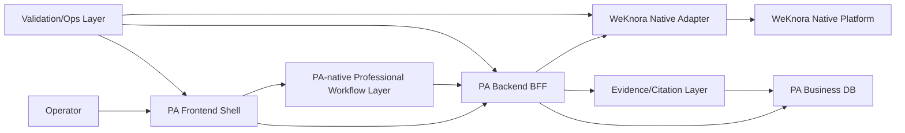

# PA WeKnora Native Expansion Architecture

> Task: `WNX-0-02`
>
> Date: 2026-06-22
>
> Evidence type: audit/map. This blueprint is not live capability PASS evidence.

## Purpose

This document turns the native expansion spec into an operational architecture
blueprint for later `WNX-P0`, `WNX-P1`, and `WNX-P2` work. It describes module
ownership, data flow, file ownership, forbidden areas, and development landing
zones for the internal production PA workbench.

The product direction is:

- PA keeps the product shell, operator workflow, business history, citation
  layer, reports, status surfaces, and safety boundaries.
- WeKnora owns general knowledge platform capability: knowledge base,
  document parsing and indexing, chunk storage, RAG, knowledge-chat, Wiki,
  AgentQA, custom Agent, MCP, web search, vector store, model/config, parser,
  data source, FAQ, tags, favorites, and skill platform surfaces.
- PA is a BFF and workflow shell around WeKnora native capabilities. It should
  not rebuild a parallel general RAG, Wiki, Agent, parser, embedding, vector
  store, MCP, or web-search stack.

## Architecture Diagram

## Module Boundaries

| Module | PA owns | WeKnora owns | Main files today | Development landing zone |
| --- | --- | --- | --- | --- |
| PA Frontend Shell | Navigation, pages, operator flow, status labels, citation/history display, safe jump links. | Native admin depth remains outside PA unless scoped. | `apps/pa-web/src/App.tsx`, `apps/pa-web/src/pages/*`, `apps/pa-web/src/api/client.ts`, `apps/pa-web/src/components/workbench.tsx` | `WNX-P0-03`, `WNX-P3-01`, P1 workflow pages. |
| PA Backend BFF | PA semantic APIs, status normalization, history/citation persistence, safe errors, masked config snapshots. | Native platform response shape and platform authorization. | `apps/pa-api/app/api/*`, `apps/pa-api/app/services/*`, `apps/pa-api/app/schemas.py`, `apps/pa-api/app/config.py` | `WNX-P0-02`, all P1/P2 BFF slices. |
| WeKnora Native Adapter | Thin typed client, trace id, timeout, retry, redaction, error classes, response normalization. | Native endpoints and authoritative capability behavior. | `packages/knowledge-engine/knowledge_engine/backends/weknora_api_backend.py`, `packages/knowledge-engine/knowledge_engine/errors.py`, `packages/knowledge-engine/knowledge_engine/schemas.py`, `packages/knowledge-engine/knowledge_engine/citations/*` | `WNX-P0-01` creates the shared client contract. |
| PA Business DB | Business records, history, citations, report metadata, active KB/workspace/config selection snapshots. | Chunks, vectors, provider secrets, parser internals, platform config truth. | `apps/pa-api/app/models.py`, `apps/pa-api/app/database.py`, SQLite by default | P1 history/citation and workflow persistence. |
| Evidence/Citation Layer | Traceable citation objects, locator routing, report safety, fail-closed checks. | Native ids and references returned by document, Wiki, or AgentQA paths. | `packages/knowledge-engine/knowledge_engine/evidence.py`, `packages/knowledge-engine/knowledge_engine/citations/*`, `apps/pa-api/app/api/citations.py`, `apps/pa-api/app/services/citation_locator_service.py` | `WNX-P1-07` plus each workflow task. |
| Validation/Ops Layer | Live smokes, browser checks, report safety, coverage ledger, service/runbook validation, handoff. | Native service health and platform status APIs. | `scripts/validation/*`, `docs/archive/weknora-first/WEKNORA_FIRST_*`, future `docs/archive/wnx/WEKNORA_NATIVE_CAPABILITY_COVERAGE_LEDGER.md` | `WNX-0-03`, `WNX-P0-04`, `WNX-P0-05`, `WNX-P3-02`. |
| PA-native Professional Workflow Layer | Policy/case/QA entry points, templates, PA history, report outputs, business language. | General AgentQA/custom Agent and tools when used for platform reasoning. | `packages/agent-runtime/agent/orchestrator.py`, `packages/agent-runtime/agent/agents/*`, `packages/agent-runtime/agent/tools/*`, `apps/pa-api/app/services/analysis_service.py`, `apps/pa-web/src/pages/AnalysisPage.tsx` | P1 AgentQA/custom Agent integration, with deeper PA-native expansion backlog by default. |

## Request And Data Flow

### Document Lifecycle

1. PA Frontend Shell sends upload/status requests through `apps/pa-web/src/api/client.ts`.
2. PA Backend BFF receives requests in `apps/pa-api/app/api/documents.py`.
3. `apps/pa-api/app/services/document_service.py` creates or updates PA business
   records and calls the WeKnora Native Adapter for native ingestion/status.
4. WeKnora Native Adapter calls WeKnora knowledge routes such as:
   - `POST /api/v1/knowledge-bases/{kb_id}/knowledge/file`
   - `POST /api/v1/knowledge-bases/{kb_id}/knowledge/url`
   - `POST /api/v1/knowledge-bases/{kb_id}/knowledge/manual`
   - `GET /api/v1/knowledge/{knowledge_id}`
   - `GET /api/v1/knowledge/{knowledge_id}/stages`
   - `GET /api/v1/knowledge/{knowledge_id}/spans`
   - `GET /api/v1/chunks/{knowledge_id}`
5. PA DB stores the business document record, status events, external native
   ids, and safe status snapshots. It must not store WeKnora authoritative
   chunks or vectors as PA-owned truth.

Development landing:

- `WNX-P1-02` owns file/url/manual ingestion, status spans, preview/download,
  delete/reparse/cancel, and chunk preview policy.
- `WNX-P1-03` owns safe chunk inspection and mutation confirmation policy.

### Retrieval, RAG, And Knowledge Chat

1. PA Frontend Shell sends RAG debug or future chat requests to PA BFF.
2. PA BFF routes through `apps/pa-api/app/api/rag.py` and
   `apps/pa-api/app/services/rag_service.py`.
3. WeKnora Native Adapter calls `POST /api/v1/knowledge-search` today and should
   add `POST /api/v1/knowledge-chat/{session_id}` only when the PA conversation
   and citation contract is ready.
4. Evidence/Citation Layer accepts only traceable evidence. The RAG result must
   carry `source=weknora_api`, `source_type`, `evidence_id`, native ids, score,
   rank, and safe metadata.
5. PA DB stores conversation/history/output/citation records, not native vector
   state.

Development landing:

- `WNX-P0-01` unifies adapter behavior first.
- `WNX-P1-04` then integrates native search and knowledge-chat with PA history
  and current-run citation evidence.

### Wiki

1. PA Frontend Shell renders the PA Wiki workspace and native overview.
2. PA BFF uses `apps/pa-api/app/api/wiki.py` and `apps/pa-api/app/services/wiki_service.py`.
3. WeKnora Native Adapter calls native Wiki routes such as:
   - `GET /api/v1/knowledgebase/{kb_id}/wiki/pages`
   - `GET /api/v1/knowledgebase/{kb_id}/wiki/pages/{slug}`
   - `GET /api/v1/knowledgebase/{kb_id}/wiki/search`
   - `GET /api/v1/knowledgebase/{kb_id}/wiki/index`
   - `GET /api/v1/knowledgebase/{kb_id}/wiki/log`
   - `GET /api/v1/knowledgebase/{kb_id}/wiki/graph`
   - `GET /api/v1/knowledgebase/{kb_id}/wiki/stats`
   - `GET /api/v1/knowledgebase/{kb_id}/wiki/lint`
   - `GET /api/v1/knowledgebase/{kb_id}/wiki/issues`
4. Wiki mutations such as create/update/delete, rebuild-links, auto-fix, and
   issue status changes require explicit PA confirmation, audit trail, and
   rollback/backlog decision. They must not be added as invisible BFF helpers.
5. PA DB may store Wiki drafts, Wiki citation records, native page id/slug
   snapshots, and locator metadata. It must not store WeKnora's authoritative
   Wiki platform state as a replacement for native Wiki.

Development landing:

- `WNX-P1-06` owns the full native Wiki workflow.
- `WNX-P1-07` owns Wiki citation locator consistency.

### AgentQA And Custom Agent

1. PA Frontend Shell keeps the intelligent analysis workflow and history UI.
2. PA BFF should route general native reasoning through WeKnora AgentQA/custom
   Agent instead of expanding PA-native general orchestration.
3. WeKnora Native Adapter already has `create_agent_session`, `run_agent_qa`,
   and `list_agents` entry points that should be moved under the unified
   adapter contract during `WNX-P0-01`.
4. Native routes include:
   - `POST /api/v1/agent-chat/{session_id}`
   - `GET /api/v1/agents`
   - `GET /api/v1/agents/type-presets`
   - `GET /api/v1/agents/placeholders`
   - `GET /api/v1/agents/{id}/suggested-questions`
5. PA may store the answer/output/history. Citation PASS is allowed only when
   the native response includes traceable references with a real source type,
   evidence id, and locator identity.

Development landing:

- `WNX-P1-05` owns AgentQA/custom Agent workflow integration.
- If native AgentQA still lacks traceable references, the workflow can be
  live-partial for answer/history and blocked for citation PASS.

### MCP, Web Search, Vector Store, Model, Parser, Data Source

These are platform configuration and infrastructure surfaces. PA should expose
masked readiness, safe read-only catalog/list/status, and native jump links
before any mutation UI.

Native route groups include:

- MCP: `/api/v1/mcp-services`, tools, resources, approval, credentials.
- Web search: `/api/v1/web-search/providers`, `/api/v1/web-search-providers`.
- Vector store: `/api/v1/vector-stores`, `/api/v1/vector-stores/types`.
- Model/config/parser: `/api/v1/models`, credentials, parser engines, model
  checks, WeKnoraCloud status.
- Data source: `/api/v1/datasource`, connector types, validate, resources,
  sync, pause, resume, logs.
- FAQ/tags/favorites/skills: native KB FAQ routes, KB tags, user favorites,
  and skills list.

Credential subresources, raw test payloads, raw provider responses, connection
strings, and private endpoints are WeKnora-owned platform concerns. PA may show
masked configured/live/blocked/backlog state, but not secret-bearing forms or
raw platform payloads unless a later secure task explicitly scopes them.

Development landing:

- `WNX-P2-01`: model, embedding, rerank, parser config.
- `WNX-P2-02`: MCP service management.
- `WNX-P2-03`: web search provider management.
- `WNX-P2-04`: vector store management.
- `WNX-P2-05`: data source connector management.
- `WNX-P2-06`: FAQ, tags, favorites, skills.

## PA Frontend Shell

Current shell:

- `apps/pa-web/src/App.tsx` owns hash navigation and the six current pages:
  Home, Library, Analysis, RAG Debug, Wiki, and History.
- `apps/pa-web/src/api/client.ts` owns frontend API types for status, model,
  documents, RAG, citations, Wiki overview, MCP overview, web search overview,
  and vector store overview.
- `apps/pa-web/src/pages/HomePage.tsx` owns status summary and entry points.
- `apps/pa-web/src/pages/LibraryPage.tsx` owns document upload, list, status,
  chunk/event viewing, and retry controls.
- `apps/pa-web/src/pages/RagDebugPage.tsx` owns native retrieval diagnostics and
  evidence display.
- `apps/pa-web/src/pages/AnalysisPage.tsx` owns PA professional analysis entry.
- `apps/pa-web/src/pages/WikiPage.tsx` owns Wiki browse/search/read/draft/status.
- `apps/pa-web/src/pages/HistoryPage.tsx` owns outputs, filters, warnings, and
  citation/history review.

Frontend must:

- Preserve PA as the user-facing workbench, not a WeKnora admin clone.
- Show live, partial, blocked, backlog, mock, and fallback states truthfully.
- Display citations and locator actions only when the backend returns traceable
  evidence fields.
- Offer native jump links for broad admin screens where PA should not duplicate
  WeKnora UI.
- Keep professional workflow entry points visible even when the underlying
  native capability is partial or blocked.

Frontend must not:

- Show static green status cards for unvalidated native services.
- Hide fallback/mock/partial state.
- Render secret values, provider payloads, raw logs, raw uploaded content, raw
  vector data, or local DB content.
- Convert MCP/web/vector/model/provider readiness into citation evidence.

## PA Backend BFF

Current BFF surfaces:

- `apps/pa-api/app/main.py` registers health, documents, citations, conversations,
  analysis, history, MCP, model, RAG, vector store, web search, and Wiki routers.
- `apps/pa-api/app/api/health.py` exposes `/health`, `/api/status`, and
  `/api/capabilities`.
- `apps/pa-api/app/api/documents.py` exposes PA document upload, list, status
  refresh, read, parse/index/reindex/retry, chunks, and events.
- `apps/pa-api/app/api/rag.py` exposes `/api/rag/retrieve` and `/api/rag/debug`.
- `apps/pa-api/app/api/wiki.py` exposes native Wiki overview plus PA Wiki
  search/page/draft/publish/status/reindex routes.
- `apps/pa-api/app/api/analysis.py`, `apps/pa-api/app/api/history.py`, and
  `apps/pa-api/app/api/citations.py` preserve professional output, history, and
  locator workflows.
- `apps/pa-api/app/api/mcp.py`, `apps/pa-api/app/api/web_search.py`, and
  `apps/pa-api/app/api/vector_store.py` expose native read-only overview slices.
- `apps/pa-api/app/api/model.py` exposes model status.

BFF must:

- Present PA semantic contracts, not raw WeKnora responses.
- Add or preserve trace id, timeout class, retry class, source endpoint,
  capability state, evidence classification, warnings, and next action.
- Mask config and credential posture as booleans or sanitized labels.
- Persist only PA business records and safe snapshots needed for history,
  audit, citations, workflow recovery, and reports.
- Fail closed when native references are missing or untraceable.

BFF must not:

- Add one-off direct native HTTP calls in route handlers when an adapter method
  should exist.
- Expose upstream error text if it may contain secrets or provider payloads.
- Store native chunks, vectors, raw embeddings, provider payloads, local logs,
  or secret-bearing config in PA DB.
- Treat configured-but-untested platform state as live-full.

## WeKnora Native Adapter

Current adapter:

- `packages/knowledge-engine/knowledge_engine/backends/weknora_api_backend.py` centralizes much of the
  current native access, including health, workspace/KB, document upload/status,
  chunks, search/RAG, Wiki, AgentQA, agents, MCP, web search, and vector store
  read-only helpers.
- It also contains low-level request helpers, auth header application, retry,
  timeout, redaction, safe dictionaries, error mapping, evidence mapping, and
  metadata allowlists.

Target adapter contract for `WNX-P0-01`:

- One shared client path for all WeKnora native capabilities.
- Shared config: base URL presence, token presence, workspace, active KB,
  optional KB mapping, timeout, retry attempts, and retry backoff.
- Shared request behavior: trace id, safe operation label, timeout class, retry
  class, HTTP error mapping, response unwrapping, redacted logs.
- Shared response behavior: `source=weknora_api`, native endpoint label,
  capability status, warnings, blocked/backlog reason, and next action.
- Capability helpers grouped by knowledge base, document, chunk, search, chat,
  AgentQA, custom Agent, Wiki, MCP, web search, vector store, model/config,
  parser, data source, FAQ, tags, favorites, and skills.
- Safe dictionary builders for every credential-bearing capability.

Adapter must not:

- Log auth headers, API keys, service tokens, private endpoints, request bodies
  that may contain uploaded text, provider payloads, raw vector data, or raw
  credentials.
- Fabricate citation ids or source types when native responses are incomplete.
- Let frontend code become the first place evidence normalization happens.

## PA Business DB

Current PA DB models in `apps/pa-api/app/models.py` include:

- `Document`, `DocumentProcessingEvent`
- `Conversation`, `ConversationMessage`
- `GenerationTask`, `GeneratedOutput`
- `Citation`
- `WikiPage`, `WikiCitation`, `WikiPageCache`
- `DocumentChunk`

Ownership rule for native expansion:

PA DB stores PA business state, not WeKnora platform internals.

PA DB may store:

- PA document records, including `knowledge_backend`, `external_doc_id`, status,
  failed step, safe title/type/source, and safe status snapshots.
- PA document processing events and retry/recovery state.
- Conversations, conversation messages, generation tasks, generated outputs,
  warnings, and workflow status.
- Citation records with source, source_type, evidence_id, chunk/native document
  id, Wiki page id/slug metadata, score, locator metadata, and short excerpts
  needed for audit/history display.
- Wiki draft records, Wiki citation records, and native Wiki page id/slug
  snapshots needed to locate PA history outputs.
- Active workspace/knowledge-base/config selection snapshots and coverage or
  validation summaries when they are sanitized.

PA DB must not store:

- WeKnora authoritative chunks or vectors for WeKnora-native documents.
- Raw embeddings.
- Raw vector records or vector-store connection data.
- Raw provider requests/responses.
- API keys, service tokens, passwords, private endpoints, private key blocks,
  auth headers, or local environment values.
- Raw uploaded bodies or local logs/cache artifacts.

Important compatibility note:

`DocumentChunk` exists for legacy/local extracted workflows and for PA read
models. During native expansion, WeKnora-native document chunks should be
read-through from WeKnora or represented only as non-authoritative, temporary,
or citation locator snapshots. A future task must not treat PA-stored chunk
rows as the source of truth for WeKnora-native chunk management.

## Evidence/Citation Layer

Allowed evidence sources:

- Traceable `document_chunk` evidence with native chunk id or result id plus
  native document/knowledge id, mapped to `source=weknora_api`, `source_type`,
  `evidence_id`, `chunk_id`, and `external_doc_id`.
- Traceable `wiki_page` evidence with native Wiki page id or stable slug-derived
  identity, mapped to `source_type=wiki_page`, `wiki_page_id`, `evidence_id`,
  and locator metadata.
- Traceable AgentQA/custom Agent references only when the native response emits
  enough source identity to audit the answer and locate the evidence later.

Not evidence:

- MCP service status, tool list, resource list, approval policy, or service
  readiness.
- Web search provider catalog, configured-provider status, provider readiness,
  or raw search provider status.
- Vector-store type/list/status, embedding readiness, KB binding status, raw
  vector-store health, or model/provider status.
- Parser readiness, data source status, FAQ/tag/favorite/skill catalog, native
  jump links, service health, and general config availability.
- Agent answer text without traceable native references.

Fail-closed rules:

- Missing `source_type` blocks citation persistence.
- Missing `evidence_id` blocks real citation PASS.
- `document_chunk` without a native chunk id/result id and native document id
  is partial or blocked.
- `wiki_page` without native page id or stable slug identity is partial or
  blocked.
- AgentQA/custom Agent answers without references can be stored as PA output,
  but citation PASS remains blocked.
- Status/config capabilities must stay status, not evidence.

Development landing:

- `WNX-P1-07` unifies history and citation behavior across native workflows.
- Every P1/P2 workflow task must state whether it produces evidence, status, or
  backlog/blocked metadata.

## Validation/Ops Layer

Validation/Ops owns truthfulness for internal production:

- `git diff --check` for documentation and code formatting sanity.
- Focused `rg` checks for required task/layer terms.
- Sensitive scans over changed reports/docs.
- Backend live smoke scripts under `scripts/validation/*` when a capability task
  changes behavior.
- Browser validation for affected frontend pages.
- Report safety checks such as `scripts/validation/check_phase5_report_safety.py`.
- Future coverage scoring in
  `docs/archive/wnx/WEKNORA_NATIVE_CAPABILITY_COVERAGE_LEDGER.md`.
- Deployment readiness in `WNX-P0-05`, including recoverable backend,
  frontend, WeKnora, model, embedding, vector, parser, and service status.

Validation/Ops must keep evidence types separate:

- live evidence
- fixture evidence
- mock evidence
- cached evidence
- partial evidence
- blocked evidence
- backlog evidence

No task may mark PASS from static UI, mock/fixture-only output, old reports,
old browser cache, hidden fallback, or unverified inference.

## PA-native Professional Workflow Layer

PA keeps the professional product layer:

- `packages/agent-runtime/agent/orchestrator.py` registers PA workflows for knowledge QA, policy
  analysis, and case review.
- `packages/agent-runtime/agent/agents/*` owns the current PA-native workflow implementations.
- `packages/agent-runtime/agent/tools/*` owns retriever, Wiki reader/writer, citation checker, and
  evidence policy tools.
- `apps/pa-api/app/services/analysis_service.py` persists PA analysis outputs and
  history.
- `apps/pa-web/src/pages/AnalysisPage.tsx` owns the operator-facing analysis UI.

Native expansion stance:

- Preserve professional workflow entry points, generated output history,
  warnings, reports, and citation display.
- Route general knowledge reasoning through WeKnora AgentQA/custom Agent where
  native paths are available and safe.
- Freeze broad PA-native general Agent expansion unless the user explicitly
  scopes a narrow professional workflow task.
- Keep PA workflow outputs internal-production eligible only when they are
  backed by live native evidence and PA citation/history persistence.

## Forbidden Cross-Cutting Moves

- Do not commit or print `.env` values, API keys, service tokens, passwords,
  auth headers, private endpoints, private key blocks, provider payloads, raw
  uploaded bodies, local database contents, logs, caches, uploads, screenshots,
  `node_modules`, or `dist`.
- Do not store WeKnora authoritative chunks/vectors or secrets in PA DB.
- Do not turn MCP/web/vector/model/provider/parser status into citation
  evidence.
- Do not create direct native HTTP calls in random BFF handlers when the adapter
  should own them.
- Do not deepen PA-native general RAG/Wiki/Agent/parser/vector systems when
  WeKnora has a native route.
- Do not hide partial/blocked/backlog state for visual polish.
- Do not make unsafe destructive native mutations without confirmation, audit
  trail, and explicit task scope.

## File Ownership Map

| Area | Existing files | Notes for future edits |
| --- | --- | --- |
| Frontend shell/navigation | `apps/pa-web/src/App.tsx`, `apps/pa-web/src/styles.css` | Add capability/config center route in `WNX-P0-03`; keep six-page product flow. |
| Frontend API contracts | `apps/pa-web/src/api/client.ts` | Add status types only after BFF shape exists; do not infer health in UI. |
| Frontend pages | `apps/pa-web/src/pages/HomePage.tsx`, `LibraryPage.tsx`, `RagDebugPage.tsx`, `AnalysisPage.tsx`, `WikiPage.tsx`, `HistoryPage.tsx` | Browser validation required when touched. |
| BFF routers | `apps/pa-api/app/api/*.py` | Expose PA semantic APIs and safe native overview endpoints. |
| BFF services | `apps/pa-api/app/services/*.py` | Own business workflow, persistence, status, and citation glue. |
| Settings/config | `apps/pa-api/app/config.py` | Load config but never print values; expose masked posture only. |
| DB models | `apps/pa-api/app/models.py`, `apps/pa-api/app/database.py` | Store business records, not WeKnora platform internals. |
| Native adapter | `packages/knowledge-engine/knowledge_engine/backends/weknora_api_backend.py` | `WNX-P0-01` should split or standardize common request/response behavior before more capability work. |
| Citation contract | `packages/knowledge-engine/knowledge_engine/evidence.py`, `packages/knowledge-engine/knowledge_engine/citations/*`, `apps/pa-api/app/api/citations.py`, `apps/pa-api/app/services/citation_locator_service.py` | Fail closed on missing ids; status is not evidence. |
| Professional workflows | `packages/agent-runtime/agent/orchestrator.py`, `packages/agent-runtime/agent/agents/*`, `packages/agent-runtime/agent/tools/*` | Preserve PA workflow shell; avoid broad general Agent rebuild. |
| Validation | `scripts/validation/*`, `docs/archive/weknora-first/WEKNORA_FIRST_*`, future WNX reports | Every task declares evidence type and runs focused checks. |

## WNX Task To Module Mapping

| Task | Primary module | Secondary modules | Main output |
| --- | --- | --- | --- |
| `WNX-0-03` | Validation/Ops Layer | Evidence/Citation Layer | Coverage ledger and 80% scoring baseline. |
| `WNX-P0-01` | WeKnora Native Adapter | PA Backend BFF, Evidence/Citation Layer | Unified adapter with shared config/error/timeout/retry/trace/normalization. |
| `WNX-P0-02` | PA Backend BFF | Validation/Ops Layer, WeKnora Native Adapter | Internal config/status center backend with masked native readiness. |
| `WNX-P0-03` | PA Frontend Shell | PA Backend BFF, Validation/Ops Layer | Capability/config center frontend shell with truthful statuses. |
| `WNX-P0-04` | Validation/Ops Layer | Evidence/Citation Layer, PA Backend BFF | Live acceptance harness and report safety gates. |
| `WNX-P0-05` | Validation/Ops Layer | PA Backend BFF, WeKnora Native Adapter | Internal deployment readiness and service recovery proof. |
| `WNX-P1-01` | WeKnora Native Adapter | PA Backend BFF, PA Business DB | Knowledge base management and active selection. |
| `WNX-P1-02` | WeKnora Native Adapter | PA Backend BFF, PA Frontend Shell, PA Business DB | Document lifecycle through native ingestion/indexing. |
| `WNX-P1-03` | WeKnora Native Adapter | PA Backend BFF, Evidence/Citation Layer | Chunk management with safe preview and mutation policy. |
| `WNX-P1-04` | WeKnora Native Adapter | Evidence/Citation Layer, PA Business DB, Frontend Shell | Native RAG plus knowledge-chat with history/citation. |
| `WNX-P1-05` | PA-native Professional Workflow Layer | WeKnora Native Adapter, Evidence/Citation Layer | AgentQA/custom Agent workflow with citation blocker if needed. |
| `WNX-P1-06` | PA Frontend Shell | WeKnora Native Adapter, Evidence/Citation Layer | Full native Wiki workflow with mutation safety. |
| `WNX-P1-07` | Evidence/Citation Layer | PA Business DB, PA Frontend Shell | History and citation unification for native workflows. |
| `WNX-P2-01` | WeKnora Native Adapter | PA Backend BFF, Validation/Ops Layer | Model/embedding/rerank/parser config status. |
| `WNX-P2-02` | WeKnora Native Adapter | PA Backend BFF, PA Frontend Shell | MCP management where safe, otherwise read-only/backlog. |
| `WNX-P2-03` | WeKnora Native Adapter | PA Backend BFF, PA-native Professional Workflow Layer | Web search provider readiness and AgentQA dependency status. |
| `WNX-P2-04` | WeKnora Native Adapter | PA Backend BFF, PA Business DB | Vector store management/readiness without raw config. |
| `WNX-P2-05` | WeKnora Native Adapter | PA Backend BFF, Validation/Ops Layer | Data source connector validate/resources/sync status. |
| `WNX-P2-06` | PA Frontend Shell | WeKnora Native Adapter, PA Business DB | FAQ, tags, favorites, skills as workbench organization primitives. |
| `WNX-P3-01` | PA Frontend Shell | Validation/Ops Layer | Six-page product workflow browser matrix. |
| `WNX-P3-02` | Validation/Ops Layer | All modules | Internal production report with coverage, risks, blockers, backlog. |
| `WNX-P3-03` | Validation/Ops Layer | All modules | Deployment handoff prompt/runbook. |

## Implementation Order Guidance

1. Finish governance baseline with `WNX-0-03` before implementation scoring.
2. Build `WNX-P0-01` before broad P1/P2 integration. A unified adapter prevents
   every later route from inventing its own timeout, retry, trace, masking, and
   evidence rules.
3. Build `WNX-P0-02` before the frontend capability center so UI cards can be
   backed by live API state instead of static assumptions.
4. Build `WNX-P0-03` after the backend status center and validate by browser.
5. Build `WNX-P0-04` and `WNX-P0-05` before heavy P1 workflows so report PASS
   and service readiness are protected.
6. Execute P1 workflow tasks one at a time: KB, document lifecycle, chunk,
   RAG/chat, AgentQA/custom Agent, Wiki, history/citation.
7. Execute P2 platform configuration only after P0 status/adapter/validation
   are stable, because these areas are credential-heavy and mutation-sensitive.

## PASS Boundary For This Blueprint

This document is PASS only as architecture audit/map evidence if validation
proves it names the required modules, existing files, forbidden areas, data
ownership rules, citation rules, and task mappings. It does not add live
capability, does not change product code, and does not mark any P0/P1/P2
implementation complete.
