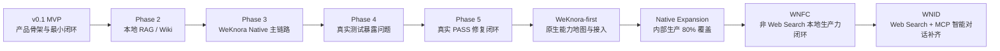
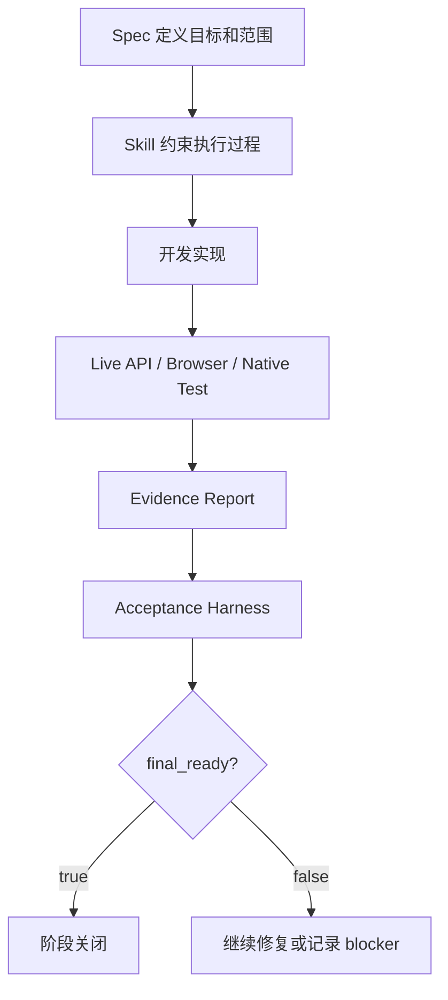

# PA AI Workbench 开发记录文档

> 从 v0.1 MVP 到 WeKnora Native Intelligent Dialogue 的产品化集成复盘
>
> 写作日期：2026-06-26
>
> 口径说明：本文采用第一人称项目复盘口径，用于简历项目复盘与面试准备。PA AI Workbench 是一个独立产品；WeKnora 是底层原生能力来源。本文不会把 PA 写成从零重写 WeKnora 底层 RAG、Wiki、Agent、MCP 或 Web Search 内核，而是强调我基于 WeKnora 原生能力完成产品化接入、封装、验证和迭代。

## 0. 一句话概括

PA AI Workbench 是我围绕“个人/团队知识资料如何变成可验证、可追溯、可持续迭代的 AI 工作台”做出的独立产品项目。它最初从 v0.1 MVP 的前后端骨架和知识问答闭环开始，随后经历本地 RAG/Wiki、WeKnora Native 主链路、Phase 4/5 真实测试、WeKnora-first 五天冲刺、Native Expansion、WNFC 本地生产力闭环，以及 WNID 智能对话补齐阶段。

这个项目对我最重要的价值不是“堆了多少功能”，而是我逐步形成了一套能管理复杂 AI 产品开发的方法：用 `spec` 定义目标、范围、任务和验收口径，用 `skill` 固化执行纪律，用 `harness` 把“看起来完成”变成“可检查、可复现、可解释的完成”。在这个过程中，我把自己从“会一点 Python、想做一个简历项目”的状态，推进到能围绕 RAG、Wiki、Agent、MCP、Web Search、citation、history、audit、browser matrix 和 acceptance harness 设计产品闭环的状态。

## 1. 项目起点：为什么我要做 PA AI Workbench

我做 PA AI Workbench 的起点很朴素：我希望拥有一个能体现 AI 产品理解、技术理解和工程协作能力的简历项目。作为 AI 产品实习生，我不能只展示“我会写提示词”或者“我会调用一个大模型接口”。我需要一个项目能回答面试官更关心的问题：我是否理解 AI 产品为什么需要知识库、为什么需要 RAG、为什么需要引用和证据、为什么需要真实环境测试，以及为什么复杂 Agent 能力不能只靠演示页面证明。

最开始我面对的是三个产品问题：

- 单纯调用大模型，无法可靠处理私有资料，也很难解释答案依据。
- 普通文档问答如果没有 Wiki、Agent、引用、历史和审计，很容易停留在一次性问答工具。
- 简历项目如果只有静态页面或 mock 数据，很难证明我真的推动过一个可验证产品。

因此我把 PA AI Workbench 定义成一个独立产品，而不是 WeKnora 的一个子页面或演示壳。PA 负责产品入口、工作流、BFF、业务状态、历史、引用、审计、状态展示和验收报告；WeKnora 负责更底层的知识库、文档解析、chunk、embedding、检索、Wiki、AgentQA、MCP、Web Search 和向量存储等原生能力。这个边界决定了后面所有阶段的取舍：PA 不盲目重写底层能力，也不把 WeKnora 后台能力原样丢给用户，而是把它们变成一个适合日常知识工作的产品体验。

## 2. 总体演进主线

整个项目不是一开始就冲着“完整 Agent 工作台”去做，而是逐层推进：

1. 先让产品跑起来：v0.1 MVP 建立前后端和最小知识工作流。
2. 再让知识能力可用：Phase 2 做本地 parser、chunk、向量检索和 Wiki CRUD。
3. 再让能力来源更真实：Phase 3 转向 WeKnora Native，建立 adapter、capability matrix 和 fail-closed 规则。
4. 再让结果可验证：Phase 4/5 用真实上传、真实 RAG、真实 Wiki、真实 QA 和浏览器门禁修正质量问题。
5. 再扩大原生能力接入：WeKnora-first 和 Native Expansion 把更多 native 能力接入 PA。
6. 再收敛成本地生产力工具：WNFC 在非 Web Search 范围做到 14/14、`final_ready=true`。
7. 最后补齐智能对话：WNID 把 Web Search 和 MCP execution 重新纳入范围，完成 README Intelligent Conversation 对齐。



从产品角度看，这条线反映的是复杂 AI 产品从“能做一个 demo”到“能被验证、能被复盘、能继续迭代”的过程。从个人成长角度看，这条线也反映了我对 AI 产品开发的理解变化：早期我更关心功能有没有；中期我开始关心 evidence 是否可定位；后期我更关心范围是否真实、验收是否严格、blocked 是否被诚实记录。

## 3. 阶段时间线总览

| 阶段 | 核心目标 | 核心产出 | 阶段结果 |
| --- | --- | --- | --- |
| v0.1 MVP | 搭出独立产品骨架 | 前后端基础、初始 API、知识库/文档/问答最小闭环 | 产品方向可运行 |
| Phase 2 本地 RAG/Wiki | 让知识能力从页面进入本地可用 | parser、chunk、embedding、向量检索、Wiki CRUD、`/api/rag/retrieve` | 本地知识工作流雏形 |
| Phase 3 WeKnora Native | 从本地能力演进到 WeKnora 原生主链路 | M1 release checklist、backend capability matrix、parity matrix、RAG 质量 rubric | 从 demo 走向 native-powered |
| Phase 4 真实测试 | 用真实环境暴露质量问题 | 环境预检查、9 文档上传/索引、24 问 RAG matrix、Wiki 测试、前端报告 | 真实证据完整，但能力结论为 PARTIAL |
| Phase 5 真实 PASS | 修复 Phase 4 暴露的问题 | 24 问 RAG PASS、24 问 knowledge_qa PASS、Wiki PASS、六页浏览器 PASS | 从“能跑”推进到“可验证通过” |
| WeKnora-first | 系统梳理 PA 与 WeKnora 的能力边界 | native capability map、document/RAG live、AgentQA、Wiki native browse、MCP/Web/vector visibility | 建立 WeKnora-first 开发纪律 |
| Native Expansion | 扩大原生能力接入到内部生产范围 | 15 组能力 ledger、Capability Center、acceptance harness、browser matrix | 12/15 = 80.0%，窄范围 PASS |
| WNFC | 做成非 Web Search 范围的本地生产力工具 | 14 组能力、confirmation/audit、browser matrix、final report | 14/14 = 100.0%，`final_ready=true` |
| WNID | 补齐智能对话与 README Intelligent Conversation | first-class dialogue、ReACT、MCP execution、Web Search、Wiki Mode、Suggested Questions | 17/17 complete，`final_ready=true` |

## 4. 阶段目标 / 动作 / 产出 / 结果表

| 阶段 | 我当时要解决的问题 | 我采取的动作 | 主要产出 | 结果与成长 |
| --- | --- | --- | --- | --- |
| MVP | 先证明产品方向能跑 | 搭项目结构、API、基础页面和知识工作流 | 独立 PA 产品目录、backend/frontend/knowledge_engine 分层 | 学会先收敛最小用户流程 |
| Phase 2 | 让知识资料可被检索和组织 | 做文档解析、chunk、embedding、向量检索、Wiki 模型 | 本地 RAG/Wiki 雏形 | 认识到 RAG 是数据链路，不是一次 LLM 调用 |
| Phase 3 | 避免自研通用底层能力 | 转向 WeKnora native adapter，建立 capability/parity matrix | M1 READY、mock/extracted/weknora_api 边界 | 学会 fail closed 和证据 traceability |
| Phase 4/5 | 证明真实环境下可用 | 上传、索引、24Q、Wiki、QA、浏览器测试 | Phase 4 PARTIAL，Phase 5 PASS | 学会把问题暴露出来再闭环 |
| WeKnora-first | 系统化接入 native 能力 | 先查 native routes，再决定 PA 适配 | 能力地图、状态门禁、citation contract | 学会 PA-first，而不是 PA 重写 |
| Native Expansion | 从功能点扩展到能力覆盖 | 建 ledger、Capability Center、acceptance harness | 12/15 = 80.0% 内部生产门槛 | 学会用分数和证据管理阶段目标 |
| WNFC | 让 PA 真正本地可用 | 逐项闭环非 Web Search 能力，确认/审计所有 mutation | 14/14、browser matrix、final_ready | 学会范围内 100% 与真实排除 |
| WNID | 补齐智能对话硬门槛 | 重新纳入 Web Search 和 MCP execution | 17/17、ReACT、MCP、Web Search、Wiki Mode | 学会后续阶段不能改写前一阶段结论 |

## 5. v0.1 MVP：从 0 搭出独立产品骨架

最早的 v0.1 MVP 阶段，我没有直接追求完整 RAG、完整 Agent 或完整 Wiki。原因很简单：如果产品骨架不存在，底层能力再强也没有承载用户流程的地方。我的第一目标是搭出一个能跑的 PA AI Workbench，让它有独立目录、独立前端、独立后端、初始 API 和最小知识工作流。

我在这个阶段做的事情主要包括：

- 建立 PA 独立产品目录，而不是把它写成 WeKnora 原仓库里一个零散脚本。
- 搭建 backend、frontend、knowledge_engine 等基础分层。
- 定义知识库、文档、问答等初始 API，使前端可以围绕稳定接口迭代。
- 允许早期 mock 或本地 prototype 存在，但把它们定位成开发辅助，而不是最终验收依据。

这个阶段的关键取舍是“先验证用户流程，而不是先追求底层完美”。我需要先证明用户可以进入工作台、上传或选择资料、发起检索/问答、看到结果与状态。只要这个骨架形成，后续无论是替换成 WeKnora 原生 RAG，还是接入 Wiki、Agent、MCP、Web Search，都有一个稳定的产品壳可以承接。

MVP 阶段给我的第一个产品教训是：AI 产品不是能力列表。一个能力只有被放进用户能理解、能操作、能看到状态、能追溯结果的流程里，才是产品能力。PA AI Workbench 从一开始就不是“模型接口调用器”，而是一个面向知识工作的产品壳。

## 6. Phase 2：本地 RAG/Wiki 基础阶段

Phase 2 的目标是让 PA 从“有页面和 API”进入“知识能力可用”的阶段。这个阶段我开始围绕本地知识链路搭建 parser、chunk、embedding、vector store、检索 API 和 Wiki 基础模型。

我当时的技术理解也在这个阶段发生变化。刚开始看 RAG，容易以为它就是“把文档塞给大模型”。真正做起来才发现，RAG 至少包括文档解析、分块、embedding、向量存储、检索召回、排序、上下文组装、回答生成、引用定位和质量诊断。只要其中一个环节不清楚，最后的答案就很难被解释。

我在 Phase 2 做了几类工作：

- 文档侧：把上传资料解析成可管理的文档记录和 chunk。
- 检索侧：从 mock vector store 逐渐转向本地 Chroma 或类似向量能力，并通过 embedding 支撑语义检索。
- API 侧：实现类似 `/api/rag/retrieve` 的检索接口，让前端和 QA 流程可以调用稳定服务。
- Wiki 侧：建立 Wiki 模型和 CRUD，让知识不只是一堆原始文档，还可以沉淀成结构化知识页。

这个阶段的核心方法是“先用 mock 验证产品形状，再用真实本地能力替换 mock”。我没有让前端随着底层实现频繁重写，而是尽量保持接口稳定。这个习惯后来在 WeKnora Native 接入中继续发挥作用：PA 可以替换底层 backend，但产品壳、history、citation 和 UI 状态不用全部推倒重来。

Phase 2 的结果是 PA 具备了本地知识工作流雏形。但我也逐渐意识到，如果继续沿着 PA 自研通用 parser、chunk、embedding、vector、Wiki、Agent 的方向走，会很容易变成重复造轮子。对于简历项目来说，这能展示工程热情，但未必是最好的产品判断。更好的方向是让 PA 保持产品壳价值，把通用底层能力尽量接入更成熟的 WeKnora native 能力。

## 7. Phase 3：WeKnora Native 主链路阶段

Phase 3 是项目方向的重要转折：我开始把 PA 从“本地自建能力优先”转向 “WeKnora native-powered”。这不是简单地把 API 地址换掉，而是重新定义 PA 与 WeKnora 的责任边界。

我给自己的原则是：

- WeKnora 已经有成熟的通用知识库、文档、RAG、Wiki、AgentQA、MCP、Web Search、vector store 能力时，PA 不应该重写一套通用内核。
- PA 应该保留产品壳、业务流程、状态展示、history、citation、report、debug 和浏览器验收。
- 如果 WeKnora native 已经提供能力，PA 只做 adapter / BFF / UI。
- 如果 native 缺字段、缺引用形状、缺安全 API，再考虑最小 native exception。
- 如果缺 API key、credential、workspace、provider 或 operator approval，就记录 blocker，而不是用 mock 假装完成。

Phase 3 的代表性产出包括 M1 release checklist、backend capability matrix、backend parity matrix、RAG quality rubric、Wiki fallback sync strategy。这些文档共同建立了一个非常重要的边界：`mock` 可以用于开发和 UI 测试，`extracted` 可以作为本地 partial fallback，但 release/pilot/staging/intranet 模式下，真正可以作为 release evidence 的是 `weknora_api`，并且必须经过 live gates。

在 M1 release checklist 里，项目状态达到 `READY`，依据是 mock mode disabled、WeKnora 相关配置存在、connection/RAG/Agent/Wiki smoke gates 通过。更重要的是，Phase 3 规定了敏感信息边界：不提交 `.env`、tokens、workspace IDs、KB IDs、真实文档、数据库、日志或 provider payload。

这个阶段我学到的不是“怎么调用一个外部 API”，而是“怎么把外部系统变成自己产品的能力来源”。PA 的价值不在于复制 WeKnora 后台，而在于把 WeKnora native 能力包装成可理解、可追溯、可验证的工作台体验。

## 8. Phase 4/5：真实测试与质量修复

Phase 4 是我第一次系统性把“真实环境测试”当成阶段目标，而不是开发后的附属动作。它的价值不在于一次性全通过，而在于把真实问题暴露出来。

### Phase 4：真实环境暴露问题

Phase 4 的真实测试覆盖了环境预检查、上传索引、RAG matrix、Wiki closed loop、knowledge_qa 和前端接受度。最终结论是 PARTIAL，而不是 PASS。

几个关键事实很能说明这个阶段的意义：

- 环境预检查中，read-only WeKnora connection smoke 通过，但 PA runtime status service 报告 WeKnora unavailable，说明前端可信状态可能误导用户。
- 上传/索引测试中，9 份 synthetic sanitized 文档全部上传、indexed、retrievable，且 evidence 使用 `source=weknora_api`、`source_type=document_chunk`。
- RAG 24 问 matrix 中，结果是 19 PASS、1 PARTIAL、1 FAIL、3 BLOCKED，主要问题包括 Wiki-only 问题依赖 Wiki 发布索引、distractor suppression 失败、ranking 质量需要提升。
- Wiki closed loop 中，draft、publish、read、targeted retrieve 都通过，但自然语言 Wiki 问题 P4Q-017 到 P4Q-019 没有返回 Wiki evidence，因此不能算 full PASS。
- Phase 4 总结明确写出：报告完整，但真实能力不是 clean PASS。

这对我很重要。很多项目复盘容易把“做过测试”写成“测试通过”。Phase 4 让我学会把真实测试当成诊断系统：它证明了哪些能力强，暴露了哪些能力弱，并给后续 Phase 5 提供了明确修复清单。

### Phase 5：从 PARTIAL 到真实 PASS

Phase 5 的目标是修复 Phase 4 暴露的问题，把“真实证据完整”推进到“真实 PASS”。

最终 Phase 5 形成了清晰的 PASS 证据：

- 环境和配置：8 项 PASS。
- 上传/索引 corpus：9 个 synthetic sanitized materials 全部 current-run 上传、索引、可检索。
- RAG debug matrix：24/24 PASS。
- Wiki gate：draft、publish、read back、indexed/retrievable、citation locate、Wiki-only question matrix 通过。
- `knowledge_qa` matrix：24/24 PASS。
- 前端 browser gate：首页、资料库、RAG 调试、Wiki、知识问答、历史六页通过浏览器验收。

Phase 5 的关键不是“数字好看”，而是 PASS 的定义变严格了：mock mode 不算，fixture-only 不算，old cache 不算，fallback evidence 不算。synthetic fixture 可以作为安全测试输入，但只有当它通过真实 PA backend、PA adapter、WeKnora、非 mock model/embedding 路径运行时，才可以作为最终证据。

这个阶段让我形成了后续所有阶段都会复用的习惯：每个报告都要区分 live、fixture、mock、cached、partial、blocked、backlog；每个结论都要有 current-run evidence；每个最终 PASS 都要经得起脚本和浏览器复查。

## 9. WeKnora-first 五天冲刺：从功能点开发到能力地图开发

WeKnora-first 五天冲刺的目标，是重新审视已有 PA 工作，决定哪些是 PA 产品价值，哪些应该迁移或接入 WeKnora 原生能力，哪些 PA-native 专业 Agent 工作应该冻结到 baseline 等以后再设计。

这个阶段最重要的产出是 WeKnora native capability map。它把 knowledge upload/status/chunks/search、knowledge chat、AgentQA、custom Agent、Wiki、MCP、web search、vector store、evidence/citation 等能力逐项映射到 WeKnora source/API surface 与 PA owner surface。

我在这个阶段形成了一个非常实用的开发判断：

- 先查 WeKnora native routes / handlers / services / types。
- 如果 native 已经有能力，PA 做最薄 adapter 和产品包装。
- 如果 native 只支持 read-only，PA 不能把 read-only visibility 说成 workflow PASS。
- 如果 native 返回缺少 traceable reference，PA 不能伪造 citation。
- 如果涉及 credentials、raw provider payload、MCP execution、vector config，必须先做安全边界。

WeKnora-first 的任务板覆盖了 P0、P1、P2 多个能力：

- P0：native capability map、document/RAG live path、RAG debug native alignment、truthful status/report gates、evidence/citation contract。
- P1：native AgentQA/custom Agent、native Wiki browse/search/index/graph/lint、KB selection mapping、frontend integration。
- P2：MCP service visibility、Web Search provider visibility、vector store management visibility，以及 advanced Wiki maintenance backlog。

这个阶段也有一个很重要的真实边界：AgentQA adapter/history slice 可以 PASS，但如果 native AgentQA 没有返回 traceable references，citation mapping 必须记录 blocker，不能把答案文本当成 citation PASS。这个原则后来在 Native Expansion 和 WNID 中不断被验证和修复。

WeKnora-first 对我的意义，是我从“做功能点”进入“做能力地图”。我不再只问“这个按钮能不能做”，而是问“这个能力的 native source 是什么，PA owner surface 是什么，adapter gap 是什么，validation recommendation 是什么，blocked/backlog decision 是什么”。

## 10. Native Expansion：内部生产可用能力覆盖

Native Expansion 的目标，是把 WeKnora-first 中已经建立的能力地图推进到内部生产可用范围。它不是追求所有 WeKnora 能力 100% full，而是建立一个可执行的 80% 覆盖门槛，并且明确哪些平台管理能力只能 live-partial 或 backlog。

这个阶段我把架构拆成几个层次：

- PA Frontend Shell：Home、Library、RAG、Analysis/Dialog、Wiki、History、Capability Center。
- PA Backend BFF：对前端提供稳定、安全、面向产品流程的 API。
- WeKnora Native Adapter：封装 native routes、错误、超时、trace 和 response normalization。
- PA Business DB：保存 PA 自己的业务状态、history、citation、audit，而不是存 WeKnora 权威 vectors/chunks。
- Evidence/Citation Layer：统一 `source`、`source_type`、`evidence_id`、locator、history visibility。
- Validation/Ops Layer：live smoke、browser matrix、report safety、coverage ledger、service recovery。
- PA-native Professional Workflow Layer：作为长期差异化资产，但在 WeKnora-first / Native Expansion 中不抢通用底层范围。

Native Expansion 的覆盖 ledger 共有 15 组 eligible capability groups，评分规则是：

- `live-full` = 1.0：真实 PA 路径调用真实 WeKnora native 能力，并满足 PA 合同。
- `live-partial` = 0.5：真实 native call 工作，但 citation、mutation、history 或 workflow 合同不完整。
- `read-only` = 0.25：PA 可以安全检查 native status/list/catalog，但不能执行用户工作流。
- `blocked` / `backlog` / `unsafe-for-pa` = 0。

最终 Native Expansion 达到：

```text
12.00 / 15 = 80.0%
```

这个 PASS 是“窄但真实”的。它依赖当前 live WNX evidence、AgentQA Wiki citation fix、RSS data source connector unblock、browser matrix 和 acceptance harness。它不声称 credential-heavy connector CRUD、raw resource browsing、raw sync-log inspection、MCP execution、Web Search credential administration 或 vector-store administration 已经 production complete。

Native Expansion 让我学到：复杂产品阶段可以用 coverage ledger 管理，但分数不能为了好看而膨胀。read-only 只能算 read-only，live-partial 只能算 live-partial，真正 full-complete 必须有完整用户工作流、history/citation/status、浏览器或服务证据。

## 11. WNFC：本地生产力工具闭环

WNFC，全称 WeKnora Native Full Completion，是项目里一个非常关键的阶段。它的目标不是继续扩大范围，而是在用户批准的范围内，把 PA 做成本机可用的知识库生产力工具。

这里必须准确区分两个边界：

- WNFC 排除了 Web Search。Web Search 不计入分母，不在这个阶段开发。
- WNFC 是非 Web Search 范围的本地生产力闭环，不是所有 WeKnora 智能对话能力的最终完成。

WNFC 的最终结果是：

```text
WNFC scored groups = 14
current WNFC score = 14.00 / 14 = 100.0%
target WNFC score = 14.00 / 14 = 100.0%
web_search = excluded
final_ready = true
```

### WNFC 的开发原则

WNFC 的核心原则是 `PA-first + controlled native exception`。

`PA-first` 指的是：当 WeKnora 已经有 native API、route、field、event、reference、connector 或 execution path 时，PA 优先修改 adapter、BFF、business DB、audit、history、citation 和 UI，不在 PA 里重写通用底层能力。

`controlled native exception` 指的是：当 WeKnora 缺少必要字段、事件、reference shape、connector、execution path 或 safe API 时，才做最小 native Go 改动，并用 focused native tests、Docker runtime、PA live API 和 browser evidence 证明它真的生效。

`blocked` 指的是：如果缺的是第三方 API、credential、OAuth scope、workspace、account、permission、sample data 或 operator approval，就停止该能力路径并请求明确输入，不用 mock 或 demo 替代。

### WNFC 覆盖的能力组

WNFC 的最终能力组包括：

- System health/status/deployment。
- Workspace/knowledge-base management。
- Document lifecycle。
- Chunk management。
- Knowledge-search/RAG。
- Knowledge-chat/session chat。
- AgentQA/custom Agent。
- Native Wiki。
- MCP scoped complete。
- Vector store。
- Model/embedding/rerank/parser。
- Data sources/connectors scoped complete。
- FAQ/tags/favorites/skills。
- History/citation/product shell。

其中，credential-bearing Notion/Yuque/Feishu connector setup 被用户明确移出 WNFC 100% 范围；MCP tools/resources/prompts list/read 与 MCP approval-gated tool execution 也被用户明确移出当时 WNFC 范围。这些任务是 `[b]`，不是假装 PASS。WNFC 对 MCP 的 scoped complete 主要来自 MCP service CRUD/credentials/status slice，而不是 MCP tool execution。

### WNFC 的产品意义

WNFC 的重要性在于它把 PA 从“能力很多”推进到“本机真的可用”。例如：

- mutation 不再只是调用接口，而是要 confirmation token。
- native mutation 不再只是改状态，而是要 `NativeMutationAudit`。
- vector store 管理不再只是看到配置，而是要确认测试、创建、更新、删除、安全清理和浏览器证据。
- skill management 不再只是列表展示，而是要 create/read/update/delete/test 的安全边界。
- Wiki global maintenance 不再只是 route 存在，而是 rebuild-links、auto-fix、issue create、issue status update 都要受控、审计、验证。

WNFC-P6-01 的 browser matrix 证明 PA 可以作为本地日常知识库工作台使用。它覆盖 Home、Library、Analysis、RAG debug、Wiki、History、Capability Center 的 desktop/mobile Chrome 验证，最终报告 `routes=7`、`viewport_checks=14`、`overflow=0`、`visible_overlap=0`。

WNFC-P6-02 的 final report 则证明 final acceptance checker 普通模式和 `--final` 模式都通过，`final_ready=true`。这也是我第一次真正体会到“阶段关闭”不应该靠主观总结，而应该靠 parser-visible 状态、task rows、score、browser hooks 和 final report 一起证明。

## 12. WNID：智能对话能力补齐

WNID 是 WNFC 之后的新阶段，而不是对 WNFC 的改写。这个边界非常重要。

WNFC 的结论保持不变：非 Web Search 范围，14/14，`final_ready=true`。但 WNFC 当时有意排除了 Web Search，也把 MCP execution 相关切片移出了范围。用户后来希望重新纳入 Web Search 和 MCP execution，这时正确做法不是重写 WNFC 的完成结论，而是建立新的 WNID 阶段。

WNID 的目标是对齐 WeKnora README Intelligent Conversation 能力，通过 PA AI Workbench 完成：

- Intelligent Reasoning：ReACT AgentQA 和 thinking/tool/reference/answer events。
- Quick Q&A：native knowledge-chat / RAG answer 与 traceable citations。
- Wiki Mode：Wiki-capable Agent 创建、维护、引用 Markdown Wiki pages。
- Tool Calling：built-in tools、MCP tools、Web Search tools 与 trace/audit/history。
- Conversation Strategy：prompt、context、tool selection、MCP、Web Search、multi-turn、retrieval thresholds。
- Suggested Questions：native suggested questions 列表与点击发起 live dialogue。

WNID 最终结果是：

```text
task_rows = 17
completed_tasks = 17
open_tasks = 0
web_search = in_scope
mcp_execution = in_scope
browser_matrix = present
final_report = present
final_ready = true
```

### WNID 的关键增量

WNID 相比 WNFC 的关键增量是“智能对话不再只是普通问答，而是有 Agent、工具、策略、Web Search、MCP、Wiki Mode、建议问题和统一历史审计的工作台”。

主要工作包括：

- `#/dialogue` 成为 first-class dialogue shell，不再隐藏在 Analysis advanced panel 里。
- Quick Q&A 从 dialogue shell 发起 native knowledge-chat，并保存 traceable citations。
- Strategy editor 可以查看和修改 native custom Agent prompt/context/tools/MCP/Web Search/multi-turn/retrieval 配置，并用 confirmation/audit 保护 mutation。
- ReACT contract 把 thinking、tool_call、tool_result、reference、answer、complete events 转成 PA runtime/output/message metadata。
- Safe local MCP service 完成 tools/resources read、prompt list/read parity，以及 approval-gated `ping` tool execution，包含 rejected 与 approved 两类证据。
- Web Search provider setup 完成 masked provider create/update/delete、credential update/clear、raw/saved test 与 audit，并用 DuckDuckGo saved-provider test 证明 live。
- AgentQA Web Search run 用 `web_search_enabled=true` 证明 native AgentQA 调用 Web Search 并返回 traceable web references。
- Wiki Mode Agent workflow 证明 Agent 可以创建/维护/引用 Wiki 页面，并保存 locatable Wiki citations。
- Suggested Questions 证明 native agent/KB-scoped suggestions 能列出并点击发起 live AgentQA。
- History/citation/audit unification 让 Quick Q&A、AgentQA、Wiki、Web Search、MCP、strategy mutation 等结果都能在 PA history/audit 里过滤和解释。

WNID-P8-01 browser matrix 覆盖 desktop 1440x900 与 mobile 390x844，证明 dialogue shell、strategy editor、tool trace、MCP/Web Search status、citations 和 suggested questions 都可见，并且没有依赖隐藏 advanced panel。WNID-P8-02 final report 则让 acceptance harness 在 final mode 下通过。

WNID 给我的产品启发是：Agent 产品的“完成”不能只看回答有没有生成。智能对话至少要证明工具是否真的被调用、Web references 是否可追溯、MCP execution 是否有审批和审计、策略变更是否可回滚和解释、history/citation/audit 是否把用户看不见的后台动作沉淀下来。

## 13. 我的开发方法论：spec + skill

这个项目最值得在面试中展开讲的，不只是技术栈，而是 `spec + skill` 方法论。

### Spec：把阶段目标变成产品与验收契约

我把 spec 当作阶段产品需求与验收契约。每个重要阶段都有自己的 spec，例如 WeKnora-first、Native Expansion、WNFC、WNID。spec 不是普通需求文档，而是同时定义：

- 阶段定位：这个阶段解决什么问题，不解决什么问题。
- 任务列表：每个任务有明确 id，例如 `WF-*`、`WNX-*`、`WNFC-*`、`WNID-*`。
- 范围边界：什么 in scope，什么 excluded，什么 backlog，什么需要用户确认。
- 完成状态：`complete`、`live-full`、`live-partial`、`blocked`、`backlog`、`excluded` 等。
- 证据要求：live API、live browser、native Go test、Docker runtime、checker execution、audit/map。
- 安全要求：不能泄露 credential、raw payload、数据库、logs、uploads、prompts、vectors。
- 最终报告：阶段关闭时必须有 final report 和 acceptance harness 证据。

Spec 的作用是防止项目跑偏。没有 spec 时，开发很容易变成“看到什么就修什么”；有 spec 后，每次开发都能回到阶段目标：这个任务编号是什么？它解决哪个能力组？它需要什么证据？它是否真的能改变 coverage 或 final readiness？

### Skill：把执行纪律变成可复用协议

如果说 spec 是“做什么与怎么验收”，skill 就是“每次怎么执行”。我把阶段规则写进 skill，让新对话、新任务也能继承同样的纪律。

典型 skill 规则包括：

- 开始前必须读取哪些 source-of-truth 文档。
- 每次只执行一个明确任务 id。
- 编辑前用中文声明任务编号、任务类型、计划修改文件、验证方式、PASS evidence type。
- native capability 任务必须先查 WeKnora routes/handlers/services/types，再改 PA。
- 不允许用 mock、fixture-only、static UI、old report、cached browser state 当 PASS。
- 需要 credential/API/workspace/provider 时，必须记录 blocker 并请求具体输入。
- mutation、external test、MCP execution、Web Search credential change、Wiki maintenance 必须 confirmation-gated 并写审计。
- 任务完成后同步更新 spec task board、progress log、evidence report、coverage ledger 和 harness。

我在项目中反复使用的任务开场模板大致是：

```text
任务编号：WNFC-Px-xx / WNID-Px-xx
任务类型：WeKnora native capability 接入 / PA BFF / product shell / validation
计划修改文件：...
验证方式：live API / browser / native Go test / Docker runtime / checker
预期 PASS evidence type：...
```

这个模板看似仪式感很强，但对复杂项目非常有用。它迫使我在动手前先确认范围、文件、验证路径和证据类型。尤其是在和 AI coding agent 协作时，skill 相当于把“项目纪律”写成可执行上下文，避免新对话忘记旧边界。

### Spec + Skill 的组合价值

`spec + skill` 让我解决了三个问题：

- 复杂度管理：阶段目标被拆成任务，每个任务有证据和边界。
- 上下文延续：即使换新对话，也能靠 spec 和 skill 恢复执行规则。
- 真实性治理：完成不是一句“done”，而是 task row、progress log、report、harness、browser matrix 一起证明。

面试中我会这样讲：

> 我把 spec 当作产品需求和验收契约，把 skill 当作执行手册。每个阶段先定义清楚范围、任务、证据和禁止事项，再让开发围绕这些约束推进。这样做的好处是项目不会变成临时功能堆叠，而是有阶段目标、有验收标准、有证据沉淀的产品迭代。

## 14. Harness 思想：让 AI 产品结果可验证

这个项目里的 harness 不是一个简单测试脚本，而是一种工程治理思想：当 AI coding、native integration、RAG、Agent、Web Search、MCP 等能力叠在一起时，人的主观判断很容易误判“完成”。Harness 的作用，是把完成标准变成机器可检查、报告可复核、浏览器可观察的证据链。



### Harness 关键概念

| 概念 | 我怎么理解 | 防止的问题 | 项目里的例子 |
| --- | --- | --- | --- |
| acceptance harness | 用脚本检查 task rows、reports、coverage、browser hooks、unsafe wording、final readiness | 文档写完成但任务表没更新；旧证据冒充当前证据 | WNX/WNFC/WNID 都有 acceptance checker |
| browser matrix | 用 desktop/mobile 浏览器验证真实产品 UI | API 通过但前端不可用；页面溢出、状态误导 | WNFC 7 routes/14 viewport checks；WNID desktop/mobile dialogue matrix |
| final_ready | 阶段能否关闭的 parser-visible 状态 | 主观宣布完成 | WNFC、WNID final report 都显示 `final_ready=true` |
| current-run evidence | 证据必须来自当前运行 | old report、old evidence id、cached browser state 被复用 | Phase 5、WNFC、WNID 都强调 current-run |
| no mock PASS | mock 只能开发辅助，不能 final PASS | demo/fixture-only 被包装成真实完成 | Phase 3 起建立 mock/extracted/weknora_api 边界 |
| blocker truth | 缺 API/credential/workspace 就诚实 blocked | 用假数据绕过真实缺口 | AgentQA citation、connector credential、MCP execution 在不同阶段都记录过 blocker 或 `[b]` |

### Acceptance harness

Acceptance harness 的价值，是让阶段关闭有硬门槛。例如 WNFC 的 final gate 必须看到 WNFC-P6-02 `[x]`、没有 unfinished in-scope tasks、score 达到 `14.00/14`、Web Search excluded、browser matrix hook 存在、final report 存在、`final_ready=true`。如果某个报告把 mock 或 fixture-only 写成 PASS，harness 应该拒绝。

### Browser matrix

很多后端能力通过 API 后，真正用户页面仍然可能有问题，比如状态不显示、移动端溢出、按钮不可见、英文标签残留、partial/blocker 被藏起来。Browser matrix 让 PA 的产品壳也成为验收对象。对一个 AI 产品实习生来说，这点很重要：产品不是 API 集合，用户看到的状态、入口、错误和证据同样是产品能力。

### final_ready

`final_ready` 是我在项目里非常喜欢的一个概念。它把“阶段结束了吗”从主观叙述变成可解析状态。只有 task rows、reports、score、browser hooks、scope exclusions 和 final checker 同时满足时，`final_ready` 才能为 true。

### current-run evidence

在 RAG/Agent 项目里，旧证据很危险。旧上传、旧 chunk、旧 browser state、旧 provider test 都可能误导判断。current-run evidence 要求每次验收都记录本次运行的 trace、source、source_type、evidence_id、history/audit 或 browser marker。这样即使过一段时间复盘，也能区分“当时真的跑过”与“文档里曾经写过”。

### no mock PASS

我并不否认 mock 的价值。MVP、UI 开发、单测、fixture smoke 都可以用 mock。问题在于不能把 mock 当最终验收。这个项目里，我多次把 mock、fixture、static UI、cached evidence、old reports 明确排除在 PASS 之外。这是我从“做功能”转向“做可信产品”的关键一步。

### blocker truth

Blocker 不是失败，而是真实边界管理。如果缺 provider key、OAuth scope、workspace、configured MCP service、native endpoint 或 operator approval，正确动作是记录 blocked，并说明需要什么输入、在哪配置、拿到后怎么验证。用假数据绕过 blocker，会让项目看起来短期顺利，但长期不可维护。

## 15. 我在项目中的关键取舍

### 取舍一：PA 是独立产品，不是 WeKnora 子产品

PA 有自己的用户入口、业务数据库、history、citation、audit、状态中心、Capability Center 和浏览器验收。它不是 WeKnora 的后台镜像，也不是把 WeKnora API 包一层就结束。它面向的是“用户如何在一个工作台里管理资料、提问、看证据、沉淀 Wiki、追踪历史、执行工具、理解状态”。

### 取舍二：不从零重写 WeKnora 底层能力

我没有把自己包装成“从零实现了完整 WeKnora”。真实情况是，我基于 WeKnora 原生能力做产品化接入和验证。通用 RAG、Wiki、Agent、MCP、Web Search、vector store 这些能力，如果 WeKnora 已经有 native path，PA 就应该复用。PA 的价值在于 adapter normalization、BFF、安全确认、审计、引用定位、history 和 UI。

### 取舍三：先 read-only visibility，再 safe workflow，再 full completion

很多 native capability 不能一上来就做完整管理。例如 MCP、Web Search、vector store、data source connectors 都涉及 credentials、raw config、external execution、secret leakage 或 destructive mutation。我在多个阶段先做 read-only visibility，再加 confirmation/audit，再做 safe live workflow，最后才考虑 full completion。

### 取舍四：阶段范围可以收缩，但不能偷换

WNFC 里，Web Search 是 excluded；credential-bearing connector setup 和 MCP tool execution 是用户明确 `[b]`。这不是问题，而是范围管理。真正的问题是把排除的东西偷偷算作完成。我的做法是保留 blocker/scope report，让 final report 明确说明哪些不计入分母。

### 取舍五：用报告和 checker 管理“成长线”

这个项目不是一次性写完的。很多阶段先 partial，再 pass；先 blocked，再修复；先 read-only，再 live-partial，再 live-full。报告和 checker 让这条成长线可复盘：Phase 4 真实 PARTIAL，Phase 5 真实 PASS；WNX 从 36.7% 到 80%；WNFC 到 100%；WNID 再补齐 Web Search/MCP execution。

## 16. 面试讲法

### 30 秒版本

我做了一个独立的 PA AI Workbench，用来把私有资料、RAG、Wiki、Agent、MCP、Web Search 和引用审计整合成一个本地知识工作台。这个项目不是简单调大模型，而是从 MVP、本地 RAG/Wiki、WeKnora Native 接入、真实测试、生产力闭环到智能对话补齐，逐步迭代完成。我最大的亮点是用 `spec + skill + harness` 管理复杂开发：spec 定义范围和验收，skill 固化执行纪律，harness 用 current-run evidence、browser matrix 和 final_ready 防止 mock 或旧证据冒充完成。

### 2 分钟版本

这个项目最初是我的 AI 产品实习生简历项目。我希望做的不是一个静态 demo，而是能展示我如何把复杂 AI 能力变成可验证产品。早期我先做 v0.1 MVP 和本地 RAG/Wiki，跑通上传、chunk、检索、问答、Wiki CRUD。后来我意识到通用 RAG、Wiki、Agent、MCP、Web Search 这些底层能力不应该由 PA 重写，所以 Phase 3 开始转向 WeKnora Native，PA 保留产品壳、BFF、history、citation、audit、状态和验证。

之后我用 Phase 4/5 做真实测试。Phase 4 没有硬说通过，而是记录 PARTIAL：RAG ranking、Wiki recall、QA、前端状态都有问题。Phase 5 再把 24 问 RAG、24 问 knowledge_qa、Wiki、六页浏览器全部修到真实 PASS。

后面我做 WeKnora-first 和 Native Expansion，把更多 native 能力接入 PA，并用 coverage ledger 和 acceptance harness 管理阶段目标。WNFC 阶段在非 Web Search 范围做到 14/14、`final_ready=true`，证明 PA 可以作为本地知识库生产力工具。WNID 阶段则把 Web Search 和 MCP execution 重新纳入范围，完成 first-class dialogue、ReACT、MCP、Web Search、Wiki Mode、Suggested Questions、history/citation/audit 统一，最终 17/17 complete。

我会强调这个项目的核心不是“我从零写了 WeKnora”，而是“我把 WeKnora 原生能力产品化接入 PA，并建立了一套能防止假完成的开发治理方法”。

### 简历 bullet 版本

- 独立设计并迭代 PA AI Workbench，将知识库、RAG、Wiki、AgentQA、MCP、Web Search、history/citation/audit 封装为本地 AI 知识工作台。
- 基于 WeKnora 原生能力完成产品化接入，设计 PA adapter/BFF/UI 边界，避免重复实现底层 RAG/Wiki/Agent/MCP/Web Search 内核。
- 建立 `spec + skill + harness` 开发方法论，用任务化 spec、执行 skill、acceptance checker、browser matrix、current-run evidence 管理复杂 AI 产品迭代。
- 完成 Phase 5 真实 PASS：24 问 RAG、24 问 knowledge_qa、Wiki、六页前端浏览器验收全部通过。
- 完成 WNFC 非 Web Search 范围本地生产力闭环：14/14 = 100.0%，`final_ready=true`。
- 完成 WNID 智能对话补齐：17/17 complete，Web Search 与 MCP execution 均保留在 scope 并以 live evidence 验证。

## 17. 常见追问与回答

### Q1：这个项目是不是只是套壳 WeKnora？

不是。PA AI Workbench 是独立产品，WeKnora 是底层能力来源。PA 负责用户工作流、BFF、状态展示、history、citation、audit、Capability Center、browser matrix、acceptance harness 和阶段报告。我的产品工作不是重写 WeKnora，也不是直接暴露 WeKnora 后台，而是把 native 能力变成一个可用、可验证、可复盘的知识工作台。

### Q2：你到底自己做了什么？

我做的是产品化集成与验证闭环：定义阶段 spec，设计任务板和验收口径；梳理 WeKnora native routes 和 PA owner surfaces；实现或推动 PA adapter、BFF、frontend、history/citation/audit、confirmation-gated mutations；建立 live smoke、browser matrix、acceptance checker 和报告体系；在 WNFC/WNID 中推动能力从 partial/blocked 到 final_ready。

### Q3：为什么不从零实现 RAG/Wiki/Agent？

因为产品判断上不划算。WeKnora 已经具备成熟的通用知识库、RAG、Wiki、AgentQA、MCP、Web Search 和 vector store 能力。PA 如果重写一遍，会消耗大量精力，而且难以达到真实可用。更合理的产品边界是：WeKnora 做通用底层能力，PA 做用户工作流、证据、状态、历史、审计和体验。

### Q4：你怎么证明不是 mock？

我从 Phase 3 开始就区分 `mock`、`extracted`、`weknora_api`。mock 只能用于 dev/test，不能作为 release evidence。正式 PASS 必须有 live PA + live WeKnora + non-mock model/embedding 或对应 native runtime 证据。Phase 5、WNX、WNFC、WNID 都有 acceptance harness 检查 unsafe PASS wording、fixture-only、cached evidence、static UI、old reports 和 secret leakage。

### Q5：WNFC 和 WNID 有什么区别？

WNFC 是非 Web Search 范围的本地生产力闭环，目标是把 PA 做成可在本机日常使用的知识库工作台。它明确排除 Web Search，并把部分 credential-heavy connector 和 MCP execution 切片按用户决策移出当时范围。最终 WNFC 是 14/14、`final_ready=true`。

WNID 是 WNFC 之后的新智能对话阶段。它不是推翻 WNFC，而是把 Web Search 和 MCP execution 重新纳入 scope，并完成 ReACT AgentQA、Quick Q&A、Wiki Mode、Tool Calling、Conversation Strategy、Suggested Questions、history/citation/audit 统一。最终 WNID 是 17/17、`final_ready=true`。

### Q6：你遇到 blocker 时怎么处理？

我不会用假数据绕过。缺 API、credential、workspace、provider、MCP service、OAuth scope、operator approval 时，就记录 blocked 或 `[b]`，说明缺什么、配置在哪里、拿到后怎么验证。如果是 native contract 缺失，就走 controlled native exception，做最小 Go 改动并用 native test、Docker runtime、PA live API/browser evidence 验证。

### Q7：为什么强调 browser matrix？

AI 产品不是后端脚本。用户实际使用的是页面，页面需要显示真实状态、引用、history、工具 trace、blocked/backlog，而不是隐藏 partial 或 mock。Browser matrix 能发现 API 测不到的问题，比如移动端溢出、状态误导、隐藏 advanced panel 依赖、按钮不可见、术语不一致。WNFC 和 WNID 的最终闭环都包含 desktop/mobile browser matrix。

### Q8：你最大的技术成长是什么？

我最大的成长是从“实现功能”转向“定义可验证能力”。以前我会问功能有没有做完；现在我会问：source of truth 是哪里？PA 和 WeKnora 的边界是什么？引用能不能定位？history 有没有保存？mutation 有没有确认和审计？证据是不是 current-run？browser 是否真的能用？acceptance harness 是否能拒绝假 PASS？

### Q9：如果继续迭代，你会做什么？

我会继续做三类工作：第一，补强 credential-heavy connector、MCP、Web Search、vector-store admin 的安全工作流；第二，把 WNID dialogue 的策略编辑、工具 trace、引用解释做得更适合真实用户；第三，把报告、harness、browser matrix 进一步产品化，让用户不只看到答案，还能看到“这个答案为什么可信、这个工具调用是否成功、这个阶段是否真的 ready”。

## 18. 项目复盘总结

PA AI Workbench 对我来说，是一个从产品雏形走向可验证 AI 工作台的完整训练。它让我经历了从 MVP 到本地 RAG/Wiki，从 WeKnora Native 接入到真实测试，从 Native Expansion 到 WNFC，从 WNFC 到 WNID 的连续演进。

如果只看最终功能，项目可以被描述成“一个接入 WeKnora 的 AI 知识工作台”。但如果看开发过程，它更像是一套复杂 AI 产品治理方法的实践：我用 spec 控制阶段目标和验收，用 skill 控制执行纪律和上下文延续，用 harness 控制真实性，用 browser matrix 控制产品可用性，用 blocker truth 控制边界诚实。

我最希望面试官从这个项目里看到的，不是我声称自己从零实现了所有底层能力，而是我能做出正确的产品边界判断：底层通用能力尽量复用 WeKnora native，PA 重点做好产品化接入、用户流程、引用定位、历史沉淀、审计、安全确认、状态透明和真实验证。这样的能力，对 AI 产品实习生来说，比单点 demo 更接近真实工作中的复杂产品落地。
