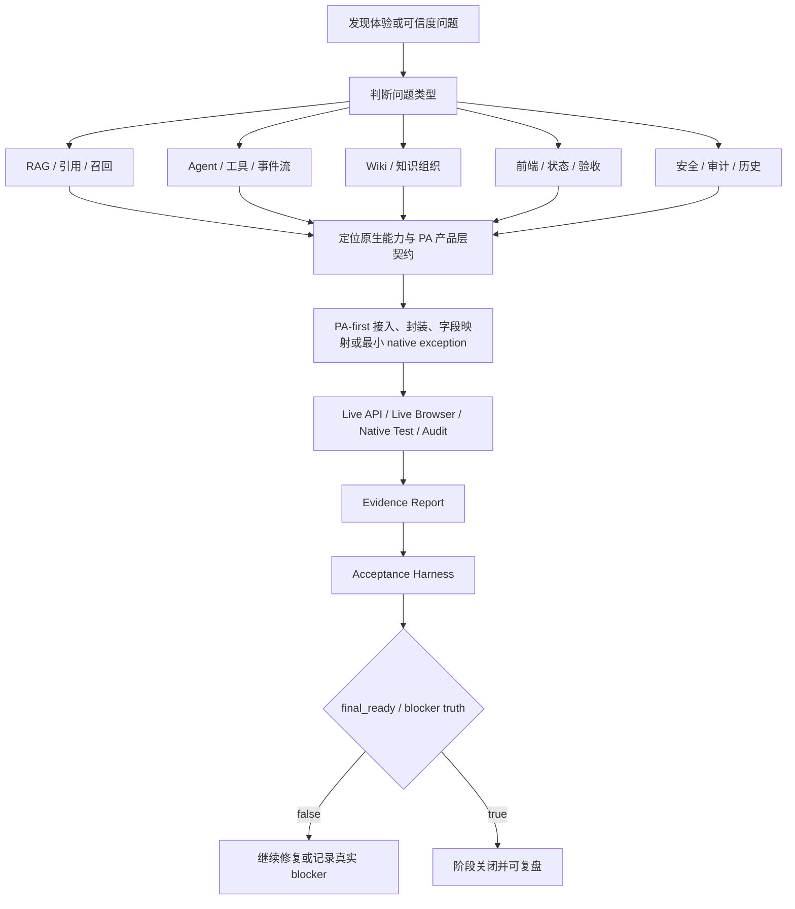

# PA AI Workbench 迭代优化文档

## 文档定位与真实边界

这份文档用于复盘 PA AI Workbench 在迭代过程中如何从“功能页面已经出现”继续推进到“真实可用、可追溯、可验证、可维护”。它不是项目从 0 到现在的时间线，也不是把所有 bug 简单排成列表，而是按照问题驱动来讲：发现了什么体验或可信度问题，为什么它会影响 AI 产品落地，如何定位根因，做了什么优化，最后用什么证据证明优化有效。

需要先明确一个重要边界：PA AI Workbench 是一个独立产品，不是 WeKnora 的子产品。WeKnora 提供原生知识库、RAG、Wiki、Agent、MCP、Web Search 等底层能力；PA AI Workbench 的工作重点，是把这些原生能力产品化接入、封装为适合用户操作的工作台，并补齐状态、历史、引用、审计、前端工作流和验收证据。本文不会把这些优化写成“我从零实现了全部 WeKnora RAG/Wiki/Agent/MCP/Web Search 内核”，而是强调我在 PA 产品层做的接入、字段映射、BFF 封装、确认门控、可视化、证据化验证与持续迭代。

同样需要区分 WNFC 与 WNID。WNFC 是非 Web Search 范围内的本地生产力闭环，它把 PA AI Workbench 推到本机可用知识库工作台的完成状态，Web Search 在该阶段被排除在计分范围之外。WNID 是后续重新纳入 Web Search 和 MCP execution 的智能对话阶段，它不重写 WNFC 的结论，而是在新的治理范围里补齐 WeKnora README 智能对话相关能力。

| 范围 | 目标 | Web Search | MCP execution | 结论口径 |
| --- | --- | --- | --- | --- |
| WNFC | 非 Web Search 的本地知识库生产力闭环 | 排除，不计入 14 分 | 部分高风险执行项可按用户决策移出当前 100% 范围 | `14.00/14 = 100.0%`，`final_ready=true`，强调 scoped completion |
| WNID | 智能对话阶段，覆盖 ReACT、Quick Q&A、Wiki Mode、Web Search、MCP、策略、建议问题、历史审计 | 重新纳入，必须有 live AgentQA Web Search 证据 | 重新纳入，必须有审批门控执行或拒绝证据 | 所有 17 个 WNID 任务完成，Web Search 与 MCP execution 仍在范围内 |

## 一、优化总览：从“看起来有”到“真实可用”

PA AI Workbench 的迭代重点不是堆功能数量，而是把复杂 AI 能力做成用户敢用、能查、能复盘、能继续维护的产品。一个页面上出现“RAG”“Agent”“Wiki”“MCP”“Web Search”这些词，并不代表产品已经可用。真正的问题是：它是不是调用了真实后端？是不是用了当前运行证据？引用能不能定位？失败时有没有明确 blocker？高风险动作有没有确认和审计？移动端页面是否还能正常操作？最终完成状态有没有机器可检查的标准？

因此，优化过程围绕三个关键词展开：

- 可信度：答案、引用、状态和报告不能靠描述，必须有 live API、live browser、native test 或明确 blocker。
- 可用性：底层能力必须进入 PA 的真实产品工作流，而不是只停留在脚本或接口层。
- 可维护性：每次修复都要沉淀为 spec、报告、checker、browser matrix 或历史审计字段，让后续迭代能继续判断真假。

### 优化方向总览

| 优化方向 | 核心问题 | 优化目标 | 代表性结果 | 产品价值 |
| --- | --- | --- | --- | --- |
| RAG 质量优化 | 能回答不等于答得可靠，检索、重排、引用和拒答都需要验证 | 用 rubric、matrix、24Q、citation contract 和 current-run guard 验证回答质量 | RAG matrix 从 partial 暴露问题，到 24Q PASS；knowledge-chat 保存引用与历史 | 把 RAG 从“模型生成答案”推进到“证据工程” |
| Agent 智能对话优化 | 只展示最终答案会让用户不知道 Agent 做过什么 | 显示 ReACT 事件、工具调用、引用、策略、MCP/Web Search 状态 | ReACT run contract、strategy editor、MCP approval、Web Search AgentQA、Wiki Mode | 让 Agent 可解释、可控、可追溯 |
| Wiki 召回与引用优化 | 文档可检索不代表知识资产可维护 | 建立 Wiki 页面、链接维护、Wiki citation、Wiki Mode Agent 工作流 | Wiki closed loop、Wiki-only PASS、global maintenance、Wiki Mode | 从“文档问答”升级到“长期知识组织” |
| 前端体验优化 | 能力分散、状态不清、移动端可能溢出 | 建立 Home、Library、RAG、Wiki、History、Capability Center、Dialogue 工作流 | WNFC 7 路由 browser matrix，WNID dialogue matrix，无 horizontal overflow | 用户能在一个工作台里完成真实操作 |
| 状态与验收优化 | AI 项目容易“看起来完成”，但证据旧、mock 或静态 | 引入 acceptance harness、browser matrix、final_ready、current-run evidence | WNFC final `14.00/14`，WNID final all rows complete | 把完成状态从主观描述变成机器可检查 |
| 安全审计/历史/引用优化 | 外部执行、凭证、删除、策略修改有风险 | confirmation token、masked output、NativeMutationAudit、history/citation/audit filters | MCP/Web Search/Wiki/Data Source 等操作都有确认和审计 | 让 AI 工作台具备可控操作边界 |

### 问题、优化、验证与结果总表

| 问题 | 为什么影响体验或可信度 | 定位方式 | 优化动作 | 验证方式 | 结果 |
| --- | --- | --- | --- | --- | --- |
| RAG 有答案但引用不稳定 | 用户无法判断答案依据，面试中也难说明产品可信 | 检查 `source_type`、`evidence_id`、`chunk_id`、`wiki_page_id` 等字段 | 建立 citation contract，统一 PA Evidence/Citation 映射 | RAG 24Q、Knowledge QA、history/citation smoke | 引用可保存、可定位、可在历史中复查 |
| 检索命中但排序和干扰项有风险 | top_k 中有正确片段不等于最终答案可靠 | RAG matrix 暴露 ranking、distractor、Wiki-only 问题 | 用 24Q、拒答题、distractor suppression 继续压测 | Phase 5 24Q PASS 与 Knowledge QA PASS | 从 partial 问题清单推进到 PASS gate |
| Agent 只有最终文本 | 用户不知道 Agent 是否调用工具、是否用了引用 | 读取 native AgentQA SSE 事件类型与 PA adapter 输出 | 映射 thinking、tool_call、tool_result、references、answer、complete | ReACT contract checker + browser Tool Trace | Agent 运行过程在 PA 中可解释 |
| AgentQA 曾经没有 traceable references | 不能把工具输出文本当 citations | AgentQA report 显示 `references=0`、`saved_citations=0`、`citation_blocked=true` | 先 fail closed，再补 Wiki tool reference propagation | AgentQA Wiki reference live smoke | `references` 与 saved citations 变为可追踪 |
| Wiki 发布后自然语言召回不足 | 用户以为 Wiki 可用，但实际问答召回不到 | P4 Wiki 报告区分 targeted retrieve 与 official questions | 调整 Wiki evidence、索引、引用与 Wiki-only 检查 | P5 Wiki PASS 报告 | Wiki-only 问题返回 `wiki_page` evidence |
| 静态页面不能证明产品可用 | UI 绿色状态可能只是写死或缓存 | browser matrix 要求 live API markers | 各页面绑定 `/api/status`、`/api/native/status`、审计和状态字段 | WNFC/WNID desktop/mobile browser matrix | 页面在真实运行状态下无溢出、无隐藏高级面板依赖 |
| 阶段完成容易被旧报告误导 | 旧 evidence、mock、fixture 可能被误当 PASS | acceptance harness 静态扫描 spec/report/checker | 加 `final_ready`、current-run evidence、no mock PASS、blocker truth | `--final` checker | WNFC/WNID 最终状态可被机器复验 |
| MCP/Web Search 外部能力风险高 | 工具执行和搜索可能产生外部影响或泄露信息 | 检查原生 route、PA BFF、审计模型与报告输出 | confirmation token、approval-gated execution、masked provider test | MCP execution / Web Search AgentQA checker | 执行、拒绝、引用、历史、审计都有证据 |

## 二、RAG 质量优化：从“能回答”到“证据工程”

RAG 优化最重要的认知变化，是不能把“模型能生成一段看起来合理的文字”当成完成。真正要验证的是：检索有没有拿到正确证据，证据能不能定位，引用有没有保存，回答有没有拒绝无依据问题，后续用户能不能在历史里复查。

### 问题 1：回答可能有文本，但缺少可靠引用

早期 RAG 质量评估先建立了 `recall_proxy`、`citation_traceability`、`source_diversity`、`latency` 和人工评分维度。这个设计的价值在于，它没有把“回答流畅”当作核心指标，而是先问证据是否正确、引用是否可追踪。对于 AI 产品实习生来说，这是一个很关键的产品判断：用户真正需要的是“我为什么应该相信这个答案”，而不只是“系统说了一段话”。

影响上看，如果 RAG 回答没有引用，用户无法判断答案来自哪份文档、哪个 chunk、哪页 Wiki，也无法在历史中复盘。更严重的是，产品后续要做审计、合规、复用和纠错时，没有 citation contract 就没有共同语言。

定位时，我把问题拆成两个层次：一是 WeKnora native retrieval 是否返回了可识别的 document chunk 或 Wiki page；二是 PA 是否把 native references 正确映射为自己的 Evidence 与 Citation。只有两个层次都成立，才能说 PA 产品层拥有可追踪引用。

优化动作包括：

- 定义 citation contract，要求真实非 mock citation 必须包含 `source`、`source_type`、`evidence_id` 和对应 native id。
- 对 document chunk 要保留 `chunk_id`、`external_doc_id` 或可定位的 PA 文档记录。
- 对 Wiki page 要保留 `wiki_page_id` 或稳定 slug，并能通过 `/api/citations/locate` 跳回 Wiki。
- 当 native AgentQA 没有返回 traceable references 时，PA 不编造 citation，而是记录 `citation_blocked`。
- 报告和前端只暴露 allowlist metadata，不把 raw payload、prompt、provider output 或本地数据库内容暴露出来。

验证方式不是看一个回答，而是看 RAG、knowledge-chat、history/citation 这一整条链路。WeKnora native RAG + knowledge-chat live report 证明 PA RAG debug 使用 native search，knowledge-chat 通过 native `/api/v1/knowledge-chat` 运行，并把 references 保存为 PA citations。History/citation unification report 再验证这些 citations 能在历史中被统计、过滤和定位。

### 问题 2：检索结果可能命中但不稳定

RAG matrix 暴露了一个很典型的问题：某些问题中，预期 anchor 虽然出现在 top_k，但并不一定排在第一；有些问题会混入 distractor；Wiki-only 问题在早期也依赖后续 Wiki 发布和索引。这个问题如果不显式记录，产品很容易误判为“RAG 已经能搜到了”。但从用户角度看，正确 chunk 在 top_k 里和最终答案真正使用正确证据，是两回事。

定位时，我把问题分为 retrieval problem、generation problem、material quality problem 和 configuration problem。比如：

- 如果配置没 ready，不能评价 RAG 质量。
- 如果 evidence 缺少关键 anchor，是召回或索引问题。
- 如果 evidence 够了但答案乱编，是生成或引用策略问题。
- 如果材料本身缺失或过时，是知识治理问题。

优化动作是把问题转换成可重复验证的 24Q gate。Phase 4 的 RAG matrix 是 partial，它保留了 Wiki-only blocked、distractor suppression fail、no-answer retrieval risk 等真实问题；Phase 5 则通过 RAG 24Q PASS 和 Knowledge QA 24Q PASS，把这些问题纳入最终验收。这里的重点不是“24 道题很多”，而是用固定问题集覆盖不同失败类型：文档事实、跨文档综合、Wiki-only、证据不足拒答、干扰项抑制和版本冲突。

验证时，我关注三个信号：

- 当前运行 id 与当前 corpus 是否一致，避免旧上传或旧报告被误用。
- 每题是否有 expected source type、trace id、evidence fields 和 forbidden retrieved 判断。
- Knowledge QA 是否能在 evidence 不足时拒答，而不是为了给答案而胡编。

### 问题 3：从本地流程切到 WeKnora native 后，字段契约容易断

PA 不是重新实现 WeKnora 的 RAG 内核，而是把 WeKnora native search、knowledge-chat、Wiki references 等能力接入自己的产品层。这里最大的风险是字段契约断裂：native 返回的引用字段如果没有被 PA adapter 正确转换，前端可能能看到答案，但历史、引用、定位和验收都会断。

优化时，我把 PA adapter 当作关键边界层，而不是简单 API 转发层。它需要做几件事：

- 把 native references 统一映射为 PA Evidence。
- 保留 source identity，例如 document chunk、Wiki page、Web Search URL。
- 给下游 history、citation、browser marker 提供稳定字段。
- 对缺字段路径 fail closed，而不是在 PA 层补假 id。
- 把 raw native payload 限制在后端处理，不进入报告和 UI。

这个思路也解释了为什么 RAG 优化不只是 prompt engineering。Prompt 可以改善表达，但 citation contract、current-run guard、history persistence、locator service 才决定产品是否可信。

### RAG 优化体现的产品/技术思考

RAG 质量优化的核心，不是追求“回答更像人”，而是追求“答案能被证据约束”。我会把它总结成四层：

| 层级 | 关注点 | PA 中的体现 |
| --- | --- | --- |
| 检索层 | 是否召回正确 evidence | RAG matrix、top_k、source_type、trace_id |
| 证据层 | evidence 是否有稳定身份 | citation contract、chunk/wiki locator |
| 生成层 | 答案是否基于证据且能拒答 | Knowledge QA 24Q、insufficient evidence checks |
| 产品层 | 用户是否能复盘 | history/citation unification、RAG debug、引用定位 |

### 面试讲法

我对 RAG 的优化不是只调 prompt，而是围绕“证据是否正确、引用是否可追溯、回答是否能被保存复查”来做。早期我先用 rubric 和 synthetic golden set 定义评价形状，后续用 real RAG matrix 暴露 Wiki-only、distractor、ranking 等问题，再通过 24Q PASS 和 citation contract 把 RAG 从 demo 问答推进到可验证问答能力。切到 WeKnora native 后，我重点做 PA adapter 字段映射、history/citation 保存和 current-run evidence，避免前端有答案但引用链路断掉。

## 三、Agent 智能对话优化：从“最终答案”到“可解释执行系统”

Agent 优化的关键，不是让页面上出现一个 Agent 按钮，而是让用户知道 Agent 做了什么、依据什么、调用了哪些工具、是否触发外部搜索或 MCP、是否经过确认、结果能不能回到历史和审计。

### 问题 1：只显示最终答案，用户无法判断 Agent 过程

普通聊天产品只显示 final answer 也许够用，但 Agent 产品不一样。Agent 会思考、选择工具、调用工具、读取结果、整合引用，再给出答案。如果 PA 只展示最后一段文本，用户无法判断它是否真的调用了工具，也无法知道失败发生在哪一步。

定位时，我查看 WeKnora native AgentQA stream 支持的事件类型，包括 `thinking`、`tool_call`、`tool_result`、`references`、`answer`、`complete` 等。然后判断 PA 是否只是把答案拼出来，还是能把事件序列转成产品层可展示的 run contract。

优化后，PA 在 Dialogue 页面展示 AgentQA Tool Trace 和 Run Contract：

- 事件计数：thinking、tool_call、tool_result、references、answer、complete。
- selected Agent 信息：Agent identity、Agent type、安全策略摘要。
- conversation continuity：多轮上下文和 PA 保存的消息 id。
- references 与 citations：引用数量、保存情况、可定位状态。
- completion status：是否完整结束，是否出现错误或 blocker。

验证方式是 WNID-P2-02 ReACT contract checker。它不是只调用接口，而是上传 sanitized document、等待 native indexing、运行 native AgentQA、检查事件、检查 citations、检查 PA history，再打开 `#/dialogue` 验证 Run Contract markers。这说明 Agent 优化同时覆盖 API、后端持久化和前端可见性。

### 问题 2：AgentQA 早期能回答，但引用缺失

AgentQA 优化中最重要的 blocker truth，是早期 live AgentQA 返回了答案和工具事件，但没有 traceable references。PA 当时没有把工具输出文本当成 citation，也没有自己编 `source_type` 或 `evidence_id`，而是保存答案、记录历史，并明确 `citation_blocked=true`。这看起来像“没做完”，但从产品可信度上是正确的：引用缺失就必须说缺失，不能为了绿色状态牺牲真实性。

后续定位发现，当前选中的 native Agent 使用的是 Wiki tools，而之前的 reference propagation 只覆盖了 `knowledge_search` 工具结果。也就是说，问题不是 PA citation 表坏了，而是 live Agent 工具路径没有把 Wiki tool result 转换成标准 references。这个定位非常关键，因为它避免了在 PA 层解析答案文本这种危险方案。

优化动作是补齐结构化 Wiki reference propagation：

- native Wiki tool result 暴露结构化 `wiki_pages` 数据。
- Agent reference extraction 支持 `wiki_search` 和 `wiki_read_page`。
- references 保留 `source_type=wiki_page`、`wiki_page_id`、slug 等可定位字段。
- PA history/citation 继续只接受 locator-grade citation metadata。

验证后，AgentQA live report 从 `references=0`、`saved_citations=0`、`citation_blocked=true` 推进到 `references > 0`、saved citations > 0、`citation_blocked=false`。这体现的不是“把 bug 修了”，而是“坚持引用契约，直到真正的 native reference 进入 PA”。

### 问题 3：Custom Agent 不能只展示，需要可配置、可审计

如果用户只能看到 Agent 列表，不能编辑策略，Agent 产品仍然很像一个只读 demo。WNID-P2-01 的 strategy editor 解决的是“Agent 可控性”问题：PA 不重新实现 Agent 内核，而是把 WeKnora native custom Agent config 通过产品化表单暴露出来。

策略编辑覆盖的不是一个 prompt 输入框，而是一组智能对话配置：

- system prompt 与 context template。
- allowed tools、MCP selection mode、selected MCP services。
- Web Search enabled、provider id、web fetch 设置。
- multi-turn 与 history turns。
- embedding top-k、keyword threshold、vector threshold、rerank top-k、rerank threshold。
- suggested prompts。

这类配置很敏感，所以优化里加入确认门控和审计：

- 更新策略必须提供确认 token。
- 审计只记录字段名、数量和布尔值，不记录 raw prompt/context。
- checker 先验证 bad confirmation token 会被拒绝，再验证 confirmed update 能落到 native catalog，并写入 NativeMutationAudit。

### 问题 4：Web Search 不能只证明 provider configured

Web Search 是 WNFC 阶段明确排除的能力，不能混入 WNFC 的 14 分结论。到了 WNID，它被重新纳入智能对话硬门槛。这里的优化重点是：provider configured 不等于 AgentQA 真的用了 Web Search。一个真正的 PASS 必须证明 native AgentQA run 中 `web_search_enabled=true`，Agent 调用了 `web_search` 工具，并且 PA 保存了可追踪 web references。

WNID-P4-02 的优化包括：

- native `web_search` tool result 提供 title、URL、snippet、provider、rank 等结构化字段。
- native reference extraction 把 web_search 结果转成 `source_type=web_search` references。
- PA adapter 生成稳定 `web_search:<hash>` evidence id，并要求 URL locator 存在。
- Dialogue Tool Trace 展示 `web_references` 与 `web_providers`。
- History/Citation 保存 Web Search citations，而不是只显示 provider 状态。

最终验证关注 `tool=web_search`、tool_call/tool_result 数、web refs、citations、URL count、history 和 browser markers。这个证据链说明 Web Search 是作为 Agent 能力跑通的，不是配置页的静态状态。

### 问题 5：MCP 不能只做到 list/read，需要审批门控执行

MCP 工具执行比普通查询更敏感，因为它可能产生外部影响。WNFC 中，MCP CRUD/credentials 可以完成，但工具执行被移出当前 WNFC 范围。WNID 中，MCP execution 被重新纳入硬门槛，因此需要真实执行或拒绝路径、审批策略、审计和历史。

优化方式是“最小 native exception + PA confirmation/audit”：

- native 增加直接、安全、可验证的 MCP tool execute endpoint。
- 服务端验证 service id、tool name 和 JSON-object arguments。
- 复用 native approval policy。
- PA 设置 approval policy，并分别验证 rejected execution 和 approved execution。
- 两条路径都记录 NativeMutationAudit 和 PA history。
- 前端 Dialogue 页面展示 MCP execution panel。

这个优化的产品意义是：AI 工作台不是把工具执行按钮随便暴露出去，而是把“能执行”和“允许执行”分开，把拒绝也作为合法证据保存下来。

### Agent 优化体现的产品/技术思考

| 思考点 | 具体体现 |
| --- | --- |
| 可解释性 | Tool Trace、Run Contract、事件计数、selected Agent 策略摘要 |
| 可控性 | Strategy editor、confirmation token、MCP approval policy |
| 可追溯性 | references、citations、history、audit |
| 真实边界 | WNFC 不写 Web Search 和 MCP execution PASS；WNID 重新纳入后才验证 |
| 安全性 | 不保存 raw tool args/results、raw prompt、provider payload 或凭证 |

### 面试讲法

Agent 优化的重点是可解释和可控。一个真正可用的 Agent 产品不能只返回最终答案，还要让用户知道它调用了什么工具、依据哪些引用、是否触发 Web Search 或 MCP、是否经过审批。我在 PA 中把 WeKnora native AgentQA 的事件流、引用、策略配置和工具执行映射到产品层，并用 live API、browser matrix、history/citation/audit 来证明它不是静态页面。

## 四、Wiki 召回与引用优化：从“文档问答”到“知识资产维护”

Wiki 优化让我明确区分了 RAG 和知识资产。RAG 更像“临时找证据回答问题”，Wiki 更像“长期组织知识、维护主题、实体、关系和综合页面”。如果 PA 只停留在文档检索，就很难支持用户沉淀知识；如果 Wiki 只能创建页面但不能被问答、Agent 和引用系统使用，也不是真正的知识资产。

### 问题 1：fallback Wiki 不能冒充 WeKnora 可检索 evidence

早期 fallback 策略明确规定，当 `KNOWLEDGE_BACKEND=extracted` 时，PA DB Wiki 页面只能表示本地产品状态，不能报告成 WeKnora retrievable evidence。这个规则看似保守，但它保护了产品可信度：本地 fallback 是可用性兜底，不是 native PASS。

优化动作是给 fallback 页面明确状态字段：

- `fallback_backend=extracted`
- `local_wiki_fallback=true`
- `weknora_sync_status=not_synced` 或 `pending`
- `weknora_index_status=not_synced`
- `weknora_retrievable=false`

这样前端可以显示页面状态，但不会把它计入 live WeKnora retrieval。

### 问题 2：Wiki 页面能发布，但自然语言召回不一定通过

Phase 4 Wiki report 是一个很好的问题驱动例子：Wiki draft、publish、read back、targeted retrieve 都通过了，但 official Wiki questions 没有召回到 `wiki_page` evidence。因此结果只能是 partial，而不是 PASS。

这个问题影响体验很明显：用户发布 Wiki 后，真正会问自然语言问题，而不是只输入 slug 或测试 anchor。如果自然语言问题召回不到 Wiki，产品就会给用户一种“我明明发布了，为什么问不到”的不信任感。

定位时，我把 Wiki 可用性拆成几层：

- 页面生命周期：draft、publish、read back。
- 索引与可检索：是否能用 title/slug/anchor 找到。
- 自然语言召回：是否能回答用户真实问题。
- citation traceability：是否返回 `source_type=wiki_page`、`wiki_page_id`、`evidence_id`。
- 下游复用：是否能进入 RAG、Agent、history 和 citation locator。

优化后，Phase 5 Wiki PASS gate 要求 Wiki-only questions 返回 `wiki_page` evidence，并能定位到 Wiki 页面。这样 Wiki 不只是“页面存在”，而是能作为知识源参与问答。

### 问题 3：Wiki 维护不是只读浏览，还需要链接、issue 和全局维护

知识资产长期可维护，离不开 rebuild links、auto-fix、issue status 等能力。WNFC-P5-04 解决的是 Wiki global maintenance 问题：过去如果没有真实 persisted issue，就不能证明 issue-status mutation；如果直接改数据库或制造假 issue，也不能算 PASS。

优化动作包括：

- 添加受 owner/admin 保护的 native route 创建 Wiki issue。
- PA BFF 提供 confirmation-gated create issue、rebuild-links、auto-fix、issue-status。
- 所有 mutation 进入 NativeMutationAudit。
- smoke 创建 isolated temporary wiki-enabled KB 和 page，执行 bad-token rejection、rebuild-links、auto-fix、create issue、resolve issue，并清理。

这个优化体现了一个重要原则：管理类能力不能靠 status-only surface 证明，必须有真实 mutation、确认门控、审计和清理。

### 问题 4：Wiki 需要进入 Agent 工作流

Wiki Mode Agent 是 WNID 中的关键优化。它不只是让 Wiki 能被浏览，而是让 Agent 可以在确认门控下创建或维护 Wiki 页面，并把 Wiki references 保存成 citations。这样 Wiki 既是知识资产，也是 Agent 可以操作和引用的对象。

WNID-P5-01 验证了：

- Wiki mutation tools 需要 `CONFIRM_NATIVE_WIKI_AGENT_RUN`。
- Agent 调用 native `wiki_write_page`。
- native `wiki_write_page` 返回结构化 page identity。
- PA 保存 locatable Wiki citations、history、output metadata 和 NativeMutationAudit。
- Dialogue 页面展示 Wiki AgentQA workflow 与 Tool Trace markers。

### 面试讲法

Wiki 的优化让我意识到，知识产品不能只停留在问答。RAG 解决的是“临时找证据”，Wiki 解决的是“长期组织知识”。我在项目中围绕 Wiki 页面生命周期、自然语言召回、引用映射、链接维护、issue 处理和 Wiki Mode Agent 做优化，让知识既能被浏览维护，也能重新进入 RAG 和 Agent。

## 五、前端体验优化：复杂能力必须变成可操作工作流

前端优化不是“美化页面”，而是把底层复杂能力变成用户能理解、能操作、能复盘的工作流。对于 PA AI Workbench，前端尤其重要，因为很多底层能力很强，但如果入口分散、状态不清、引用和 blocker 不可见，用户还是不会信任它。

### 问题 1：能力很多，用户找不到入口和状态

早期页面有 Home、Library、Analysis、Wiki、History 等基础入口，后续又加入 RAG debug、Capability Center、Dialogue。优化重点是把能力按用户任务组织：

- Home：看当前 PA/WeKnora 连接、工作台状态和能力概览。
- Library：管理 KB、文档、上传目标和文档生命周期。
- RAG debug：调试检索、知识问答、引用和 trace。
- Wiki：浏览和维护 native Wiki workflow。
- History：复查生成记录、引用、blocker、WNID capability 和 audit 关联。
- Capability Center：集中展示 native capability 状态、partial/backlog/blocker 和安全操作入口。
- Dialogue：作为 WNID 智能对话的一等入口，承载 AgentQA、Quick Q&A、strategy、MCP/Web Search、Tool Trace、suggested questions。

### 问题 2：状态如果藏起来，用户会误以为全绿

WeKnora-first frontend acceptance 引入了 status strip，所有核心页面都能看到 live/native connectivity、active KB mapping、mock/fallback/partial/blocked/backlog count 等状态。这个设计不是为了堆信息，而是为了让用户知道当前系统的真实边界。

Capability Center 进一步把 `/api/native/status` 的 15 个 capability groups 渲染出来，明确展示 live、partial、blocked、backlog。这里有一个关键产品判断：即使 blocked count 是 0，也要显示 blocked bucket，因为未来 blocker 需要稳定的操作员界面，而不能等出问题时才临时加状态。

### 问题 3：移动端和复杂 trace 面板容易溢出

AI 工作台的前端很容易出现长字段、长 route、长 trace、长 evidence id 导致 horizontal overflow。Browser matrix 的意义就在这里：它不只截图，而是检查 desktop 和 mobile 的 DOM 是否水平溢出、是否有可见元素重叠、是否渲染了 secret-like text。

WNFC browser matrix 覆盖 7 个工作台路由，desktop 和 mobile 共 14 个 viewport checks。WNID browser matrix 重点检查 `#/dialogue`，包括 Agent picker、strategy editor、Tool Trace、MCP/Web Search 状态、citation panel、suggested questions 等。WNID-P8-01 还修复了 dialogue inspector trace rows 造成 horizontal overflow 的真实问题，让长状态值按 existing ellipsis 行为收缩，而不是撑宽页面。

### 问题 4：静态页面不能证明真实能力

前端 PASS 必须绑定 live API markers。比如 browser matrix 会先检查 `/api/status`、`/api/model/status`、`/api/native/status`、`/api/native-audit/events` 或 WNID 相关 API，再打开浏览器验证页面 markers。这样可以避免“页面写死显示 PASS”，也避免旧缓存被误当当前运行结果。

### 面试讲法

前端优化的重点是把底层复杂能力变成用户能理解的工作流。AgentQA、Web Search、MCP、Wiki Mode 如果只是 API，业务用户很难使用。我把它们组织到 Dialogue、History、Capability Center 等页面里，用工具轨迹、引用、状态标记和审计入口帮助用户理解系统正在做什么。browser matrix 则保证这些入口不是静态展示，而是能在 desktop/mobile 真实渲染中使用。

## 六、状态与验收优化：把“完成”变成可检查事实

状态与验收是这个项目里非常有差异化的优化点。AI 产品开发最容易出现的问题，是功能看起来很多、报告写得很完整，但真实运行并没有闭环。为了解决这个问题，PA AI Workbench 建立了 acceptance harness、browser matrix、final_ready、current-run evidence、no mock PASS、blocker truth 等机制。

### 核心机制解释

| 机制 | 解决的问题 | 在优化中的作用 |
| --- | --- | --- |
| acceptance harness | 防止主观宣布完成 | 读取 spec/report/task rows，检查分数、硬门槛、报告、敏感信息和 unsafe PASS wording |
| browser matrix | API 通过不代表前端可用 | 用 desktop/mobile Chrome 验证页面、marker、overflow、overlap 和 live status |
| final_ready | 区分“治理检查通过”和“阶段最终完成” | 默认模式可报告 in-progress，final 模式必须所有范围内任务完成 |
| current-run evidence | 防止旧报告、缓存、旧 id 被误用 | 每次 PASS 都要有当前运行的 live API、browser、service 或 native test |
| no mock PASS | 防止 mock/fixture/static UI 变成最终证据 | mock 和 fixture 可用于早期 contract，不可作为最终 capability PASS |
| blocker truth | 缺 API、凭证、workspace、权限时不假装完成 | blocker 要说明缺什么、在哪里配置、拿到后怎么验证 |

### acceptance harness 的作用

WNFC acceptance harness 最初不是最终 PASS，而是一个防止错误 100% 声明的机制。它检查：

- WNFC scored group 是否为 14。
- Web Search 是否是唯一排除的 capability group。
- 当前 score 是否等于目标 score。
- completed、blocked、removed task rows 是否都有 progress log。
- evidence reports 是否存在且包含 task/evidence markers。
- 是否存在 mock、fixture-only、cached、stale、static UI、demo、MVP 等 unsafe PASS wording。
- 是否泄露 secret-shaped assignments、tokens、private keys 等。
- Browser hook inventory 是否包含 P6 browser matrix 和 final report hooks。

最终 WNFC `--final` 模式通过时，才证明 `14.00/14 = 100.0%`、`final_ready=true`、`web_search=excluded`。这让“完成”不再只是文字，而是脚本能复验的状态。

WNID acceptance harness 则保留了新的硬门槛：Web Search 和 MCP execution 必须在 scope 内。它不能像 WNFC 一样排除 Web Search，也不能从 provider status 或 MCP service catalog visibility 直接算 PASS。最终 `--final` 只有在所有 17 个 WNID task rows 完成、browser matrix present、final report present、Web Search/MCP execution in scope 且 current-run evidence present 时才通过。

### browser matrix 的作用

browser matrix 是前端可信度的验收工具。它不只是“打开页面看看”，而是验证：

- 路由是否能加载。
- 关键工作流 marker 是否可见。
- 后端 live status 是否先通过。
- desktop/mobile 是否无 horizontal overflow。
- 可见元素是否没有明显重叠。
- 页面是否没有渲染 secret-like text。
- 高级能力是否不是藏在不可见面板里。

这对 AI 工作台很重要，因为很多能力在 API 层能跑通，但用户最终使用的是页面。如果页面入口不清、移动端溢出、trace 面板藏起来或状态不可见，产品仍然不能算真实可用。

### final_ready 的作用

`final_ready` 是防止“治理检查通过”被误写成“阶段完成”的关键字段。默认 acceptance mode 可以在阶段中期通过 guardrail 检查，但显示 `final_ready=false`。只有 final mode 同时满足任务、报告、browser matrix、hard gates 和 current-run evidence，才变成 `final_ready=true`。

这个设计帮助我在复盘里准确表达：

- WNFC 的最终状态是 scoped completion，`final_ready=true`，但 Web Search excluded。
- WNID 的最终状态是 intelligent dialogue completion，`final_ready=true`，并且 Web Search 与 MCP execution 都在 scope 内。
- 中间出现 blocked 或 partial 不是失败，而是真实状态的一部分。

### no mock PASS 与 blocker truth

mock 和 fixture 在早期开发里有价值，比如定义 rubric、做 contract smoke、跑 self-test。但最终验收不能用 mock/fixture-only 证明真实能力。比如 RAG rubric 的 synthetic golden set 只证明评价形状；真正的 RAG PASS 需要 live WeKnora evidence。AgentQA 早期有 live answer 但没有 traceable references，就必须记录 citation blocker，而不是根据答案文本假装 citation PASS。

blocker truth 同样重要。缺真实 Notion/Yuque/Feishu credential、缺 accessible workspace、缺 provider key、缺 OAuth scope、缺 MCP service、缺 operator approval 时，正确处理方式是 blocker 或用户决策移出当前 scope，而不是用 RSS、mock connector 或 no-op demo 冒充完整能力。这个原则让报告虽然更“难看”，但更可信。

### 面试讲法

我在项目里引入 harness 思想，是因为 AI 产品很容易停留在 demo。我的标准是，功能完成必须有当前运行证据，有报告，有浏览器或 API 验证，有最终检查脚本。这样既能减少主观判断，也能让后续复盘时知道每个能力到底是 live、partial、blocked 还是 excluded。

## 七、安全审计、历史与引用优化：可信 AI 产品需要操作边界

PA AI Workbench 的安全与审计优化不是附加项，而是 AI 工作台可信度的一部分。只要系统开始支持 MCP、Web Search、Wiki mutation、data source sync、Agent strategy update、delete 等能力，就已经不只是生成文本，而是在执行可能有外部影响的操作。

### 问题 1：凭证和 raw payload 不能进入报告或 UI

很多 native capability 都涉及敏感内容：service token、provider payload、MCP credential、raw web page、raw prompt、local DB、uploaded body、logs、vectors 等。优化原则是只暴露 masked/configured/status/test summary，不暴露原始值。

具体做法包括：

- `/api/native/status` 返回 masked booleans 和 sanitized summary。
- MCP credentials 只显示配置状态和 masked metadata。
- Web Search provider test 显示 provider identity 和测试结果，不输出 raw credential。
- 报告只记录 counts、status、operation names、source_type 和 locator summary。
- sensitive scan 检查 secret-shaped text。

### 问题 2：删除、外部执行、策略变更需要确认

高风险操作都不能无确认执行。PA 使用 confirmation token 区分“用户正在看状态”和“用户确认执行 mutation”：

- MCP tool execution 使用执行确认与 approval decision。
- Web Search credential changes 和 provider test 需要确认路径。
- native Agent strategy update 需要确认。
- Wiki global maintenance、issue status、Wiki Mode Agent run 需要确认。
- Data source sync/pause/resume/delete 通过 PA BFF 记录审计。

这个设计让用户和系统都有机会在执行前明确边界，也让自动 checker 能验证 bad-token rejection。

### 问题 3：执行结果必须能追溯到 audit/history

审计优化不只是保存一条日志，而是让用户能从 History 和 Audit 两个视角复盘操作。

WNID-P7-01 把 WNID history、citation、audit 统一到几个过滤维度：

- `wnid_capability`
- `wnid_capabilities`
- `wnid_evidence_state`
- `evidence_source_types`
- `web_search_citation_count`

这让 History 页面可以过滤 Quick Q&A、ReACT AgentQA、Wiki Mode、MCP Tools、Web Search、Strategy mutation 和 citation blocker。Audit 页面也能按 WNID capability 查看 strategy、mcp、web、wiki 等操作。

### 问题 4：引用缺失要显式阻断

History/citation unification 的设计是：当 traceable references 存在时，保存并定位 citations；当 native workflow 没有 traceable references 时，记录 `citation_blocked`，而不是把答案文本当作证据。这种 fail-closed 机制能防止产品在最关键的可信度问题上自欺欺人。

### 面试讲法

我把安全和审计当作 AI 产品可信度的一部分。尤其是 Agent 能调用工具后，系统就不只是生成文本，还可能触发外部搜索、MCP 执行、策略修改或数据删除。因此我在产品层设计了确认、审计、历史和 masked output，避免把 demo 能力直接暴露成不可控操作。

## 八、代表性问题修复卡片

下面的卡片不是零散 bug list，而是代表几类系统性优化：引用可信度、召回稳定性、工具执行安全、状态验收真实性和前端可用性。

### 卡片 1：RAG 引用字段不完整

问题：RAG 或 knowledge-chat 能生成答案，但如果 citation 缺少 `source_type`、`evidence_id`、`chunk_id`、`external_doc_id` 或 `wiki_page_id`，用户无法定位证据。

影响：答案看起来正确，但不可追溯；历史记录也无法可靠复查。

定位：检查 PA Evidence/Citation builder、WeKnora adapter 和 `/api/citations/locate`，确认 native references 是否保留稳定身份。

修复：建立 citation contract，按 document chunk、Wiki page、Web Search 分别定义必需字段；缺字段时 fail closed 或记录 blocker。

验证：RAG/Knowledge QA 24Q、knowledge-chat live report、history/citation unification。

复盘：RAG 产品的核心不是“给答案”，而是“给有来源、可复查的答案”。

### 卡片 2：RAG 命中但 ranking 和 distractor 有风险

问题：正确 evidence 出现在 top_k，但排名靠后；某些问题混入 forbidden distractor。

影响：最终回答可能采用错误证据，用户难以发现。

定位：Phase 4 RAG matrix 按 24 个问题记录 trace_id、expected anchors、actual anchors、source_type 和 forbidden retrieved。

修复：把问题纳入 Phase 5 24Q gate，加入 insufficient evidence、distractor suppression、Wiki-only 等测试类型。

验证：Phase 5 RAG 24Q PASS 和 Knowledge QA 24Q PASS。

复盘：检索系统不能只看“有没有召回”，还要看召回质量、拒答能力和干扰项控制。

### 卡片 3：AgentQA 有答案但没有 traceable references

问题：native AgentQA 早期返回 answer、tool_call、tool_result，但 `references=0`、`saved_citations=0`。

影响：Agent 看起来能工作，但无法证明它的答案依据。

定位：对比 native AgentQA stream、PA parser 和 knowledge-chat citation，确认 PA citation persistence 没坏，问题在 Agent tool reference path。

修复：先记录 `CITATION_BLOCKED`，后续补齐 Wiki tool structured reference propagation。

验证：AgentQA Wiki reference live report 显示 references 和 saved citations 进入可追踪状态。

复盘：不要从工具输出文本硬解析引用，必须等待或补齐结构化 source identity。

### 卡片 4：Wiki 页面发布后 official questions 召回失败

问题：Wiki draft/publish/read 都通过，但 official Wiki questions 返回 0 Wiki evidence。

影响：用户发布了 Wiki，却不能通过自然语言问题复用它。

定位：把 direct slug/title/anchor retrieve 和 official natural-language question retrieve 分开记录。

修复：推进 Wiki-only PASS gate，要求 `source_type=wiki_page`、`wiki_page_id`、`evidence_id` 和 locator。

验证：Phase 5 Wiki PASS 报告中的 Wiki-only question results 全部 PASS。

复盘：Wiki 的可用性不能只看页面生命周期，还要看能否进入真实问答。

### 卡片 5：MCP 只有服务可见，不能证明安全执行

问题：MCP service list/detail 或 credentials CRUD 只能证明管理面，不能证明 tool execution。

影响：如果把可见性当执行能力，会高估产品能力；如果直接执行，又有安全风险。

定位：区分 WNFC 中 MCP scoped completion 与 WNID 中 MCP execution hard gate。

修复：WNID 增加 approval-gated execution，验证 reject 和 approve 两条路径，记录 audit/history。

验证：MCP execution checker 显示 approval policy、reject、approve、audits、history、browser markers。

复盘：工具执行不是“按钮能点”，而是权限、审批、执行、历史和审计共同成立。

### 卡片 6：Web Search provider 配置不等于 AgentQA 使用了 Web

问题：provider test 通过仍不能证明 Agent 回答中使用 Web Search。

影响：用户可能以为答案来自网络，实际只是配置页显示成功。

定位：要求 AgentQA run 中出现 `web_search_enabled=true`、`tool=web_search`、web references 和 citations。

修复：补 native web_search reference extraction，PA 保存 `source_type=web_search` citation，Dialogue 展示 web providers/references。

验证：WNID-P4-02 Web Search AgentQA checker。

复盘：AI 工具能力必须从配置状态推进到真实运行证据。

### 卡片 7：复杂 trace 面板导致移动端 horizontal overflow

问题：Dialogue inspector 中长 trace/status 值可能撑宽页面。

影响：移动端用户无法正常阅读和操作，browser matrix 不能通过。

定位：WNID browser matrix 在 desktop/mobile 检查 horizontal overflow 和 hidden advanced panel。

修复：为 page surface 和 trace rows 增加 shrink constraints，让长字段按 ellipsis 收缩。

验证：WNID-P8-01 browser matrix 显示 desktop/mobile `horizontal_overflow=false`。

复盘：前端验收不是只看功能存在，还要看复杂数据在真实视口里的可用性。

### 卡片 8：final_ready 与报告状态可能不一致

问题：如果报告中残留旧的 `final_ready=false` 或移除 parser-visible marker，checker 可能误判。

影响：最终状态不可复验，后续接手者不知道阶段是否真的完成。

定位：acceptance harness 同时检查 task rows、progress log、score、final report 和 marker 文本。

修复：保留 required marker，正常模式和 final 模式都重新跑 acceptance checker。

验证：WNFC final report 与 acceptance harness 均显示 `14.00/14`、`final_ready=true`。

复盘：最终完成状态必须能被脚本稳定识别，而不能靠人读报告猜。

### 卡片 9：缺凭证或缺 API 容易被误写成失败或 PASS

问题：缺 Notion/Yuque/Feishu workspace、provider key、MCP prompt API 等时，容易被简单归为失败，或者用 mock 绕过。

影响：失败原因不清，后续也不知道补什么资源。

定位：把 blocker 分类为 API、credential、workspace、provider、permission、approval 或 native contract gap。

修复：记录 exact blocker；若用户明确移出当前 scope，则标记 `[b]`，不计入当前阶段分母或 PASS。

验证：WNFC final report 明确说明 credential-heavy connector setup 和部分 MCP slices 的 scoped decision。

复盘：blocker truth 是产品治理能力，不是开发失败。

## 九、优化前后对比

| 方向 | 优化前状态 | 优化后状态 | 价值 |
| --- | --- | --- | --- |
| RAG | 能调用检索/问答，但引用、排序、拒答和 Wiki-only 需要验证 | 24Q、Knowledge QA、citation contract、current-run guard | 回答更可信，可复查 |
| Wiki | 有页面生命周期和部分 targeted retrieve | Wiki-only PASS、global maintenance、Wiki Mode Agent、locatable citations | 知识资产可维护、可复用 |
| Agent | 能调用 AgentQA，但早期引用缺失、过程不透明 | ReACT trace、Run Contract、strategy editor、Wiki/Web/MCP references | Agent 可解释、可控、可追溯 |
| Web Search | WNFC 中排除，早期不能混入最终分数 | WNID 中 provider setup + live AgentQA web refs + citations | 不再停留在配置可见 |
| MCP | WNFC 中保留 CRUD/credentials，执行项按 scope 决策 | WNID 中 approval-gated execution、prompt parity、history/audit | 外部工具执行可控 |
| 前端 | 多页面能打开，但状态与复杂能力分散 | Capability Center、Dialogue、History filters、browser matrix | 用户能在产品里完成真实流程 |
| 验收 | 容易靠报告描述判断完成 | acceptance harness、final_ready、browser matrix、no mock PASS | 完成状态可机器复验 |
| 安全 | 外部能力和 mutation 有泄露/误触风险 | confirmation token、masked output、NativeMutationAudit | AI 操作边界更清楚 |

## 十、面试可讲的技术成长点

### 1. 我对 RAG 的理解从“调用模型”升级为“证据工程”

最开始容易以为 RAG 就是把文档丢给检索，再让模型回答。但做完这轮优化后，我更关注 evidence lifecycle：检索是否召回正确片段、证据是否有稳定 id、引用能否保存和定位、无依据问题能否拒答、历史里能否复查。这个认知变化让我能把 RAG 的产品价值讲得更扎实。

### 2. 我对 Wiki 的理解从“页面”升级为“知识资产层”

Wiki 不是简单富文本页面。它需要 draft/publish/read/search/index，也需要链接维护、issue、citation、locator，以及重新进入 RAG 和 Agent 的能力。Wiki 优化让我理解到，知识产品要同时支持“即时问答”和“长期沉淀”。

### 3. 我对 Agent 的理解从“会调用工具”升级为“ReACT 执行系统 + 工具治理 + 事件流”

Agent 的可用性不是最终答案，而是过程可解释、工具可控、引用可追溯。ReACT run contract、Tool Trace、strategy editor、MCP approval、Web Search references、Wiki Mode audit 都属于 Agent 产品化的一部分。

### 4. 我对产品开发的理解从“做功能”升级为“定义范围、验证证据、管理风险”

WNFC 和 WNID 的区分让我学会了 scope management。WNFC 可以在排除 Web Search 的前提下完成本地生产力闭环；WNID 则在新的阶段重新纳入 Web Search 和 MCP execution。这个过程说明，产品推进不是无限加需求，而是明确当前阶段的目标、边界和验收证据。

### 5. 我学会了用 spec + skill 控制复杂项目

复杂 AI 项目如果只靠临时任务描述，很容易忘记边界。spec 负责定义目标、任务、状态和验收；skill 负责规定执行前要读什么、怎么分类、什么时候 blocker、怎么验证。它们把“个人记忆”变成“可交接的项目治理”。

### 6. 我学会了用 harness 防止 AI 项目停留在 demo

acceptance harness 的价值是把完成状态变成机器可检查。它检查分数、任务行、证据报告、浏览器矩阵、敏感信息、mock/fixture/stale wording 和 final mode。这个机制让项目在复盘和面试中更有说服力，因为我可以说清楚“为什么这个 PASS 可信”。

### 7. 我学会了在缺凭证、缺 API 或缺 workspace 时记录真实 blocker

在 AI 产品中，不是所有问题都应该用代码绕过。有些能力必须依赖真实 provider、workspace、credential 或 native endpoint。正确做法是说明缺什么、为什么缺、拿到后怎么验证，而不是用假数据做绿色状态。这体现了对产品可信度和工程边界的尊重。

## 十一、面试讲法

### 30 秒版本

PA AI Workbench 是我基于 WeKnora 原生 RAG、Wiki、Agent 等能力做的独立 AI 工作台。我后期优化重点不是堆功能，而是把能力从“页面上看起来有”推进到“真实可用、可追溯、可验证、可维护”。我做了 RAG 24Q 和 citation contract、Agent ReACT run contract、Wiki 召回与引用、Dialogue 和 Capability Center 前端、acceptance harness、browser matrix、history/citation/audit 等优化，并严格区分 live、blocked、excluded 和 mock evidence。

### 2 分钟版本

这个项目里我最想突出的是“可信 AI 产品”的迭代能力。比如 RAG 不是能回答就行，我用 rubric、RAG matrix、24Q、Knowledge QA 和 citation contract 去验证召回、引用、拒答和历史复查；Agent 不是只返回 final answer，我把 WeKnora native AgentQA 的 thinking、tool_call、tool_result、references、answer、complete 映射成 PA 的 Run Contract 和 Tool Trace；Wiki 不是只做页面，而是要能发布、召回、链接维护、issue 处理、进入 Agent Wiki Mode；前端不是静态展示，而是通过 browser matrix 证明 desktop/mobile 都能使用。

同时我做了很多验收治理。WNFC 阶段专注非 Web Search 的本地生产力闭环，Web Search 排除在 14 分范围外，最终 `14.00/14` 和 `final_ready=true` 由 acceptance harness 验证。WNID 阶段重新纳入 Web Search 和 MCP execution，用 live AgentQA Web Search references 和 approval-gated MCP execution 证明智能对话能力。这个过程让我学会了用 spec、skill、harness、current-run evidence 和 blocker truth 管理复杂 AI 产品。

### 技术细节版本

技术上，我主要工作在 PA 产品层：WeKnora native adapter、PA BFF、业务数据库的 history/citation/audit、前端工作流和验证脚本。对于 native 已有能力，我坚持 PA-first，不重造 WeKnora RAG/Wiki/Agent/MCP/Web Search 内核；只有当 native 缺少必要 reference shape 或 safe execution route 时，才使用最小 native exception，并通过 Go test、Docker runtime、PA live API 和 browser validation 证明。

我比较看重字段契约，比如 citation 必须有 `source_type`、`evidence_id` 和可定位 native id；Web Search citation 必须有 URL locator；MCP execution 必须有 service、tool、approval decision、execution summary、audit id 和 history。这样做的好处是，产品里的每个 AI 输出都能回到证据，不会停留在“模型说了什么”。

## 十二、常见追问

### 追问 1：这个项目和 WeKnora 是什么关系？

PA AI Workbench 是独立产品，不是 WeKnora 的子产品。WeKnora 提供原生知识库、RAG、Wiki、Agent、MCP、Web Search 等底层能力；PA 负责把这些能力接入成产品工作流，包括 BFF、前端页面、状态中心、历史、引用、审计、确认门控和验收。我的工作重点不是从零实现 WeKnora 内核，而是基于 WeKnora 原生能力做产品化封装和验证。

### 追问 2：你为什么反复强调“不要 mock PASS”？

因为 AI 产品最容易出现“演示能跑，真实不可用”。mock 和 fixture 可以用来做早期 contract 或自测，但最终 PASS 必须来自 live API、live browser、native test、live service 或明确 blocker。否则用户看到绿色状态，却无法在真实环境复现。

### 追问 3：RAG 优化里最有价值的是什么？

最有价值的是 citation contract 和 24Q gate。citation contract 解决“答案从哪里来、能不能定位”；24Q gate 解决“不同问题类型下是否稳定”。二者结合，才能把 RAG 从问答 demo 变成可验证能力。

### 追问 4：Agent 优化里你最想讲哪一点？

我会讲 ReACT run contract。它把 Agent 的 thinking、tool_call、tool_result、references、answer、complete 转成用户可见和系统可存的结构化运行记录。这样用户不是只看最终答案，而是能理解 Agent 做了什么、用了哪些工具、引用了什么证据。

### 追问 5：为什么 WNFC 不包含 Web Search，但 WNID 包含？

这是阶段范围管理。WNFC 的目标是非 Web Search 的本地知识库生产力闭环，因此 Web Search 被明确排除，不计入 14 分。后续 WNID 是智能对话阶段，重新把 Web Search 和 MCP execution 纳入硬门槛，并用 live AgentQA Web Search 和 approval-gated MCP execution 验证。这样不会混淆两个阶段的完成口径。

### 追问 6：你如何判断一个 blocker 不是 bug？

如果问题是代码逻辑错误、字段映射错误、状态不一致，那是 bug。如果问题是缺真实第三方凭证、缺 workspace 权限、缺 provider key、缺 native API 或缺操作员批准，那就是 blocker。blocker 需要写清楚缺什么、影响什么、拿到后怎么验证，而不是用假数据绕过。

### 追问 7：browser matrix 比普通前端测试多了什么？

它不仅检查页面能打开，还检查 live API marker、关键工作流 marker、desktop/mobile 视口、horizontal overflow、visible overlap、secret-like rendered text、hidden advanced panel dependency。它证明的是“真实产品页面在真实状态下可用”，不是静态截图。

### 追问 8：MCP execution 为什么要做 approval-gated？

因为 MCP 工具可能产生外部影响。产品不能把执行按钮随便暴露，而要先设置 approval policy，再验证 reject 和 approve 两种路径，并记录 history/audit。这样即使用户拒绝执行，系统也能留下可复盘的安全证据。

### 追问 9：Web Search citation 和文档 citation 有什么不同？

文档 citation 依赖 chunk id、external doc id、Wiki page id 等内部知识库身份；Web Search citation 依赖 URL、title、snippet、provider、rank 等外部网页身份。PA 必须分别定义 source type 和 locator contract，不能把 web result 伪装成 document chunk。

### 追问 10：这个项目对产品经理或 AI 产品实习生有什么体现？

它体现的不只是会接 API，而是能定义产品边界、设计验证指标、处理 blocked scope、把复杂能力转成可用工作流、关注引用与审计、用 evidence 证明完成。这些能力比单纯“做了很多功能”更接近真实 AI 产品工作。

## 十三、可放进简历的复盘表达

可以把这段项目经历总结为：

> 基于 WeKnora 原生 RAG/Wiki/Agent/MCP/Web Search 能力，独立构建 PA AI Workbench 产品层工作台，负责 native adapter、PA BFF、前端工作流、history/citation/audit、confirmation-gated mutation 与 acceptance harness。围绕 RAG 质量、Agent 可解释性、Wiki 知识资产、前端可用性、状态验收和安全审计持续迭代，将功能从“页面可见”推进到“live evidence 可验证”。通过 RAG 24Q、browser matrix、final_ready、no mock PASS、blocker truth 等机制，完成 WNFC scoped 本地生产力闭环，并在 WNID 阶段补齐 Web Search 与 MCP execution 的智能对话硬门槛。

这段表达的重点是：不夸大为从零实现 WeKnora 底层内核，也不把 blocked/excluded 写成 PASS，而是突出独立产品、产品化接入、可信验收和系统优化能力。
