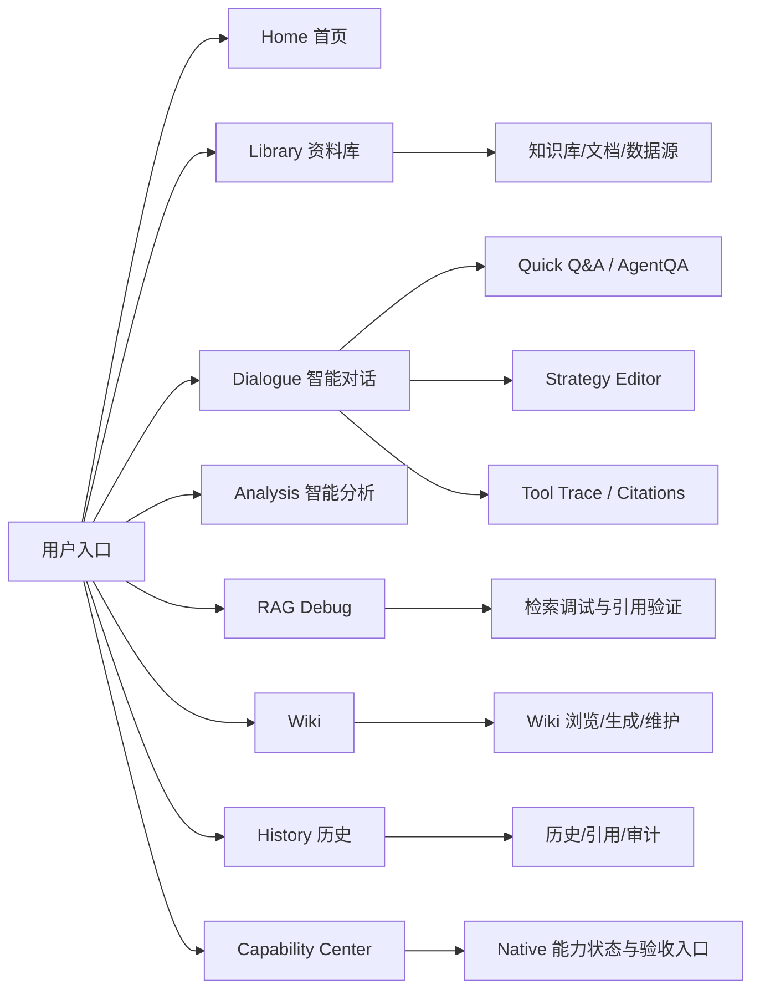
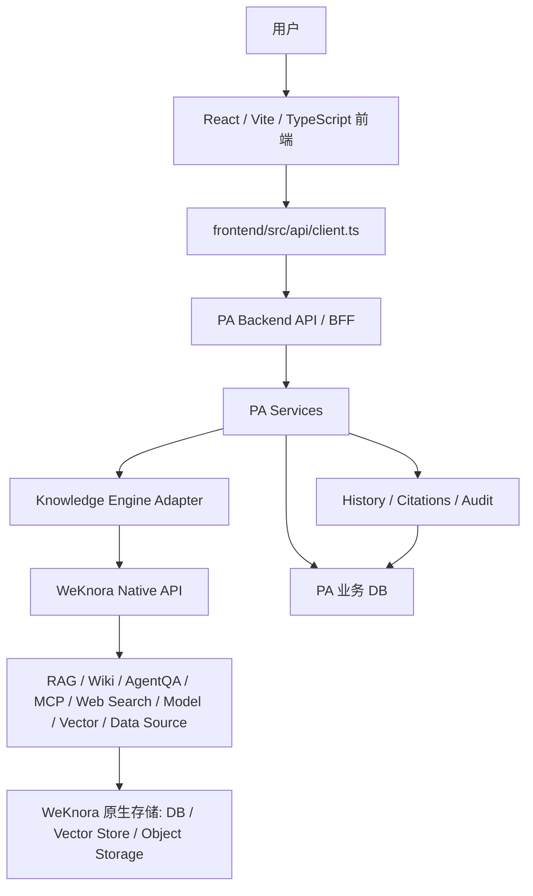
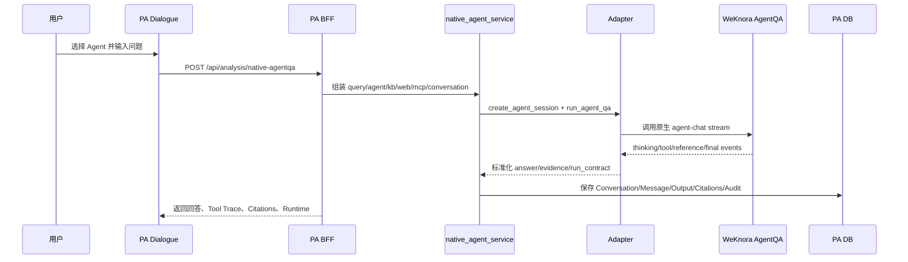
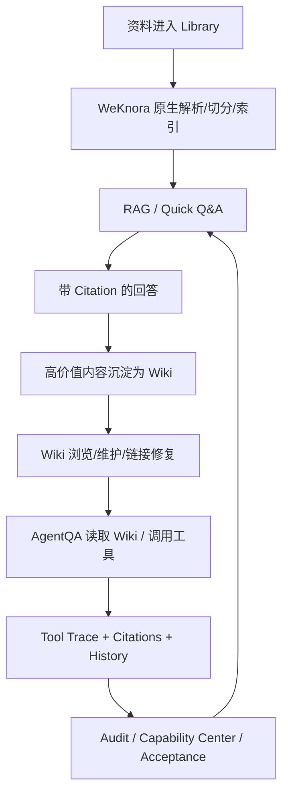

# PA AI Workbench 产品说明文档

> 面向简历项目复盘、AI 产品实习生面试准备和项目交付说明。
>
> 事实口径基于当前仓库 `pa-ai-workbench` 的产品文档、阶段报告、前后端源码和验收脚本整理。本文只说明 PA AI Workbench 这一独立产品，不把 WeKnora 上游能力写成个人从零实现的底层内核。

## 0. 阅读摘要

PA AI Workbench 是一个面向个人和小团队知识工作的 AI 工作台。它的核心价值不是重新造一套 RAG、Wiki、Agent、MCP 或 Web Search 引擎，而是把 WeKnora 已经具备的原生知识引擎能力接入到一个可使用、可追溯、可验证、可复盘的产品流程里。

这份文档采用“先产品价值、再系统架构、再模块细节、最后面试表达”的顺序。原因很简单：面试官首先要判断这个项目是不是一个完整产品，而不是只会调用接口；其次才会追问前端、BFF、adapter、业务数据库、WeKnora Native API 和 WeKnora 原生存储之间如何协作。

本文最重要的结论有四个。

1. PA AI Workbench 是独立产品，不是 WeKnora 的子产品或后台页面。它有自己的前端工作台、PA BFF、业务数据库、历史引用审计体系、状态中心、验收脚本和复盘文档。
2. PA 采用 WeKnora-first 策略，不重写 WeKnora 底层 RAG、Wiki、Agent、MCP、Web Search、模型、向量库、数据源、文档解析等内核。PA 的价值在于产品化接入、封装、状态聚合、引用映射、审计、安全确认和浏览器验收。
3. PA 的核心工作流是 RAG、Wiki、Agent 三条链路形成闭环：资料进入知识库，RAG 产生带引用回答，高价值内容沉淀为 Wiki，AgentQA 再调用知识、Wiki、Web Search 和 MCP 处理复杂任务，最后把结果写入 History/Citations/Audit。
4. WNFC 和 WNID 是两个不同阶段。WNFC 是非 Web Search 范围的本地生产力闭环，结果为 `14.00/14 = 100.0%` 且 `final_ready=true`，Web Search 在 WNFC 中明确 excluded。WNID 是后续重新纳入 Web Search 和 MCP execution 的智能对话阶段，17 个任务完成，`final_ready=true`，Web Search 与 MCP execution 是硬门槛。

## 1. 产品定位

### 1.1 一句话说明

PA AI Workbench 是一个基于 WeKnora 原生 RAG、Wiki、AgentQA、Web Search 和 MCP 能力构建的 AI 知识工作台，把底层知识引擎封装成面向真实知识工作的产品流程。

更口语化地讲，它不是“又做了一个 ChatPDF 页面”，也不是“把 WeKnora 后台搬到另一个前端”。它更像一个个人或小团队的 AI 知识操作台：你可以上传资料、管理知识库、调试检索、进行 Quick Q&A、沉淀 Wiki、使用 AgentQA 分析复杂问题、查看引用来源、回看历史记录、审计外部执行，并通过 Capability Center 和验收脚本知道每个能力到底是真接上了、部分接上了、阻塞了，还是只是待办。

### 1.2 为什么要做这个产品

在真实知识工作里，资料往往不是规整地存在一个地方。个人可能有本地 PDF、会议纪要、Markdown、网页链接和零散笔记；团队可能有部门知识库、FAQ、项目文档、Wiki 页面、外部数据源和工具系统。普通大模型可以回答通用问题，却无法天然访问这些内部资料，也无法稳定说明答案来自哪里。

单纯的“文档问答”产品能解决一部分问题，但它通常有几个短板。第一，它只关注一次问答，不关注知识库生命周期。资料上传后是否解析成功、索引是否完成、chunk 是否可检索、失败如何恢复，往往不清楚。第二，它缺少知识沉淀机制，回答完就结束，不能把高价值内容变成 Wiki 资产。第三，它缺少复杂任务能力，无法把 RAG、Wiki、工具调用、Web Search、MCP 和多轮上下文组织成 Agent 工作流。第四，它缺少可信治理层，没有引用、历史、审计、安全确认和验收矩阵，项目容易停留在 demo。

PA AI Workbench 解决的是这一层产品化问题。它把 WeKnora 的原生能力包装成面向用户的工作台，让用户看到的是“我能完成什么工作”，而不是“这里有一堆底层接口”。这也是它适合作为 AI 产品实习生简历项目的原因：它不只是技术接入，而是把复杂 AI 能力转译为可理解、可操作、可验证的产品流程。

### 1.3 独立产品边界

PA AI Workbench 与 WeKnora 的关系可以用一句话概括：WeKnora 是底层知识引擎和原生能力提供方，PA AI Workbench 是独立的产品工作台和 BFF/adapter 封装层。

必须特别强调，PA 不是 WeKnora 的子产品，也不是 WeKnora 上游仓库中的一个页面。PA 有自己的产品目标、信息架构、前端页面、BFF API、业务数据库、历史引用审计体系、验收报告和简历复盘文档。它使用 WeKnora 原生能力，但不把 WeKnora 的底层实现据为己有，也不为了展示功能而重复实现一套通用 RAG/Wiki/Agent/MCP/Web Search 内核。

| 边界问题 | 正确表述 | 不应该这样说 |
| --- | --- | --- |
| PA 与 WeKnora 的关系 | PA 是独立 AI 工作台，WeKnora 是其接入的原生知识引擎能力来源 | PA 是 WeKnora 的一个子页面 |
| RAG/Wiki/Agent 内核 | PA 调用、适配和产品化 WeKnora 原生 RAG/Wiki/AgentQA | 我从零实现了完整 WeKnora RAG/Wiki/Agent 内核 |
| 产品价值 | PA 把底层能力组织成用户工作流、引用历史审计和验收体系 | PA 的价值只是调用 API |
| 数据归属 | PA DB 存业务记录、历史、引用映射、审计摘要；WeKnora 存原生知识对象和向量等权威数据 | PA 把 WeKnora 原生 chunk/vector/provider payload 全部复制为自己的权威数据 |
| Web Search/MCP 阶段 | WNFC 排除 Web Search；WNID 重新纳入 Web Search 和 MCP execution | WNFC 和 WNID 范围混在一起 |

## 2. 目标用户与核心场景

### 2.1 目标用户

PA AI Workbench 的目标用户不是单一角色，而是围绕知识工作流的一组角色。它既要让非技术用户可以直接问资料，也要让产品、运营或技术同学能看懂能力状态和验收结果。

| 用户类型 | 核心需求 | PA 提供的产品能力 |
| --- | --- | --- |
| AI 产品实习生/产品经理 | 快速理解资料、做需求分析、准备方案和复盘材料 | RAG 问答、Wiki 沉淀、AgentQA 分析、History 复盘、面试讲法沉淀 |
| 部门知识管理员 | 上传资料、维护知识库、检查解析索引状态、处理失败 | Library、KB 选择、文档生命周期、chunk 预览、数据源状态、Wiki 维护 |
| 业务同学 | 用自然语言查询业务资料，并能确认答案来源 | Quick Q&A、Citations、History、引用定位 |
| 技术/运营同学 | 判断能力是否真实接入，排查模型、向量库、MCP、Web Search 等状态 | Capability Center、native status、acceptance harness、browser matrix、审计摘要 |
| 高阶用户 | 需要复杂分析、外部搜索、工具调用和策略配置 | Dialogue、AgentQA、Strategy Editor、Tool Trace、Web Search、MCP、Suggested Questions |

### 2.2 核心使用场景

1. 用户上传一份部门资料，Library 展示解析、切分、索引和失败恢复状态。
2. 用户选择知识库，在 Dialogue 页面使用 Quick Q&A 发起知识问答，得到带 document/wiki citation 的回答。
3. 用户将高价值回答或结构化内容沉淀为 Wiki 页面，再通过 Wiki 浏览、搜索、维护链接和处理 issue。
4. 用户在 Dialogue 页面选择 Agent，发起 AgentQA，让原生 ReACT Agent 调用知识检索、Wiki 工具、Web Search 或 MCP 工具处理复杂问题。
5. 高阶用户通过 Strategy Editor 调整 prompt、context template、allowed tools、MCP selection、Web Search、multi-turn、retrieval 和 rerank 参数。
6. 用户在 Tool Trace 中查看 Agent 的 thinking、tool_call、tool_result、reference、final answer 等运行过程。
7. 用户在 History 中回看 Quick Q&A、AgentQA、Wiki Mode、Web Search、MCP、strategy mutation 的结果、引用状态和审计状态。
8. 用户在 Capability Center 查看 WeKnora native 能力覆盖情况，判断哪些是 live、partial、blocked 或 backlog。
9. 开发和复盘阶段通过 acceptance harness 和 browser matrix 验证产品不是静态页面，而是经过 API、浏览器和报告证据支撑的真实工作流。

## 3. 产品信息架构

### 3.1 页面结构

PA 的前端不是按底层接口分散堆页面，而是围绕用户工作流组织。当前工作台主导航包含首页、资料库、智能对话、智能分析、Wiki、历史、设置/Capability Center 等入口。它保留了产品工作台的完整壳层，同时把 WeKnora native 能力以“可理解的任务入口”呈现给用户。

### 3.2 页面模块表

| 页面/模块 | 用户看到什么 | PA 后端负责什么 | WeKnora 原生能力 |
| --- | --- | --- | --- |
| Home 首页 | 系统状态、常用入口、知识工作台总览 | 聚合 `/api/status`、模型状态、native status 摘要 | 健康检查、模型状态、能力状态 |
| Library 资料库 | 知识库选择、文档上传、解析/索引状态、chunk 和事件预览、数据源状态 | 文档业务记录、状态刷新、native 文档生命周期 API 封装、失败恢复、安全删除/重解析 | KB、Knowledge、Document、Chunk、Data Source |
| Dialogue 智能对话 | Agent 选择、Quick Q&A、AgentQA、策略编辑、工具轨迹、引用、历史 | native Agent catalog、知识对话、AgentQA run、strategy mutation、citation 保存、history 和 audit | Knowledge-chat、AgentQA、Custom Agent、Web Search、MCP、Suggested Questions |
| Analysis 智能分析 | 专业分析入口、历史任务输出、业务分析模板 | PA 专业工作流、任务持久化、引用策略和输出管理 | 可复用 WeKnora 检索、AgentQA、Wiki 证据 |
| RAG Debug | 检索参数、命中文档、score、rank、source_type、trace | RAG debug API、evidence 标准化、引用字段 fail-closed | knowledge-search、hybrid retrieval、rerank、citation references |
| Wiki | Wiki 页面浏览、搜索、读取、草稿、发布、维护 | Wiki BFF、Wiki draft、citation locator、确认式维护操作 | WikiPage、Wiki search/read/create/update/delete、lint、issues、rebuild-links、auto-fix |
| History | 输出列表、任务类型过滤、citation source 过滤、WNID capability 过滤、audit 卡片 | GeneratedOutput、Citation、Conversation、NativeMutationAudit 的查询和聚合 | Session、references、tool events、native mutation evidence |
| Capability Center | 原生能力覆盖、live/partial/blocked/backlog、模型/向量/MCP/Web Search/数据源状态 | native status center、能力组聚合、masked config、审计入口、验证摘要 | MCP、Web Search、Vector Store、Model、Parser、Data Source、FAQ、Tags、Favorites、Skills |

### 3.3 用户工作流表

| 工作流 | 用户动作 | PA 产品层处理 | WeKnora 原生处理 | 输出与复盘 |
| --- | --- | --- | --- | --- |
| 文档进入知识库 | 上传文件、URL 或手动内容 | Library 创建 PA document record，展示解析、chunk、索引状态和事件 | 原生 knowledge/file、knowledge/url、knowledge/manual、stages、spans、chunks | 文档状态、chunk 预览、失败恢复入口 |
| Quick Q&A | 在 Dialogue 中选择知识范围并提问 | PA 发起 native knowledge-chat 或 RAG，保存 conversation、message、output、citation | 原生 knowledge-chat/RAG 返回 references | 带引用回答、History 可回看、citation 可定位 |
| RAG 调试 | 调整检索范围、topK、source_type | PA 标准化 evidence 字段和 warnings | 原生 knowledge-search、rerank 和 search result | score、rank、evidence_id、source_type |
| Wiki 沉淀 | 从资料或回答生成/维护 Wiki | PA 保存 draft、引用映射，确认式执行维护操作 | 原生 Wiki read/search/create/update/delete/rebuild/auto-fix/issues | Wiki 页面、Wiki citation、审计记录 |
| AgentQA 分析 | 选择 Agent 并发起复杂问题 | PA 组织 Agent、KB、Web Search、MCP、conversation、history、citations | 原生 AgentQA/ReACT、built-in tools、Wiki tools、Web Search、MCP | Tool Trace、最终回答、引用、运行契约 |
| Strategy 编辑 | 修改 prompt、工具、MCP、Web Search、retrieval/rerank 参数 | PA 做字段校验、确认 token、审计摘要、调用 native update | 原生 Custom Agent config 更新 | strategy audit、catalog readback、可复盘策略变更 |
| MCP 执行 | 选择安全 MCP 服务和工具 | PA 做 approval-gated execution、确认、审计和历史保存 | 原生 MCP tools/resources/prompts/execution | 工具执行结果摘要、audit id、History 可过滤 |
| Web Search | 配置/测试 provider，AgentQA 中开启搜索 | PA 只保存 masked 状态和引用映射，不保存原始 provider payload | 原生 Web Search provider test 和 AgentQA web_search tool | URL/title/snippet/rank 类型 web citation |
| 能力验收 | 查看状态中心、运行 checker、浏览器矩阵 | PA 输出 sanitized status、reports、browser proof | WeKnora 提供 live native capability | final_ready、browser matrix、PASS/blocked 证据 |

## 4. 整体技术架构

### 4.1 架构总览

PA AI Workbench 的架构可以分成六层：前端工作台、PA BFF、PA services、Knowledge Engine Adapter、WeKnora Native API、数据存储。理解这六层，是解释项目技术含量的关键。

### 4.2 技术架构表

| 层级 | 代表文件/模块 | 主要职责 | 重要边界 |
| --- | --- | --- | --- |
| 前端工作台 | `frontend/src/App.tsx`、`frontend/src/pages/*`、`frontend/src/api/client.ts` | 页面导航、用户工作流、状态展示、Tool Trace、Citations、History、Capability Center | 不直接拼 WeKnora 原始响应，不隐藏 partial/blocked 状态，不展示密钥或原始 provider payload |
| PA BFF API | `backend/app/api/*` | 暴露 PA 产品语义 API，如 `/api/documents`、`/api/rag/debug`、`/api/wiki/native/*`、`/api/analysis/native-agentqa`、`/api/native/status` | 不让前端直接面对底层 WeKnora route 细节，不把 status 当 citation evidence |
| PA Services | `backend/app/services/*` | 业务流程、历史记录、引用保存、审计、安全确认、状态聚合 | 不承担 WeKnora RAG/Wiki/Agent/MCP/Web Search 内核算法 |
| Knowledge Engine Adapter | `knowledge_engine/backends/weknora_api_backend.py` | 统一 WeKnora 原生 API 请求、超时、错误、redaction、安全字典、evidence mapping | 不伪造 citation，不泄漏 auth/header/provider payload，不让 route handler 到处写一次性 HTTP |
| WeKnora Native API | 外层 WeKnora `internal/*` route、handler、service、types | 提供 KB、document、chunk、knowledge-search、knowledge-chat、AgentQA、Wiki、MCP、Web Search、vector、model、parser、data source 等原生能力 | PA 复用这些能力，不重写通用平台内核 |
| PA 业务 DB | `backend/app/models.py`、SQLite 默认配置 | 保存 Document、Conversation、GeneratedOutput、Citation、WikiPage、WikiCitation、NativeMutationAudit 等业务状态 | 不保存 WeKnora 权威 chunk/vector/raw provider payload/密钥/原始日志 |
| WeKnora 原生存储 | WeKnora DB、向量库、对象存储等 | 保存知识库、文档、chunk、Wiki page、Agent config、向量、索引和平台对象 | 是 WeKnora 原生能力的权威数据源 |
| Validation/Ops | `backend/scripts/check_weknora_*`、阶段报告、browser matrix | 证明能力真实可用，区分 live、partial、blocked、backlog、fixture、mock | 不用旧报告、静态 UI 或 mock 当 PASS |

### 4.3 前端层

前端采用 React、Vite 和 TypeScript。`frontend/src/App.tsx` 负责主导航和 hash route，页面包括首页、资料库、智能对话、智能分析、RAG Debug、Wiki、历史和 Capability Center。`frontend/src/api/client.ts` 定义前端 API 类型和请求方法，相当于前端与 PA BFF 的契约层。

从产品角度看，前端层不是简单把接口结果打印出来，而是把底层能力组织成可操作界面。例如 Library 不只是上传按钮，还展示知识库选择、文档状态、chunk 状态、处理事件、失败提示和恢复动作。Dialogue 不只是一个输入框，而是包含 Agent picker、Quick Q&A/AgentQA 模式、Conversation Strategy Editor、MCP/Web Search 状态、Tool Trace、Citations 和历史对话。History 不只是输出列表，而是能按 WNID capability、citation source、evidence state、audit 状态过滤。

### 4.4 PA BFF 后端层

PA 后端是 BFF，而不是 WeKnora 的替代后端。它的价值在于把底层 native route 转换成产品语义 API。例如用户不需要知道 WeKnora 的 `agent-chat` streaming event 怎么组织，也不需要知道 Wiki issue status 的 native route 细节。前端调用的是 PA 的 `/api/analysis/native-agentqa`、`/api/wiki/native/*`、`/api/native/status` 等产品化接口。

BFF 做的关键事情包括：

- 统一状态：把 WeKnora 的运行状态、模型状态、MCP/Web Search/Vector/Data Source 等状态聚合为 live、partial、blocked、backlog 等用户可理解状态。
- 统一错误：将上游错误变成安全、简短、可解释的错误，而不是把可能含敏感内容的原始错误透传到前端。
- 统一历史：把 Quick Q&A、AgentQA、Wiki、MCP、Web Search 等输出保存为 Conversation、Message、GeneratedOutput。
- 统一引用：将 document_chunk、wiki_page、web_search 等 references 映射为 PA Citation。
- 统一审计：对 mutation、外部执行、strategy update、Wiki Mode、MCP execution、Web Search provider test 记录 NativeMutationAudit。
- 统一安全确认：对删除、MCP 执行、Wiki 维护、Agent strategy mutation 等操作使用 confirm token。

### 4.5 Knowledge Engine Adapter

Knowledge Engine Adapter 是 PA 架构中最容易被低估的一层。它不是多余的“转发器”，而是隔离底层能力变化、统一证据格式和保护安全边界的关键。

在当前实现中，`weknora_api_backend.py` 集中处理 WeKnora 原生访问，包括健康检查、workspace/KB、文档上传与状态、chunk、RAG 检索、Wiki、AgentQA、Custom Agent、MCP、Web Search、Vector Store、Model/Parser、Data Source、FAQ、Tags、Favorites、Skills 等路径。它也承担请求 helper、auth header、timeout、retry、redaction、安全字典、错误映射、evidence mapping 和 metadata allowlist。

如果前端直接调用 WeKnora，会出现三个问题。第一，页面会被底层接口形态绑死，产品语义不稳定。第二，引用、历史、审计、安全过滤会分散到多个页面，难以保证一致。第三，WeKnora 原生接口调整时，前端和业务逻辑都要大范围改动。Adapter 把这些变化收束在一个层里，让前端面对稳定的 PA 产品契约。

### 4.6 PA 业务 DB 与 WeKnora 原生存储

PA 业务 DB 保存的是产品工作流需要的业务记录，不保存 WeKnora 平台内部权威数据。当前 PA DB 模型包括 Document、DocumentProcessingEvent、Conversation、ConversationMessage、GenerationTask、GeneratedOutput、Citation、WikiPage、WikiCitation、WikiPageCache、NativeMutationAudit 等。

这套设计的关键不是“PA 自己也存一份数据”，而是“PA 存的是产品复盘和操作语义”。例如：

- Document 记录 PA 工作台中展示的文档状态、外部 native id、失败步骤、安全状态快照。
- Conversation/Message 保存用户和助手对话，用于多轮上下文和历史复盘。
- GeneratedOutput 保存一次任务输出，并与 Citation 关联。
- Citation 保存 source、source_type、evidence_id、chunk id、Wiki page id、web reference 等可追踪字段。
- NativeMutationAudit 保存 mutation 或外部执行的安全摘要、确认方式、状态和错误摘要。

WeKnora 原生存储仍然保存知识库、文档、chunk、Wiki page、Agent config、向量、索引、provider 配置等权威平台对象。PA 不应该复制 WeKnora 的权威 chunk/vector/raw provider payload，也不应该把密钥、原始日志、原始上传内容或 provider 原始响应写进 PA DB。

## 5. Knowledge Engine Adapter 设计

### 5.1 为什么需要 Adapter

Adapter 的第一层价值是产品稳定性。WeKnora 原生 API 是平台能力接口，而 PA 前端需要的是产品任务接口。两者关注点不同：WeKnora 更关注能力本身是否可调用，PA 更关注用户工作流是否完成、状态是否可读、引用是否可追踪、错误是否可解释。

Adapter 的第二层价值是证据一致性。RAG search result、Wiki page、AgentQA references、Web Search references 都可能来自不同 native route。如果每个页面自己处理 references，就很容易出现字段名不统一、缺少 evidence_id、source_type 混乱、History 无法过滤的问题。Adapter 统一把 native references 转换为 PA Evidence/Citation 所需字段。

Adapter 的第三层价值是安全过滤。MCP、Web Search、Vector Store、Model/Data Source 等能力会涉及 credential posture、provider payload、connection fields、raw logs 等敏感信息。Adapter 通过 safe dict、masked status、redaction 和 metadata allowlist 保证前端和报告只看到安全摘要。

### 5.2 Adapter 负责什么

| Adapter 职责 | 具体表现 | 产品收益 |
| --- | --- | --- |
| 调用 WeKnora Native API | request_json、request_sse_json、request_multipart_json | PA 不直接散落底层 HTTP 调用 |
| 统一错误与超时 | operation label、timeout、retry、public error message | 前端错误可解释，不泄漏敏感内容 |
| 安全字段过滤 | safe dict、redaction、masked credential status | Credential/provider/vector/raw payload 不进入前端和报告 |
| Evidence mapping | document_chunk、wiki_page、web_search source_type 和 evidence_id | Citations 可保存、可过滤、可定位 |
| Native capability helper | KB、document、chunk、RAG、Wiki、Agent、MCP、Web Search、Vector、Model、Data Source 等 helper | BFF 能以产品语义组合能力 |
| 状态摘要 | capability status、warnings、next action | Capability Center 可以展示真实状态 |

### 5.3 面试讲法

我不会说“我只是调了 WeKnora API”。更准确的说法是：

> 我在 PA 中设计了 BFF + Knowledge Engine Adapter 的分层。前端只面对 PA 产品语义，不直接耦合 WeKnora 原生接口；adapter 负责统一请求、错误、状态、安全过滤和 evidence mapping。这样既能复用 WeKnora 的成熟 RAG/Wiki/Agent/MCP/Web Search 能力，又能在 PA 产品层统一实现引用、历史、审计、状态中心和浏览器验收。

## 6. PA Agent 产品层设计

### 6.1 Agent 产品层的定位

PA 里的 Agent 产品层不是重新写一个通用 AgentEngine。它的正确定位是：把 WeKnora 原生 AgentQA、Custom Agent、built-in tools、Wiki tools、MCP、Web Search、Suggested Questions 和 conversation strategy 组织成用户可操作的 Dialogue 工作流。

用户真正看到的不是“某个 Go service 的 Agent 实现”，而是一个可用的智能对话空间：可以选择 Agent，可以在 Quick Q&A 和 AgentQA 之间切换，可以编辑策略，可以看到工具轨迹，可以查看引用和历史，可以知道 Web Search/MCP 是否真的可用。

### 6.2 Dialogue 页面

Dialogue 是 WNID 阶段的核心产品界面。它将智能对话从 Analysis 页面的高级功能提升为第一等入口。页面中包含：

- Agent Picker：从 WeKnora 原生 Custom Agent catalog 中选择可运行 Agent。
- Quick Q&A：面向知识库的快速问答，强调知识范围和引用。
- AgentQA：面向复杂问题的原生 ReACT 多步推理。
- Strategy Editor：编辑 system prompt、context template、allowed tools、MCP selection、Web Search、web fetch、multi-turn、history turns、embedding topK、threshold、rerank topK、suggested prompts 等策略字段。
- Tool Trace：展示 thinking、tool_call、tool_result、references、final answer 等事件。
- Citations：展示 document、Wiki、Web Search 等引用。
- History：保留 conversation、message、output 和 citation，支持回看。
- MCP 面板：展示安全 MCP service、tools/resources/prompts read path、approval-gated execution。
- Web Search 面板：展示 provider setup/test 状态和 AgentQA web reference evidence。
- Suggested Questions：展示原生 Agent/KB 范围下的建议问题，并可一键发起真实对话。

### 6.3 AgentQA 运行链路

### 6.4 Quick Q&A

Quick Q&A 面向更轻量的知识问答。用户不需要理解 Agent 复杂策略，只需要选择知识范围并提问。PA 通过 native knowledge-chat 或 RAG 路径拿到 references，并保存 citations。这个路径适合业务同学快速询问部门资料，也适合面试中解释“RAG 不是只返回答案，而是要带 source_type、evidence_id 和 locator”。

### 6.5 AgentQA

AgentQA 面向复杂问题。它通过 WeKnora 原生 AgentQA/ReACT 能力执行多步推理，可能调用知识检索、Wiki 工具、Web Search、MCP 等工具。PA 的职责是把这些 events 转成用户能理解的运行契约：工具调用了什么、返回了什么、有哪些 references、是否保存了 citations、是否有 citation blocker、是否写入 history。

### 6.6 Strategy Editor

Strategy Editor 是 PA Agent 产品层的重要亮点。它不是把配置文件暴露给用户，而是把对话策略变成可编辑、可确认、可审计的产品表单。它覆盖的字段包括 prompt/context、allowed tools、MCP selection mode、MCP services、Web Search 开关、Web Search provider、web fetch、multi-turn、history turns、embedding topK、keyword/vector threshold、rerank topK、rerank threshold、suggested prompts 等。

这体现了产品设计能力：复杂模型策略不应该停留在后端配置里，也不应该让用户直接改原始 JSON。PA 把它整理成 Strategy Editor，并用 confirm token 和 NativeMutationAudit 记录变化，降低误操作和不可复盘风险。

### 6.7 Tool Trace

Tool Trace 的价值是让 Agent 不再是黑盒。用户可以看到 Agent 是否真的调用了工具、调用顺序是什么、结果是否进入引用体系。对于 MCP 和 Web Search，Tool Trace 也能区分“工具调用证据”和“事实引用证据”：工具执行本身只能证明工具被调用，不能自动证明事实来源；事实引用仍然要依赖 document/Wiki/Web references。

### 6.8 Citations

Citations 是 PA 从 demo 走向可信 AI 产品的核心。PA 不把 answer text 直接当可信结果，而是要求输出有 source_type 和 evidence_id。当前 citation 类型包括 document_chunk、wiki_page、web_search 等。History 页面也能统计 WeKnora citation、mock citation、document citation、Wiki citation、Web citation 和 traceable citation。

### 6.9 History

History 保存的不只是“过去问过什么”。它把每次输出、引用、警告、WNID capability、evidence state、citation blocker 组织起来。用户可以筛选 Quick Q&A、AgentQA、Wiki Mode、MCP Tools、Web Search，也可以查看是否 citation_blocked、是否 wiki_traceable、是否 web_search_traceable、是否 mcp_audited。

### 6.10 Audit

Audit 解决的是“谁做了什么外部或危险操作、是否确认、结果如何”的问题。PA 对 custom Agent mutation、strategy update、Wiki Mode mutation、MCP execution、Web Search provider test、FAQ/tag/favorite/skill/vector/data source 等操作记录 NativeMutationAudit。审计只保存安全摘要，不保存密钥、原始 prompt、原始 provider payload、原始 web page 或本地数据库内容。

### 6.11 Suggested Questions

Suggested Questions 来自 WeKnora 原生 Agent endpoint，PA 按当前 Agent、KB 和 knowledge scope 展示建议问题，并允许用户点击后进入真实 AgentQA 或 Quick Q&A。这个设计降低了用户使用 Agent 的启动成本，也能把 Wiki/知识库范围和对话入口连接起来。

### 6.12 Web Search

Web Search 在 WNFC 中不开发、不计分、不作为非 Web Search 本地闭环的一部分。WNID 重新把 Web Search 纳入智能对话硬门槛。PA 需要证明 provider setup/test、AgentQA web_search tool run、web references、citations、history 和 browser trace 都成立。Web Search 不是一个开关，它必须有 provider identity、URL、title、snippet、rank 或等价 reference shape，才能成为可追踪证据。

### 6.13 MCP

MCP 在 WNFC 中部分能力被用户移出范围，WNID 重新把 MCP execution 纳入硬门槛。PA 的 MCP 产品层包括 service list/read、tools/resources/prompts read、approval-gated execution、拒绝和批准两种路径、audit/history 和 browser trace。PA 不把 MCP result text 直接当 factual citation，而是将其作为工具执行证据；事实引用仍然要由 document/Wiki/Web reference 支撑。

## 7. RAG、Wiki、Agent 的产品工作流闭环

### 7.1 闭环总览

PA 最有产品感的地方，不是单独做了某个 RAG 或 Wiki 页面，而是把 RAG、Wiki 和 Agent 变成一个闭环。

这个闭环可以用一句话解释：文档变知识，知识变回答，回答可追溯，高价值内容变 Wiki，Wiki 再进入检索和 Agent，所有过程进入 History、Citations、Audit 和状态验收。

### 7.2 文档生命周期

文档生命周期从上传开始，但不是上传结束。PA 需要展示解析、切分、索引、失败、重试、预览、下载、删除、重解析等状态。WeKnora 原生层负责文档 ingestion、stages、spans 和 chunks；PA 负责把这些 native 状态映射到 Library 可理解的状态和事件。

产品上，这解决了用户最关心的问题：资料到底有没有进入知识库？为什么问不到？是解析失败、chunk 失败、embedding 失败、索引未完成，还是知识范围没有选对？PA 的 Library 和 Capability Center 让这些问题有地方查，而不是让用户去读后端日志。

### 7.3 知识库管理

知识库是用户组织资料的基本单位。PA 支持知识库选择、active KB snapshot、KB create/update/delete/pin 等安全操作，也通过 tags/favorites/FAQ/skills 等组织能力增强知识工作台。这里依然遵守 WeKnora-first：WeKnora 拥有知识库和平台对象，PA 保存业务选择和操作审计。

### 7.4 RAG 问答与调试

RAG 在 PA 里有两种产品形态。第一是用户视角的 Quick Q&A，强调自然语言提问和带引用回答。第二是调试视角的 RAG Debug，强调检索参数、source_type、evidence_id、rank、score、warnings 和 locator。两者共同解决“能回答”和“为什么这样回答”两个问题。

在面试中可以强调：我没有把 RAG 简化成“把检索结果塞给大模型”。我设计的是回答、引用、历史、证据字段、失败边界和调试视图组成的产品闭环。

### 7.5 Wiki 工作流

Wiki 是知识沉淀层。PA 支持 Wiki 浏览、搜索、读取、草稿、发布、维护、rebuild links、auto-fix、issue status 等路径，并对全局维护和写操作使用安全确认与审计。Wiki 的价值是把一次性回答变成长期知识资产，让高价值内容沉淀下来，继续参与检索、引用和 Agent 工作流。

### 7.6 Agent 工作流

Agent 是复杂任务层。它不只是调用 RAG，而是能在多步任务中调用知识检索、Wiki 工具、Web Search、MCP 和内置工具。PA 的 Agent 产品层把这个过程可视化、可配置、可审计、可复盘。用户可以从 Suggested Questions 进入，也可以自己提问；可以选择 Quick Q&A，也可以选择 AgentQA；可以查看 Tool Trace，也可以回到 History 复查引用和审计。

## 8. 历史、引用、审计与安全体系

### 8.1 为什么治理层是产品亮点

很多 AI demo 到“能回答”就结束了，但真实产品必须回答几个追问：答案来自哪里？这次运行能不能回看？工具是否真的执行？谁修改了策略？外部搜索或 MCP 是否经过确认？报告里有没有泄漏密钥或原始 payload？如果能力不可用，界面是否如实显示？

PA 的 History、Citations、Audit、安全确认和状态中心正是为这些问题设计的。

### 8.2 Citation 设计

Citation 不是装饰。它是降低幻觉、支持复查、支撑面试可信度的关键。PA 对 citation 的要求包括：

- 必须区分 source 和 source_type，例如 weknora_api、document_chunk、wiki_page、web_search。
- 必须有 evidence_id 或足够稳定的 native identity。
- document_chunk 要能关联 native document/chunk。
- wiki_page 要能关联 native page id 或 slug。
- web_search 要包含 URL/title/snippet/rank 或等价引用形态。
- 如果没有 traceable references，可以保存回答和历史，但 citation PASS 必须 fail closed。

### 8.3 History 设计

History 的核心不是“列表页”，而是复盘入口。它把 GeneratedOutput、Citation、warnings、WNID capability 和 evidence state 结合起来。用户可以看到一次输出是否来自 WeKnora、是否有 mock、是否有 document/Wiki/Web citation、是否 traceable、是否 citation_blocked。

这种设计在面试里很好解释：AI 产品不能只追求一次回答效果，还要能复查、能定位、能说明证据质量。

### 8.4 Audit 设计

Audit 关注 mutation 和外部执行。PA 对以下操作记录审计：

- Custom Agent create/update/copy/delete。
- Strategy Editor 修改 prompt、tools、MCP、Web Search、retrieval/rerank 参数。
- Wiki Mode 写入或维护 Wiki 页面。
- Wiki rebuild links、auto-fix、issue status 等维护操作。
- MCP approval-gated execution。
- Web Search provider create/update/delete/test。
- Vector store、data source、FAQ、tags、favorites、skills 等安全 mutation。

审计中只保存安全摘要、状态、target 类型、确认方式、错误摘要等，不保存原始敏感内容。

### 8.5 安全确认

PA 使用 confirm token 控制危险或外部操作。它不是为了增加操作负担，而是为了防止把“点击一下就删除/执行/外部请求”做成不透明能力。需要确认的操作包括删除、MCP execution、Web Search provider test、strategy mutation、Wiki global maintenance、vector rebind、data source sync/delete 等。

### 8.6 敏感信息边界

PA 的安全边界非常明确：

- 不打印或提交密钥、服务令牌、私有端点、认证头、原始 provider payload、原始 web page、原始 prompt、原始上传内容、本地数据库内容、日志、缓存或向量原始数据。
- 前端只展示 masked status、configured count、安全摘要和 blocker。
- 报告和验收脚本只输出 sanitized 状态、counts、route、marker、audit id 等可公开信息。
- Adapter 和 audit service 对敏感字段做 redaction、safe summary 和长度限制。

## 9. 状态中心与验收体系

### 9.1 为什么需要状态中心

AI 产品最容易出现的问题是“页面看起来都绿了，但背后没有真的接上”。PA 用 Capability Center、native status center、acceptance harness 和 browser matrix 来避免这种情况。它要求状态来自 API、服务、浏览器和报告证据，而不是静态卡片。

### 9.2 Capability Center

Capability Center 聚合 WeKnora native capability group，包括 system health、workspace/KB、document lifecycle、chunk、RAG、knowledge-chat、AgentQA/custom Agent、Wiki、MCP、Web Search、Vector Store、Model/Parser、Data Source、FAQ/Tags/Favorites/Skills、History/Citation/Product Shell 等。

它展示 live、partial、blocked、backlog 等状态，并显示 next action、masked config、summary 和 warnings。用户和面试官可以通过它理解：这个产品到底接了哪些底层能力，哪些是真实可用，哪些只是可见，哪些受限于 credential/API/runtime。

### 9.3 Acceptance harness

Acceptance harness 是阶段验收脚本。它通过脚本检查任务行、报告链接、final_ready、Web Search/MCP 范围、current-run evidence、browser matrix、敏感信息边界和禁止 mock/demo/stale evidence 的规则。它的意义是把“我觉得完成了”变成“脚本可以机械验证完成状态”。

WNFC 使用 native full completion acceptance harness，验证非 Web Search 范围的本地生产力闭环。WNID 使用 native intelligent dialogue acceptance harness，验证 README Intelligent Conversation 能力通过 PA 完成，且 Web Search 和 MCP execution 仍然在 scope。

### 9.4 Browser matrix

Browser matrix 是用户可见层的验收。它会在桌面和移动 viewport 下打开关键页面，检查页面是否可见、关键 marker 是否存在、是否有横向溢出、是否依赖隐藏高级面板、是否能看到状态和引用等。

WNFC browser matrix 覆盖 Home、Library、Analysis、RAG Debug、Wiki、History、Capability Center。WNID browser matrix 重点覆盖 Dialogue shell、Strategy Editor、Tool Trace、Citations、MCP/Web Search status、Suggested Questions，并验证桌面和移动端渲染。

### 9.5 WNFC 与 WNID 的事实口径

| 阶段 | 范围 | 最终状态 | 关键结论 |
| --- | --- | --- | --- |
| WNX Native Expansion | 内部生产化基础，目标 80% coverage | `12.00/15 = 80.0%` | 建立 PA as BFF/workflow shell、native capability ledger、status/report gates |
| WNFC Native Full Completion | 非 Web Search 范围的本地生产力闭环 | `14.00/14 = 100.0%`，`final_ready=true`，Web Search excluded | PA 可以作为本机知识库生产力工具使用，MCP/数据源部分 credential-heavy slice 按用户决策移出该阶段 |
| WNID Native Intelligent Dialogue | 重新纳入 Web Search 和 MCP execution 的智能对话阶段 | `task_rows=17`，`completed_tasks=17`，`final_ready=true` | README Intelligent Conversation rows 通过 PA 完成，Web Search 和 MCP execution 是硬门槛 |

这里要避免一个常见错误：不能说 WNFC 已经包含 Web Search 最终验收。正确说法是 WNFC 明确排除 Web Search；当用户后来决定把 Web Search 和 MCP execution 纳入范围时，项目创建了新的 WNID 阶段，并在 WNID 中完成这些硬门槛。

## 10. 产品亮点

### 10.1 独立产品定位清晰

PA 不是 WeKnora 管理台的复制品。它有明确的用户、场景、页面、业务数据库、历史引用审计体系和验收报告。它把底层 AI 能力包装成知识工作流，而不是让用户面对一堆后端接口。

### 10.2 WeKnora-first 策略正确

项目没有为了“显得技术多”而重复造 RAG/Wiki/Agent/MCP/Web Search 轮子。它尊重 WeKnora 的原生能力边界，优先通过 native API 接入，只有当 native contract 缺失时才走受控 native exception，并且要求测试和运行证据。

### 10.3 BFF + Adapter 把底层能力产品化

前端不直接调 WeKnora，BFF 和 Adapter 负责语义转换、状态聚合、错误处理、引用映射、安全过滤和审计接入。这是一个更接近真实产品工程的设计。

### 10.4 RAG、Wiki、Agent 形成闭环

项目不是孤立的 RAG 问答，而是资料进入知识库、RAG 生成带引用回答、Wiki 沉淀知识、Agent 调用知识和工具、History/Citations/Audit 复盘结果的闭环。

### 10.5 Agent 产品层完整

Dialogue 页面覆盖 Quick Q&A、AgentQA、Strategy Editor、Tool Trace、Citations、History、Audit、Suggested Questions、Web Search、MCP。它把复杂 Agent 能力从“后端能力”变成“用户可以操作的产品空间”。

### 10.6 可信 AI 设计完整

PA 强调 citation、history、audit、confirm token、masked status、sensitive scan、browser matrix 和 acceptance harness。这些能力让项目从 demo 走向可复查的产品。

### 10.7 阶段治理清晰

WNX、WNFC、WNID 分阶段推进，每个阶段都有 spec、skill、reports、acceptance harness 和 final report。尤其 WNFC/WNID 的范围区分体现了产品和工程治理意识。

### 10.8 适合作为 AI 产品实习生项目

这个项目能体现产品实习生的几个能力：理解底层 AI 技术、做产品抽象、设计信息架构、定义边界、组织用户流程、推动验收、写复盘文档、把复杂技术讲给非技术面试官听。

## 11. 面试讲法

### 11.1 30 秒版本

PA AI Workbench 是我做的一个独立 AI 知识工作台，用来把本地或团队资料接入 WeKnora 原生知识引擎。它不是重写 WeKnora，而是通过 PA 前端、BFF、Knowledge Engine Adapter、业务 DB、引用历史审计和验收体系，把 WeKnora 的 RAG、Wiki、AgentQA、Web Search、MCP 能力封装成用户可用的知识工作流。项目最终形成了资料上传、RAG 问答、Wiki 沉淀、Agent 多步处理、引用追踪、历史复盘、审计和状态验收的闭环。

### 11.2 2 分钟版本

这个项目的背景是，真实知识工作中资料很分散，普通大模型无法稳定访问内部资料，单纯文档问答又缺少知识维护、Agent 多步执行、引用历史和审计。我设计 PA AI Workbench 的目标，是做一个面向个人和小团队的 AI 知识工作台。

架构上，前端用 React/Vite/TypeScript，承载 Home、Library、Dialogue、Wiki、History、Capability Center 等页面；后端是 PA BFF，负责产品 API、状态聚合、历史、引用、审计和安全确认；WeKnora native 能力通过 Knowledge Engine Adapter 接入，adapter 统一请求、错误、redaction 和 evidence mapping；PA 业务 DB 保存 Document、Conversation、GeneratedOutput、Citation、NativeMutationAudit 等业务数据；WeKnora 原生存储仍然保存知识库、文档、chunk、Wiki、Agent config、向量等权威对象。

产品上，我重点做了三条闭环。第一是 RAG 闭环：上传资料、解析索引、Quick Q&A、RAG debug 和 citation mapping。第二是 Wiki 闭环：把高价值内容沉淀成 Wiki，并支持搜索、读取、维护和引用定位。第三是 Agent 闭环：Dialogue 页面支持 AgentQA、Strategy Editor、Tool Trace、Web Search、MCP、Suggested Questions、History 和 Audit。整个项目还有 acceptance harness 和 browser matrix，证明它不是静态 demo，而是有真实 API 和浏览器证据支撑的产品。

### 11.3 技术面试强调点

| 面试官关注 | 推荐回答角度 |
| --- | --- |
| 你到底做了什么 | 我做的是独立产品层和 BFF/adapter 封装，不是重写 WeKnora 内核 |
| 为什么不用前端直连 WeKnora | 需要稳定产品语义、统一引用历史审计、安全过滤和错误处理 |
| RAG 怎么保证可信 | 通过 source_type、evidence_id、citation locator、History、fail-closed blocker |
| Agent 不是黑盒吗 | Dialogue 展示 Strategy、Tool Trace、Citations、History 和 Audit |
| Web Search/MCP 怎么证明不是开关 | WNID 要求 provider/tool execution 当前运行证据、history/audit/browser matrix |
| 如何避免 demo 化 | spec + skill + reports + acceptance harness + browser matrix + sensitive scan |
| 数据怎么分层 | PA DB 存业务记录和安全摘要，WeKnora 存原生知识和向量等权威数据 |

### 11.4 产品面试强调点

| 产品能力 | 可以怎么讲 |
| --- | --- |
| 用户场景抽象 | 从资料管理、问答、Wiki 沉淀、Agent 分析、复盘审计五个场景组织产品 |
| 信息架构 | 导航不是按 API 排，而是按 Home、Library、Dialogue、Wiki、History、Capability Center 的用户任务排 |
| 风险意识 | 不把没有引用的回答当 citation PASS，不把配置状态当真实执行证据 |
| 阶段治理 | WNFC/WNID 范围清晰，用户改变范围后新建治理阶段，而不是篡改旧结论 |
| 体验设计 | 非技术用户可以 Quick Q&A，高阶用户可以 Strategy Editor 和 Tool Trace |

## 12. 常见追问

### 12.1 PA AI Workbench 和 WeKnora 到底是什么关系？

PA AI Workbench 是独立产品，WeKnora 是底层原生知识引擎和能力提供方。PA 的前端、BFF、业务 DB、历史引用审计、状态中心和验收体系由 PA 产品层负责；RAG、Wiki、AgentQA、MCP、Web Search、模型、向量库、数据源等通用平台能力由 WeKnora 原生层提供。PA 复用和封装这些能力，不把它们写成自己从零实现。

### 12.2 你有没有实现 RAG？

准确说，我没有从零重写 WeKnora 的 RAG 内核。我的工作是把 WeKnora 原生 knowledge-search、knowledge-chat、references 和 citation contract 接入 PA 产品层，并做了 RAG Debug、Quick Q&A、citation mapping、History 保存、source_type/evidence_id 校验和 fail-closed 边界。这比单纯“调一下 RAG API”更接近产品化落地。

### 12.3 你有没有实现 Agent？

准确说，我没有重写 WeKnora 的通用 Agent 内核。我的工作是把 WeKnora 原生 AgentQA、Custom Agent、tools、Web Search、MCP、Suggested Questions 接入 PA Dialogue 产品层，做 Agent picker、Strategy Editor、Tool Trace、Citations、History、Audit 和 browser validation。这样用户不用理解底层 Agent 代码，也能使用和复盘 Agent 能力。

### 12.4 为什么需要 PA BFF？

因为前端直接调 WeKnora 会把页面绑死在底层接口上，也难以统一引用、历史、审计、安全过滤和错误处理。PA BFF 把底层能力包装成产品语义 API，让前端关注用户工作流，让 adapter 关注 native integration，让 service 关注业务记录和治理。

### 12.5 Citation 为什么这么重要？

AI 知识产品的最大风险是幻觉和不可复查。Citation 让用户知道回答来自哪份文档、哪个 Wiki 页面或哪个 Web reference。PA 还要求 citation 具备 source_type、evidence_id 和 locator 信息。如果没有可追踪引用，可以保存回答，但不能把它标记为 citation PASS。

### 12.6 Audit 和安全确认是不是过度设计？

不是。MCP execution、Web Search provider test、Wiki 维护、Agent strategy mutation、删除和外部同步都可能产生外部影响或数据风险。确认 token 和 audit 让这些操作变得可控、可复盘，也能证明产品没有为了演示而隐藏危险操作。

### 12.7 WNFC 和 WNID 有什么区别？

WNFC 是非 Web Search 范围的本地生产力闭环，最终 `14.00/14 = 100.0%`，`final_ready=true`，Web Search excluded。WNID 是 WNFC 之后的新阶段，它重新纳入 Web Search 和 MCP execution，并把它们作为智能对话最终 PASS 的硬门槛。不能把 WNFC 写成已经包含 Web Search，也不能把 WNID 当成修改 WNFC 结论。

### 12.8 这个项目最能体现产品能力的地方是什么？

最能体现产品能力的是把复杂底层能力翻译成用户工作流，并且守住真实边界。PA 不只是“能问答”，而是有资料管理、RAG、Wiki、Agent、引用、历史、审计、状态中心、验收脚本和浏览器矩阵。它把技术能力变成可用、可信、可复盘的产品体验。

### 12.9 如果继续迭代，你会做什么？

后续可以围绕三类方向迭代。第一是团队协作能力，例如权限、共享空间、协作 Wiki 和任务分配。第二是知识质量能力，例如 citation quality scoring、重复知识检测、知识过期提醒和 Wiki 自动维护策略。第三是 Agent 工作流能力，例如更细的工具权限、策略版本管理、Agent 模板市场、MCP 工具安全分级和更完整的运行评估。

## 13. 简历项目写法建议

### 13.1 简历项目描述

可以写成：

> PA AI Workbench：独立 AI 知识工作台，基于 WeKnora 原生 RAG/Wiki/AgentQA/Web Search/MCP 能力构建产品化接入层。负责设计前端信息架构、PA BFF、Knowledge Engine Adapter、History/Citations/Audit、安全确认、Capability Center、acceptance harness 和 browser matrix，实现资料管理、RAG 问答、Wiki 沉淀、Agent 多步分析和可追溯复盘闭环。

### 13.2 可量化表达

- 建立 WNX/WNFC/WNID 分阶段治理体系，阶段任务、报告、验收脚本和浏览器矩阵可追踪。
- WNFC 完成非 Web Search 范围本地生产力闭环，`14.00/14 = 100.0%`，`final_ready=true`。
- WNID 完成 17 个智能对话任务，Web Search 和 MCP execution 保持 in scope，`final_ready=true`。
- 覆盖 Home、Library、Dialogue、Analysis、RAG Debug、Wiki、History、Capability Center 等核心页面。
- 建立 document_chunk、wiki_page、web_search 等 citation source_type，并在 History 中支持 evidence state 和 WNID capability 过滤。

### 13.3 口径提醒

简历和面试中不要写“从零实现 WeKnora RAG/Wiki/Agent/MCP/Web Search 内核”。更准确也更有含金量的表述是：

> 我基于 WeKnora 原生能力做了独立产品层和 BFF/adapter 封装，把 RAG、Wiki、AgentQA、Web Search、MCP 接入 PA 工作台，并补齐了用户工作流、引用历史审计、安全确认、状态中心和验收矩阵。

## 14. 项目真实边界与风险

### 14.1 不夸大的部分

PA 没有从零实现 WeKnora 的底层 RAG、Wiki、Agent、MCP、Web Search、模型、向量库、parser、data source 内核。PA 的主要贡献是产品化接入、封装、验证和复盘。这个边界不是弱点，反而体现了正确的工程判断：成熟平台已有能力时，产品层应该复用和组合，而不是重复造轮子。

### 14.2 不混淆的部分

WNFC 的 final_ready=true 不代表 Web Search 在 WNFC 中完成；Web Search 在 WNFC 中明确 excluded。WNID 的 final_ready=true 才代表 Web Search 和 MCP execution 作为智能对话硬门槛被重新纳入并完成。

### 14.3 仍可继续增强的部分

PA 仍可以继续增强团队协作、多租户、权限、部署、知识质量评估、Agent 策略版本管理、MCP 安全策略和长期监控。但这些不是本文把当前项目讲成完整简历项目的前提。当前项目已经具备独立产品定位、完整架构、核心工作流、治理层和验收证据。

## 15. 附录：来源与证据口径

本文参考了当前仓库中的以下事实源：

| 类型 | 文件或模块 | 用途 |
| --- | --- | --- |
| 产品与架构 | `docs/WEKNORA_NATIVE_EXPANSION_ARCHITECTURE.md` | PA/WeKnora 模块边界、数据流、BFF/adapter/DB 关系 |
| 阶段规范 | `docs/WEKNORA_NATIVE_EXPANSION_INTERNAL_PROD_SPEC.md` | WNX 内部生产化目标、non-goals、coverage model |
| WNFC 规范 | `docs/WEKNORA_NATIVE_FULL_COMPLETION_SPEC.md` | 非 Web Search 本地生产力闭环、PA-first + native exception 原则 |
| WNFC 最终报告 | `docs/WEKNORA_NATIVE_FULL_COMPLETION_FINAL_BLOCKER_REPORT_WNFC_P6_02.md` | `14.00/14 = 100.0%`、`final_ready=true`、Web Search excluded |
| WNID 规范 | `docs/WEKNORA_NATIVE_INTELLIGENT_DIALOGUE_SPEC.md` | Dialogue、Quick Q&A、AgentQA、Strategy、Web Search、MCP、Suggested Questions |
| WNID 最终报告 | `docs/WEKNORA_NATIVE_INTELLIGENT_DIALOGUE_FINAL_REPORT_WNID_P8_02.md` | 17 个任务完成、Web Search/MCP in scope、final_ready=true |
| 能力覆盖 | `docs/WEKNORA_NATIVE_CAPABILITY_COVERAGE_LEDGER.md` | native capability group、live/partial/blocked/backlog 边界 |
| 原生能力映射 | `docs/WEKNORA_FIRST_NATIVE_CAPABILITY_MAP.md` | WeKnora native routes 与 PA owner surface 映射 |
| Adapter | `knowledge_engine/backends/weknora_api_backend.py` | WeKnora native client、safe dict、evidence mapping、redaction |
| BFF/Services | `backend/app/api/*`、`backend/app/services/*` | PA 产品 API、Agent service、History、Audit、Status Center |
| 前端 | `frontend/src/App.tsx`、`frontend/src/pages/*`、`frontend/src/api/client.ts` | 页面信息架构、Dialogue/History/Capability Center 产品层 |
| 验收脚本 | `backend/scripts/check_weknora_*` | acceptance harness、browser matrix、live evidence 验证 |

这份文档的写作原则是：能从当前文档和代码证据支持的内容才写成事实；涉及 WeKnora 原生内核的能力，只描述为 PA 的接入、封装、验证和复盘，不写成 PA 从零实现。
