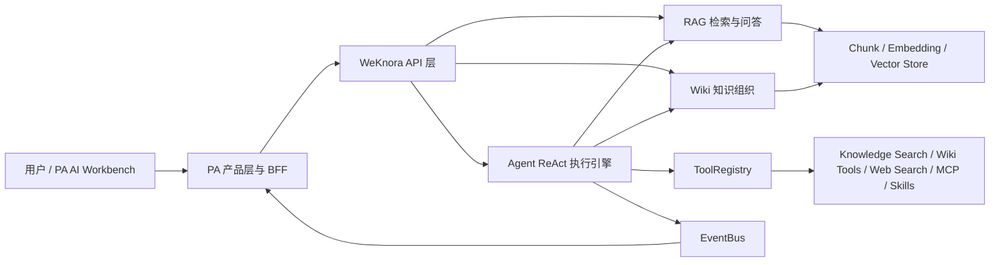
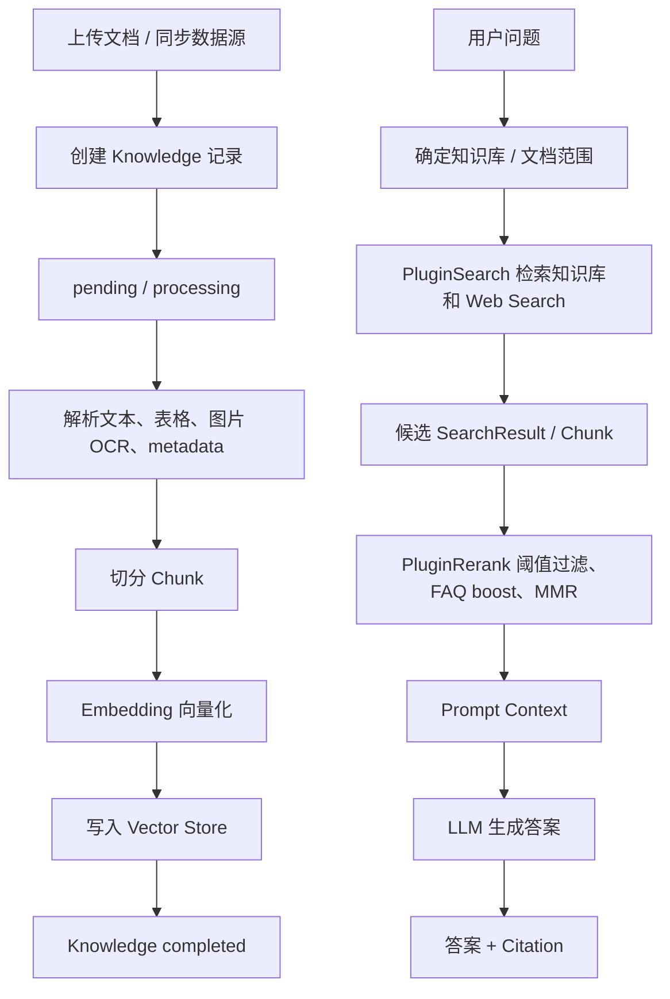
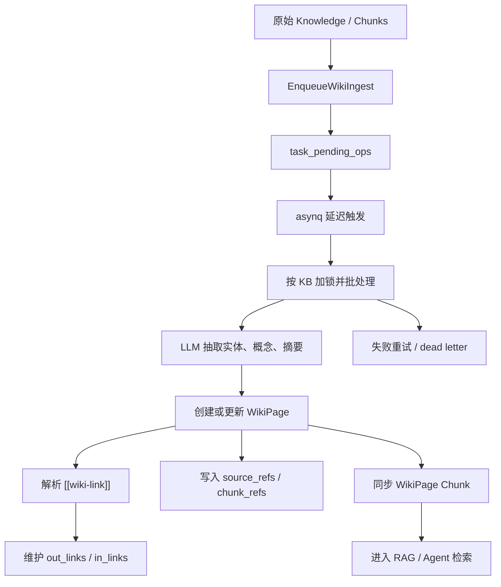
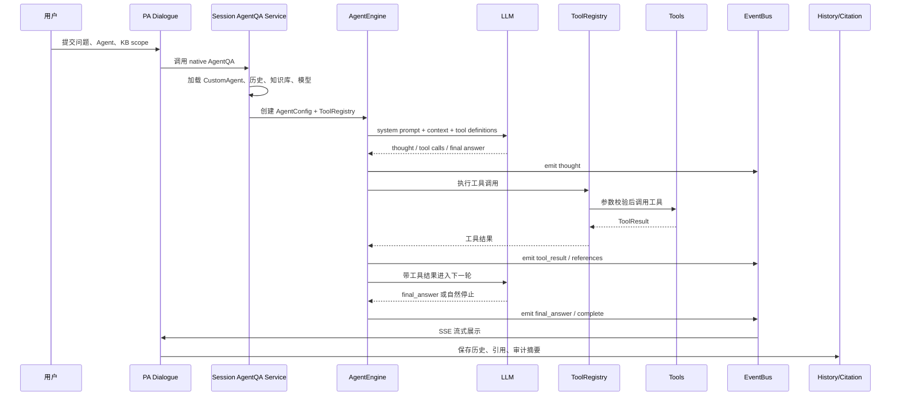
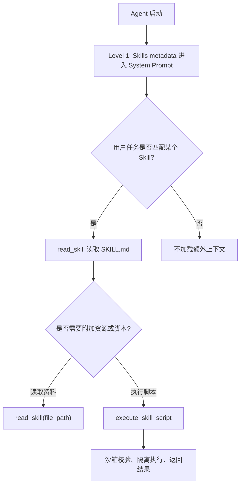
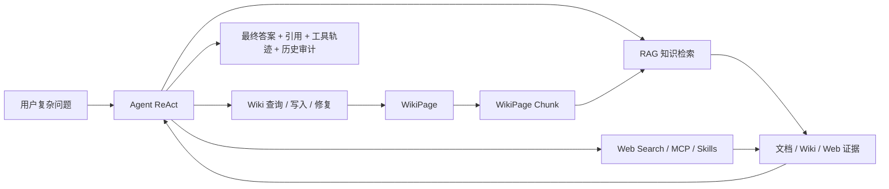

# WeKnora RAG、Wiki 与 Agent 技术说明文档

> 适用场景：AI 产品实习生做简历项目复盘、面试准备、项目答辩和技术沟通。
>
> 写作口径：我不是从零开发 WeKnora 上游内核，而是基于 WeKnora 原生 RAG、Wiki、Agent 能力做系统拆解、产品化接入、验证和封装。PA AI Workbench 是独立产品，不是 WeKnora 的子产品。

## 0. 阅读边界与项目口径

这份文档的目标不是复述 WeKnora 的官方 README，也不是把 Go 源码逐行翻译成中文。它要解决的是一个更贴近面试和项目复盘的问题：如果我只有一点 Python 基础，但参与了一个基于 WeKnora 原生能力的 AI 产品项目，我应该怎样讲清楚底层的 RAG、Wiki 和 Agent 架构，以及我在 PA AI Workbench 中做了什么产品化接入。

最重要的边界有三个。

第一，WeKnora 是上游知识工程与智能对话平台。它原生提供知识库、文档入库、检索、重排、Wiki、AgentQA、自定义 Agent、MCP、Web Search、Skills 等能力。我在项目表达中不能说这些上游内核都是我从零写出来的。

第二，PA AI Workbench 是独立产品。它复用 WeKnora 原生能力，通过 Python 后端、产品 API、前端工作台、历史、引用、审计、验收脚本，把底层能力包装成可操作、可验证、可复盘的产品工作流。它不是 WeKnora 的一个子页面，也不是简单套壳。

第三，WNFC 和 WNID 的范围不能混淆。WNFC 已经完成非 Web Search 范围的本地生产力工具闭环，最终状态是 `14.00/14 = 100.0%`、`final_ready=true`，并且明确排除了 Web Search，也把部分 MCP 工具执行能力延后。WNID 是后续单独打开的智能对话阶段，重新把 Web Search 和 MCP execution 纳入硬验收门槛，最终 17 个任务完成，`final_ready=true`。

可以用一句话概括我的真实项目贡献：

> 我基于 WeKnora 的原生 RAG、Wiki、Agent 能力做了系统拆解和产品化接入，把底层能力包装成 PA AI Workbench 中可操作、可验证、有引用、有审计、有历史记录的工作流；同时围绕 Agent 策略、工具轨迹、Web Search、MCP、Wiki Mode 和 Suggested Questions 做了智能对话能力的产品化验证。

## 1. 总体系统地图：WeKnora 不只是 ChatPDF

很多人第一次接触知识库问答，会把它理解成“上传 PDF，然后让大模型回答”。这个理解只覆盖了最表层。WeKnora 更像一套知识工程与智能对话平台：它不仅把文档变成可检索的证据，还能把碎片知识整理成 Wiki 页面，并让 Agent 通过 ReAct 循环调用知识搜索、Wiki、Web Search、MCP 和 Skills。

从源码和文档看，WeKnora 至少可以拆成五层：

| 层级 | 作用 | 典型对象或文件 |
| --- | --- | --- |
| 知识入库层 | 接收文件、URL、手工内容、数据源，把原始资料变成 Knowledge 和 Chunk | `internal/types/knowledge.go`、`internal/types/chunk.go` |
| RAG 检索增强层 | 对用户问题做知识库检索、Web Search、rerank、上下文组装和引用返回 | `chat_pipeline/search.go`、`chat_pipeline/rerank.go`、`retrieval_config.go` |
| Wiki 知识组织层 | 把资料沉淀为可浏览、可链接、可维护的 Markdown Wiki 页面 | `wiki_page.go`、`wiki_ingest.go`、`wiki_page.go` handler |
| Agent 执行层 | 基于 ReAct 做多轮推理、工具选择、工具调用、观察结果和最终回答 | `internal/agent/engine.go`、`act.go`、`observe.go`、`finalize.go` |
| 工具生态层 | 提供知识搜索、Wiki、Web Search、MCP、Skills、数据分析等工具 | `tools/registry.go`、`tools/definitions.go`、`docs/agent-skills.md` |

这里有几个初学者必须先理解的术语。

| 术语 | 初学者理解 | 在 WeKnora 中的专业含义 |
| --- | --- | --- |
| Knowledge Base | 一个知识空间 | 一组可检索、可管理的知识集合，通常对应一个业务主题或资料库 |
| Knowledge | 一份资料 | 上传或同步进来的文档、URL、FAQ、手工内容或数据源内容，带解析状态 |
| Chunk | 可检索片段 | 从 Knowledge 中切出来的文本单元，是向量检索和引用定位的重要对象 |
| Embedding | 文本变数字 | 把文本转成向量，让系统可以按语义相似度检索 |
| Vector Store | 向量数据库 | 存储 chunk 向量并支持相似度搜索的基础设施 |
| Retriever | 找证据的人 | 根据问题从知识库中找候选 chunk 或 Wiki 页面 |
| Rerank | 复排裁判 | 对初步召回的候选证据重新排序，挑出更相关、更少重复的内容 |
| Citation | 引用证据 | 最终答案背后的可追溯来源，不只是答案文本 |
| WikiPage | 知识页面 | 由资料整理出的长期知识资产，带 slug、链接、引用、版本 |
| Agent | 任务执行系统 | 可以推理、选择工具、调用工具、观察结果并继续决策的系统 |
| Tool | Agent 的外部能力 | 例如知识搜索、Wiki 读写、Web Search、MCP 工具、Skill 读取 |
| Skill | 按需加载的专业说明 | 让 Agent 在需要时读取专业能力说明或脚本，减少上下文负担 |

如果用面试语言说，WeKnora 和普通 ChatPDF 的区别在于：ChatPDF 往往只强调“文档问答”，而 WeKnora 的能力链路更完整，包括入库、检索、重排、引用、Wiki 组织、Agent 工具调用、MCP/Web Search 扩展和可观测性。PA AI Workbench 的价值则是在这些底层能力之上做产品接入，把底层接口变成用户可以操作、可以审计、可以回放、可以验证的工作流。

## 2. RAG 模块：从原始资料到带引用回答

### 2.1 RAG 的基本目的

RAG 是 Retrieval-Augmented Generation，中文通常叫“检索增强生成”。它解决的问题很朴素：大模型本身不一定知道用户的私有资料，也不一定知道企业内部最新文件。如果直接让模型回答，它可能凭通用知识猜测，产生幻觉。RAG 的做法是先检索证据，再把证据和问题一起交给模型回答。

可以把 RAG 理解成两条链路。

第一条是离线或准离线的入库链路：把文档解析成文本，切成 chunk，计算 embedding，写入向量索引。第二条是在线问答链路：用户提出问题后，系统检索候选 chunk，rerank，组装 prompt context，再让 LLM 生成答案和引用。

### 2.2 关键对象：Knowledge、Chunk、RetrievalConfig

`Knowledge` 是一份资料的生命周期记录。它有 `ParseStatusPending`、`ParseStatusProcessing`、`ParseStatusFinalizing`、`ParseStatusCompleted`、`ParseStatusFailed`、`ParseStatusDeleting`、`ParseStatusCancelled` 等状态。对产品来说，这些状态很重要，因为用户上传文件后，需要知道它是在等待解析、正在处理、已经可检索、最终完成，还是失败了。

`Chunk` 是 RAG 检索的最小证据单元之一。WeKnora 的 `ChunkType` 不只是普通文本，还包括 `text`、`parent_text`、`image_ocr`、`image_caption`、`summary`、`entity`、`relationship`、`faq`、`web_search`、`table_summary`、`table_column`、`wiki_page` 等类型。这说明 WeKnora 的检索证据来源很丰富：普通文档、图片 OCR、FAQ、网页搜索、表格摘要和 Wiki 页面都可以进入检索体系。

`RetrievalConfig` 是检索策略配置。它包含 `embedding_top_k`、`vector_threshold`、`keyword_threshold`、`rerank_top_k`、`rerank_threshold`、`rerank_model_id`，以及 RRF 的权重配置。对初学者来说，可以这样理解：

| 配置 | 含义 | 影响 |
| --- | --- | --- |
| `EmbeddingTopK` | 初步召回多少个候选 chunk | 越大召回越全，但上下文压力越大 |
| `VectorThreshold` | 向量相似度最低门槛 | 太高可能漏召回，太低可能噪音多 |
| `KeywordThreshold` | 关键词匹配最低门槛 | 对专有名词、编号、制度条款很有用 |
| `RerankTopK` | 重排后保留多少结果 | 控制最终进入上下文的证据数量 |
| `RerankThreshold` | rerank 模型分数门槛 | 控制证据质量 |
| `RRF` 权重 | 融合向量检索和关键词检索 | 兼顾语义相似和字面命中 |

### 2.3 PluginSearch：知识库检索和 Web Search 的入口

WeKnora 的聊天管线采用插件事件机制。`chat_pipeline.go` 中的 `EventManager` 会把某个事件分发给对应插件，例如 `CHUNK_SEARCH` 触发 `PluginSearch`，`CHUNK_RERANK` 触发 `PluginRerank`。这种设计的好处是每个阶段职责清楚：检索插件只负责找候选证据，重排插件只负责排序和过滤，后续模块再负责组装上下文和生成答案。

`PluginSearch` 的核心逻辑可以概括为：

1. 判断是否有知识库目标，或者是否启用了 Web Search。
2. 并发执行知识库检索和 Web Search。
3. 对知识库检索，按实际 embedding 模型进行分组，减少重复 embedding 调用。
4. 对完整知识库目标，合并多个 KB 做 HybridSearch；对指定 Knowledge 目标，必要时直接加载 chunk。
5. 对结果做显式知识范围过滤，避免超出用户选择范围。
6. 如果召回不足，并且开启 query expansion，就进行扩展检索。
7. 最后把结果放入 `chatManage.SearchResult`，交给下一阶段。

这说明 WeKnora 的 RAG 检索不是简单调用一次向量库。它同时考虑了知识库范围、指定文档范围、embedding 模型复用、向量和关键词混合检索、Web Search、query expansion 和结果范围过滤。

### 2.4 PluginRerank：为什么 embedding 后还要重排

Embedding 检索擅长快速召回，但初步召回不一定就是最适合回答的证据。例如用户问“这个项目中 Web Search 为什么不属于 WNFC”，向量检索可能找出很多包含 Web Search 的段落，但不一定把“WNFC 排除 Web Search，WNID 重新纳入”的证据排在最前面。

`PluginRerank` 的工作是对候选证据做第二次排序。源码中可以看到几个质量控制点：

| 机制 | 作用 |
| --- | --- |
| 跳过 DirectLoad | 对直接加载的指定文档 chunk 不再走 rerank，默认高相关 |
| 清洗 passage | 去掉不利于语义排序的 Markdown 噪音、结构噪音 |
| 阈值过滤 | 只保留超过 `RerankThreshold` 的结果 |
| 阈值降级 | 如果阈值过高导致无结果，会尝试降低阈值重排 |
| top1 fallback | 如果全部低于阈值但最高分仍有基本相关性，保留最强候选 |
| FAQ boost | FAQ 类型 chunk 可以按配置加权，提高问答条目的优先级 |
| MMR | 在相关性和去重之间平衡，避免多个结果说同一件事 |
| API 失败回退 | rerank 模型失败时回退到原始检索结果，避免整条链路不可用 |

面试中可以这样解释：

> Embedding 检索解决“先找一批可能相关的内容”，rerank 解决“从这批内容里挑最适合进入上下文的证据”。我理解的关键不是多调一个模型，而是控制召回质量、上下文预算和引用可信度。WeKnora 的 rerank 还做了阈值降级、FAQ boost、MMR 去重和失败回退，所以它是产品可用性的质量控制层。

### 2.5 RAG 的产品化重点：答案之外还要有证据

RAG 不能只看“回答像不像对”。在产品里，更重要的是回答能否追溯到证据。PA AI Workbench 在接入 WeKnora RAG 时，把 native search 结果转换成统一的 `Evidence` 和 `Citation`。`weknora_api_backend.py` 中会根据来源类型生成不同的 `evidence_id`，例如：

| 来源类型 | Evidence ID 形态 | 产品意义 |
| --- | --- | --- |
| `document_chunk` | `document_chunk:<chunk_id>` | 可以定位到 Library 的文档 chunk |
| `wiki_page` | `wiki_page:<wiki_page_id>` | 可以定位到 Wiki 页面 |
| `web_search` | `web_search:<url_hash>` | 可以保留外部网页来源 |

这就是 PA 的产品价值之一：底层 native 结果不只是返回文本，PA 会把它变成可过滤、可展示、可保存、可回放的引用系统。History 页面还可以按 `document_chunk`、`wiki_page`、`web_search`、`citation_blocked` 等状态筛选，帮助用户区分真实证据、引用阻断和无证据输出。

## 3. Wiki 模块：把碎片知识沉淀成可维护资产

### 3.1 Wiki 与 RAG 的区别

RAG 更偏向“回答前临时找证据”。用户问一个问题，系统检索 chunk，组装上下文，生成答案。Wiki 更偏向“长期组织知识”。它不是临时搜索结果，而是把原始资料整理成有标题、有 slug、有摘要、有链接、有引用、有版本的知识页面。

可以用一个例子理解：如果上传很多项目复盘文档，RAG 可以回答“WNID 为什么要重新纳入 Web Search”。但 Wiki 可以生成一个“WNID 智能对话阶段”页面，里面长期记录阶段目标、任务、证据、关联概念和链接。下次用户不一定要重新问，直接浏览 Wiki 就能理解结构。

### 3.2 WikiPage 的核心字段

`internal/types/wiki_page.go` 中的 `WikiPage` 是 Wiki 的核心对象。

| 字段 | 作用 | 产品理解 |
| --- | --- | --- |
| `ID` | 页面唯一标识 | 数据库主键 |
| `KnowledgeBaseID` | 所属知识库 | Wiki 属于某个 KB |
| `Slug` | 稳定地址 | 类似网页路径，如 `concept/rag` |
| `Title` | 页面标题 | 用户可读名称 |
| `PageType` | 页面类型 | `summary`、`entity`、`concept`、`index`、`log`、`synthesis`、`comparison` |
| `Status` | 页面状态 | `draft`、`published`、`archived` |
| `Content` | Markdown 正文 | 页面主体内容 |
| `Summary` | 摘要 | 列表和检索展示 |
| `Aliases` | 别名 | 提高召回和链接识别能力 |
| `SourceRefs` | 来源资料 | 页面由哪些 Knowledge 贡献 |
| `ChunkRefs` | 具体 chunk 引用 | 页面背后的细粒度证据 |
| `InLinks` | 入链 | 哪些页面链接到我 |
| `OutLinks` | 出链 | 我链接到哪些页面 |
| `Version` | 版本 | 只有用户可见内容变化才增加 |

这里最值得注意的是 `SourceRefs`、`ChunkRefs`、`InLinks`、`OutLinks` 和 `Version`。这几个字段说明 Wiki 不只是“LLM 生成一段 Markdown”，而是一个可维护知识系统：它知道来源，知道页面之间的关系，也能区分真实内容编辑和后台链接维护。

### 3.3 Wiki 生命周期

Wiki ingest 不是简单同步任务。源码中可以看到它通过 `task_pending_ops` 保存待处理操作，通过 asynq 延迟触发，支持按 KB 批处理、去重、重试、dead letter 和 Redis/进程锁。对产品而言，这意味着 Wiki 面向大知识库时不能靠前端等一个长请求，而要设计成异步、可恢复、可观测的后台任务。

Wiki 页面维护也有自己的规则：

1. 创建页面时会解析正文中的 `[[wiki-link]]`，生成 `OutLinks`。
2. 更新页面时会判断用户可见字段是否变化，只有标题、正文、摘要、类型、状态变化才 bump version。
3. 删除页面时会清理入链引用，并删除同步的 Wiki chunk。
4. 全局 `RebuildLinks` 会重新解析所有页面，重建双向链接，但作为 metadata-only 更新，不误增版本。
5. `AutoFix`、issue 创建、issue status 更新等能力用于 Wiki 健康维护。

### 3.4 Wiki 如何反哺 RAG 和 Agent

WeKnora 的 `ChunkTypeWikiPage` 很关键。它说明 Wiki 页面可以同步为 chunk，重新进入检索管线。这形成了一个闭环：

| 流程 | 解释 |
| --- | --- |
| 原始文档进入 RAG | 文档被解析、切块、向量化 |
| Wiki ingest 生成页面 | LLM 将碎片资料整理成页面 |
| Wiki 页面同步为 chunk | 页面不只是可浏览，也能被检索 |
| Agent 查询或维护 Wiki | Agent 可以 `wiki_search`、`wiki_read_page`、`wiki_write_page` |
| 新 Wiki 结果再次成为证据 | 后续 Quick Q&A 和 AgentQA 可以引用 Wiki 页面 |

面试中可以这样讲：

> 我把 WeKnora 的 Wiki 看成 RAG 之上的知识组织层。RAG 擅长临时召回证据，但不擅长把碎片长期组织成结构化页面。Wiki 通过 WikiPage、source refs、chunk refs、页面链接和版本管理，把资料沉淀成可浏览、可维护、可再次检索的知识资产。PA 接入后，用户不只是问答，还能浏览和维护知识结构。

## 4. Agent 模块：可配置的 ReAct 执行系统

Agent 是这份文档最重要的部分。因为它最能体现“我理解并产品化接入了这套 Agent 架构”，而不是只会说“调用了一个 Agent 接口”。

### 4.1 Agent 和普通 RAG 的区别

普通 RAG 更像“一问一答”：用户提问，系统检索证据，LLM 回答。Agent 更像“多步任务执行”：用户给出目标，Agent 可以先思考，再选择工具，再观察结果，再决定下一步，直到给出最终答案。

ReAct 是 Reason + Act 的组合。它不是一个具体工具，而是一种执行模式：

1. Reason：模型先理解问题和当前状态。
2. Act：模型决定是否调用工具。
3. Observe：工具返回结果后，模型观察结果。
4. Repeat：如果信息还不够，继续下一轮。
5. Final：调用 `final_answer` 或自然停止，输出最终答案。

WeKnora 的 Agent 不是单一 prompt。它由 `CustomAgentConfig`、运行时 `AgentConfig`、`AgentEngine`、`AgentState`、`ToolRegistry`、`EventBus`、Skills、MCP、Web Search、上下文管理和最终答案合成共同组成。

### 4.2 Agent 核心对象

| 对象 | 它是什么 | 面试时怎么解释 |
| --- | --- | --- |
| `CustomAgent` | 数据库中的可配置 Agent | 用户在产品里看到和编辑的 Agent |
| `CustomAgentConfig` | 产品配置 | prompt、工具范围、KB 范围、Web Search、MCP、Skills、retrieval 参数 |
| `AgentConfig` | 运行时配置 | 每次 AgentQA 真正传给执行引擎的配置 |
| `AgentEngine` | ReAct 执行引擎 | 负责循环调用 LLM、分析响应、执行工具、观察结果、结束回答 |
| `AgentState` | 执行状态 | 保存 steps、tool calls、references、final answer |
| `ToolRegistry` | 工具注册中心 | 统一注册、排序、校验、执行、截断和清理工具 |
| `EventBus` | 事件总线 | 把 thought、tool_call、tool_result、references、final_answer、approval 推给上层 |
| `AgentStreamHandler` | SSE 事件桥 | 把 EventBus 事件转成前端可见流式消息，并写回 assistant message |

### 4.3 CustomAgentConfig 和 AgentConfig 的区别

`CustomAgentConfig` 更偏产品配置，字段非常多，包括：

| 配置组 | 代表字段 |
| --- | --- |
| 基本设置 | `agent_mode`、`agent_type`、`system_prompt`、`context_template` |
| 模型设置 | `model_id`、`rerank_model_id`、`temperature`、`thinking` |
| Agent 设置 | `max_iterations`、`allowed_tools`、`llm_call_timeout` |
| MCP 设置 | `mcp_selection_mode`、`mcp_services` |
| Skills 设置 | `skills_selection_mode`、`selected_skills` |
| KB 设置 | `kb_selection_mode`、`knowledge_bases`、`retrieve_kb_only_when_mentioned` |
| Web Search | `web_search_enabled`、`web_search_provider_id`、`web_fetch_enabled` |
| 多轮对话 | `multi_turn_enabled`、`history_turns` |
| 检索策略 | `embedding_top_k`、`keyword_threshold`、`vector_threshold`、`rerank_top_k`、`rerank_threshold` |
| 推荐问题 | `suggested_prompts` |

`AgentConfig` 是运行时配置。`session_agent_qa.go` 中的 `buildAgentConfig` 会根据 CustomAgent、tenant、session、知识库范围、Web Search 请求开关、Skills 配置等生成 `AgentConfig`。这里有一个非常重要的工程点：`AgentEngine` 自身跨轮无状态。源码注释明确说明，历史由调用方从数据库加载后作为 `llmContext` 注入。也就是说，多轮记忆不是藏在引擎里的全局缓存，而是服务层每轮重建上下文，这样更容易审计和复现。

### 4.4 AgentEngine 的 ReAct 主循环

`AgentEngine.Execute` 的执行过程可以拆成几个阶段：

1. 初始化 `AgentState`。
2. 构建 system prompt。如果启用了 Skills，会把 Skills metadata 作为 Progressive Disclosure 的第一层放入 prompt。
3. 根据历史、用户问题和图片等输入构建 messages。
4. 从 `ToolRegistry` 获取工具 definitions，提供给 LLM function calling。
5. 进入 `executeLoop`，最多运行 `MaxIterations` 轮。
6. 每轮通过 `runReActIteration` 执行 think、analyze、act、observe。
7. 如果出现 `final_answer`、自然停止、内容过滤、用户取消或最大迭代次数，就进入 finalize 或回退处理。

这套循环非常适合面试讲架构能力，因为它体现了 Agent 工程化的几个核心问题：工具如何暴露给模型，工具参数如何校验，工具结果如何写回上下文，引用如何抽取，流式事件如何给前端，最大轮次和上下文窗口如何控制。

### 4.5 Stop condition、fallback 与上下文管理

Agent 不能无限运行，所以需要停止条件。WeKnora 的 AgentEngine 至少处理这些情况：

| 停止或降级场景 | 处理方式 |
| --- | --- |
| LLM 自然 `stop` 且无工具调用 | 认为回答完成，发送 final answer |
| 模型调用 `final_answer` 工具 | 明确终止 ReAct 循环 |
| 内容过滤 | 返回安全策略提示，避免无限循环 |
| 用户取消或 context cancel | 保留已有 step，必要时尝试基于工具结果合成答案 |
| 达到最大迭代次数 | `handleMaxIterations` 根据已有工具结果合成最终答案 |
| 空回答 | 重试要求模型调用 `final_answer`，失败后给 fallback |
| 上下文过长 | 通过 token estimator 和 memory consolidator 压缩上下文 |

这体现了一个重要产品原则：Agent 不只是“能跑”，还要“失败时可控”。工具失败、模型空回答、上下文超限、用户中断都不能让产品陷入黑盒状态。

### 4.6 ToolRegistry：工具系统为什么不能硬编码

`ToolRegistry` 统一管理工具注册和执行。它有几个关键职责：

1. 工具注册采用 first-wins，拒绝重复名称覆盖，防止工具名劫持。
2. `ListTools` 和 `GetFunctionDefinitions` 按工具名排序，保证给 LLM 的工具定义稳定，有利于 prompt caching。
3. 执行前会根据 JSON Schema 做参数类型转换和参数校验。
4. 工具输出过长会截断，避免污染上下文窗口。
5. 会调用工具的 `Cleanup`，释放工具资源。

工具分类可以这样理解：

| 工具类型 | 例子 | 作用 |
| --- | --- | --- |
| 思考规划 | `thinking`、`todo_write` | 帮助 Agent 组织步骤 |
| 知识检索 | `knowledge_search`、`grep_chunks`、`list_knowledge_chunks` | 从知识库找证据 |
| Wiki 工具 | `wiki_search`、`wiki_read_page`、`wiki_write_page`、`wiki_replace_text` | 查询、创建、维护 Wiki 页面 |
| 数据分析 | `data_schema`、`data_analysis`、`database_query` | 分析 CSV/Excel 或结构化数据 |
| Web 工具 | `web_search`、`web_fetch` | 获取外部网络信息 |
| MCP 工具 | MCP tools/resources/prompts | 调用外部服务能力 |
| Skills 工具 | `read_skill`、`execute_skill_script` | 按需读取专业说明或执行技能脚本 |
| 终止工具 | `final_answer` | 明确告诉引擎最终答案完成 |

为什么不把所有工具写死在 AgentEngine 里？因为 AgentEngine 应该负责执行循环，而不是负责每一种外部能力的细节。ToolRegistry 把工具注册、工具定义、参数校验、执行、截断和清理独立出来，使 Agent 可以扩展，同时保持安全边界。

### 4.7 EventBus：让 Agent 从黑盒变成可观察工作流

Agent 如果只返回最终答案，用户很难信任它。WeKnora 使用 `EventBus` 把 Agent 运行过程拆成多个事件：

| 事件 | 含义 | PA 中的产品价值 |
| --- | --- | --- |
| `thought` | 思考或推理摘要 | 让用户知道 Agent 在处理问题 |
| `tool_call` | 即将调用工具 | 展示工具轨迹 |
| `tool_result` | 工具返回结果 | 调试工具是否成功 |
| `references` | 引用证据 | 建立答案可信度 |
| `final_answer` | 最终答案流 | 前端实时展示 |
| `agent.complete` | 执行完成 | 保存 steps、duration、references |
| `tool_approval_required` | 工具需要审批 | MCP 等高风险工具的人机确认 |
| `tool_approval_resolved` | 审批完成 | 审计执行结果 |

PA 的 `DialoguePage` 把这些事件产品化为 Tool Trace、Run Contract、Citations、History 和 Audit。面试时可以这样说：

> 我不把 Agent 只看成一个回答接口，而是把它看成一个可观察执行系统。EventBus 把 thought、tool_call、tool_result、references、final_answer、approval 等事件流式暴露出来，PA 再把它们做成工具轨迹、引用、历史和审计。这样用户可以知道 Agent 调了什么工具、用了什么证据、哪里失败或被阻断。

### 4.8 Skills 与 Progressive Disclosure

Skills 是 WeKnora Agent 的重要扩展机制。它的设计理念是 Progressive Disclosure，中文可以叫“渐进式披露”：不是一开始把所有专业说明都塞进 prompt，而是先给 Agent 能力索引，需要时再读取详细说明，需要执行时再运行脚本。

Skills 和 Tools 的区别可以这样说：

| 对比项 | Tool | Skill |
| --- | --- | --- |
| 本质 | Agent 可调用的动作接口 | Agent 按需读取的能力说明、流程或脚本包 |
| 常见形式 | JSON Schema + Execute | `SKILL.md` + references + scripts |
| 作用 | 做一件事，如搜索、读 Wiki、执行 MCP | 教 Agent 如何做一类专业任务 |
| 上下文策略 | 工具定义会暴露给模型 | 先暴露 metadata，需要时再读取详情 |
| 安全点 | 参数校验、输出截断、审批 | 沙箱执行、危险命令检测、白名单 |

PA 在 WNFC 阶段接入了 skill 管理相关能力，在 WNID 阶段可以把 Skills 作为智能对话能力的一部分，通过工具事件、历史和审计展示出来。面试里不必夸大说自己实现了完整 Skills 内核，可以说自己理解了它的渐进式披露机制，并在产品层将其纳入 Agent 能力和可验证工作流。

### 4.9 MCP：让 Agent 调用外部服务，但必须审批和审计

MCP 可以理解成 Agent 连接外部工具和上下文的一层协议。WeKnora 的 MCP 能力包括 service 管理、tools/resources/prompts 列表读取、prompt read、tool approval、tool execution 等。源码中可以看到路由包括：

| 能力 | 典型路由 |
| --- | --- |
| MCP 服务 CRUD | `/api/v1/mcp-services` |
| 工具读取 | `/api/v1/mcp-services/:id/tools` |
| 资源读取 | `/api/v1/mcp-services/:id/resources` |
| Prompt 读取 | `/api/v1/mcp-services/:id/prompts`、`/prompts/:prompt_name/read` |
| 工具执行 | `/api/v1/mcp-services/:id/tools/:tool_name/execute` |
| 审批策略 | `/tool-approvals/:tool_name` |
| 审批决策 | `/api/v1/agent/tool-approvals/:pending_id` |

WNFC 阶段没有把 MCP tools/resources/prompts 和 approval-gated execution 纳入完成范围，避免用不完整或不安全的能力假装 PASS。WNID 阶段重新把 MCP execution 设为硬门槛：不只是“能看到 MCP 服务”，而是要证明安全服务能列工具、列资源、读 prompt，并且至少一次审批式工具执行或拒绝有审计和历史记录。

面试中可以这样解释：

> MCP 对 Agent 很有价值，因为它把外部服务能力接入工具系统。但 MCP 也有风险，因为工具可能访问外部系统或执行动作。所以我在 PA 的产品化接入中关注的不只是 catalog visibility，而是确认令牌、审批策略、执行结果、超时错误、NativeMutationAudit 和历史可见性。这样 MCP 才是产品能力，不是静态配置展示。

### 4.10 Web Search：为什么属于 WNID，而不是 WNFC

Web Search 让 Agent 可以查外部网络信息。WeKnora 支持 DuckDuckGo、Bing、Google、Tavily、Baidu、Ollama、SearXNG 等 provider。源码中 `web_search_provider.go` 把 provider 类型、参数、凭据和测试分开处理，DuckDuckGo 不需要 API key，Bing/Google/Tavily 等需要凭据。

在 PA 接入里有一个很关键的边界：普通 agent mutation payload 会把 `web_search_enabled` 置为 `false`，这是为了不把 Web Search 混进 WNFC 的已完成范围；而 WNID 的 strategy update 专门允许编辑 `web_search_enabled`、`web_search_provider_id`、`web_fetch_enabled`、`web_fetch_top_n` 等字段。这说明 WNFC 和 WNID 是两个不同治理阶段。

WNID 对 Web Search 的验收不是“provider 配置存在”，而是：

1. Web Search provider 可以安全创建、更新、测试，并且敏感信息被遮蔽。
2. AgentQA 运行时 `web_search_enabled=true`。
3. 工具轨迹里能看到 `web_search`。
4. native 结果能提取 URL、title、snippet、rank 或等价字段。
5. PA 保存为 `web_search` citation，并在 History 和 Dialogue 中可见。

## 5. RAG、Wiki、Agent 如何协同

RAG、Wiki、Agent 不是三块互相独立的功能，而是一个知识工作闭环。

可以从三个方向理解协同关系。

第一，RAG 给 Agent 提供证据。Agent 可以调用 `knowledge_search`、`grep_chunks`、`list_knowledge_chunks` 等工具，把知识库里的 chunk 变成工具结果和引用。普通 Quick Q&A 是一次检索问答，AgentQA 则可以多轮调用检索工具。

第二，Wiki 给 Agent 提供结构化知识资产。Agent 可以 `wiki_search` 找页面，可以 `wiki_read_page` 阅读页面，也可以在有确认和权限的情况下 `wiki_write_page` 或维护页面。Wiki 页面反过来同步成 chunk，进入 RAG 检索。

第三，Agent 给 RAG/Wiki 提供任务编排能力。复杂问题可能需要先查 Wiki 建立背景，再查 chunk 找精确引用，再 Web Search 补外部事实，最后调用 final_answer 汇总。普通 RAG 不负责这种多步决策，Agent 更适合做跨工具推理。

| 用户需求 | 更适合的能力 | 原因 |
| --- | --- | --- |
| “这份文档里某条制度是什么？” | Quick Q&A / RAG | 问题明确，证据集中 |
| “帮我解释这个项目的技术架构并找证据” | AgentQA + RAG | 需要多步检索和综合 |
| “把这些资料整理成一个可维护知识页” | Wiki Mode | 需要沉淀页面和链接 |
| “比较两个阶段的范围差异” | AgentQA + Wiki + RAG | 需要查多处资料并综合 |
| “查当前外部信息并结合知识库回答” | AgentQA + Web Search + RAG | 需要外部网络证据 |
| “调用外部安全工具读取状态” | AgentQA + MCP | 需要外部服务工具能力 |

面试中可以这样讲：

> 我把 RAG、Wiki、Agent 看成一个闭环：RAG 负责把资料变成可检索证据，Wiki 负责把碎片资料沉淀成可维护知识资产，Agent 负责在复杂任务里编排 RAG、Wiki、Web Search、MCP 和 Skills。PA AI Workbench 则把这些能力组织成 Quick Q&A、Wiki Mode、AgentQA、Tool Trace、Citations、History 和 Audit。

## 6. PA AI Workbench 如何对接 WeKnora 原生能力

### 6.1 PA 的定位

PA AI Workbench 是独立产品。它不是 WeKnora 的子产品，也不是简单复制 WeKnora UI。它的定位是把 WeKnora 原生能力产品化成一个本地 AI 工作台，让用户能管理知识库、执行 RAG、浏览 Wiki、运行 Agent、查看引用、追踪历史、审计外部执行，并通过验收脚本证明真实能力。

PA 不重写 WeKnora 的 RAG/Wiki/Agent 内核。它采用的是“PA-first + controlled native exception lane”的工程原则：

| 决策路径 | 什么时候用 | 结果 |
| --- | --- | --- |
| PA-first | WeKnora 已有 route、field、event、reference、config 或 execution path | PA 做 adapter、BFF、history、citation、audit、UI |
| native exception | WeKnora 缺少必要事件、引用形态、安全 API 或执行路径 | 做最小 native Go 改动，并用测试和 PA live evidence 证明 |
| blocked | 缺的是外部 API key、账号、OAuth、权限、工作区、审批 | 不 mock，不伪造 PASS，明确向用户要输入 |

### 6.2 Adapter：WeKnoraApiBackend

`pa-ai-workbench/knowledge_engine/backends/weknora_api_backend.py` 是 PA 对 WeKnora 的核心 adapter。它负责把 PA 侧的产品调用转换成 WeKnora native API，同时把 native 返回结果归一化成 PA 的 Evidence、WikiPage、Agent、MCP、Web Search 等对象。

| PA 需要的能力 | Adapter 行为 |
| --- | --- |
| RAG retrieve | 调 `/api/v1/knowledge-search`，把结果转成 `Evidence` |
| Wiki | 调 `/knowledgebase/:kb_id/wiki/...`，归一化页面、索引、issue、auto-fix |
| Agent | 调 `/api/v1/agents`、`/agent-qa`、suggested questions |
| MCP | 调 `/api/v1/mcp-services`、tools/resources/prompts/execution |
| Web Search | 调 `/api/v1/web-search-providers`、provider test |
| Citation | 生成 `document_chunk`、`wiki_page`、`web_search` 三类证据 ID |
| 安全 | 对敏感文本、URL、token、payload 做截断或遮蔽 |

这就是为什么 PA 不是“套壳”：如果只是套壳，可能只把 native answer 显示出来；PA 的 adapter 还做范围解析、证据归一化、引用定位、安全摘要和错误语义转换。

### 6.3 NativeAgentService：把 Agent 变成产品工作流

`native_agent_service.py` 是 PA Agent 产品化的关键服务层。它做了几件事：

1. 读取 native agent catalog、type presets、placeholders 和 suggested questions。
2. 对自定义 Agent 创建、更新、复制、删除加确认令牌和 `NativeMutationAudit`。
3. 对 strategy update 做字段白名单和范围限制，如 prompt、tools、MCP、Web Search、多轮、retrieval threshold。
4. 运行 native AgentQA，并保存 conversation、message、task、output、citations、runtime metadata。
5. 对 Wiki mutation tools 要求额外确认，避免 Agent 未经确认修改 Wiki。
6. 对 Web Search 和 Wiki 引用做数量统计，若没有 traceable reference 就写入明确 warning。

特别重要的是引用阻断逻辑。`_result_warnings` 会在没有 evidence 时记录 `CITATION_BLOCKED`；如果启用 Web Search 但没有 web reference，会记录 `WEB_SEARCH_REFERENCE_BLOCKED`；如果 Wiki mutation Agent 没有 Wiki reference，会记录 `WIKI_REFERENCE_BLOCKED`。这体现了 PA 的验收口径：答案文本不是证据，必须有可追溯引用。

### 6.4 前端产品化：Dialogue、Library、History

PA 前端把底层能力组织成用户能理解的工作区。

| 页面 | 对接能力 | 用户价值 |
| --- | --- | --- |
| Library | KB、文档、chunk、上传、状态、Wiki 入口 | 管理知识来源和入库状态 |
| Dialogue | AgentQA、Quick Q&A、Strategy、Tool Trace、MCP、Web Search、Citations | 运行智能对话并观察工具和证据 |
| History | 输出、引用、WNID capability、evidence state、audit filters | 复盘历史结果和证据状态 |
| Wiki | Wiki 页面、图谱、issue、维护操作 | 浏览和维护结构化知识 |
| Capability Center | native status、模型、MCP、Web Search、vector、parser 等 | 诊断系统能力和配置 |

`DialoguePage.tsx` 尤其能体现 WNID 的产品化：它提供 AgentQA/Quick Q&A 模式切换、Suggested Questions、Strategy Editor、Tool Trace、MCP Read Path、MCP Execution、MCP Prompt Parity、Web Search Provider、Citations 等面板。这不是一个单纯聊天框，而是智能对话工作台。

`HistoryPage.tsx` 则把结果复盘做成筛选体系：可以按 WNID 能力筛选 Quick Q&A、ReACT AgentQA、Wiki Mode、MCP Tools、Web Search、策略变更；也可以按证据类型筛选文档分块、Wiki 页面、Web Search；还可以看到 citation blocked、mcp audited、web traceable 等状态。

### 6.5 技术栈视角

| 层 | 技术/对象 | 在项目中的作用 |
| --- | --- | --- |
| WeKnora 后端 | Go、Gin 路由、GORM 类型、service/handler 分层 | 原生 RAG、Wiki、Agent、MCP、Web Search 能力 |
| RAG 检索 | HybridSearch、Embedding、Vector Store、Rerank、MMR | 召回和筛选证据 |
| 异步任务 | asynq、Redis/锁、task_pending_ops、dead letter | 支撑 Wiki ingest、重试和恢复 |
| Agent | AgentEngine、ToolRegistry、EventBus、function calling | 多步推理和工具调用 |
| 外部能力 | MCP、Web Search providers、Skills sandbox | 扩展 Agent 能力边界 |
| PA 后端 | Python、SQLModel、adapter/service/history/audit | 将 native 能力变成产品 API 和持久化记录 |
| PA 前端 | React/TypeScript 页面 | 将能力呈现为工作台、轨迹、引用和筛选 |
| 验收体系 | WNFC/WNID specs、checker scripts、browser matrix | 证明能力不是 demo 或 mock |

## 7. WNFC 与 WNID：阶段边界怎么讲清楚

面试官可能会问：“你们到底完成了什么？Web Search 和 MCP 到底算不算完成？”这时一定要按阶段回答。

| 阶段 | 范围 | 最终状态 | 不能混淆的点 |
| --- | --- | --- | --- |
| WNFC | 非 Web Search 的 WeKnora native 本地生产力工具闭环 | `14.00/14 = 100.0%`，`final_ready=true` | Web Search 明确 excluded；部分 MCP execution 当时不计入 |
| WNID | README Intelligent Conversation 通过 PA 的完整智能对话能力 | 17 个任务完成，`final_ready=true` | Web Search 和 MCP execution 重新纳入硬门槛 |

更自然的面试说法是：

> 我们先在 WNFC 阶段把非 Web Search 范围的本地知识工作台做到 100%，包括知识库、文档、RAG、Wiki、AgentQA、自定义 Agent、模型配置、vector、FAQ、skills、历史引用和审计等。这个阶段明确排除了 Web Search。之后我们开启 WNID 作为新的智能对话阶段，把 WeKnora README 里的 Intelligent Conversation 能力重新拉齐，包括 ReACT AgentQA、Quick Q&A、Wiki Mode、Tool Calling、Conversation Strategy、Suggested Questions，并把 Web Search 和 MCP execution 作为硬验收门槛。

这个回答的好处是既不贬低 WNFC，也不把 WNID 的成果偷塞回 WNFC。

## 8. 面试讲法：我在项目中的技术表达方式

如果我是 AI 产品实习生，面试里最重要的不是把每个 Go 函数背出来，而是说清楚“我如何理解系统、如何产品化接入、如何验证边界”。

### 8.1 可以这样介绍项目

> PA AI Workbench 是我做的一个独立 AI 工作台产品，它基于 WeKnora 原生知识库能力构建。我的工作不是从零重写 WeKnora 的 RAG、Wiki、Agent 内核，而是先系统拆解 WeKnora 的底层能力，再把它们接入 PA 的产品层。我重点理解和接入了三条链路：RAG 的文档入库、chunk、embedding、hybrid retrieval、rerank 和 citation；Wiki 的页面生成、链接维护、引用、版本和回流检索；Agent 的 ReAct 执行、AgentEngine、CustomAgentConfig、ToolRegistry、EventBus、Skills、MCP 和 Web Search。最后我通过历史、引用、审计、状态可视化和验收脚本，把这些能力变成可验证的产品工作流。

### 8.2 可以这样讲 RAG

> 我把 RAG 拆成入库链路和在线问答链路。入库链路把 Knowledge 解析成 Chunk，计算 embedding，写入 vector store；在线链路根据用户问题确定 KB scope，使用 HybridSearch 找候选结果，再通过 rerank、阈值过滤、FAQ boost、MMR 去重和 fallback 机制选出证据，最后让 LLM 基于 prompt context 生成答案。PA 的重点是把 native search 结果变成可追踪 Citation，保存到历史里，而不是只展示答案文本。

### 8.3 可以这样讲 Wiki

> 我把 Wiki 看成 RAG 之上的知识组织层。RAG 解决临时找证据，Wiki 解决长期沉淀知识结构。WeKnora 的 WikiPage 有 slug、title、summary、source refs、chunk refs、in/out links 和 version，wiki ingest 通过异步任务生成页面并维护链接。Wiki 页面还能同步成 wiki_page chunk 回到 RAG。PA 接入后，用户不仅能问答，还能浏览 Wiki、维护页面、追踪 Wiki citation。

### 8.4 可以这样讲 Agent

> 我把 WeKnora Agent 理解为一个可配置的 ReAct 执行系统。CustomAgentConfig 是产品配置，包含 prompt、工具、KB、MCP、Web Search、Skills、多轮和 retrieval 参数；Session AgentQA 会把它转换成运行时 AgentConfig。AgentEngine 负责 ReAct 循环，每轮调用 LLM、分析是否要调用工具、通过 ToolRegistry 校验和执行工具、把结果写回上下文，再通过 EventBus 把 thought、tool_call、tool_result、references 和 final_answer 推给前端。PA 的重点是把这些底层事件变成 Tool Trace、Citations、History 和 Audit，让 Agent 可观察、可解释、可验证。

## 9. 常见追问与面试追问

| 问题 | 短回答 | 深入回答 |
| --- | --- | --- |
| 你的项目和普通 ChatPDF 有什么区别？ | 普通 ChatPDF 多是上传文档问答，PA 接入的是 WeKnora 的知识工程和智能对话能力。 | 我们不只做文档问答，还接入了 RAG 检索、rerank、Wiki 页面、AgentQA、工具轨迹、MCP、Web Search、引用、历史和审计。用户可以看到证据来源、Wiki 页面、Agent 工具调用过程和验收状态。 |
| 为什么不完全自己写 RAG？ | 因为 WeKnora 已经有成熟原生能力，我的项目重点是产品化接入和验证。 | 从零写 RAG 需要处理解析、chunk、embedding、vector store、hybrid retrieval、rerank、citation、模型配置和异常恢复。我的目标是基于 WeKnora 原生能力做 PA 工作台，因此重点在 adapter、产品 API、引用映射、审计、历史和验收。 |
| Chunk 和 Knowledge 有什么区别？ | Knowledge 是一份资料，Chunk 是从资料中切出来的可检索片段。 | Knowledge 管理资料生命周期和解析状态，Chunk 是实际进入检索和引用定位的内容单元。一个 Knowledge 通常会生成多个 Chunk。不同 ChunkType 可以表示文本、OCR、FAQ、Web Search、Wiki 页面等来源。 |
| 为什么 embedding 后还要 rerank？ | embedding 负责召回，rerank 负责精选。 | 向量召回可能返回相关但不够精确或重复的片段。Rerank 会结合模型相关性、阈值、FAQ boost、MMR 去重和 fallback 机制，控制最终进入 prompt context 的证据质量。 |
| Wiki 和 RAG 是什么关系？ | Wiki 是 RAG 之上的知识组织层，也能反过来进入 RAG。 | RAG 偏即时检索，Wiki 偏长期沉淀。WeKnora 的 WikiPage 有 source refs、chunk refs 和链接关系，页面可以同步成 wiki_page chunk，后续 RAG 和 Agent 都能引用 Wiki。 |
| Agent 和普通 RAG 问答有什么区别？ | RAG 是一次检索回答，Agent 是多步推理和工具调用。 | Agent 可以先查知识库，再读 Wiki，再 Web Search，再调用 MCP，观察结果后继续决策。它需要 AgentEngine、ToolRegistry、EventBus、AgentState、final_answer 和上下文管理，不是一个简单 prompt。 |
| AgentEngine 为什么是执行引擎？ | 它负责 ReAct 循环，不负责长期配置存储。 | CustomAgentConfig 是产品配置，AgentConfig 是运行时配置，AgentEngine 用这些配置执行一轮任务。它跨轮无状态，历史由服务层从 DB 加载后注入，这样便于审计和复现。 |
| ToolRegistry 解决了什么问题？ | 它让工具可扩展且可控。 | ToolRegistry 统一注册工具、拒绝重名覆盖、稳定排序 function definitions、校验参数、截断输出、清理资源。这样 AgentEngine 不需要硬编码每个工具，也降低工具调用风险。 |
| EventBus 有什么价值？ | 把 Agent 从黑盒变成可观察流程。 | EventBus 输出 thought、tool_call、tool_result、references、final_answer、approval 等事件。PA 把它们展示成 Tool Trace、Run Contract、Citations 和 History，让用户知道 Agent 做了什么。 |
| Web Search 和 MCP 为什么要单独验收？ | 因为它们有外部依赖和安全风险，不能只看配置。 | Web Search 需要 provider、测试和可追踪网页引用；MCP 需要服务、工具/资源/prompt 读取、审批策略、执行结果、审计和历史。WNID 把它们作为硬门槛，而不是状态可见就算完成。 |
| PA 的价值是不是只是套壳？ | 不是，PA 做的是产品化接入、证据闭环和验收体系。 | PA 通过 adapter 归一化 native 能力，通过服务层做确认、审计、历史、引用和错误边界，通过前端把复杂能力做成工作流，通过 checker 和 browser matrix 证明能力真实可用。 |
| 作为产品实习生如何推动技术项目落地？ | 我先拆模块和边界，再把能力变成可验证工作流。 | 我的方法是先读原生能力和 route，区分 PA-first、native exception、blocked；再把用户可见流程设计成页面、状态、引用、历史、审计；最后用 live API、browser matrix、acceptance harness 验证，而不是只写说明。 |
| 如果重做一次会优化什么？ | 会更早建立能力地图、引用 contract 和验收脚本。 | RAG/Wiki/Agent 这种系统很容易“看起来能用但证据不完整”。如果重做，我会更早定义每个能力的 PASS 条件、引用格式、审计字段、敏感信息规则和浏览器验收矩阵，减少后期返工。 |

## 10. 复盘用知识卡片

### 10.1 RAG 复盘卡

| 项目 | 要点 |
| --- | --- |
| 核心目的 | 先检索证据，再让模型基于证据回答 |
| 入库对象 | Knowledge、Chunk、Embedding、Vector Store |
| 在线流程 | Query -> SearchTargets -> HybridSearch/Web Search -> Rerank -> Prompt Context -> Answer + Citation |
| 质量控制 | topK、threshold、rerank、FAQ boost、MMR、fallback |
| PA 接入价值 | 证据归一化、引用定位、历史保存、状态展示、验收 |

### 10.2 Wiki 复盘卡

| 项目 | 要点 |
| --- | --- |
| 核心目的 | 把碎片资料沉淀成可维护知识页面 |
| 核心对象 | WikiPage、SourceRefs、ChunkRefs、InLinks、OutLinks、Version |
| 后台流程 | pending ops、asynq、Redis/lock、batch、retry、dead letter |
| 与 RAG 关系 | WikiPage 可以同步成 `wiki_page` chunk 进入检索 |
| PA 接入价值 | Wiki 浏览、维护、引用定位、Wiki Mode Agent 工作流 |

### 10.3 Agent 复盘卡

| 项目 | 要点 |
| --- | --- |
| 核心目的 | 多步推理和工具调用 |
| 运行模式 | ReAct: Reason -> Act -> Observe -> Final |
| 配置对象 | CustomAgentConfig 到 AgentConfig |
| 执行对象 | AgentEngine、AgentState、ToolRegistry、EventBus |
| 工具能力 | knowledge_search、Wiki tools、Web Search、MCP、Skills、final_answer |
| PA 接入价值 | Strategy Editor、Tool Trace、Citations、History、Audit、Suggested Questions |

## 11. 源文件阅读索引

这份文档主要依据以下本地源文件和报告整理：

| 模块 | 文件 |
| --- | --- |
| RAG 管线 | `internal/application/service/chat_pipeline/chat_pipeline.go`、`search.go`、`rerank.go` |
| RAG 类型 | `internal/types/knowledge.go`、`chunk.go`、`retrieval_config.go` |
| Wiki 类型和服务 | `internal/types/wiki_page.go`、`internal/application/service/wiki_page.go`、`wiki_ingest.go`、`internal/handler/wiki_page.go` |
| Agent 引擎 | `internal/agent/engine.go`、`act.go`、`observe.go`、`finalize.go` |
| Agent 工具 | `internal/agent/tools/registry.go`、`definitions.go` |
| Agent 配置 | `internal/types/agent.go`、`custom_agent.go`、`config/builtin_agents.yaml`、`config/agent_type_presets.yaml` |
| Agent Skills | `docs/agent-skills.md` |
| 原生路由 | `internal/router/router.go` |
| PA adapter | `pa-ai-workbench/knowledge_engine/backends/weknora_api_backend.py` |
| PA Agent 产品层 | `pa-ai-workbench/backend/app/services/native_agent_service.py` |
| PA 历史与审计 | `history_service.py`、`native_audit_service.py` |
| PA 前端 | `DialoguePage.tsx`、`LibraryPage.tsx`、`HistoryPage.tsx` |
| 阶段事实 | `WEKNORA_NATIVE_FULL_COMPLETION_FINAL_BLOCKER_REPORT_WNFC_P6_02.md`、`WEKNORA_NATIVE_INTELLIGENT_DIALOGUE_FINAL_REPORT_WNID_P8_02.md` |

## 12. 最终面试总结

最后可以把整个项目收束成一段更完整的表达：

> 这个项目中，我围绕 WeKnora 原生 RAG、Wiki 和 Agent 能力做了系统拆解和产品化接入。RAG 方面，我理解了 Knowledge、Chunk、Embedding、HybridSearch、Rerank、MMR、FAQ boost 和 Citation 的链路，并在 PA 中把 native evidence 归一化为可追踪引用。Wiki 方面，我理解了 WikiPage、source refs、chunk refs、页面链接、版本和异步 ingest 任务，并把 Wiki 页面浏览、维护和 Wiki citation 接入产品。Agent 方面，我重点理解了 ReAct、CustomAgentConfig 到 AgentConfig 的转换、AgentEngine 执行循环、ToolRegistry 工具系统、EventBus 流式事件、Skills progressive disclosure、MCP approval 和 Web Search references。我的贡献不是从零重写上游内核，而是把这些原生能力接成 PA AI Workbench 中可操作、可审计、可验证、可复盘的独立产品工作流，并通过 WNFC/WNID 两个阶段分别完成本地生产力闭环和智能对话能力闭环。
