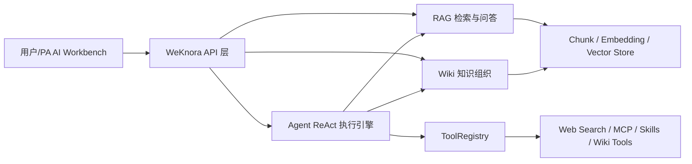
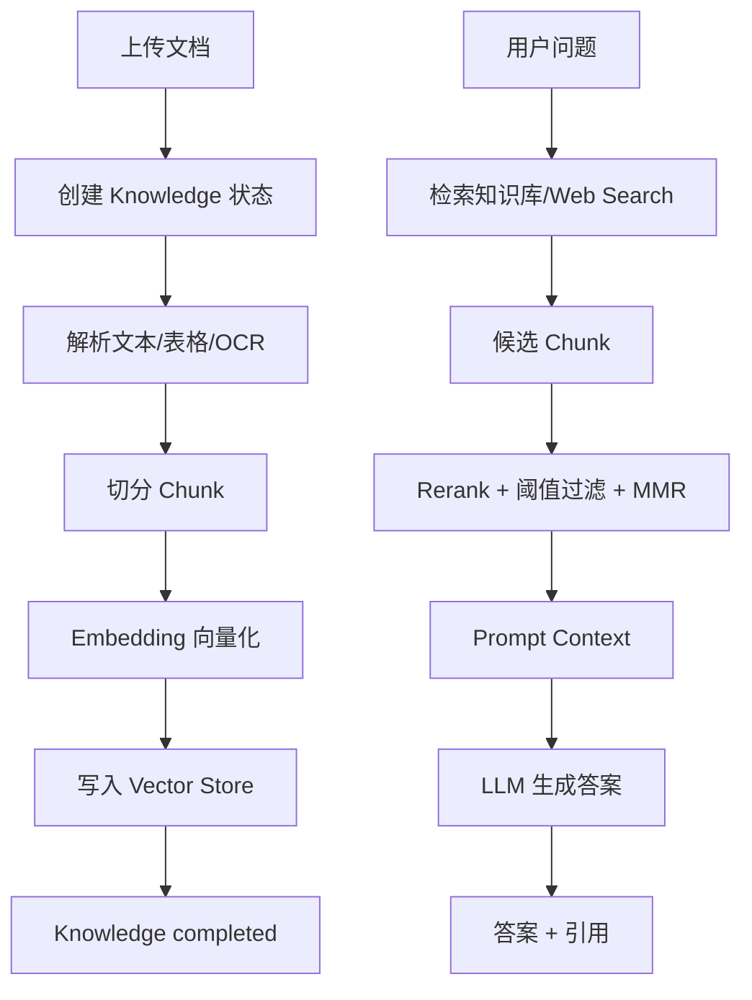
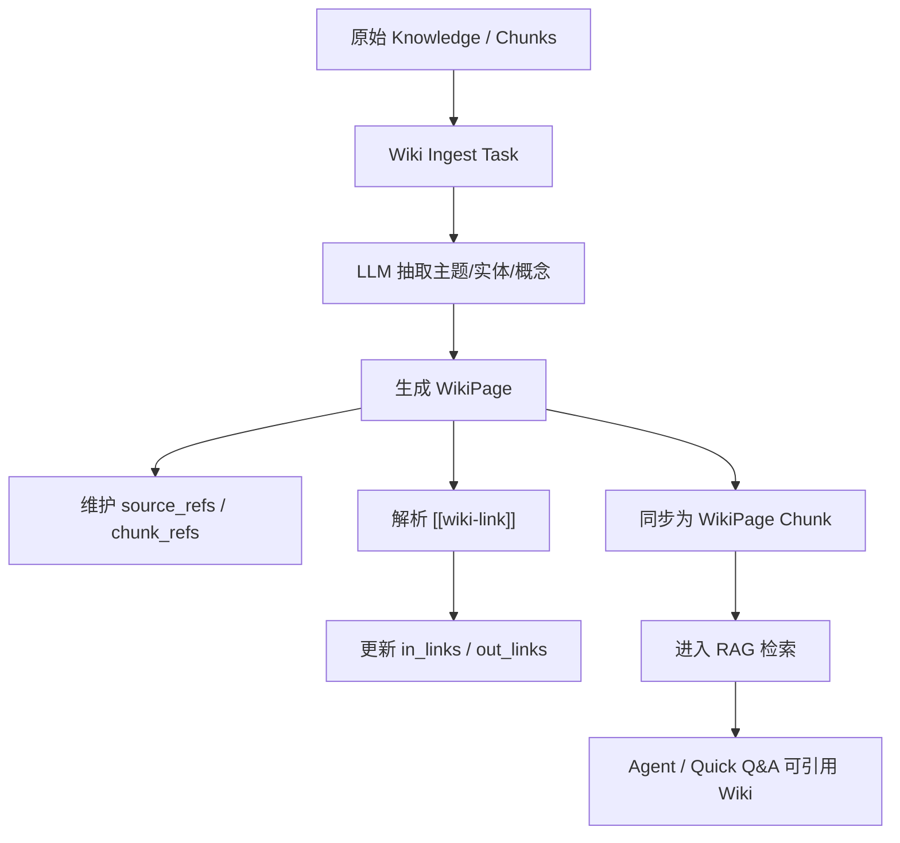
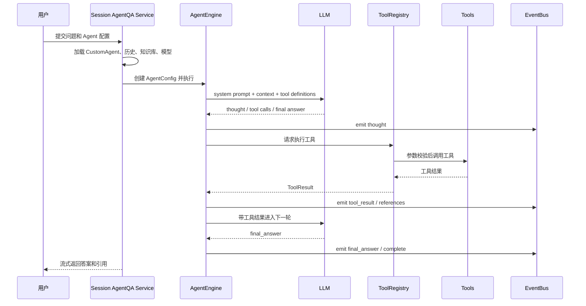
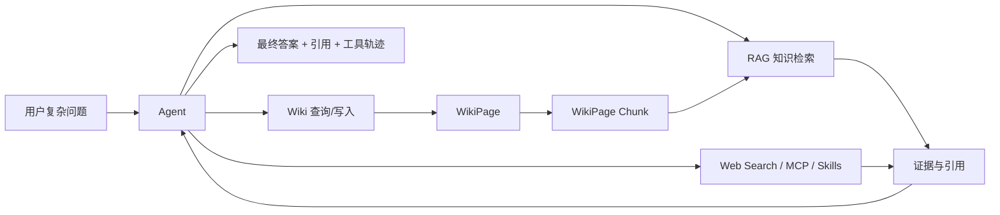

# WeKnora 技术说明文档生成计划

> 目标成品文档建议名：`WeKnora RAG、Wiki 与 Agent 技术说明文档`
>
> 建议正式输出：
>
> - Markdown：`pa-ai-workbench/docs/resume_project/WEKNORA_RAG_WIKI_AGENT_TECHNICAL_EXPLANATION.md`
> - Word：`pa-ai-workbench/docs/resume_project/WEKNORA_RAG_WIKI_AGENT_TECHNICAL_EXPLANATION.docx`

## 1. 文档目标

这份文档的目标不是写一份普通的 WeKnora 功能介绍，而是帮助我真正理解 WeKnora 的三条核心技术链路：

1. RAG：文档如何被解析、切块、向量化、检索、重排，并最终进入大模型回答。
2. Wiki：原始资料如何被组织成可维护、可链接、可引用的知识资产。
3. Agent：用户问题如何进入 ReAct 推理循环，Agent 如何选择工具、调用工具、观察结果并生成最终答案。

这份文档要服务于两个场景：

- 我自己复盘项目时，能从系统架构、数据流、模块职责的角度讲清 WeKnora。
- 面试时，能以“我理解并产品化接入了这套底层能力”的方式表达，而不是只说“我调了一个接口”。

## 2. 读者与写作口径

### 2.1 目标读者

主要读者是我自己，以及可能看到项目文档的面试官。读者不一定熟悉 Go、后端服务、向量数据库、Agent 工程化等技术，所以文档要做到：

- 术语第一次出现时必须解释。
- 少写源码逐行解释，多写模块职责、输入输出、状态变化、调用关系。
- 每个复杂流程最好配一个 Mermaid 图或表格。
- 每个模块都要回答“为什么需要它”“它接收什么”“它产出什么”“下游怎么用它”。

### 2.2 面试表达口径

这份文档可以用“设计者视角”解释 WeKnora 的架构，但正式表达时要避免不真实地声称“从零开发了上游 WeKnora”。推荐口径是：

> 我基于 WeKnora 的原生 RAG、Wiki、Agent 能力做了系统拆解和产品化接入，把底层能力包装成 PA AI Workbench 中可操作、可验证、有引用、有审计、有历史记录的工作流。为了能稳定接入，我按模块理解了 WeKnora 的 RAG 检索链路、Wiki 知识组织链路和 Agent ReAct 工具调用链路，并在产品层做了适配、验收和体验封装。

如果要从“架构设计能力”角度表达，可以说：

> 我在项目中按照 WeKnora 的底层能力抽象，设计了 PA 侧的 Agent 产品层接入架构，包括 Agent 策略配置、工具能力透出、Web Search/MCP/Wiki/RAG 引用映射、历史与审计闭环。

## 3. 事实源范围

正式文档需要优先基于当前仓库，而不是凭印象写。生成正文时建议读取以下文件：

### 3.1 WeKnora RAG 相关

- `internal/application/service/chat_pipeline/chat_pipeline.go`
- `internal/application/service/chat_pipeline/search.go`
- `internal/application/service/chat_pipeline/rerank.go`
- `internal/types/chunk.go`
- `internal/types/knowledge.go`
- `internal/types/retrieval_config.go`
- `internal/router/router.go`

重点关注：

- `PluginSearch` 如何组织知识库检索、Web Search、搜索目标过滤、召回不足时的 query expansion。
- `PluginRerank` 如何调用 rerank 模型、做阈值降级、FAQ boost、MMR 选择和 fallback。
- `ChunkType` 如何区分普通文本、OCR、summary、FAQ、web search、wiki page 等不同内容来源。
- `Knowledge` 的解析状态如何描述文档从上传到可检索的生命周期。

### 3.2 WeKnora Wiki 相关

- `internal/types/wiki_page.go`
- `internal/application/service/wiki_page.go`
- `internal/application/service/wiki_ingest.go`
- `internal/handler/wiki_page.go`

重点关注：

- `WikiPage` 的字段、页面类型、状态、链接关系和引用字段。
- `[[wiki-link]]` 解析、入链/出链维护、版本更新规则。
- Wiki ingest 的异步任务、Redis 锁、pending ops、dead letter、重试与撤回机制。
- Wiki 页面如何同步成 `ChunkTypeWikiPage`，重新进入 RAG 检索体系。

### 3.3 WeKnora Agent 相关

- `internal/agent/engine.go`
- `internal/agent/observe.go`
- `internal/agent/act.go`
- `internal/agent/finalize.go`
- `internal/agent/tools/registry.go`
- `internal/agent/tools/definitions.go`
- `internal/types/agent.go`
- `internal/types/custom_agent.go`
- `internal/application/service/session_agent_qa.go`
- `internal/handler/session/agent_stream_handler.go`
- `config/builtin_agents.yaml`
- `config/agent_type_presets.yaml`
- `docs/agent-skills.md`

重点关注：

- `AgentEngine` 为什么可以看成 ReAct 执行引擎。
- `AgentConfig` 和 `CustomAgentConfig` 的区别。
- `ToolRegistry` 如何注册、校验、执行和清理工具。
- `EventBus` 如何把 thought、tool_call、tool_result、references、final_answer 等事件推给前端。
- Skills 如何通过 `read_skill`、`execute_skill_script` 做 progressive disclosure。

### 3.4 PA AI Workbench 对接相关

- `pa-ai-workbench/knowledge_engine/backends/weknora_api_backend.py`
- `pa-ai-workbench/backend/app/services/native_agent_service.py`
- `pa-ai-workbench/backend/app/services/history_service.py`
- `pa-ai-workbench/backend/app/services/native_audit_service.py`
- `pa-ai-workbench/backend/app/api/*`
- `pa-ai-workbench/frontend/src/pages/DialoguePage.tsx`
- `pa-ai-workbench/frontend/src/pages/LibraryPage.tsx`
- `pa-ai-workbench/frontend/src/pages/HistoryPage.tsx`
- `pa-ai-workbench/docs/WEKNORA_NATIVE_FULL_COMPLETION_FINAL_BLOCKER_REPORT_WNFC_P6_02.md`
- `pa-ai-workbench/docs/WEKNORA_NATIVE_INTELLIGENT_DIALOGUE_FINAL_REPORT_WNID_P8_02.md`

重点关注：

- PA 不重写 WeKnora 的 RAG/Wiki/Agent，而是通过适配层接入原生能力。
- WNFC 已完成非 Web Search 范围的本地生产力工具闭环。
- WNID 后续把 Web Search、MCP execution、ReAct AgentQA、Wiki Mode、Suggested Questions 等智能对话能力纳入最终验收。

## 4. 推荐文档结构

正式文档建议使用以下章节。每章都要写成“解释 + 架构 + 工作流 + 面试讲法”的组合。

## 第一章：先建立 WeKnora 的总体系统地图

### 章节目标

让读者先知道 WeKnora 不是单一的聊天接口，而是一套知识工程与智能对话平台。它至少包含：

- 知识入库层：文件、数据源、解析、切块、向量化。
- 检索增强层：retrieval、rerank、prompt context、citation。
- Wiki 知识组织层：把碎片资料整理成可浏览、可维护、可链接的知识页。
- Agent 执行层：基于 ReAct 循环进行推理、工具调用和结果汇总。
- 工具生态层：内置工具、Wiki 工具、Web Search、MCP、Skills。

### 本章必须解释的术语

| 术语 | 必须解释到什么程度 |
| --- | --- |
| Knowledge Base | 一组可检索知识的容器，可以理解为业务知识空间 |
| Knowledge | 一份上传或同步进来的资料，可能是 PDF、网页、FAQ、数据源内容 |
| Chunk | 为了检索而切出来的知识片段，是 RAG 的最小检索单元之一 |
| Embedding | 把文本转成向量，方便机器按语义相似度检索 |
| Vector Store | 存储向量并支持相似度搜索的基础设施 |
| Retriever | 根据问题从知识库找候选证据的模块 |
| Rerank | 对候选证据重新排序，把最有用的片段放到前面 |
| Citation | 最终答案中可追溯的证据来源 |
| WikiPage | 被整理成页面形态的知识资产，不只是原始 chunk |
| Agent | 可以推理、选择工具、调用工具并根据结果继续决策的执行系统 |
| Tool | Agent 可调用的外部能力，比如知识搜索、Wiki 写入、Web Search、MCP |
| Skill | 一组可按需读取的能力说明或脚本，帮助 Agent 节省上下文并执行专业任务 |

### 建议图



### 本章要回答的问题

- WeKnora 和普通“上传文档问答”有什么区别？
- 为什么 RAG、Wiki、Agent 是三条不同但互相协作的能力线？
- PA AI Workbench 在这张系统地图中处于什么位置？

## 第二章：RAG 模块设计与工作流

### 章节目标

讲清楚“一份文档如何变成可检索证据”和“一个问题如何变成带引用的回答”。

### 必写内容

1. RAG 的基本目的。
   - 大模型本身不直接知道企业或部门内部资料。
   - RAG 先检索证据，再把证据和问题一起交给模型回答。
   - 它的核心价值是减少幻觉、提供引用、让私有知识可用。

2. 入库流程。
   - 用户上传文档或同步数据源。
   - 系统创建 `Knowledge` 记录，进入 `pending` 或 `processing` 状态。
   - 解析器抽取文本、表格、图片 OCR、metadata。
   - 切块器生成多个 `Chunk`。
   - embedding 模型把 chunk 转为向量。
   - 向量写入 vector store。
   - 状态进入 `completed`，失败则进入 `failed` 并保留错误信息。

3. 检索流程。
   - 用户提出问题。
   - 系统识别知识库范围、检索目标、是否需要 Web Search。
   - `PluginSearch` 执行知识库检索和 Web Search。
   - 如果召回不足，可能进行 query expansion。
   - `PluginRerank` 对候选结果重排。
   - MMR 或类似策略减少重复片段。
   - 组装 prompt context。
   - LLM 生成回答。
   - 引用信息随回答返回给上层。

4. RAG 质量控制。
   - topK 控制召回数量。
   - rerank threshold 控制进入上下文的证据质量。
   - FAQ boost 让 FAQ 类内容有更高优先级。
   - fallback 机制避免 rerank 模型失败时整条问答链路不可用。
   - citation contract 保证答案不是只有文本，还要能追溯来源。

### 建议图



### 本章要回答的问题

- Chunk 和 Knowledge 有什么区别？
- 为什么 embedding 之后还要 rerank？
- 为什么 RAG 不能只看“回答对不对”，还要看引用是否可追溯？
- PA 在接入 RAG 时重点解决了哪些产品层问题？

### 面试讲法

可以这样讲：

> 我把 RAG 理解成两条链路：一条是离线入库链路，把文档变成 chunk、embedding 和向量索引；另一条是在线问答链路，把用户问题变成检索、重排、上下文组装和带引用回答。我的工作重点不是重新训练模型，而是把 WeKnora 原生 RAG 能力接入 PA 产品层，并围绕知识库选择、引用映射、历史记录、状态展示和验证脚本做了产品化封装。

## 第三章：Wiki 模块设计与工作流

### 章节目标

讲清楚 Wiki 为什么不是普通文档，也不是普通 RAG 检索结果，而是一层“可维护知识资产”。

### 必写内容

1. Wiki 的定位。
   - RAG 更偏向“按问题临时找证据”。
   - Wiki 更偏向“把资料沉淀成结构化页面”。
   - WikiPage 可以有标题、摘要、别名、来源引用、chunk 引用、入链、出链和版本。

2. WikiPage 的核心字段。
   - `title`：页面标题。
   - `slug`：可稳定访问的页面标识。
   - `page_type`：summary、entity、concept、index、log、synthesis、comparison 等。
   - `status`：draft、published、archived。
   - `content`：页面正文。
   - `summary`：页面摘要。
   - `aliases`：别名，方便召回。
   - `source_refs`：来源资料。
   - `chunk_refs`：引用的 chunk。
   - `in_links` / `out_links`：页面之间的链接关系。
   - `version`：版本号。

3. Wiki 生成流程。
   - 从知识库或 selected chunks 出发。
   - 创建 wiki ingest 任务。
   - 使用 LLM 抽取概念、实体、主题或综合页面。
   - 批量写入 WikiPage。
   - 维护链接关系。
   - 失败时进入重试、dead letter 或等待人工处理。

4. Wiki 维护流程。
   - 创建页面。
   - 更新页面。
   - 解析 `[[wiki-link]]`。
   - 更新入链/出链。
   - 删除页面时清理同步 chunk。
   - 全局 rebuild links 或 auto-fix。

5. Wiki 与 RAG 的关系。
   - Wiki 页面可以同步成 `ChunkTypeWikiPage`。
   - 这意味着 Wiki 不只是浏览页面，也可以进入检索和 Agent 问答。
   - Agent 可以通过 Wiki 工具读取、创建、修复或引用 Wiki 页面。

### 建议图



### 本章要回答的问题

- Wiki 为什么比普通文档列表更适合沉淀组织知识？
- WikiPage 和 Chunk 的关系是什么？
- Wiki 的链接关系为什么重要？
- Wiki 如何反过来提升 RAG 和 Agent 的回答质量？

### 面试讲法

可以这样讲：

> 我把 WeKnora 的 Wiki 看成 RAG 之上的知识组织层。RAG 擅长临时召回证据，但不擅长把碎片长期组织成页面。Wiki 模块通过 WikiPage、source refs、chunk refs、页面链接和版本管理，把原始资料沉淀为可浏览、可维护、可再次检索的知识资产。PA 侧接入 Wiki 后，用户不只是问答，还能看到和维护知识结构。

## 第四章：Agent 模块设计与 ReAct 工作流

### 章节目标

这是整份文档最重要的部分。需要把 WeKnora Agent 讲成一个完整的工程系统，而不是简单说“Agent 会调用工具”。

### 必写内容

1. Agent 的核心定位。
   - Agent 是围绕目标进行多步推理和工具调用的执行系统。
   - ReAct 可以理解为 Reason + Act：先思考，再行动，再观察，再继续。
   - WeKnora 的 Agent 不是单一 prompt，而是由配置、工具注册、执行循环、事件流、上下文管理和最终答案组成。

2. Agent 核心对象。

| 对象 | 作用 |
| --- | --- |
| `CustomAgentConfig` | 存储可配置 Agent 的产品形态，如 prompt、工具范围、知识库、Web Search、MCP、skills、retrieval 参数 |
| `AgentConfig` | 运行时配置，是执行一次 AgentQA 时真正传入引擎的配置 |
| `AgentEngine` | ReAct 执行引擎，负责循环调用 LLM、判断工具调用、执行工具、观察结果和完成答案 |
| `AgentState` | 一次执行中的状态，包括 steps、messages、tool results、references、final answer |
| `ToolRegistry` | 工具注册与调用中心，决定 Agent 能看到和调用哪些工具 |
| `EventBus` | 事件总线，把思考、工具调用、工具结果、引用、最终答案流式推给上层 |

3. CustomAgentConfig 到 AgentConfig 的转换。
   - PA 或 WeKnora 前端配置的是 Custom Agent。
   - 会话启动时，`session_agent_qa.go` 根据 Custom Agent、知识库、模型、历史、附件、上下文等生成运行时 `AgentConfig`。
   - AgentEngine 不长期保存跨轮状态，多轮历史由服务层从数据库加载后注入。

4. ReAct 执行循环。
   - 构建 system prompt 和工具定义。
   - 创建 AgentState。
   - 调用 LLM。
   - 分析模型是否要调用工具。
   - 如果有 tool calls，进入 Act 阶段。
   - ToolRegistry 校验参数并执行工具。
   - 工具结果写回上下文。
   - 进入下一轮观察和思考。
   - 达到 final_answer 或 stop condition 后 finalize。

5. Stop condition 与 fallback。
   - 到达最大迭代次数。
   - 模型明确调用 `final_answer`。
   - 上下文窗口需要裁剪。
   - 工具失败或无结果时需要友好降级。
   - 如果达到最大轮次但已有工具结果，finalize 可以基于工具结果综合答案。

6. Event stream。
   - thought：模型思考过程或可展示推理摘要。
   - tool_call：将要调用工具。
   - tool_result：工具返回结果。
   - references：产生可引用证据。
   - final_answer：最终回答。
   - complete：一次执行结束。
   - approval：需要用户确认的工具执行。

### 建议图



### 本章要回答的问题

- Agent 和普通 RAG 问答的区别是什么？
- 为什么 AgentEngine 是执行引擎，而 CustomAgentConfig 是产品配置？
- ToolRegistry 解决了什么问题？
- EventBus 对前端体验和调试有什么价值？
- 为什么 Agent 要有最大迭代次数和上下文管理？

### 面试讲法

可以这样讲：

> 我把 Agent 层理解成一个可配置的 ReAct 执行系统。用户看到的是一个 Agent，但底层其实包含 CustomAgent 配置、运行时 AgentConfig、AgentEngine 循环、ToolRegistry 工具系统和 EventBus 流式事件。一次 AgentQA 会先加载模型、知识库、历史和工具范围，然后 AgentEngine 多轮调用 LLM，根据模型输出决定是否调用知识搜索、Wiki、Web Search、MCP 或 Skills，最后把工具结果和引用汇总成答案。PA 侧重点是把这些底层事件和配置产品化，让用户能看到工具轨迹、引用、历史和审计。

## 第五章：ToolRegistry、工具系统与安全边界

### 章节目标

讲清楚 Agent 为什么需要工具注册中心，以及工具系统如何让 Agent 可扩展但不失控。

### 必写内容

1. ToolRegistry 的作用。
   - 统一管理工具注册。
   - 防止重复工具名冲突。
   - 生成稳定排序的 function definitions，利于 prompt caching。
   - 校验工具参数。
   - 执行工具。
   - 截断过长输出。
   - 清理工具资源。

2. 工具分类。

| 工具类型 | 例子 | 作用 |
| --- | --- | --- |
| 思考/规划工具 | thinking、todo_write | 帮助 Agent 拆解任务 |
| 知识检索工具 | knowledge_search、grep_chunks、list_knowledge_chunks | 从知识库找证据 |
| Wiki 工具 | wiki read/write/update/fix 类工具 | 创建、读取、维护 Wiki 页面 |
| 数据分析工具 | data_analysis | 对结构化数据做分析 |
| Web 工具 | web_search、web_fetch | 获取外部网络信息 |
| MCP 工具 | MCP tools/resources/prompts | 调用外部服务能力 |
| Skill 工具 | read_skill、execute_skill_script | 按需加载专业能力说明或脚本 |
| 终止工具 | final_answer | 明确告诉引擎最终答案已完成 |

3. 安全边界。
   - 不是所有 Agent 都能调用所有工具。
   - `AllowedTools` 控制工具范围。
   - MCP 执行需要审批或安全策略。
   - Web Search 需要配置 provider。
   - mutation 类工具需要确认和审计。
   - PA 侧需要隐藏敏感参数，只展示安全摘要。

### 本章要回答的问题

- 为什么不把所有工具硬编码在 AgentEngine 里？
- 为什么工具调用需要参数校验和输出截断？
- MCP 和 Web Search 为什么要作为硬验收门槛，而不是只展示“已配置”？
- PA 如何把工具执行变成可审计、可回放、可解释的产品能力？

## 第六章：Skills 与 Progressive Disclosure

### 章节目标

解释 WeKnora Agent Skills 的价值：让 Agent 在需要时才读取专业说明或脚本，而不是一开始把所有知识塞进上下文。

### 必写内容

1. Skill 的概念。
   - Skill 可以是一组说明、流程、脚本、专业知识或工具使用指南。
   - Agent 通过 `read_skill` 获取需要的能力信息。
   - 在更高权限或更明确任务下，可以通过 `execute_skill_script` 执行脚本。

2. Progressive Disclosure。
   - 不是把所有能力都一次性放进 prompt。
   - 先给 Agent 能力索引。
   - 需要时读取具体 skill。
   - 需要执行时再调用脚本。
   - 好处是节省 token、减少干扰、提升专业任务稳定性。

3. 与 PA 的关系。
   - PA 在 WNFC 阶段接入了 skill 管理相关能力。
   - 在 WNID 阶段，Skills 可作为智能对话能力的一部分，通过工具事件、历史和审计展示。

### 本章要回答的问题

- Skill 和 Tool 有什么区别？
- 为什么 Skill 是 Agent 工程化的重要能力？
- Progressive Disclosure 对上下文窗口和成本有什么帮助？

## 第七章：RAG、Wiki、Agent 三者如何协同

### 章节目标

这是整篇文档的综合章节。要讲清：三者不是孤立功能，而是一个闭环。

### 必写内容

1. RAG 给 Agent 提供证据。
   - Agent 可以调用 knowledge_search。
   - 检索结果可以成为工具结果和引用。

2. Wiki 给 Agent 提供结构化知识资产。
   - Agent 可以查询 Wiki。
   - Agent 可以创建或维护 Wiki。
   - Wiki 页面可以再次进入 RAG。

3. Agent 给 RAG/Wiki 提供任务编排能力。
   - 普通 RAG 是“一问一答”。
   - Agent 可以多步处理，比如先查知识库、再查 Wiki、再 Web Search、再汇总。
   - 对于复杂问题，Agent 更适合做跨工具推理。

4. PA 侧协同。
   - Quick Q&A 对应快速 RAG。
   - Wiki Mode 对应 Wiki 能力和 Agent Wiki 工具。
   - Agent Mode 对应 ReAct AgentQA。
   - Dialogue 页面把策略、工具轨迹、引用和历史整合起来。

### 建议图



### 本章要回答的问题

- 什么时候用 Quick Q&A，什么时候用 AgentQA？
- Wiki 生成后为什么还能反哺 RAG？
- Agent 工具轨迹为什么是产品可信度的一部分？

## 第八章：PA AI Workbench 如何对接 WeKnora 原生能力

### 章节目标

把 WeKnora 底层能力和我的产品项目连接起来。这里要为第二份产品说明文档埋钩子，但不要展开太多 PA 业务细节。

### 必写内容

1. PA 的定位。
   - PA AI Workbench 是独立产品，不是 WeKnora 的子产品。
   - 它复用 WeKnora 原生能力，通过产品层做组织、体验、历史、引用、审计和验证。

2. 对接方式。
   - `weknora_api_backend.py` 作为 WeKnora API backend/adapter。
   - 后端 services 把 native routes 映射成 PA 可用的产品 API。
   - 前端页面展示 Library、RAG、Wiki、Dialogue、History、Capability Center 等工作流。

3. 对接能力。
   - RAG：知识库、文档、chunk、检索、引用。
   - Wiki：页面浏览、维护、引用、Wiki Mode。
   - Agent：AgentQA、自定义 Agent、策略编辑、工具轨迹、Suggested Questions。
   - Web Search：WNID 阶段纳入硬门槛。
   - MCP：读取工具/资源/提示词，并证明审批式执行。
   - 历史、引用、审计：把底层动作变成可追溯产品闭环。

4. 验收事实。
   - WNFC：非 Web Search 范围，`14.00/14 = 100.0%`，`final_ready=true`。
   - WNID：智能对话范围，17 个任务完成，Web Search 和 MCP execution 均在范围内，`final_ready=true`。

### 本章要回答的问题

- PA 为什么不自己重写 RAG/Wiki/Agent？
- PA 的价值是否只是“套壳”？应该如何反驳？
- 引用、历史、审计、浏览器矩阵为什么是产品化的重要证据？

## 第九章：面试讲法与常见追问

### 必写内容

文档最后要有一章专门帮助面试。建议包含以下问题：

1. 你这个项目和普通 ChatPDF 有什么区别？
2. 你为什么选择接入 WeKnora，而不是完全自己写 RAG？
3. 你对 RAG 做了哪些理解和优化？
4. Wiki 和 RAG 是什么关系？
5. Agent 是怎么设计的？
6. Agent 调用工具时如何保证安全？
7. Web Search 和 MCP 为什么要单独验收？
8. 你作为产品实习生，怎么推动技术项目落地？
9. 如果重做一次，你会怎么优化？

每个问题都给出“短回答 + 深入追问回答”。

## 5. 图表要求

正式文档至少包含：

- 1 张 WeKnora 总体架构图。
- 1 张 RAG 入库与检索流程图。
- 1 张 Wiki 生命周期图。
- 1 张 Agent ReAct sequence diagram。
- 1 张 RAG/Wiki/Agent 协同图。
- 3 到 5 张模块职责表。
- 1 张面试问答表。

## 6. 写作边界

### 应该强调

- 我理解并接入了 WeKnora 原生 RAG、Wiki、Agent 能力。
- 我在 PA 产品层做了产品化封装、引用映射、历史审计、状态可视化和验收。
- 我能从架构角度解释 AgentEngine、ToolRegistry、EventBus、CustomAgent、AgentConfig。
- 我能解释 RAG、Wiki、Agent 的协同，而不是只背概念。

### 不应该写偏

- 不要写成 WeKnora 官方说明书的搬运。
- 不要过度逐行解释 Go 代码。
- 不要声称“完全从零实现了 WeKnora 上游 Agent 内核”。
- 不要把 PA 描述成 WeKnora 的一个子模块。
- 不要把 WNFC 和 WNID 的范围混淆：WNFC 排除了 Web Search，WNID 重新纳入 Web Search 和 MCP execution。

## 7. 正式文档验收标准

生成正文后，需要检查：

- 是否能让只有一点 Python 基础的人理解。
- 是否覆盖 RAG、Wiki、Agent 三大模块。
- Agent 部分是否足够详细，尤其是 ReAct、ToolRegistry、EventBus、AgentConfig、CustomAgent、AgentEngine。
- 是否明确说明三者如何协同。
- 是否连接到 PA AI Workbench 的产品接入。
- 是否有面试话术。
- 是否有 Mermaid 图和表格。
- 是否避免不真实夸大。
- Markdown 结构是否清晰，适合转 Word。

## 8. 新对话可直接复制的生成提示词

```text
请根据这个 plan 生成正式文档：

文件路径：
/Users/mac/Downloads/WeKnora-main/pa-ai-workbench/docs/resume_project/plans/01_WEKNORA_TECHNICAL_PLAN.md

目标：
生成《WeKnora RAG、Wiki 与 Agent 技术说明文档》的 Markdown 正文，并随后生成 Word docx。

写作要求：
1. 使用中文。
2. 篇幅要长且详细，适合 AI 产品实习生用于简历项目复盘和面试准备。
3. 面向只有一点 Python 基础的读者解释，但保持专业性。
4. 必须详细解释 WeKnora 的 RAG、Wiki、Agent 模块，包括架构、工作流、关键对象、技术栈、模块协同。
5. Agent 部分要重点写，按照“我理解并产品化接入了这套 Agent 架构”的口径写，详细解释 ReAct、AgentEngine、AgentConfig、CustomAgent、ToolRegistry、EventBus、Skills、MCP、Web Search。
6. 必须说明 PA AI Workbench 如何对接 WeKnora 原生能力。
7. 包含 Mermaid 图、表格、面试讲法、常见追问。
8. 注意真实边界：不要声称我从零开发了 WeKnora 上游内核，要表达为我基于 WeKnora 原生能力做了系统拆解、产品化接入、验证和封装。

请先读取 plan 和仓库相关源文件，再生成 Markdown 正文。
```
