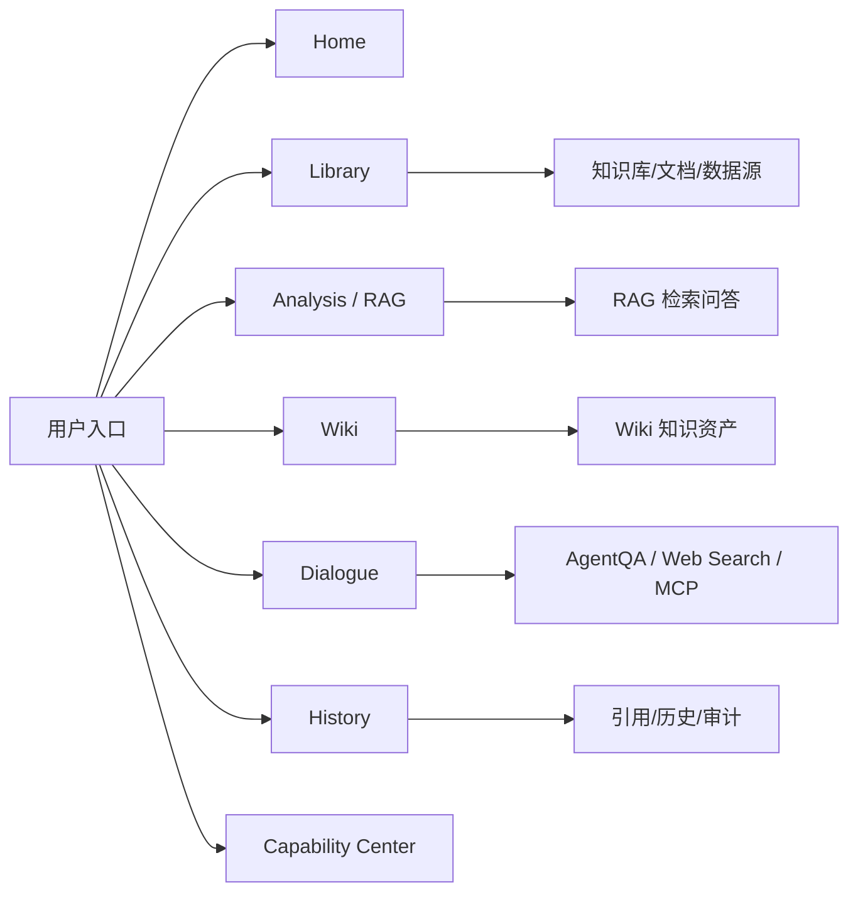
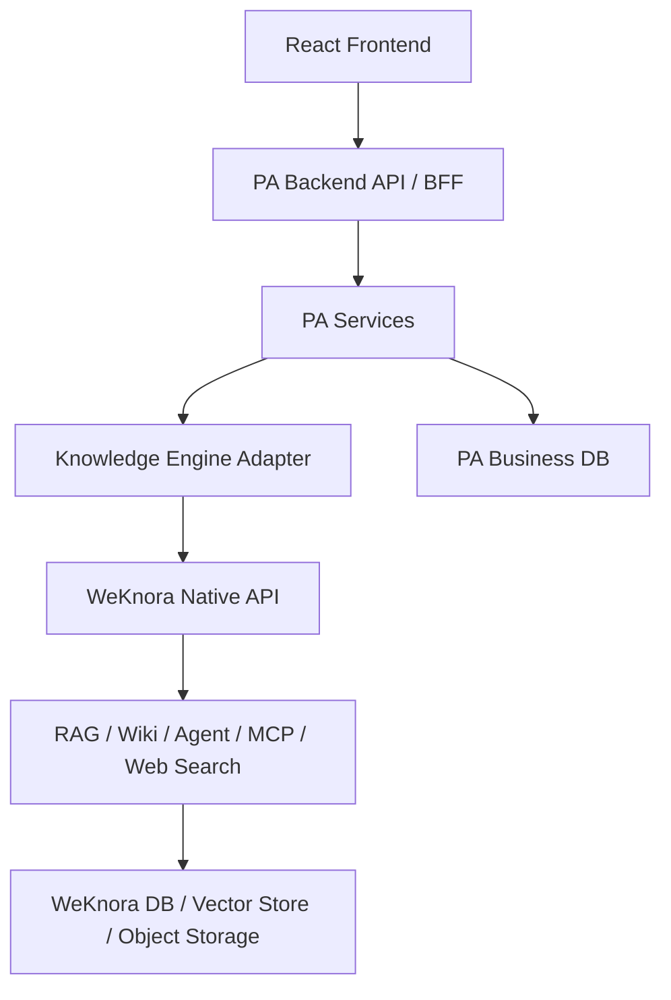
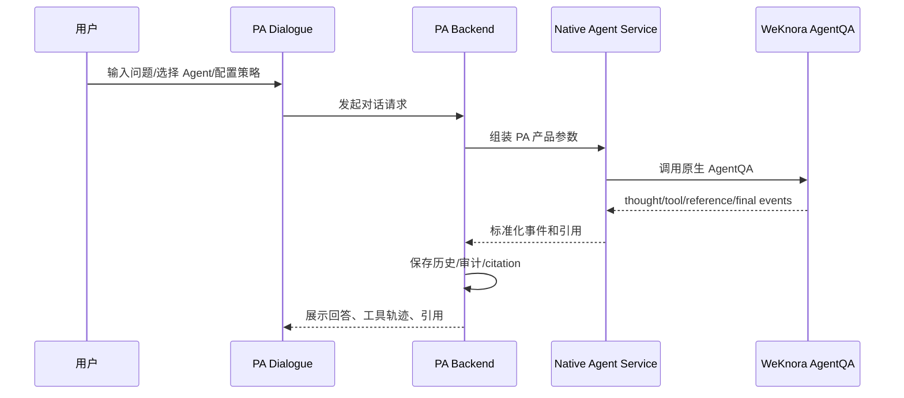

# PA AI Workbench 产品说明文档生成计划

> 目标成品文档建议名：`PA AI Workbench 产品说明文档`
>
> 建议正式输出：
>
> - Markdown：`pa-ai-workbench/docs/resume_project/PA_AI_WORKBENCH_PRODUCT_EXPLANATION.md`
> - Word：`pa-ai-workbench/docs/resume_project/PA_AI_WORKBENCH_PRODUCT_EXPLANATION.docx`

## 1. 文档目标

这份文档要回答一个核心问题：

> PA AI Workbench 到底是一个什么产品？它解决什么问题？它的产品架构、技术架构、模块拆分、数据流、用户工作流和项目亮点是什么？

它不是 WeKnora 的重复说明，也不是简单罗列功能。它要把我的项目讲成一个完整的 AI 产品实习生简历项目：

- 有明确目标用户。
- 有清晰使用场景。
- 有完整功能模块。
- 有前后端架构。
- 有 WeKnora 原生能力接入。
- 有 Agent 产品层设计。
- 有引用、历史、审计、安全和状态体系。
- 有真实验收和迭代证据。

## 2. 产品定位

正式文档需要把 PA AI Workbench 定位为：

> 一个面向个人/团队知识工作的 AI 工作台，用于把本地或部门资料接入 WeKnora 原生知识引擎，通过 RAG、Wiki、AgentQA、Web Search、MCP、历史引用和审计能力，形成可检索、可追溯、可维护、可验证的智能知识工作流。

必须强调：

- PA AI Workbench 是独立产品，不是 WeKnora 的子产品。
- PA 不重写 WeKnora 的底层 RAG/Wiki/Agent/MCP/Web Search 能力。
- PA 的产品价值在于把底层能力变成用户可用的工作流，包括页面组织、任务状态、引用映射、历史记录、审计、策略编辑、浏览器验收和产品化体验。

## 3. 目标读者与写作风格

目标读者是：

- 面试官。
- HR 或业务面试官。
- 我自己后续复盘项目。

写作风格：

- 专业但可读。
- 先讲产品价值，再讲架构细节。
- 每个模块都要说明“用户看到什么”“后端做什么”“WeKnora 提供什么”“PA 做了什么产品化封装”。
- 避免像源码注释，也避免像营销文案。

## 4. 事实源范围

正式文档建议读取：

### 4.1 产品与阶段文档

- `pa-ai-workbench/docs/WEKNORA_NATIVE_EXPANSION_ARCHITECTURE.md`
- `pa-ai-workbench/docs/WEKNORA_NATIVE_EXPANSION_INTERNAL_PROD_SPEC.md`
- `pa-ai-workbench/docs/WEKNORA_NATIVE_FULL_COMPLETION_SPEC.md`
- `pa-ai-workbench/docs/WEKNORA_NATIVE_FULL_COMPLETION_FINAL_BLOCKER_REPORT_WNFC_P6_02.md`
- `pa-ai-workbench/docs/WEKNORA_NATIVE_INTELLIGENT_DIALOGUE_SPEC.md`
- `pa-ai-workbench/docs/WEKNORA_NATIVE_INTELLIGENT_DIALOGUE_FINAL_REPORT_WNID_P8_02.md`
- `pa-ai-workbench/docs/WEKNORA_NATIVE_CAPABILITY_COVERAGE_LEDGER.md`
- `pa-ai-workbench/docs/WEKNORA_FIRST_NATIVE_CAPABILITY_MAP.md`

### 4.2 后端与适配层

- `pa-ai-workbench/knowledge_engine/backends/weknora_api_backend.py`
- `pa-ai-workbench/backend/app/api/`
- `pa-ai-workbench/backend/app/services/`
- `pa-ai-workbench/backend/app/models.py`
- `pa-ai-workbench/backend/app/schemas.py`
- `pa-ai-workbench/backend/scripts/check_weknora_*`

### 4.3 前端

- `pa-ai-workbench/frontend/src/App.tsx`
- `pa-ai-workbench/frontend/src/api/client.ts`
- `pa-ai-workbench/frontend/src/pages/HomePage.tsx`
- `pa-ai-workbench/frontend/src/pages/LibraryPage.tsx`
- `pa-ai-workbench/frontend/src/pages/HistoryPage.tsx`
- `pa-ai-workbench/frontend/src/pages/DialoguePage.tsx`
- `pa-ai-workbench/frontend/src/styles.css`

### 4.4 WeKnora 原生能力参考

- `internal/router/router.go`
- `internal/application/service/chat_pipeline/*`
- `internal/application/service/session_agent_qa.go`
- `internal/agent/*`
- `internal/application/service/wiki_*.go`
- `internal/application/service/mcp_service.go`
- `internal/application/service/web_search*.go`
- `internal/types/*`

## 5. 推荐文档结构

## 第一章：产品概述

### 章节目标

用 1 到 2 页讲清楚产品是什么，为什么要做，解决什么问题。

### 必写内容

1. 背景问题。
   - 企业或个人资料分散在文档、网页、知识库、数据源里。
   - 普通大模型无法直接可靠回答内部知识。
   - 单纯 ChatPDF 只能问答，缺少知识维护、Agent 多步执行、历史引用和审计。
   - 技术同学能用底层接口，但非技术用户需要一个产品化工作台。

2. 产品目标。
   - 统一管理知识库、文档、Wiki、Agent 对话和外部工具。
   - 支持从资料上传到检索问答，再到 Wiki 沉淀和 Agent 多步处理。
   - 让每一次回答可引用、可追溯、可复查。
   - 用状态中心和验收脚本保证能力不是静态页面展示，而是真实可用。

3. 产品一句话。

推荐表达：

> PA AI Workbench 是一个基于 WeKnora 原生 RAG、Wiki、Agent、Web Search 和 MCP 能力构建的 AI 知识工作台，把底层知识引擎封装成面向真实知识工作的产品流程。

## 第二章：目标用户与核心场景

### 目标用户

| 用户类型 | 需求 | PA 提供的能力 |
| --- | --- | --- |
| AI 产品实习生/产品经理 | 快速理解资料、生成分析、准备方案 | RAG 问答、Wiki 沉淀、Agent 分析 |
| 部门知识管理员 | 上传资料、维护知识库、检查状态 | Library、KB 管理、文档生命周期、Wiki 维护 |
| 业务同学 | 用自然语言问业务资料 | Quick Q&A、引用、历史记录 |
| 技术/运营同学 | 查看能力接入是否可用 | Capability Center、验收报告、审计 |
| 高阶用户 | 需要外部搜索或工具调用 | AgentQA、Web Search、MCP、策略配置 |

### 核心场景

1. 上传一份部门资料，查看解析和索引状态。
2. 针对知识库发起 Quick Q&A，获得带引用回答。
3. 把资料沉淀成 Wiki 页面，并维护链接关系。
4. 使用 Agent Mode 进行复杂问题分析。
5. 在 Agent 中调用 Web Search 或 MCP 工具。
6. 查看历史记录、引用和审计，确认回答来源。
7. 在 Capability Center 查看 WeKnora 原生能力是否真实接入。

## 第三章：产品信息架构与页面模块

### 章节目标

从用户界面角度讲清楚 PA 的模块组成。

### 必写模块

| 页面/模块 | 用户价值 | 后端依赖 | WeKnora 原生能力 |
| --- | --- | --- | --- |
| Home | 总览系统状态和入口 | status/native status | 健康检查、模型状态、能力状态 |
| Library | 管理知识库、文档、数据源 | KB/document APIs | KB、Knowledge、Chunk、Data Source |
| Analysis/RAG | 发起知识问答和检索调试 | rag/knowledge-chat APIs | RAG 检索、rerank、citation |
| Wiki | 浏览和维护知识页 | wiki APIs | WikiPage、Wiki ingest、link maintenance |
| Dialogue | 智能对话、AgentQA、策略配置 | native_agent_service | AgentQA、Custom Agent、Web Search、MCP |
| History | 查看对话历史、引用、审计 | history/audit services | Session、references、tool events |
| Capability Center | 查看原生能力覆盖情况 | native capability APIs | WeKnora route/capability map |

### 建议图



## 第四章：整体技术架构

### 章节目标

讲清楚前端、PA 后端、适配层、WeKnora 原生服务之间的关系。

### 必写内容

1. 前端层。
   - React/Vite/TypeScript。
   - 页面承载用户工作流。
   - 通过 `frontend/src/api/client.ts` 调用 PA BFF API。

2. PA BFF 后端层。
   - Python/FastAPI 风格的 API 和 service 分层。
   - 负责产品 API、状态聚合、历史记录、审计、安全封装。
   - 不直接承担 WeKnora 原生能力的核心算法。

3. Knowledge Engine Adapter。
   - `weknora_api_backend.py` 连接 WeKnora 原生 API。
   - 把 WeKnora route/response 转换成 PA 产品层更容易使用的数据结构。
   - 隔离外部服务变动对前端的影响。

4. WeKnora 原生层。
   - RAG、Wiki、AgentQA、MCP、Web Search、模型、向量库、数据源等能力。
   - PA 调用并展示这些能力，而不是复制实现。

5. 数据层。
   - PA 侧保存业务历史、引用映射、审计、产品状态。
   - WeKnora 侧保存知识库、文档、chunk、wiki page、agent 配置等原生对象。
   - 注意不能把 WeKnora 权威 chunk/vector/provider payload 全部复制到 PA 业务 DB。

### 建议图



## 第五章：Knowledge Engine Adapter 设计

### 章节目标

说明 PA 为什么需要适配层，而不是前端直接调 WeKnora。

### 必写内容

1. 适配层要解决的问题。
   - WeKnora 原生 API 是底层能力接口，不一定直接符合 PA 页面需要。
   - 前端需要稳定的产品 API。
   - 不同能力的状态、引用、错误信息需要统一。
   - 需要屏蔽敏感字段和底层实现细节。

2. Adapter 负责的事情。
   - 调用 WeKnora API。
   - 处理 native response。
   - 统一错误格式。
   - 做安全字段过滤。
   - 将 native reference 映射成 PA citation。
   - 给 history/audit 提供标准数据。

3. 面试讲法。

> 我在 PA 中没有直接让前端调 WeKnora，而是设计了 Knowledge Engine Adapter 和 BFF 服务层。这样做的好处是前端面对的是稳定产品语义，WeKnora 原生接口变动时主要影响 adapter；同时可以在 PA 层统一做引用、历史、审计、状态和安全过滤。

## 第六章：PA Agent 产品层设计

### 章节目标

这是产品说明文档的重点之一。要讲清 PA 里的 Agent 不是自己重新写一套 Agent 内核，而是把 WeKnora 原生 AgentQA 和 Custom Agent 能力产品化。

### 必写内容

1. 用户视角。
   - 用户可以选择 Agent。
   - 用户可以在 Dialogue 页面发起 Quick Q&A 或 AgentQA。
   - 用户可以看到工具轨迹、引用、历史。
   - 高阶用户可以编辑策略，如 prompt、工具、MCP、Web Search、retrieval 参数、建议问题。

2. 后端视角。
   - `native_agent_service.py` 负责 native Agent 能力接入。
   - PA service 把 Agent config、策略、Web Search、MCP、history、citation、audit 组织起来。
   - 对 mutation 或外部执行做确认和审计。

3. WeKnora 原生能力视角。
   - Custom Agent 配置。
   - AgentQA ReAct 执行。
   - Built-in tools。
   - Web Search。
   - MCP tools/resources/prompts/execution。
   - Skills。
   - Suggested Questions。

4. 产品价值。
   - 用户不需要理解 AgentEngine 代码，也能使用 Agent 能力。
   - 工具调用过程可见。
   - 引用和历史可追溯。
   - Web Search 和 MCP 不只是开关，而是经过验收的真实能力。

### 建议图



## 第七章：RAG、Wiki 与文档工作流设计

### 必写内容

1. 文档生命周期。
   - 上传。
   - 解析。
   - 索引。
   - 状态展示。
   - 预览/下载/删除/重解析。

2. 知识库管理。
   - 创建、选择、更新、删除、pin。
   - FAQ、标签、收藏。
   - 数据源连接。

3. RAG 问答。
   - Quick Q&A。
   - RAG debug。
   - Citation mapping。
   - 检索参数。

4. Wiki 工作流。
   - Wiki 浏览。
   - Wiki 生成。
   - Wiki 维护。
   - rebuild links、auto-fix、issue status。

5. 产品闭环。
   - 文档变知识。
   - 知识变回答。
   - 回答可引用。
   - 高价值内容沉淀成 Wiki。
   - Wiki 再进入检索和 Agent。

## 第八章：历史、引用、审计与安全体系

### 章节目标

说明 PA 不只是能力入口，还构建了可信 AI 产品必需的治理层。

### 必写内容

1. Citation。
   - 回答必须能追溯到 document/wiki/web reference。
   - Citation 是降低幻觉和支持复查的关键。

2. History。
   - 保存 Quick Q&A、AgentQA、Wiki、Web Search、MCP 等运行结果。
   - 支持后续回看。

3. Audit。
   - mutation、外部执行、策略修改、MCP 执行、Web Search provider 测试都需要审计。
   - 审计只保存安全摘要，不保存敏感原始内容。

4. 安全边界。
   - 不打印或提交密钥。
   - MCP/Web Search/删除/外部执行等需要确认。
   - 报告和脚本只输出 masked 状态。

## 第九章：状态中心与验收体系

### 章节目标

解释项目为什么不是“界面 demo”，而是通过 harness 和 browser matrix 证明真实可用。

### 必写内容

1. Capability Center。
   - 展示 native 能力覆盖。
   - 帮助用户知道哪些功能是真的接上了。

2. Acceptance harness。
   - 用脚本检查阶段任务、报告、状态、最终 readiness。
   - 防止用 mock 或静态页面冒充完成。

3. Browser matrix。
   - 桌面和移动端页面检查。
   - 检查关键页面、状态、横向溢出、可见性等。

4. WNFC/WNID 事实。
   - WNFC：`14.00/14 = 100.0%`，`final_ready=true`，Web Search excluded。
   - WNID：17 个任务完成，Web Search/MCP execution in scope，`final_ready=true`。

## 第十章：产品亮点与面试表达

### 必写亮点

1. 独立产品定位清晰，不是简单套壳。
2. 使用 WeKnora-first 策略，优先复用成熟原生能力。
3. 通过 adapter/BFF 把底层能力产品化。
4. RAG、Wiki、Agent 三条链路形成闭环。
5. 引用、历史、审计提升可信度。
6. Spec + skill + harness 让开发过程可控、可验证。
7. WNFC/WNID 分阶段验收体现工程质量意识。
8. 作为产品实习生，能把复杂技术翻译为用户可用工作流。

## 6. 不应该写偏的地方

- 不要把 PA 写成 WeKnora 的一个页面。
- 不要把产品价值写成“调用 WeKnora API”这么浅。
- 不要把所有 WeKnora 原生能力都说成自己从零实现。
- 不要忽略历史、引用、审计和验收，它们是项目从 demo 到产品的关键。
- 不要混淆 WNFC 与 WNID 的范围。

## 7. 正式文档验收标准

生成后的正式文档应满足：

- 产品定位清晰。
- 架构图完整。
- 前端、后端、adapter、WeKnora native 层次清楚。
- 模块说明详细。
- Agent 产品层足够突出。
- RAG/Wiki/Agent 的产品工作流讲清楚。
- 有数据流、状态流、用户工作流。
- 有项目亮点和面试讲法。
- 有 WNFC/WNID 真实验收事实。
- 适合转成 Word 简历项目说明文档。

## 8. 新对话可直接复制的生成提示词

```text
请根据这个 plan 生成正式文档：

文件路径：
/Users/mac/Downloads/WeKnora-main/pa-ai-workbench/docs/resume_project/plans/02_PA_PRODUCT_EXPLANATION_PLAN.md

目标：
生成《PA AI Workbench 产品说明文档》的 Markdown 正文，并随后生成 Word docx。

写作要求：
1. 使用中文。
2. 篇幅长且详细，适合 AI 产品实习生用于简历项目和面试。
3. 先讲产品价值，再讲系统架构和模块细节。
4. 必须强调 PA AI Workbench 是独立产品，不是 WeKnora 子产品。
5. 必须讲清前端、PA BFF、Knowledge Engine Adapter、WeKnora Native API、业务 DB、WeKnora 原生存储之间的关系。
6. 必须详细写 PA Agent 产品层、RAG/Wiki/Agent 接入、历史引用审计、安全确认、状态中心和验收体系。
7. 使用 Mermaid 图、模块表、用户工作流表、面试亮点。
8. 注意真实边界：PA 是产品化接入和封装，不要写成我从零实现了全部 WeKnora 底层能力。

请先读取 plan 和仓库相关源文件，再生成 Markdown 正文。
```
