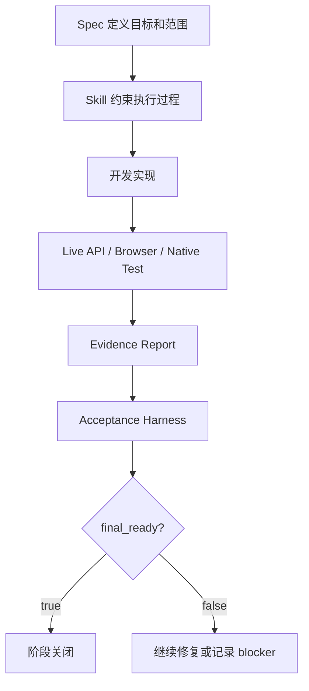

# PA AI Workbench 开发记录文档生成计划

> 目标成品文档建议名：`PA AI Workbench 开发记录文档`
>
> 建议正式输出：
>
> - Markdown：`pa-ai-workbench/docs/resume_project/PA_AI_WORKBENCH_DEVELOPMENT_RECORD.md`
> - Word：`pa-ai-workbench/docs/resume_project/PA_AI_WORKBENCH_DEVELOPMENT_RECORD.docx`

## 1. 文档目标

这份文档要记录 PA AI Workbench 从 0 到当前版本的开发过程。它不是流水账，而是要把整个项目讲成一个有方法、有阶段、有取舍、有验证的产品开发故事。

核心目标：

- 说明我为什么要做这个产品。
- 说明每个阶段做了什么、为什么这样做、解决了什么问题。
- 说明我的开发方法论：`spec + skill`。
- 说明项目中的 harness 思想：acceptance harness、browser matrix、final_ready、current-run evidence、no mock PASS。
- 说明作为 AI 产品实习生，我如何把复杂技术项目拆成可执行任务并推动完成。

## 2. 写作口径

正式文档应使用“第一人称项目复盘”口径，但保持专业：

- 可以写“我在这个阶段的目标是……”
- 可以写“我选择先做……再做……”
- 可以写“我通过 spec 约束范围，通过 skill 约束执行方式，通过 harness 检查结果……”
- 不要写成每天几点做了什么。
- 不要把所有实现都写成自己从零写底层 WeKnora。
- 要突出我做的是产品化集成、架构拆解、任务治理、验证闭环和体验打磨。

推荐总叙事：

> 这个项目不是一开始就冲着完整 Agent 工作台去做，而是从一个最小可用的知识工作台开始，先验证上传、解析、检索和问答，再逐步接入本地 RAG/Wiki、WeKnora 原生能力、真实环境测试、生产力工具闭环，最后补齐智能对话中的 ReAct AgentQA、Web Search、MCP、Wiki Mode、策略编辑和建议问题。

## 3. 事实源范围

正式文档建议读取：

### 3.1 早期阶段

- `pa-ai-workbench/docs/PA_EXISTING_WORK_REVIEW_FOR_WEKNORA_FIRST.md`
- `pa-ai-workbench/docs/PHASE3_M1_RELEASE_CHECKLIST.md`
- `pa-ai-workbench/docs/PHASE3_M3_BACKEND_CAPABILITY_MATRIX.md`
- `pa-ai-workbench/docs/PHASE3_M3_BACKEND_PARITY_MATRIX.md`
- `pa-ai-workbench/docs/PHASE3_M3_RAG_QUALITY_EVALUATION_RUBRIC.md`
- `pa-ai-workbench/docs/PHASE3_M3_WIKI_FALLBACK_SYNC.md`

### 3.2 真实环境测试阶段

- `pa-ai-workbench/docs/PHASE4_REAL_ENV_PRECHECK_REPORT.md`
- `pa-ai-workbench/docs/PHASE4_REAL_UPLOAD_INDEX_REPORT.md`
- `pa-ai-workbench/docs/PHASE4_REAL_RAG_MATRIX_REPORT.md`
- `pa-ai-workbench/docs/PHASE4_REAL_WIKI_REPORT.md`
- `pa-ai-workbench/docs/PHASE4_REAL_TEST_SUMMARY.md`
- `pa-ai-workbench/docs/PHASE5_REAL_PASS_REPORT.md`
- `pa-ai-workbench/docs/PHASE5_REAL_RAG_24Q_PASS_REPORT.md`
- `pa-ai-workbench/docs/PHASE5_REAL_KNOWLEDGE_QA_24Q_PASS_REPORT.md`

### 3.3 WeKnora-first / Native Expansion / WNFC / WNID 阶段

- `pa-ai-workbench/docs/WEKNORA_FIRST_5DAY_SPRINT_SPEC.md`
- `pa-ai-workbench/docs/WEKNORA_FIRST_NATIVE_CAPABILITY_MAP.md`
- `pa-ai-workbench/docs/WEKNORA_NATIVE_EXPANSION_INTERNAL_PROD_SPEC.md`
- `pa-ai-workbench/docs/WEKNORA_NATIVE_EXPANSION_ACCEPTANCE_HARNESS_REPORT.md`
- `pa-ai-workbench/docs/WEKNORA_NATIVE_FULL_COMPLETION_SPEC.md`
- `pa-ai-workbench/docs/WEKNORA_NATIVE_FULL_COMPLETION_FINAL_BLOCKER_REPORT_WNFC_P6_02.md`
- `pa-ai-workbench/docs/WEKNORA_NATIVE_INTELLIGENT_DIALOGUE_SPEC.md`
- `pa-ai-workbench/docs/WEKNORA_NATIVE_INTELLIGENT_DIALOGUE_FINAL_REPORT_WNID_P8_02.md`

### 3.4 Skills

- `.agents/skills/pa-weknora-first-sprint/SKILL.md`
- `.agents/skills/pa-weknora-native-expansion/SKILL.md`
- `.agents/skills/pa-weknora-native-full-completion/SKILL.md`
- `.agents/skills/pa-weknora-native-intelligent-dialogue/SKILL.md`
- `.agents/skills/weknora-technical-learning/SKILL.md`

## 4. 推荐文档结构

## 第一章：项目起点与目标定义

### 章节目标

讲清楚为什么做 PA AI Workbench，以及最初想解决什么问题。

### 必写内容

1. 我的背景。
   - AI 产品实习生。
   - 有一点 Python 基础。
   - 希望做一个能体现 AI 产品理解、技术理解和工程协作能力的简历项目。

2. 起始问题。
   - 单纯调用大模型无法处理私有资料。
   - 普通文档问答缺少 Wiki、Agent、引用、历史和审计。
   - 我需要一个能展示“从需求到可验证产品”的项目。

3. 初始目标。
   - 搭建一个独立产品 PA AI Workbench。
   - 先支持知识资料接入和 RAG。
   - 再逐步接入 Wiki 和 Agent。
   - 最终形成真实可用的本地知识工作台。

4. 产品边界。
   - PA AI Workbench 是独立产品。
   - WeKnora 是底层能力来源。
   - PA 负责产品化、适配、验证、用户流程。

## 第二章：v0.1 MVP 阶段

### 章节目标

说明如何从 0 搭出最小产品骨架。

### 必写内容

1. MVP 目标。
   - 跑通前后端。
   - 有基础页面。
   - 有知识库/文档/问答的最小闭环。
   - 能证明产品方向可行。

2. 我做了什么。
   - 搭建 PA 独立目录和基础项目结构。
   - 设计产品说明和开发 spec。
   - 建立 backend、frontend、knowledge_engine 等分层。
   - 定义初始 API。
   - 做基础 mock 或本地能力验证。

3. 为什么先做 MVP。
   - 降低复杂度。
   - 先验证用户流程。
   - 让后续模块有承载页面和 API。

4. 阶段结果。
   - 产品雏形形成。
   - 可以进入更真实的 RAG/Wiki 能力阶段。

## 第三章：Phase 2 本地 RAG/Wiki 基础阶段

### 章节目标

说明产品从“页面和骨架”进入“知识能力可用”的阶段。

### 必写内容

1. 阶段目标。
   - 搭建本地 parser/chunk 流程。
   - 支持 DocumentChunk。
   - 从 mock vector store 逐步到本地 Chroma 或类似向量库。
   - 接入 embedding。
   - 实现 `/api/rag/retrieve`。
   - 建立 Wiki 模型和 CRUD。

2. 我的开发思路。
   - 先用 mock 验证产品流程。
   - 再把 mock 替换成真实本地能力。
   - 保持接口稳定，让前端不频繁重写。

3. 关键产出。
   - 文档解析和 chunk。
   - 检索 API。
   - Wiki 基础模型。
   - 本地知识工作流雏形。

4. 学到的东西。
   - RAG 不只是调用 LLM，而是数据准备、检索、排序、上下文组装。
   - Wiki 不是回答结果，而是知识资产管理。

## 第四章：Phase 3 WeKnora Native 主链路阶段

### 章节目标

说明项目为什么从本地能力演进到 WeKnora-first。

### 必写内容

1. 为什么转向 WeKnora native。
   - WeKnora 已有成熟 RAG、Wiki、Agent、MCP、Web Search 等原生能力。
   - 如果 PA 重写一遍，会重复造轮子，也难以达到真实可用。
   - 产品层应该优先复用底层能力，把精力放在工作流和验证。

2. WeKnora-first 思路。
   - 先查 native routes。
   - 如果 WeKnora 已提供能力，PA 只做 adapter/BFF/UI。
   - 如果 native 缺字段或契约，再考虑最小 Go native exception。
   - 如果缺 API key、credential、workspace，则记录 blocker，不 fake PASS。

3. Phase 3 关键工作。
   - 建立 WeKnora API map。
   - 做后端 capability matrix。
   - 做 parity matrix。
   - 对齐 RAG/Wiki 配置。
   - 做 release checklist 和 runbook。

4. 阶段价值。
   - 产品架构从本地 demo 转为 WeKnora native-powered。
   - 开始形成“真实能力接入”的开发纪律。

## 第五章：Phase 4/5 真实测试与质量修复阶段

### 章节目标

说明项目从功能实现进入真实环境验证。

### 必写内容

1. 为什么需要真实测试。
   - 静态页面不能证明能力可用。
   - 单个 happy path 不能证明稳定。
   - RAG/Wiki/Agent 都需要真实输入、真实 API、真实引用和真实状态。

2. Phase 4。
   - 环境预检查。
   - 上传/索引测试。
   - RAG matrix。
   - Wiki 测试。
   - 前端真实页面测试。

3. Phase 5。
   - 修复 Phase 4 暴露的问题。
   - 扩展 RAG 24Q 和 Knowledge QA 24Q。
   - 做真实 pass report。
   - 形成 runbook。

4. 阶段结果。
   - 从“能跑”推进到“可验证”。
   - 为后续 WNFC/WNID 奠定证据基础。

## 第六章：WeKnora-first 5 Day Sprint 阶段

### 章节目标

说明项目进入更系统的 WeKnora 原生能力接入阶段。

### 必写内容

1. Sprint 目标。
   - 重新审视 PA 已有工作。
   - 建立 WeKnora native capability map。
   - 接入 document RAG、AgentQA、Wiki native browse、MCP visibility、Web Search visibility 等能力。

2. 主要工作。
   - Document/RAG live report。
   - AgentQA live report。
   - Citation contract。
   - KB selection mapping。
   - Frontend browser acceptance。
   - Status report gates。

3. 这个阶段的意义。
   - 从功能点开发转向能力地图开发。
   - 让我学会先查底层能力，再决定产品实现。

## 第七章：WeKnora Native Expansion 阶段

### 章节目标

说明产品如何从 sprint 扩展到内部生产可用能力覆盖。

### 必写内容

1. Native Expansion 的目标。
   - 让更多 WeKnora 原生能力进入 PA。
   - 形成 capability coverage ledger。
   - 建立 internal production spec。

2. 主要能力。
   - KB 管理。
   - 文档生命周期。
   - chunk 管理。
   - RAG knowledge-chat。
   - Wiki workflow。
   - AgentQA citation traceability。
   - MCP 管理。
   - Web Search 管理。
   - Vector store 管理。
   - Model config。

3. 阶段价值。
   - PA 不再只是 RAG 产品，而是一个覆盖 WeKnora 多模块能力的工作台。

## 第八章：WNFC 阶段：本地生产力工具闭环

### 章节目标

说明 WNFC 为什么重要：它让 PA 从“能力多”变成“本机可用的知识库生产力工具”。

### 必写内容

1. WNFC 范围。
   - Web Search 在 WNFC 中排除。
   - 目标是非 Web Search 范围达到 100%。
   - 最终结果：`14.00/14 = 100.0%`，`final_ready=true`。

2. WNFC 的开发原则。
   - PA-first + controlled native exception。
   - 不重复实现 native 能力。
   - 缺失 API/credential 就记录 blocker。
   - mutation 要 confirmation token。
   - 外部执行、删除、策略变更要审计。

3. WNFC 覆盖能力。
   - 系统状态。
   - KB 管理。
   - 文档生命周期。
   - chunk 管理。
   - RAG/knowledge-chat。
   - AgentQA/custom Agent。
   - Wiki。
   - MCP scoped complete。
   - Vector store。
   - Model/embedding/rerank/parser。
   - Data source。
   - FAQ/tags/favorites/skills。
   - History/citation/product shell。

4. 阶段结果。
   - PA 达到本地可用工作台状态。
   - browser matrix 证明页面可用。
   - acceptance harness 证明任务闭环。

## 第九章：WNID 阶段：智能对话能力补齐

### 章节目标

说明 WNID 是 WNFC 之后的新阶段，不是推翻 WNFC，而是把 Intelligent Conversation 中的 Web Search、MCP execution、ReAct AgentQA 等能力重新纳入范围。

### 必写内容

1. WNID 范围。
   - ReAct AgentQA。
   - Quick Q&A。
   - Wiki Mode。
   - Tool Calling。
   - Conversation Strategy。
   - Suggested Questions。
   - Web Search provider + AgentQA。
   - MCP read + prompt parity + approval-gated execution。
   - History/citation/audit unification。

2. WNID 结果。
   - 17 个 task rows。
   - 17 个 completed tasks。
   - Web Search in scope。
   - MCP execution in scope。
   - Browser matrix present。
   - `final_ready=true`。

3. 阶段意义。
   - PA 的 Dialogue 页面从普通问答升级为智能对话工作台。
   - Web Search 和 MCP 不再只是可见状态，而是经过 live evidence 验证。

## 第十章：`spec + skill` 开发方法论

### 章节目标

这是开发记录文档的核心亮点。要讲清楚我不是随意开发，而是用 spec 和 skill 管理复杂项目。

### 必写内容

1. Spec 的作用。
   - 定义阶段目标。
   - 定义任务列表。
   - 定义范围边界。
   - 定义验收标准。
   - 定义 blocker 处理方式。
   - 定义最终报告格式。

2. Skill 的作用。
   - 把开发规则写成可复用执行协议。
   - 约束每次开发前必须读取什么文件。
   - 约束任务编号、任务类型、计划修改文件、验证方式、PASS evidence type。
   - 约束不能 mock PASS、不能跳过浏览器验证、不能泄露 credential。

3. 这样做的好处。
   - 复杂项目不容易跑偏。
   - 新对话也能继承开发纪律。
   - 每个阶段都有可复查证据。
   - 产品实习生也能用结构化方法管理工程复杂度。

4. 面试讲法。

> 我把 spec 当作产品需求和验收契约，把 skill 当作执行手册。每个阶段先定义清楚范围、任务、证据和禁止事项，再让开发过程围绕这些约束推进。这样做的好处是项目不会变成一堆临时功能，而是有阶段目标、有验收标准、有证据沉淀的产品迭代。

## 第十一章：项目体现的 harness 思想

### 章节目标

解释 harness 不是简单测试脚本，而是一种“让 AI 生成和复杂集成结果可验证”的工程思想。

### 必写内容

1. Acceptance harness。
   - 用脚本检查任务状态、报告、证据、最终 readiness。
   - 防止文档说完成但任务表没更新。
   - 防止旧证据冒充当前结果。

2. Browser matrix。
   - 在桌面和移动端检查关键页面。
   - 验证真实产品 UI，而不是只测 API。

3. final_ready。
   - 一个阶段最终是否完成，不靠主观描述，而靠 parser-visible 状态和检查脚本。

4. current-run evidence。
   - 必须是当前运行产生的证据。
   - 不用陈旧报告冒充通过。

5. no mock PASS。
   - mock 可以用于早期开发。
   - 但正式验收不能用 mock/fixture-only/static UI 伪装真实完成。

6. blocker truth。
   - 缺 API key、credential、workspace、native endpoint 时，记录 blocked。
   - 不用假数据绕过。

### 建议图



## 第十二章：阶段总览时间线

正式文档中建议放一张表：

| 阶段 | 目标 | 核心产出 | 结果 |
| --- | --- | --- | --- |
| v0.1 MVP | 搭产品骨架 | 前后端基础、初始 API | 产品方向可运行 |
| Phase 2 | 本地 RAG/Wiki | parser、chunk、vector、Wiki CRUD | 本地知识能力雏形 |
| Phase 3 | WeKnora native 主链路 | API map、parity matrix、RAG/Wiki config | 从 demo 转向 native-powered |
| Phase 4 | 真实环境测试 | 上传、RAG、Wiki、前端报告 | 暴露并定位问题 |
| Phase 5 | 质量修复和 PASS | 24Q RAG/QA、真实 pass report | 从能跑到可验证 |
| WeKnora-first | 原生能力 sprint | RAG、AgentQA、Wiki、MCP/Web visibility | 能力地图建立 |
| Native Expansion | 内部生产可用扩展 | 多模块 native 接入 | 工作台能力扩展 |
| WNFC | 本地生产力工具闭环 | 14/14、browser matrix、final_ready | 非 Web Search 范围 100% |
| WNID | 智能对话能力补齐 | 17/17、Web Search、MCP、ReAct | Intelligent Conversation 完成 |

## 5. 不应该写偏的地方

- 不要写成“我两周内从零实现了整个 WeKnora”。
- 不要省略 spec + skill + harness，这是开发记录最有价值的部分。
- 不要把 WNFC 和 WNID 混成一个阶段。
- 不要把 blocked 说成 bug，而要说它是缺凭证/缺授权/缺用户输入时的真实状态管理。
- 不要把 mock 开发和最终验收混为一谈。

## 6. 正式文档验收标准

生成后的正式文档应满足：

- 读完能理解项目从 0 到当前版本的演进。
- 每个阶段都有目标、动作、产出、结果、学到的东西。
- spec + skill 方法论讲得清楚。
- harness 思想讲得具体。
- WNFC/WNID 事实准确。
- 能帮助我在面试中讲出“我如何推动复杂 AI 产品落地”。
- 不只是功能清单，而是有开发思路和成长线。

## 7. 新对话可直接复制的生成提示词

```text
请根据这个 plan 生成正式文档：

文件路径：
/Users/mac/Downloads/WeKnora-main/pa-ai-workbench/docs/resume_project/plans/03_DEVELOPMENT_RECORD_PLAN.md

目标：
生成《PA AI Workbench 开发记录文档》的 Markdown 正文，并随后生成 Word docx。

写作要求：
1. 使用中文。
2. 篇幅长且详细，适合 AI 产品实习生用于简历项目复盘和面试。
3. 按项目从 0 到当前版本的时间线写，不要只是列功能。
4. 必须覆盖 v0.1 MVP、Phase 2 本地 RAG/Wiki、Phase 3 WeKnora Native、Phase 4/5 真实测试、WeKnora-first、Native Expansion、WNFC、WNID。
5. 必须详细阐述我的开发思路：spec + skill。
6. 必须详细解释 harness 思想：acceptance harness、browser matrix、final_ready、current-run evidence、no mock PASS、blocker truth。
7. 写作口径要体现我是 AI 产品实习生，通过结构化方法推动复杂技术产品落地。
8. 注意真实边界：不要写成我从零实现了全部 WeKnora 底层能力，要写成我基于 WeKnora 原生能力做产品化接入、验证和迭代。

请先读取 plan 和仓库相关源文件，再生成 Markdown 正文。
```
