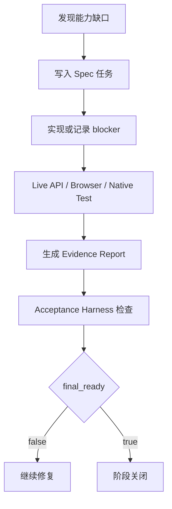

# PA AI Workbench 迭代优化文档生成计划

> 目标成品文档建议名：`PA AI Workbench 迭代优化文档`
>
> 建议正式输出：
>
> - Markdown：`pa-ai-workbench/docs/resume_project/PA_AI_WORKBENCH_ITERATION_OPTIMIZATION.md`
> - Word：`pa-ai-workbench/docs/resume_project/PA_AI_WORKBENCH_ITERATION_OPTIMIZATION.docx`

## 1. 文档目标

这份文档要记录 PA AI Workbench 到目前为止做过的优化、修复过的问题、补齐过的能力，以及这些优化背后的产品判断。

它和“开发记录文档”的区别是：

- 开发记录文档讲项目从 0 到现在的阶段演进。
- 迭代优化文档讲“我发现了哪些问题，怎么优化，最终带来了什么提升”。

它要突出：

- 从 demo 到可验证产品的过程。
- RAG、Agent、Wiki、前端体验、状态验证、安全审计等方向的迭代。
- bug 修复不是零散补丁，而是围绕产品可信度、可用性和可验证性展开。

## 2. 写作口径

正式文档应该采用“问题驱动”的写法：

1. 发现什么问题。
2. 为什么这个问题影响产品体验或可信度。
3. 我如何定位。
4. 我做了什么优化或修复。
5. 修复后如何验证。
6. 这个优化体现了什么产品/技术思考。

推荐表达：

> 我的优化重点不是只追求功能数量，而是把功能从“页面上看起来有”推进到“真实可用、可追溯、可验证、可维护”。因此迭代集中在 RAG 质量、Agent 轨迹、Wiki 引用、状态闭环、前端体验、安全审计和验收 harness 上。

## 3. 事实源范围

正式文档建议读取：

### 3.1 RAG 与质量相关

- `pa-ai-workbench/docs/PHASE3_M3_RAG_QUALITY_EVALUATION_RUBRIC.md`
- `pa-ai-workbench/docs/PHASE3_M3_RAG_QUALITY_SAMPLE_REPORT.md`
- `pa-ai-workbench/docs/PHASE4_REAL_RAG_MATRIX_REPORT.md`
- `pa-ai-workbench/docs/PHASE5_REAL_RAG_24Q_PASS_REPORT.md`
- `pa-ai-workbench/docs/PHASE5_REAL_KNOWLEDGE_QA_24Q_PASS_REPORT.md`
- `pa-ai-workbench/docs/WEKNORA_NATIVE_RAG_KNOWLEDGE_CHAT_LIVE_REPORT.md`
- `pa-ai-workbench/docs/WEKNORA_NATIVE_AGENTQA_CITATION_TRACEABILITY_REPORT.md`

### 3.2 Agent 与智能对话相关

- `pa-ai-workbench/docs/WEKNORA_FIRST_AGENTQA_LIVE_REPORT.md`
- `pa-ai-workbench/docs/WEKNORA_NATIVE_AGENTQA_CUSTOM_AGENT_LIVE_REPORT.md`
- `pa-ai-workbench/docs/WEKNORA_NATIVE_AGENTQA_REFERENCE_PROPAGATION_PATCH_REPORT.md`
- `pa-ai-workbench/docs/WEKNORA_NATIVE_AGENTQA_RUNTIME_VALIDATION_REPORT.md`
- `pa-ai-workbench/docs/WEKNORA_NATIVE_AGENTQA_WIKI_REFERENCE_LIVE_REPORT.md`
- `pa-ai-workbench/docs/WEKNORA_NATIVE_INTELLIGENT_DIALOGUE_REACT_CONTRACT_WNID_P2_02.md`
- `pa-ai-workbench/docs/WEKNORA_NATIVE_INTELLIGENT_DIALOGUE_STRATEGY_EDITOR_WNID_P2_01.md`
- `pa-ai-workbench/docs/WEKNORA_NATIVE_INTELLIGENT_DIALOGUE_WEB_SEARCH_AGENTQA_WNID_P4_02.md`
- `pa-ai-workbench/docs/WEKNORA_NATIVE_INTELLIGENT_DIALOGUE_MCP_TOOL_EXECUTION_WNID_P3_02.md`

### 3.3 Wiki 相关

- `pa-ai-workbench/docs/PHASE3_M3_WIKI_FALLBACK_SYNC.md`
- `pa-ai-workbench/docs/PHASE4_REAL_WIKI_REPORT.md`
- `pa-ai-workbench/docs/PHASE5_REAL_WIKI_PASS_REPORT.md`
- `pa-ai-workbench/docs/WEKNORA_NATIVE_WIKI_WORKFLOW_LIVE_REPORT.md`
- `pa-ai-workbench/docs/WEKNORA_NATIVE_FULL_COMPLETION_WIKI_GLOBAL_MAINTENANCE_BLOCKER_WNFC_P5_04.md`
- `pa-ai-workbench/docs/WEKNORA_NATIVE_INTELLIGENT_DIALOGUE_WIKI_MODE_AGENT_WORKFLOW_WNID_P5_01.md`

### 3.4 前端、状态、验收相关

- `pa-ai-workbench/docs/PHASE3_M1_FRONTEND_BROWSER_CHECK.md`
- `pa-ai-workbench/docs/WEKNORA_FIRST_FRONTEND_BROWSER_ACCEPTANCE_REPORT.md`
- `pa-ai-workbench/docs/WEKNORA_NATIVE_PRODUCT_BROWSER_MATRIX_REPORT.md`
- `pa-ai-workbench/docs/WEKNORA_NATIVE_FULL_COMPLETION_BROWSER_MATRIX_WNFC_P6_01.md`
- `pa-ai-workbench/docs/WEKNORA_NATIVE_INTELLIGENT_DIALOGUE_BROWSER_MATRIX_WNID_P8_01.md`
- `pa-ai-workbench/docs/WEKNORA_NATIVE_STATUS_CENTER_REPORT.md`
- `pa-ai-workbench/docs/WEKNORA_NATIVE_CAPABILITY_CENTER_BROWSER_REPORT.md`

### 3.5 安全、审计、历史、引用相关

- `pa-ai-workbench/docs/WEKNORA_FIRST_CITATION_CONTRACT.md`
- `pa-ai-workbench/docs/WEKNORA_NATIVE_HISTORY_CITATION_UNIFICATION_LIVE_REPORT.md`
- `pa-ai-workbench/docs/WEKNORA_NATIVE_INTELLIGENT_DIALOGUE_HISTORY_CITATION_AUDIT_UNIFICATION_WNID_P7_01.md`
- `pa-ai-workbench/docs/WEKNORA_NATIVE_FULL_COMPLETION_DATA_SOURCE_WORKFLOW_WNFC_P1_02.md`
- `pa-ai-workbench/docs/WEKNORA_NATIVE_FULL_COMPLETION_MCP_CRUD_CREDENTIALS_WNFC_P2_01.md`

## 4. 推荐文档结构

## 第一章：优化总览

### 章节目标

先给读者建立全局印象：优化不是零散 bug，而是围绕“真实可用”和“可信 AI 产品”展开。

### 必写内容

1. 优化目标。
   - 提升 RAG 回答质量。
   - 提升 Agent 可解释性和工具调用可信度。
   - 提升 Wiki 知识组织能力。
   - 提升前端真实可用性。
   - 提升状态和验收可靠性。
   - 提升安全、引用、历史和审计闭环。

2. 优化分类。

| 优化方向 | 目标 | 代表性结果 |
| --- | --- | --- |
| RAG 质量 | 提高召回、引用和回答可靠性 | RAG matrix、24Q pass、citation mapping |
| Agent 能力 | 让 Agent 轨迹、工具和引用可见 | ReAct contract、strategy editor、tool trace |
| Wiki | 从文档问答升级为知识资产维护 | Wiki workflow、global maintenance、Wiki Mode |
| 前端体验 | 页面可用、移动端不溢出、入口清晰 | browser matrix、Dialogue shell |
| 状态验证 | 防止静态页面冒充完成 | acceptance harness、final_ready |
| 安全审计 | 外部执行和敏感配置可控 | confirmation、masked output、audit |

## 第二章：RAG 质量优化

### 章节目标

说明 RAG 不是“能回答就行”，而是需要围绕召回、重排、引用和验证不断优化。

### 必写问题线索

1. 问题：回答可能缺少可靠引用。
   - 影响：用户无法判断答案来自哪里。
   - 优化：建立 citation contract，把 native references 映射为 PA citations。
   - 验证：RAG/Knowledge QA 报告中检查 references 和 saved citations。

2. 问题：检索结果可能不够稳定。
   - 影响：同一知识库问题可能召回不到关键片段。
   - 优化：使用 RAG quality rubric、RAG matrix、24Q 问答集进行覆盖测试。
   - 验证：Phase 4/5 RAG 报告。

3. 问题：检索链路从本地实现转向 WeKnora native 后需要保证语义一致。
   - 影响：产品层可能出现字段不匹配、引用丢失、状态不一致。
   - 优化：做 backend parity matrix、WeKnora API map、adapter 层字段映射。
   - 验证：native RAG live report、knowledge-chat live report。

4. 问题：RAG 不应停留在单次问答。
   - 影响：用户难以复盘历史回答。
   - 优化：将 RAG 回答、引用、历史统一保存。
   - 验证：history/citation unification。

### 面试讲法

> 我对 RAG 的优化不是只调 prompt，而是围绕“检索证据是否对、引用是否可追溯、回答是否能被保存复查”来做。早期我用本地 RAG 验证流程，后面转向 WeKnora native 后，重点做 adapter 字段映射、citation contract、RAG matrix 和 24Q 验收，把 RAG 从 demo 问答推进到可验证问答能力。

## 第三章：Agent 能力优化

### 章节目标

说明 Agent 优化的重点是从“能调 AgentQA”提升为“可解释、可配置、可追溯的智能对话”。

### 必写问题线索

1. 问题：Agent 回答如果只显示最终文本，用户无法知道它做了什么。
   - 优化：展示 thought、tool_call、tool_result、references、final_answer 等事件。
   - 价值：用户能看到 Agent 推理和工具调用轨迹。

2. 问题：Custom Agent 不能只做静态展示，需要能编辑策略。
   - 优化：策略编辑器覆盖 prompt/context、工具选择、MCP selection、Web Search、multi-turn、history、retrieval thresholds、rerank thresholds、suggested prompts。
   - 验证：WNID strategy editor 报告。

3. 问题：Web Search 不能只显示 provider configured。
   - 优化：要求 live AgentQA run 中 `web_search_enabled=true`，并有 web references 和 citations。
   - 验证：WNID Web Search AgentQA。

4. 问题：MCP 不能只做到 list/read。
   - 优化：实现 approval-gated execution，记录拒绝和批准执行，并写入 audit/history。
   - 验证：WNID MCP tool execution。

5. 问题：Agent 与 Wiki/RAG 的引用需要统一。
   - 优化：AgentQA wiki reference、reference propagation、citation traceability。
   - 验证：AgentQA citation 和 Wiki reference reports。

### 面试讲法

> Agent 优化的重点是可解释和可控。一个真正可用的 Agent 产品不能只返回一个答案，还要让用户知道它调用了什么工具、依据了哪些引用、是否触发了外部搜索或 MCP 执行、是否经过审批。我在 PA 中把 WeKnora 原生 AgentQA 的事件和引用映射到产品层，并补齐策略编辑、历史、审计和浏览器验证。

## 第四章：Wiki 召回与引用优化

### 章节目标

说明 Wiki 优化如何让产品从“文档问答”升级为“知识资产维护”。

### 必写问题线索

1. 问题：原始文档虽然能检索，但不利于长期知识组织。
   - 优化：接入 WikiPage 模型和 Wiki workflow。
   - 价值：沉淀主题、实体、概念和综合页面。

2. 问题：Wiki 页面之间的链接关系可能不完整。
   - 优化：rebuild links、auto-fix、issue status。
   - 验证：WNFC Wiki global maintenance。

3. 问题：Wiki 内容需要进入问答和 Agent。
   - 优化：WikiPage chunk、Wiki reference、Wiki Mode Agent workflow。
   - 验证：WNID Wiki Mode Agent。

4. 问题：Wiki fallback 或同步不稳定会影响用户信任。
   - 优化：建立 fallback sync 报告和真实 Wiki pass。
   - 验证：Phase 3/4/5 Wiki 报告。

### 面试讲法

> Wiki 的优化让我意识到，知识产品不能只停留在问答。RAG 解决的是“临时找证据”，Wiki 解决的是“长期组织知识”。我在项目中围绕 Wiki 页面、链接维护、引用映射和 Agent Wiki Mode 做了优化，让知识既能被浏览维护，也能重新进入 RAG 和 Agent。

## 第五章：前端体验优化

### 章节目标

说明前端优化不是美化页面，而是让复杂能力有可用的产品入口。

### 必写问题线索

1. 问题：能力很多，用户找不到入口。
   - 优化：Home、Library、Analysis/RAG、Wiki、Dialogue、History、Capability Center 模块化。

2. 问题：Agent 高级能力容易藏在配置里。
   - 优化：Dialogue shell 一等入口，展示 Agent、Quick Q&A、策略、工具轨迹、MCP/Web Search 状态、Suggested Questions。

3. 问题：页面在不同视口可能溢出或重叠。
   - 优化：desktop/mobile browser matrix。
   - 验证：WNFC/WNID browser matrix。

4. 问题：静态页面不能证明真实能力。
   - 优化：浏览器检查必须绑定 live status/API markers。

### 面试讲法

> 前端优化的重点是把底层复杂能力变成用户能理解的工作流。比如 AgentQA、Web Search、MCP、Wiki Mode 如果只是 API，就很难被业务用户使用。我把它们放到 Dialogue、History、Capability Center 等页面里，用工具轨迹、引用和状态标记帮助用户理解系统正在做什么。

## 第六章：状态与验证优化

### 章节目标

这是本项目非常有差异化的亮点。要讲清为什么我做了大量报告、检查脚本、browser matrix 和 final_ready。

### 必写问题线索

1. 问题：复杂 AI 产品很容易“看起来完成”，实际没跑通。
   - 优化：acceptance harness。

2. 问题：旧报告或静态数据容易误导。
   - 优化：current-run evidence。

3. 问题：阶段是否完成需要客观标准。
   - 优化：final_ready。

4. 问题：API 通过不代表用户界面可用。
   - 优化：browser matrix。

5. 问题：mock/fixture 在早期有用，但不能作为最终 PASS。
   - 优化：no mock PASS 规则。

### 本章建议图



### 面试讲法

> 我在项目里引入了 harness 思想，是因为 AI 产品很容易停留在 demo。我的标准是，功能完成必须有当前运行证据，有报告，有浏览器或 API 验证，有最终检查脚本。这样既能减少主观判断，也能让后续复盘时知道每个能力到底是 live、partial、blocked 还是 excluded。

## 第七章：安全与审计优化

### 章节目标

说明为什么 AI 工作台需要安全边界，尤其是 MCP、Web Search、外部执行、凭证配置和删除类操作。

### 必写问题线索

1. 问题：凭证、provider payload、raw prompt、raw DB 内容不能出现在日志或报告里。
   - 优化：masked output 和敏感信息扫描。

2. 问题：删除、外部执行、策略变更不能无确认执行。
   - 优化：confirmation token。

3. 问题：MCP 工具执行可能有外部影响。
   - 优化：approval-gated execution，记录批准/拒绝。

4. 问题：用户需要知道谁做了什么操作。
   - 优化：NativeMutationAudit、history/audit filters。

5. 问题：Web Search provider 不能只保存配置，必须测试。
   - 优化：masked provider test + audit。

### 面试讲法

> 我把安全和审计当作 AI 产品可信度的一部分。尤其是 Agent 能调用工具后，系统就不只是生成文本，还可能触发外部搜索、MCP 执行、策略修改或数据删除。因此我在产品层设计了确认、审计、历史和 masked output，避免把 demo 能力直接暴露成不可控操作。

## 第八章：代表性 bug 修复记录

### 章节目标

以问题卡片形式记录有代表性的 bug 或缺陷修复。正式文档不需要列出所有小 bug，但要覆盖主要类型。

### 推荐写法

每个 bug 用同一格式：

```text
问题：
影响：
定位：
修复：
验证：
复盘：
```

### 建议包含的 bug 类型

1. RAG 引用丢失或映射不完整。
   - 修复方向：reference propagation、citation contract。

2. AgentQA 最终答案有了，但工具轨迹或引用没有同步到 PA。
   - 修复方向：事件流映射、history/citation 保存。

3. Wiki 页面可见，但链接维护或全局修复能力不足。
   - 修复方向：rebuild links、auto-fix、issue status。

4. MCP 只能展示服务，不能证明工具执行。
   - 修复方向：approval-gated execution。

5. Web Search 只展示 provider，不证明 AgentQA 真用到了 web references。
   - 修复方向：AgentQA Web Search live run。

6. 浏览器页面在移动端出现布局问题或高级面板依赖。
   - 修复方向：browser matrix、Dialogue shell。

7. 阶段报告中存在 stale evidence 或 final_ready 状态不一致。
   - 修复方向：acceptance harness、parser-visible marker。

8. 缺凭证或缺 API 时容易被误判为失败。
   - 修复方向：blocked/excluded 状态治理。

9. 数据源或外部连接器缺真实账号时不能 fake PASS。
   - 修复方向：用户决策后标记 `[b]` 或 blocker。

10. 前后端字段契约不一致。
   - 修复方向：adapter 层统一 schema。

## 第九章：优化前后对比

正式文档建议放一张总表：

| 方向 | 初始状态 | 优化后状态 | 价值 |
| --- | --- | --- | --- |
| RAG | 能问答但引用和质量需要验证 | 24Q、citation、native live evidence | 更可信 |
| Wiki | 有基础页面/同步 | 链接维护、global maintenance、Wiki Mode | 可维护知识资产 |
| Agent | 能调用 AgentQA | ReAct trace、策略编辑、Web Search、MCP、history/audit | 可解释智能对话 |
| 前端 | 多能力入口分散 | Dialogue/Capability/History 工作流 | 更易用 |
| 验收 | 功能完成靠描述 | harness、browser matrix、final_ready | 可验证 |
| 安全 | 外部能力风险较高 | confirmation、masked output、audit | 可控 |

## 第十章：面试可讲的技术成长点

### 必写内容

1. 我对 RAG 的理解从“调用模型”升级为“证据工程”。
2. 我对 Wiki 的理解从“页面”升级为“知识资产层”。
3. 我对 Agent 的理解从“会调用工具”升级为“ReAct 执行系统 + 工具治理 + 事件流”。
4. 我对产品开发的理解从“做功能”升级为“定义范围、验证证据、管理风险”。
5. 我学会了用 spec + skill 控制复杂项目。
6. 我学会了用 harness 防止 AI 项目停留在 demo。
7. 我学会了在缺凭证/缺 API 时记录真实 blocker，而不是用假数据绕过。

## 5. 不应该写偏的地方

- 不要写成纯 bug list。
- 不要只写“修复了页面样式”，要写优化背后的产品价值。
- 不要把 blocked 说成 bug。
- 不要把 mock 阶段说成最终验收。
- 不要把 WNFC 排除的 Web Search 混进 WNFC 成果，要说明它在 WNID 阶段被重新纳入并完成。
- 不要省略安全、审计、引用和验证，它们是从 demo 到产品的关键。

## 6. 正式文档验收标准

生成后的正式文档应满足：

- 以问题驱动，而不是功能堆叠。
- 覆盖 RAG、Agent、Wiki、前端、状态验证、安全审计。
- 每个优化都说明问题、影响、修复、验证、复盘。
- 有优化前后对比表。
- 有代表性 bug 修复卡片。
- 有面试成长点。
- 能体现“从 demo 到可验证产品”的过程。

## 7. 新对话可直接复制的生成提示词

```text
请根据这个 plan 生成正式文档：

文件路径：
/Users/mac/Downloads/WeKnora-main/pa-ai-workbench/docs/resume_project/plans/04_ITERATION_OPTIMIZATION_PLAN.md

目标：
生成《PA AI Workbench 迭代优化文档》的 Markdown 正文，并随后生成 Word docx。

写作要求：
1. 使用中文。
2. 篇幅长且详细，适合 AI 产品实习生用于简历项目复盘和面试。
3. 以“问题 -> 影响 -> 定位 -> 修复 -> 验证 -> 复盘”的方式写，不要只列功能。
4. 必须覆盖 RAG 质量优化、Agent 能力优化、Wiki 召回与引用优化、前端体验优化、状态与验证优化、安全与审计优化、代表性 bug 修复。
5. 必须突出从 demo 到可验证产品的过程。
6. 必须体现 spec + skill + harness 对优化过程的帮助。
7. 需要有优化前后对比表、bug 修复卡片、面试成长点。
8. 注意真实边界：不要把 blocked/excluded 写成 bug 或 PASS，不要把 mock/fixture-only 证明写成最终验收。

请先读取 plan 和仓库相关源文件，再生成 Markdown 正文。
```
